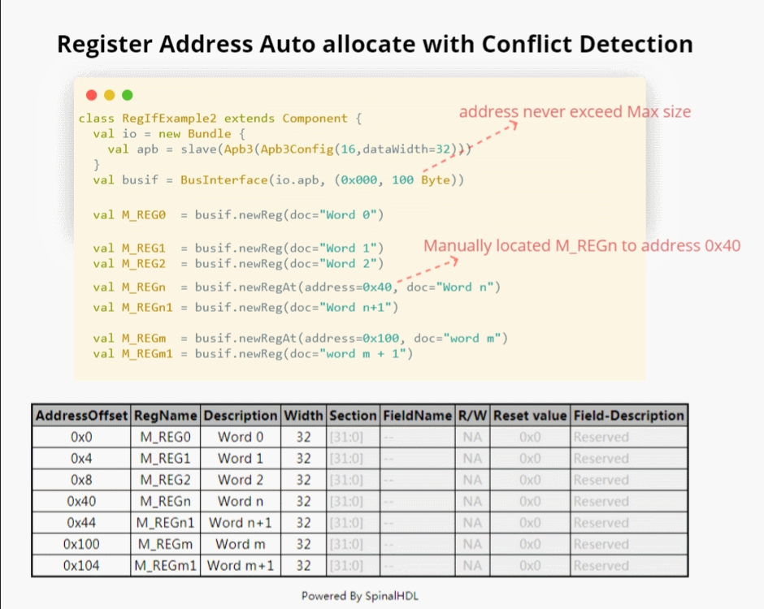
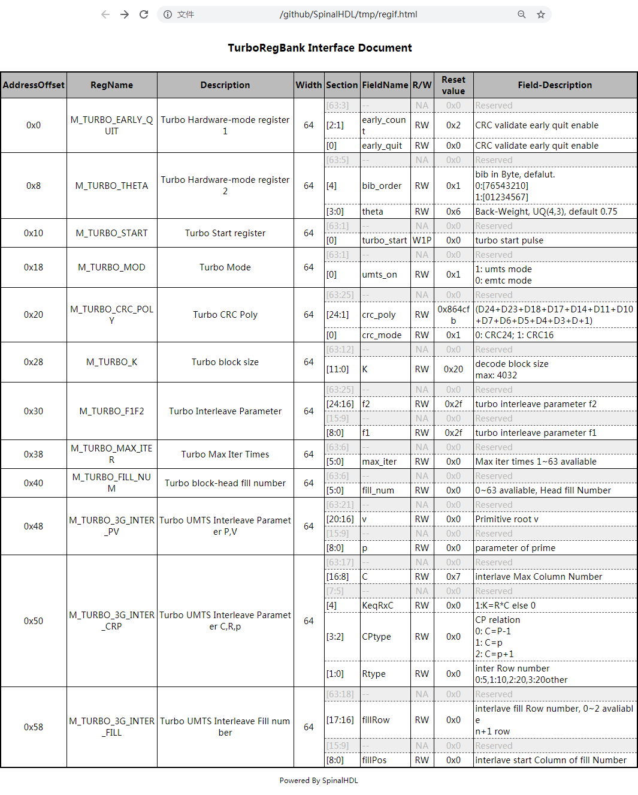

## 寄存器接口(RegIf)

寄存器接口搭建器：
+ 自动寻址, 字段分配和冲突检测
+ 28个寄存器类型(涵盖UVM标准定义的25种类型)
+ 自动文献生成

### 一、自动分配(Automatic allocation)

自动地址分配：

```Scala
class RegBankExample extends Component{
  val io = new Bundle{
    apb = Apb3(Apb3Config(16,32))
  }
  val busif = Apb3BusInterface(io.apb,(0x0000, 100 Byte)
  val M_REG0  = busif.newReg(doc="REG0")
  val M_REG1  = busif.newReg(doc="REG1")
  val M_REG2  = busif.newReg(doc="REG2")

  val M_REGn  = busif.newRegAt(address=0x40, doc="REGn")
  val M_REGn1 = busif.newReg(doc="REGn1")

  busif.accept(HtmlGenerator("regif.html", "AP"))
  // busif.accept(CHeaderGenerator("header.h", "AP"))
  // busif.accept(JsonGenerator("regif.json"))
}
```


自动字段分配：

```Scala
val M_REG0  = busif.newReg(doc="REG1")
val fd0 = M_REG0.field(Bits(2 bit), RW, doc= "fields 0")
M_REG0.reserved(5 bits)
val fd1 = M_REG0.field(Bits(3 bit), RW, doc= "fields 0")
val fd2 = M_REG0.field(Bits(3 bit), RW, doc= "fields 0")
//自动保存2 bits
val fd3 = M_REG0.fieldAt(pos=16, Bits(4 bit), doc= "fields 3")
//自动保存12 bits
```


冲突检测：

```Scala
val M_REG1  = busif.newReg(doc="REG1")
val r1fd0 = M_REG1.field(Bits(16 bits), RW, doc="fields 1")
val r1fd2 = M_REG1.field(Bits(18 bits), RW, doc="fields 1")
  ...
cause Exception
val M_REG1  = busif.newReg(doc="REG1")
val r1fd0 = M_REG1.field(Bits(16 bits), RW, doc="fields 1")
val r1fd2 = M_REG1.field(offset=10, Bits(2 bits), RW, doc="fields 1")
  ...
cause Exception
```

### 二、28种可支持类型(28 Access Types)

大多数这些类型来自于UVM定义：

| 接入类型 |                          描述                           | 来源  |
| :------: | :-----------------------------------------------------: | :---: |
|    RO    |                  w: 无影响, r: 无影响                   |  UVM  |
|    RW    |                   w: as-is, r: 无影响                   |  UVM  |
|    RC    |               w: 无影响, r: 清空所有比特                |  UVM  |
|    RS    |               w: 无影响, r: 设置所有比特                |  UVM  |
|   WRC    |                w: as-is, r: 清空所有比特                |  UVM  |
|   WRS    |                w: as-is, r: 设置所有比特                |  UVM  |
|    WC    |               w: 清空所有比特, r: 无影响                |  UVM  |
|    WS    |               w: 设置所有比特, r: 无影响                |  UVM  |
|   WSRC   |            w: 设置所有比特, r: 清空所有比特             |  UVM  |
|   WCRC   |            w: 清空所有比特, r: 设置所有比特             |  UVM  |
|   W1C    |       w: 1/0 清空/对于匹配的比特无影响, r: 无影响       |  UVM  |
|   W1S    |       w: 1/0 设置/对于匹配的比特无影响, r: 无影响       |  UVM  |
|   W1T    |       w: 1/0 切换/对于匹配的比特无影响, r: 无影响       |  UVM  |
|   W0C    |          w: 1/0 无影响/清空匹配比特, r: 无影响          |  UVM  |
|   W0S    |          w: 1/0 无影响/设置匹配比特, r: 无影响          |  UVM  |
|   W0T    |          w: 1/0 无影响/切换匹配比特, r: 无影响          |  UVM  |
|  W1SRC   |    w: 1/0 设置/对于匹配的比特无影响, r: 清空所有比特    |  UVM  |
|  W1CRS   |    w: 1/0 清空/对于匹配的比特无影响, r: 设置所有比特    |  UVM  |
|  W0SRC   |       w: 1/0 无影响/设置匹配比特, r: 清空所有比特       |  UVM  |
|  W0CRS   |       w: 1/0 无影响/清空匹配比特, r: 设置所有比特       |  UVM  |
|    WO    |                   w: as-is, r: error                    |  UVM  |
|   WOC    |                w: 清空所有比特, r: error                |  UVM  |
|   WOS    |                w: 设置所有比特, r: error                |  UVM  |
|    W1    | w: 第一个进行硬复位的是as-is, 其他w对s无影响, r: 无影响 |  UVM  |
|   WO1    |  w: 第一个进行硬复位的是as-is,其他w对s无影响, r: 错误   |  UVM  |
|    NA    |                w: reserved, r: reserved                 |  New  |
|   W1P    |      w: 1/0 pulse/对于匹配的比特无影响, r: 无影响       |  New  |
|   W0P    |      w: 0/1 pulse/对于匹配的比特无影响, r: 无影响       |  New  |

### 三、自动文献生成(Automatic documentation generation)

文献类型：

|  文献类型  |                                使用                                 | 状态  |
| :--------: | :-----------------------------------------------------------------: | :---: |
|    HTML    | `busif.accept(HtmlGenerator("regif", title = "XXX register file"))` |   Y   |
|  CHeader   |          `busif.accept(CHeaderGenerator("header", "AP"))`           |   Y   |
|    JSON    |               `busif.accept(JsonGenerator("regif"))`                |   Y   |
| RALF(UVM)  |               `busif.accept(RalfGenerator("header"))`               |   Y   |
| Latex(pdf) |                                                                     |   N   |
|    docx    |                                                                     |   N   |

HTML自动文档目前完成了, 生成的HTML文档如下：



### 四、例子

批量创建REG-Address和字段寄存器：

```Scala
import spinal.lib.bus.regif._

class RegBank extends Component {
  val io = new Bundle {
    val apb = slave(Apb3(Apb3Config(16, 32)))
    val stats = in Vec(Bits(16 bit), 10)
    val IQ  = out Vec(Bits(16 bit), 10)
  }
  val busif = Apb3BusInterface(io.apb, (0x000, 100 Byte), regPre = "AP")

  (0 to 9).map{ i =>
    //这里使用setName对REG命名特殊名字以方便文档使用
    val REG = busif.newReg(doc = s"Register${i}").setName(s"REG${i}")
    val real = REG.field(SInt(8 bit), AccessType.RW, 0, "Complex real")
    val imag = REG.field(SInt(8 bit), AccessType.RW, 0, "Complex imag")
    val stat = REG.field(Bits(16 bit), AccessType.RO, 0, "Accelerator status")
    io.IQ(i)( 7 downto 0) := real.asBits
    io.IQ(i)(15 downto 8) := imag.asBits
    stat := io.stats(i)
  }

  def genDocs() = {
    busif.accept(CHeaderGenerator("regbank", "AP"))
    busif.accept(HtmlGenerator("regbank", "Interupt Example"))
    busif.accept(JsonGenerator("regbank"))
    busif.accept(RalfGenerator("regbank"))
  }

  this.genDocs()
}

SpinalVerilog(new RegBank())
```

### 五、中断库(Interrupt Factory)

手动书写中断：

```Scala
class cpInterruptExample extends Component {
   val io = new Bundle {
     val tx_done, rx_done, frame_end = in Bool()
     val interrupt = out Bool()
     val apb = slave(Apb3(Apb3Config(16, 32)))
   }
   val busif = Apb3BusInterface(io.apb, (0x000, 100 Byte), regPre = "AP")
   val M_CP_INT_RAW   = busif.newReg(doc="cp int raw register")
   val tx_int_raw      = M_CP_INT_RAW.field(Bool(), W1C, doc="tx interrupt enable register")
   val rx_int_raw      = M_CP_INT_RAW.field(Bool(), W1C, doc="rx interrupt enable register")
   val frame_int_raw   = M_CP_INT_RAW.field(Bool(), W1C, doc="frame interrupt enable register")

   val M_CP_INT_FORCE = busif.newReg(doc="cp int force register\n for debug use")
   val tx_int_force     = M_CP_INT_FORCE.field(Bool(), RW, doc="tx interrupt enable register")
   val rx_int_force     = M_CP_INT_FORCE.field(Bool(), RW, doc="rx interrupt enable register")
   val frame_int_force  = M_CP_INT_FORCE.field(Bool(), RW, doc="frame interrupt enable register")

   val M_CP_INT_MASK    = busif.newReg(doc="cp int mask register")
   val tx_int_mask      = M_CP_INT_MASK.field(Bool(), RW, doc="tx interrupt mask register")
   val rx_int_mask      = M_CP_INT_MASK.field(Bool(), RW, doc="rx interrupt mask register")
   val frame_int_mask   = M_CP_INT_MASK.field(Bool(), RW, doc="frame interrupt mask register")

   val M_CP_INT_STATUS   = busif.newReg(doc="cp int state register")
   val tx_int_status      = M_CP_INT_STATUS.field(Bool(), RO, doc="tx interrupt state register")
   val rx_int_status      = M_CP_INT_STATUS.field(Bool(), RO, doc="rx interrupt state register")
   val frame_int_status   = M_CP_INT_STATUS.field(Bool(), RO, doc="frame interrupt state register")

   rx_int_raw.setWhen(io.rx_done)
   tx_int_raw.setWhen(io.tx_done)
   frame_int_raw.setWhen(io.frame_end)

   rx_int_status := (rx_int_raw || rx_int_force) && (!rx_int_mask)
   tx_int_status := (tx_int_raw || rx_int_force) && (!rx_int_mask)
   frame_int_status := (frame_int_raw || frame_int_force) && (!frame_int_mask)

   io.interrupt := rx_int_status || tx_int_status || frame_int_status

}
```

这是一项非常乏味和重复的工作, 更好的方法是使用factory范式为每个信号自动生成文档。

现在中断库可以做到这一点。写中断的简单方法:

```Scala
class EasyInterrupt extends Component {
  val io = new Bundle{
    val apb = slave(Apb3(Apb3Config(16,32)))
    val a, b, c, d, e = in Bool()
  }

  val busif = BusInterface(io.apb,(0x000,1 KiB), 0, regPre = "AP")

  busif.interruptFactory("T", io.a, io.b, io.c, io.d, io.e)

  busif.accept(CHeaderGenerator("intrreg","AP"))
  busif.accept(HtmlGenerator("intrreg", "Interupt Example"))
  busif.accept(JsonGenerator("intrreg"))
  busif.accept(RalfGenerator("intrreg"))
}
```


