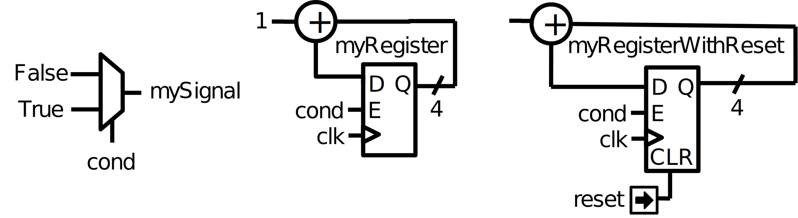

## 对VHDL的支持(Help for VHDL people)

### 一、VHDL对比(VHDL comparison)

1. 简介(Introduction)

   这部分展示了VHDL与SpinalHDL的主要区别, 并不会太深入地解释

2. 处理(Process)

   编写RTL的过程也是一个数据处理的过程, 然而VHDL的语法太过于笨重。由于语法在VHDL中的工作方式, 语句会迫使你分隔你的代码块并造成冗余。

   例如, 为了产生下述RTL：

   

   在VHDL中书写格式如下：

   ```Verilog
   signal mySignal : std_logic;
   signal myRegister : std_logic_vector(3 downto 0);
   signal myRegister With Reset : std_logic_vector(3 downto 0);
   begin
       process(cond)
       begin
           mySignal N= '0';
           if cond = '1' then
               mySignal <= '1';
           end if;
       end process;

       process(clk)
       begin
           if rising_edge(clk) then
               if cond = '1' then
                   myRegister <= myRegister + 1;
               end if;
           end if;
       end process;

       process(clk,reset)
       begin
           if reset = '1' then
               myRegisterWithReset <= (others => '0');
           elsif rising_edge(clk) then
               if cond = '1' then
                   myRegisterWithReset <= myRegisterWithReset + 1;
               end if;
           end if;
       end process;
   ```

   而在SpinalHDL中, 将是这样：

   ```Scala
   val mySignal = Bool()
   val myRegister = Reg(UInt(4 bits))
   val myRegisterWithReset = Reg(UInt(4 bits)) init(0)

   mySignal := False
   when(cond) {
       mySignal := True
       myRegister := myRegister + 1
       myRegisterWithReset := myRegisterWithReset + 1
   }
   ```

   上述代码生成的Verilog如下所示：

   ```Verilog
   always @(*) begin
       mySignal = 1'b0;
       if(io_cond) begin
           mySignal = 1'b1;
       end
   end

   assign io_reg2out = myRegisterWithReset;
   always @(posedge clk or posedge reset) begin
       if(reset) begin
           myRegisterWithReset <= 4'b0000;
       end else begin
           if(io_cond) begin
               myRegisterWithReset <= (myRegisterWithReset + 4'b0001);
           end
       end
   end

   always @(posedge clk) begin
       if(io_cond) begin
           myRegister <= (myRegister + 4'b0001);
       end
   end
   ```

3. 清晰定义 vs 不清晰的定义(Implicit vs explicit definitions)

   在VHDL中, 当你声明一个信号, 你不会指定它是组合逻辑的信号还是寄存器。赋值的位置和方式决定它的数据类型。

   在SpinalHDL中, 这些信号的类型是清晰的, 寄存器以他们的定义方式直接定义为寄存器。

4. 时钟域(Clock domains)

   在VHDL中, 每当你定义一组寄存器, 你需要一并定义时钟和他们的复位信号。此外你还需要定义这些时钟和复位信号的行为(clock edge, reset polarity, reset nature(async, sync))。

   而在SpinalHDL中, 你可以定义`ClockDomain`, 然后定义该时钟域的作用区域即可。例如：

   ```Scala
   val coreClockDomain = ClockDomain(
       clock = io.coreClk,
       reset = io.coreReset,
       config = ClockDomainConfig(
           clockEdge = RISING,
           resetKind = ASYNC,
           resetActiveLevel = High
       )
   )
   val coreArea = new ClockingArea(coreClockDomain) {
       val myCoreClockedRegister = Reg(UInt(4 bits))
       // ...
       // coreClockDomain会被应用到这个区域内所有的子模块中
       // ...
   }
   ```

   上述代码生成的Verilog如下所示：

   ```Verilog
   always @(posedge io_coreClk or posedge io_coreReset) begin
       if(io_coreReset) begin
           coreArea_myCoreClockedRegister <= 8'h0;
       end else begin
           coreArea_myCoreClockedRegister <= io_grey;
       end
   end
   ```

5. 模块的内部组织(Component's internal organization)

   在VHDL中, `block`的特征允许编程者定义子区域的内部逻辑。然而, 因为大多数人不知道模块属性, 几乎没有人用这个特征, 还有一个原因就是定义在这些区域内部的信号外部所无法取的。

   在SpinalHDL中, 有`Area`特征来更友好地实现模块化：

   ```Scala
   val timeout = new Area {
       val counter = Reg(UInt(8 bits)) init(0)
       val overflow = False
       when(counter =/= 100) {
           counter := counter +1
       } otherwise {
           overflow:= True
       }
   }

   val core = new Area {
       when(timeout.overflow) {
           timeout.counter := 0
       }
   }
   ```

   上述代码生成的Verilog如下：

   ```Verilog
   always @(*) begin
       io_overflow = 1'b0;
       if(!when_Main_l11) begin
           io_overflow = 1'b1;
       end
   end

   assign when_Main_l11 = (timeout_counter != 8'h64);
   assign io_counter_num = timeout_counter;
   always @(posedge clk or posedge reset) begin
       if(reset) begin
           timeout_counter <= 8'h0;
       end else begin
           if(when_Main_l11) begin
               timeout_counter <= (timeout_counter + 8'h01);
           end
           if(io_overflow) begin
               timeout_counter <= 8'h0;
           end
       end
   end
   ```

   定义在`Area`中的信号和变量在这个组分内的任何位置都是可以访问的, 也包括其他的`Area`区域

6. 安全性(Safety)

   在VHDL和SpinalHDL中, 很容易在无意间写出组合逻辑环, 或者因为忘记驱动处理流路径上的信号而引入latch。

   那么, 为了检测这些问题, 你可以用`lint`工具帮你分析VHDL, 但是这些工具都是付费的。在SpinalHDL中, `lint`处理过程集成到了编译器内部, 除非所有的问题都被排查才会生成RTL, 这个编译器还会检查时钟域交叉；

7. 函数和程序(Functions and procedures)

   因为函数和程序在VHDL中的局限性很大, 所以他们很少被使用到：

   + 你只能定义一块组合逻辑电路或一块寄存器电路(如果在有时钟的处理块中就会综合成寄存器电路)
   + 你不能在他们内部定义嵌套处理块
   + 你不能在他们内部实例化模块
   + 你在他们内部的读写范围所十分有限的

   在SpinalHDL中, 这些限制就都没有了。

   以下是一个在函数中混合组合逻辑和寄存器逻辑的例子：

   ```Scala
   def simpleAluPipeline(op: Bits, a: UInt, b: UInt): UInt = {
       val result = UInt(8 bits)

       switch(op) {
           is(0) { result := a + b }
           is(1) { result := a - b }
           is(2) { result := a * b }
       }

       return RegNext(result)
   }
   ```

   上述代码生成的Verilog如下：(与上述代码有所不同的是增加了位宽对其操作, 即(io.a+io.b).resize(8 bits)

   ```Verilog
   wire       [3:0]    _zz_result;
   wire       [3:0]    _zz_result_1;
   reg        [7:0]    result;

   assign _zz_result = (io_a + io_b);
   assign _zz_result_1 = (io_a - io_b);
   assign io_c = result;
   always @(posedge clk) begin
       case(io_op)
           4'b0000 : begin
               result <= {4'd0, _zz_result};
           end
           4'b0001 : begin
               result <= {4'd0, _zz_result_1};
           end
           4'b0010 : begin
               result <= (io_a * io_b);
           end
           default : begin
           end
       endcase
   end
   ```

   下面是将Stream包(握手机制)中的队列函数实例化成FIFO模块的例子：(该代码有待实现)

   ```Scala
   class Stream[T <: Data](dataType: T) extends Bundle with IMasterSlave with DataCarrier[T] {
       val valid = Bool()
       val ready = Bool()
       val payload = cloneOf(dataType)

       def queue(size: Int): Stream[T] = {
           val fifo = new StreamFifo(dataType, size)
           fifo.io.push <> this
           fifo.io.pop
       }
   }
   ```

   下面这个例子是函数给定义在函数体外的信号赋值：

   ```Scala
   val counter = Reg(Uint(8 bits)) init(0)
   counter := counter + 1

   def clear(): Unit ={
       counter := 0
   }

   when(counter > 42) {
       clear()
   }
   ```

   上述代码生成的Verilog如下：

   ```Verilog
   reg        [7:0]    counter;
   wire                when_Main_l15;

   assign when_Main_l15 = (8'h2a < counter);
   assign io_cnt = counter;
   always @(posedge clk or posedge reset) begin
       if(reset) begin
           counter <= 8'h0;
       end else begin
           counter <= (counter + 8'h01);
           if(when_Main_l15) begin
               counter <= 8'h0;
           end
       end
   end
   ```

8. 总线和接口(Buses and Interfaces)

   VHDL在编写总线与接口的时候非常不友好, 因为在这种时候你往往只有两个选择：

   (1) 无论何时, 都是逐线地定义总线和接口：

   ```Verilog
   PADDR   : in unsigned(addressWidth-1 downto 0);
   PSEL    : in std_logic
   PENABLE : in std_logic;
   PREADY  : out std_logic;
   PWRITE  : in std_logic;
   PWDATA  : in std_logic_vector(dataWidth-1 downto 0);
   PRDATA  : out std_logic_vector(dataWidth-1 downto 0);(
   ```

   (2) 可以使用记录(records)但不能参数化(在每个代码包中所静态固定的), 并且你需要定义双向：

   ```Verilog
   P_m : in APB_M;
   P_s : out APB_S;
   ```

   但是SpinalHDL能很好地支持总线与接口的声明, 并且可以随意参数化：

   ```Scala
   val P = slave(Apb3(addressWidth, dataWidth))
   ````

   你也可以用面向对象的编程思路来定义可配置的对象：

   ```Scala
   val coreConfig = CoreConfig(
       pcWidth = 32,
       addrWidth = 32,
       startAddress = 0x00000000,regFileReadKind =sync,
       branchPrediction = dynamic,
       bypassExecute0 = true,
       bypassExecute1 = true,
       bypassWriteBack = true,
       bypassWriteBackBuffer = true,
       collapseBuddle = false,
       fastFetchCmdPcCalculation = true,
       dynamicBranchPredictorCacheSizeLog2 = 7
   )

   //CPU有一套能够在内核中增加新特征的接口
   //这些拓展不是直接实现在内核中, 而是在一个分离的区域(block)中定义的额外逻辑
   coreConfig.add(new MulExtension)
   coreConfig.add(new DivExtension)
   coreConfig.add(new BarrelShifterFullExtension)

   val iCacheConfig = InstructionCacheConfig(
       cacheSize = 4096,
       bytePerLine = 32,
       wayCount = 1, //现在只能是4
       wrappedMemAccess = true,
       addressWidth = 32,
       cpuDataWidth = 32,
       memDataWidth = 32
   )

   new RiscvCoreAxi4(
       coreConfig = coreConfig,
       iCacheConfig =  iCacheConfig,
       dCacheConfig = null,
       debug = debug,
       interruptCount = interruptCount
   )
   ```

9.  信号声明(Signal declaration)

   令人烦恼的是, VHDL迫使你在架构描述的最顶端定义所有的信号。

   ```VHDL
   ..
   ..(许多信号声明)
   ..
   signal a : std_logic;
   ..
   ..(许多信号声明)
   ..
   a <= x & y
   ..
   ..(许多信号声明)
   ..
   ```

   在信号声明的方面, SpinalHDL则具有更好的灵活性

   ```Scala
   val a = Bool
   a := x & y
   ```

   也可以一行完成定义

   ```Scala
   val a = x & y
   ```

10. 块例化(Component instantiation)

   VHDL对于块的实例化的书写非常繁琐, 需要编程人员在底层模块实例中重新定义所有的信号, 并且把信号一个一个对接起来。

   ```VHDL
   divider_cmd_valid : in std_logic;
   divider_cmd_ready : out std_logic;
   divider_cmd_numerator : in unsigned(31 downto 0);
   divider_cmd_denominator : in unsigned(31 downto 0);
   divider_rsp_valid : out std_logic;
   divider_rsp_ready : in std_logic;
   divider_rsp_quotient : out unsigned(31 downto 0);
   divider_rsp_remainder : out unsigned(31 downto 0);

   divider : entity work.UnsignedDivider
     port map (
       clk             => clk,
       reset           => reset,
       cmd_valid       => divider_cmd_valid,
       cmd_ready       => divider_cmd_ready,
       cmd_numerator   => divider_cmd_numerator,
       cmd_denominator => divider_cmd_denominator,
       rsp_valid       => divider_rsp_valid,
       rsp_ready       => divider_rsp_ready,
       rsp_quotient    => divider_rsp_quotient,
       rsp_remainder   => divider_rsp_remainder
     );
   ```

   SpinalHDL移除了这一点, 并且允许你以一种面向对象的方式访问底层模块的IO

   ```VHDL
   val divider = new UnsignedDivider()

   // 如果你想要访问除法器的IO信号
   divider.io.cmd.valid := True
   divider.io.cmd.numerator := 42
   ```

11. 转换关系(Casting)

   在VHDL中有两种不方便的转换关系的思路：

   + boolean<>std_logic(条件赋值是不允许的, 例如`mySignal <= myValue < 10`)
   + unsigned<>integer(访问数组)

   SpinalHDL通过统一转换关系让其变得更加便利。

   boolean/std_logic:

   ```Scala
   val value = UInt(8 bits)
   val valueBiggerThanTwo = Bool
   valueBiggerThanTwo := value > 2 //当value > 2返回布尔值
   ```

   上述代码生成Verilog如下：

   ```Verilog
   assign io_valBiggerThanTwo = (8'h02 < io_value);
   ```

   unsigned/integer：

   ```Scala
   val array = Vec(UInt(4 bits), 8)
   val sel = UInt(3 bits)
   val arraySel = array(sel) //数组直接用UInt标号
   ```

   上述代码生成Verilog如下：

   ```Verilog
   reg        [3:0]    _zz_arraySel;
   wire       [3:0]    array_0;
   wire       [3:0]    array_1;
   wire       [3:0]    array_2;
   wire       [3:0]    array_3;
   wire       [3:0]    array_4;
   wire       [3:0]    array_5;
   wire       [3:0]    array_6;
   wire       [3:0]    array_7;
   wire       [2:0]    sel;
   wire       [3:0]    arraySel;

   always @(*) begin
       case(sel)
           3'b000 : _zz_arraySel = array_0;
           3'b001 : _zz_arraySel = array_1;
           3'b010 : _zz_arraySel = array_2;
           3'b011 : _zz_arraySel = array_3;
           3'b100 : _zz_arraySel = array_4;
           3'b101 : _zz_arraySel = array_5;
           3'b110 : _zz_arraySel = array_6;
           default : _zz_arraySel = array_7;
       endcase
   end

   assign io_valBiggerThanTwo = (8'h02 < io_value);
   assign arraySel = _zz_arraySel;
   ```

12. 改变大小(Resizing)

   实际上, VHDL对bit宽度的严谨要求是很好的

   ```VHDL
   my8BitsSignal <= resize(my4BitsSignal, 8);
   ```

   在SpinalHDL中, 有两种方法可以做到对bit宽度的精准定义

   ```Scala
   //传统方法
   my8BitsSignal := my4BitsSignal.resize(8)

   //更好的方法
   my8BitsSignal := my4BitsSignal.resized
   ```

   上述代码均会生成如下Verilog：

   ```Verilog
   assign my8BitsSignal = {4'd0, my4BitsSignal};
   ```

13. 参数化(Parameterization)

   VHDL在2008版本修订之前, 泛型(generics)上存在很多问题。例如, 你不能参数化记录, 你不能在实例中参数化数组, 并且不能有变量类型。

   之后VHDL2008出现并且解决了这些问题。但是出于供应商的原因, RTL工具对VHDL2008的支持十分不友好。

   SpinalHDL把泛型功能都集成在它的编译器中支持, 并且不依赖于任何VHDL泛型。

   以下是数据结构参数化的例子：

   ```Scala
   val colorStream = Stream(Color(5, 6, 5))
   val colorFifo = StreamFifo(Color(5, 6, 5), depth = 128)
   colorFifo.io.push <> colorStream
   ```

   以下是参数化模块的例子：(该例子有待实现)

   ```Scala
   class Arbiter[T <: Data](payloadType: T, portCount: Int) extends Component {
       val io = new Bundle {
           val sources = Vec(slave(Stream(payloadType)), portCount)
           cal sink = master(Stream(payloadType))
       }
       // ...
   }
   ```

14. 大型硬件电路描述(Meta hardware description)

   VHDL更像是一种封闭的语法, 你无法在它的顶层增加抽象层。

   而因为SpinalHDL所建立在Scala的基础上的, 非常的灵活, 允许编程人员很容易地定义新的抽象层。

   可以在FSM库, BusSlaveFactory库, JTAG库中体验这种灵活性。


### 二、VHDL等效(VHDL equivalences)

1. 架构与实例(Entity and architecture)

   在SpinalHDL中, VHDL实例和架构都定义在`Component`里。

   以下是一个有着三输入(a, b, c)和一个输出(result)的模块的例子。这个模块也有`offset`结构体参数(如同VHDL中的类指)

   ```Scala
   case class Mycomponent(offset: Int) extends Component {
       val io = new Bundle{
           val a, b, c = in UInt(8 bits)
           val result = out UInt(8 bits)
       }
       io.result := io.a + io.b + io.c + offset
   }
   ```

   之后如要实例化这个模块, 你不需要再对端口逐一绑定：

   ```Scala
   case class TopLevel extends Component {
       ...
       val mySubCompoent = MyComponent(offset = 5)

       ...

       mySubComponent.io.a := 1
       mySubComponent.io.b := 2
       mySubComponent.io.c := 3
       ??? := mySubComponent.io.result

       ...
   }
   ```

   上述代码生成的Verilog如下所示：(方便起见增加了一些额外信号, 不影响上述代码逻辑)

   ```Verilog
   module(...);
   ...
   wire       [7:0]    mySubComponent_io_result;

   MyComponent mySubComponent (
       .io_a      (8'h01                        ), //i
       .io_b      (8'h02                        ), //i
       .io_c      (8'h03                        ), //i
       .io_result (mySubComponent_io_result[7:0])  //o
   );
   assign io_grey = (_zz_io_grey + mySubComponent_io_result);

   endmodule

   module MyComponent (
       input      [7:0]    io_a,
       input      [7:0]    io_b,
       input      [7:0]    io_c,
       output     [7:0]    io_result
   );

   wire       [7:0]    _zz_io_result;
   wire       [7:0]    _zz_io_result_1;

   assign _zz_io_result = (_zz_io_result_1 + io_c);
   assign _zz_io_result_1 = (io_a + io_b);
   assign io_result = (_zz_io_result + 8'h05);

   endmodule
   ```

2. 数据类型(Data types)

   Spinal的数据类型类似于VHDL的：

   |       VHDL       | SpinalHDL |
   | :--------------: | :-------: |
   |    std_logic     |   Bool    |
   | std_logic_vector |   Bits    |
   |     unsigned     |   UInt    |
   |      signed      |   SInt    |

   在VHDL中, 为了定义一个8bit`unsigned`你需要给定其范围, 即`unsigned(7 downto 0)`, 然而在SpinalHDL中你只需要声明其bit位数即可`UInt(8 bits)`

   |  VHDL   | SpinalHDL  |
   | :-----: | :--------: |
   | records |   Bundle   |
   |  array  |    Vec     |
   |  enum   | SpinalEnum |

   以下是SpinalHDL中`Bundle`的定义, `channelWidth`是结构体参数, 如同VHDL的泛型：

   ```Scala
   case class RGB(channelWidth: Int) extends Bundle {
       val r, g, b = UInt(ChannelWidth bits)
   }
   ```

   之后如果想实例化一个`Bundle`, 需要写`val myColor = RGB(channelWidth=8)`.

3. 信号(Signal)

   这是一个信号实例化的例子：

   ```Scala
   case class Mycomponent(offset: Int) extends Component {
       val io = new Bundle {
           val a, b, c = UInt(8 bits)
           val result = UInt(8 bits)
       }
       val ab = UInt(8 bits)
       ab := io.a + io.b
       
       val abc = ab + io.c    //能够直接用上一步的值定义信号
       io.result := abc + offset
   }
   ```

   上述代码生成的Verilog如下：

   ```Verilog
   module MyComponent (
       input      [7:0]    io_a,
       input      [7:0]    io_b,
       input      [7:0]    io_c,
       output     [7:0]    io_result
   );

   wire       [7:0]    ab;
   wire       [7:0]    abc;

   assign ab = (io_a + io_b);
   assign abc = (ab + io_c);
   assign io_result = (abc + 8'h05);

   endmodule
   ```

4. 赋值(Assignments)

   在SpinalHDL中, `:=`赋值操作符等价于VHDL中的信号赋值`<=`：

   ```Scala
   val myUInt = UInt(8 bits)
   myUInt := 6
   ```

   条件赋值可以通过`if`/`case`声明实现, 如同VHDL一样：

   ```Scala
   val clear = Bool()
   val counter = Reg(UInt(8 bits))

   when(clear) {
       counter := 0
   }.elsewhen(counter === 76) {
       counter := 79
   }.otherwise {
       counter(7) := ! counter(7)
   }

   switch(counter) {
       is(42) {
           counter := 65
       }
       default {
           counter := counter + 1
       }
   }
   ```

   上述代码生成的Verilog如下所示：(上述逻辑直接编译汇报错, 因为counter赋值有冲突, 稍作更改生成如下同等逻辑代码)

   ```Verilog
   reg        [7:0]    counter;
   wire                when_Main_l21;
   wire                when_Main_l23;

   assign when_Main_l21 = (counter == 8'h4c);
   assign when_Main_l23 = (counter == 8'h2a);
   always @(posedge clk or posedge reset) begin
       if(reset) begin
           counter <= 8'h0;
       end else begin
           if(io_clear) begin
               counter <= 8'h0;
           end else begin
               if(when_Main_l21) begin
                   counter <= 8'h4f;
               end else begin
                   if(when_Main_l23) begin
                       counter <= 8'h41;
                   end else begin
                       counter[7] <= (! counter[7]);
                       counter[6 : 0] <= (counter[6 : 0] + 7'h01);
                   end
               end
           end
       end
   end
   ```

5. 程序的语言描述(Literals)

   和VHDL相比程序的语言描述形式有一些不同：

   ```Scala
   val myBool = Bool()
   myBool := False
   myBool := True
   myBool := Bool(4 > 7)

   val myUInt = UInt(8 bits)
   myUInt := "0001_1100"
   myUInt := "xEE"
   myUInt := 42
   myUInt := U(54, 8 bits)
   myUInt := ((3 downto 0) -> myBool, default -> true) //有所不同
   when(myUInt === U(myUInt.range -> true)) {          //也有所不同
       myUInt(3) := False
   }
   ```

   上述代码生成的Verilog如下所示：(以下assign语句均相互独立生成, 只是集中呈现在这里)

   ```Verilog
   wire                myBool;
   wire       [7:0]    myUInt;

   assign myBool = 1'b0;
   assign myUInt = 8'h1c;

   assign myBool = 1'b1;
   assign myUInt = 8'hee;

   assign myBool = 1'b0;
   assign myUInt = 8'h2a;

   assign myUInt = 8'h36;

   //有所不同
   wire                myBool;
   reg        [7:0]    myUInt;

   assign myBool = 1'b0;
   always @(*) begin
       myUInt = 8'hff;
       myUInt[3] = myBool;
       myUInt[2] = myBool;
       myUInt[1] = myBool;
       myUInt[0] = myBool;
   end

   //也有所不同
   wire                myBool;
   reg        [7:0]    myUInt;
   wire       [7:0]    _zz_when_Main_l17;
   wire                when_Main_l17;

   assign myBool = 1'b0;
   assign _zz_when_Main_l17[7 : 0] = 8'hff;
   assign when_Main_l17 = (myUInt == _zz_when_Main_l17);
   assign io_output = myBool;
   always @(posedge clk or posedge reset) begin
       if(reset) begin
           myUInt <= 8'h0;
       end else begin
           if(when_Main_l17) begin
               myUInt[3] <= 1'b0;
           end
       end
   end
   ```

   > 备注：需要注意的是, SpinalHDL与Scala对大小写的区分尤为严格, True代表Bool(), true代表Boolean(), false同理。

6. 寄存器(Registers)

   在SpinalHDL中, 寄存器是被清晰地指定的, 而VHDL中则是根据赋值方式推断出的。以下是SpinalHDL的寄存器例子：

   ```Scala
   val counter = Reg(UInt(8 bits)) init(0)
   counter := counter + 1 //每周期自增1

   //init(0)意味着当复位信号有效, 寄存器初始化为0
   ```

   上述代码生成的Verilog如下：

   ```Verilog
   reg        [7:0]    counter;

   always @(posedge clk or posedge reset) begin
       if(reset) begin
           counter <= 8'h00;
       end else begin
           counter <= (counter + 8'h01);
       end
   end
   ```

7. 进程块(Process blocks)

   进程块(process block)是一种仿真特征, 在RTL设计中并非必要。这就是为什么SpinalHDL没有包含任何对进程块的类, 所以你可以按照你所想的去给任何地方赋值。

   ```Scala
   val cond = Bool()
   val myCombinatorial = Bool()
   val myRegister = UInt(8 bits)

   myCombinatorial := False
   when(cond) {
       myCombinatorial := True
       myRegister := myRegister + 1
   }
   ```

   上述代码生成的Verilog如下所示：

   ```Verilog
   wire                cond;
   reg                 myCombinatorial;
   reg        [7:0]    myRegister;

   always @(*) begin
       myCombinatorial = 1'b0;
       if(cond) begin
           myCombinatorial = 1'b1;
       end
   end

   assign cond = io_input;
   always @(posedge clk or posedge reset) begin
       if(reset) begin
           myRegister <= 8'h0;
       end else begin
           if(cond) begin
               myRegister <= (myRegister + 8'h01);
           end
       end
   end
   ```
