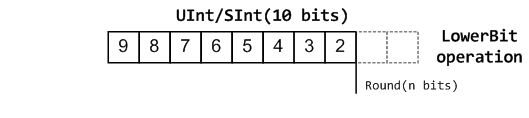
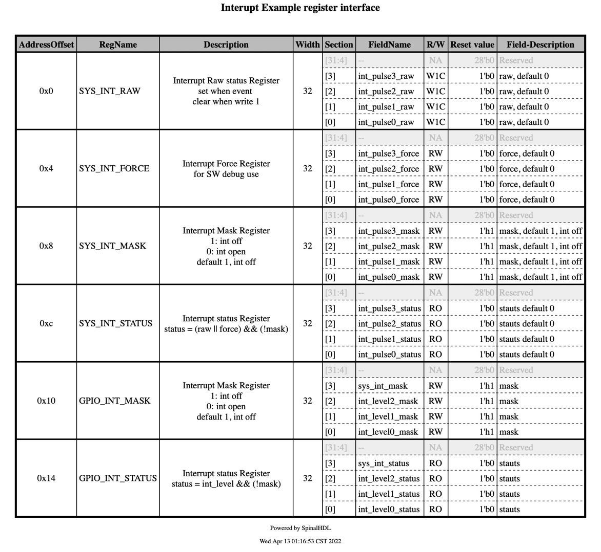
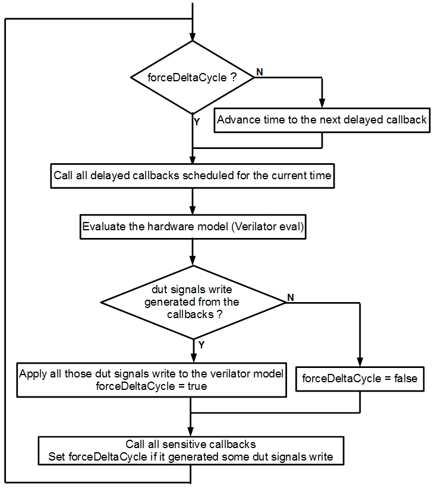

</br></br></br></br></br></br>

<div align=center>

</div>

</br></br></br>

<center> <font size=30> SpinalHDL</br></br>中文手册 </font> </center>

</br></br></br></br></br></br></br></br></br></br></br></br></br></br></br>
</br></br></br></br></br>

<center> 原作者: Charles Papon </center>
<center> 译作者: 谷江源  回浩嘉  吴其谍 </center>

<div STYLE="page-break-after: always;"></div>

</br></br></br>

<center> <font size=24> 注序</br> </font> </center>

</br>

1. 本团队对SpinalHDL-Doc的翻译工作及其成果非商业目的，所有公司、团队、个人均可无任何限制地免费试用，如有收费行为与本团队无关，为收费者个人行为。


2. 感谢原作者Charles Papon对本团队翻译的支持和认可，更感谢他开发了SpinalHDL，让我们硬件工程师有更加灵活便捷的硬件语言生成工具，让大规模架构的设计变得更加可参数化、可模型化、可配置化。同时本团队也希望该译本能够帮助更多的国内硬件工程师开发和设计灵活的硬件电路，为集成电路设计行业注入新的活力。


3. 该译本尽可能地保证了与原文档表述的一致性，文中出现的绝大多数专用词汇也均有其对应的英文表述，方便大家对照Scala和SpinalHDL进行学习。此外，在原文档的基础上，该中文译本为每个可生成Verilog的SpinalHDL代码增加了其对应的生成结果，方便各位读者对比学习。最后，本团队为EE出身，专注于硬件架构设计，文中如有翻译不到位的地方，请各位读者参考作者的原文档: https://spinalhdl.github.io/SpinalDoc-RTD/master/index.html。此外，请各位读者注意，该译本所翻译的SpinalHDL版本为v1.7.2，不同版本之间可能有所差异，请各位读者在编程的时候注意工程下build.sbt中的版本号。


4. 本团队归属于清华大学尹首一教授课题组可重构计算团队，热烈欢迎大家加入我们团队！

<div STYLE="page-break-after: always;"></div>

# 目录

- [目录](#目录)
- [关于SpinalHDL(About SpinalHDL)](#关于spinalhdlabout-spinalhdl)
  - [FAQ](#faq)
    - [一、SpinalHDL生成的RTL与手工书写VHDL/Verilog相比额外硬件开销有多少？](#一spinalhdl生成的rtl与手工书写vhdlverilog相比额外硬件开销有多少)
    - [二、SpinalHDL未来可能会不支持吗？](#二spinalhdl未来可能会不支持吗)
    - [三、SpinalHDL生成的VHDL/Verilog是否保持备注？](#三spinalhdl生成的vhdlverilog是否保持备注)
    - [四、SpinalHDL可以扩展到大工程吗？](#四spinalhdl可以扩展到大工程吗)
    - [五、SpinalHDL如何产生的？](#五spinalhdl如何产生的)
    - [六、为什么有VHDL/Verilog/SystemVerilog还要开发新语言？](#六为什么有vhdlverilogsystemverilog还要开发新语言)
    - [七、如何使用未发布(但是已经提交到git)的SpinalHDL版本？](#七如何使用未发布但是已经提交到git的spinalhdl版本)
  - [支持(Support)](#支持support)
    - [一、联系渠道(Communication channels)](#一联系渠道communication-channels)
    - [二、商业支持(Commercial support)](#二商业支持commercial-support)
  - [用户(Users)](#用户users)
    - [一、公司(Companies)](#一公司companies)
    - [二、仓库(Repositories)](#二仓库repositories)
- [开始入门(Getting Started)](#开始入门getting-started)
  - [开始入门(Getting Started)](#开始入门getting-started-1)
    - [一、开始所要下载的必要条件/事情(Requirements/Things to download to get started)](#一开始所要下载的必要条件事情requirementsthings-to-download-to-get-started)
    - [二、如何开始用SpinalHDL编程(How to start programming with SpinalHDL)](#二如何开始用spinalhdl编程how-to-start-programming-with-spinalhdl)
    - [三、一个非常简单的SpinalHDL例子(A very simple SpinalHDL example)](#三一个非常简单的spinalhdl例子a-very-simple-spinalhdl-example)
    - [四、接下来做什么?(What to do next?)](#四接下来做什么what-to-do-next)
  - [目的(Motivation)](#目的motivation)
  - [表现(Presentation)](#表现presentation)
  - [Scala指导手册(Scala Guide)](#scala指导手册scala-guide)
    - [简介(Basics)](#简介basics)
    - [一、基础](#一基础)
    - [二、代码约束(Coding conventions)](#二代码约束coding-conventions)
    - [三、交互](#三交互)
  - [对VHDL的支持(Help for VHDL people)](#对vhdl的支持help-for-vhdl-people)
    - [一、VHDL对比(VHDL comparison)](#一vhdl对比vhdl-comparison)
    - [二、VHDL等效(VHDL equivalences)](#二vhdl等效vhdl-equivalences)
- [数据类型(Data types)](#数据类型data-types)
  - [简介(Introduction)](#简介introduction)
  - [Bool](#bool)
    - [一、描述(Description)](#一描述description)
    - [二、声明(Declaration)](#二声明declaration)
    - [三、操作符(Operators)](#三操作符operators)
  - [Bits](#bits)
    - [一、描述(Description)](#一描述description-1)
    - [二、声明(Declaration)](#二声明declaration-1)
    - [三、操作符(Operators)](#三操作符operators-1)
  - [UInt/SInt](#uintsint)
    - [一、描述(Description)](#一描述description-2)
    - [二、声明(Declaration)](#二声明declaration-2)
    - [三、操作符(Operators)](#三操作符operators-2)
    - [四、定点数操作(FixPoint operations)](#四定点数操作fixpoint-operations)
  - [SpinalEnum](#spinalenum)
    - [一、描述(Description)](#一描述description-3)
    - [二、声明(Declaration)](#二声明declaration-3)
    - [三、操作符(Operators)](#三操作符operators-3)
  - [Bundle](#bundle)
    - [一、描述(Description)](#一描述description-4)
    - [二、声明(Declaration)](#二声明declaration-4)
    - [三、操作符(Operators)](#三操作符operators-4)
    - [四、IO类型指导(IO Element direction)](#四io类型指导io-element-direction)
  - [Vec](#vec)
    - [一、描述(Description)](#一描述description-5)
    - [二、声明(Declaration)](#二声明declaration-5)
      - [Examples](#examples)
    - [三、操作符(Operators)](#三操作符operators-5)
  - [UFix/SFix](#ufixsfix)
    - [一、描述(Description)](#一描述description-6)
    - [二、声明(Declaration)](#二声明declaration-6)
    - [三、赋值(Assignments)](#三赋值assignments)
    - [四、Raw值(Raw value)](#四raw值raw-value)
    - [五、操作符(Operators)](#五操作符operators)
  - [Floating](#floating)
    - [一、描述(Description)](#一描述description-7)
    - [二、声明(Declaration)](#二声明declaration-7)
    - [三、操作符(Operators)](#三操作符operators-6)
  - [AFix(AFix是最新版Spinal新增的数据结构，不知为何该板块有些代码无法通过编译)](#afixafix是最新版spinal新增的数据结构不知为何该板块有些代码无法通过编译)
    - [一、描述(Description)](#一描述description-8)
    - [二、声明(Declaration)](#二声明declaration-8)
    - [三、数学操作(Mathematical Operations)](#三数学操作mathematical-operations)
    - [四、不相等操作(Inequality Operators)](#四不相等操作inequality-operators)
    - [五、Bit移位(Bitshifting)](#五bit移位bitshifting)
    - [六、近似和饱和(Saturation and Rounding)](#六近似和饱和saturation-and-rounding)
    - [七、赋值(Assignment)](#七赋值assignment)
- [结构(Structuring)](#结构structuring)
  - [模块和层次(Component and hierarchy)](#模块和层次component-and-hierarchy)
    - [一、简介(Introduction)](#一简介introduction)
    - [二、输入/输出定义(Input/output definition)](#二输入输出定义inputoutput-definition)
    - [三、信号剪枝(Pruned signals)](#三信号剪枝pruned-signals)
    - [四、参数化硬件电路("Generic"——VHDL, "Parameter"——Verilog)](#四参数化硬件电路genericvhdl-parameterverilog)
    - [五、综合模块名(Synthesized component names)](#五综合模块名synthesized-component-names)
  - [区域(Area)](#区域area)
    - [一、简介(Introduction)](#一简介introduction-1)
  - [函数(Function)](#函数function)
    - [一、简介(Introduction)](#一简介introduction-2)
    - [二、RGA到灰度(RGB to grey)](#二rga到灰度rgb-to-grey)
    - [三、Valid和Ready负载总线(Valid Ready Payload bus)](#三valid和ready负载总线valid-ready-payload-bus)
  - [时钟域(Clock domains)](#时钟域clock-domains)
    - [一、简介(Introduction)](#一简介introduction-3)
    - [二、例化(Instantiation)](#二例化instantiation)
    - [三、跨时钟域(Clock domain crossing)](#三跨时钟域clock-domain-crossing)
    - [四、特殊的时序区域(clocking areas)](#四特殊的时序区域clocking-areas)
  - [VHDL例化和Verilog IP(Instantiate VHDL and Verilog IP)](#vhdl例化和verilog-ipinstantiate-vhdl-and-verilog-ip)
    - [一、描述(Description)](#一描述description-9)
    - [二、定义黑盒(Defining an blackbox)](#二定义黑盒defining-an-blackbox)
    - [三、范式(Generics)](#三范式generics)
    - [四、例化黑盒(Instantiating a blackbox)](#四例化黑盒instantiating-a-blackbox)
    - [五、时钟和复位的布局(Clock and reset mapping)](#五时钟和复位的布局clock-and-reset-mapping)
    - [六、io前缀(io prefix)](#六io前缀io-prefix)
    - [七、重命名黑盒的所有io(Rename all io of a blackbox)](#七重命名黑盒的所有iorename-all-io-of-a-blackbox)
    - [八、添加RTL源(Add RTL source)](#八添加rtl源add-rtl-source)
    - [九、VHDL——非数字类型(VHDL-No numeric type)](#九vhdl非数字类型vhdl-no-numeric-type)
  - [保留名称(Preserving names)](#保留名称preserving-names)
    - [一、简介(Introduction)](#一简介introduction-4)
    - [二、可命名的基础类(Nameable base class)](#二可命名的基础类nameable-base-class)
    - [三、从Scala中提取名字(Name extraction from Scala)](#三从scala中提取名字name-extraction-from-scala)
    - [四、模块中的区域(Area in a Component)](#四模块中的区域area-in-a-component)
    - [五、函数中的区域(Area in a function)](#五函数中的区域area-in-a-function)
    - [六、在函数中组合(Composite in a function)](#六在函数中组合composite-in-a-function)
    - [七、组合链(Composite chains)](#七组合链composite-chains)
    - [八、Bundle函数中的组合(Composite in a Bundle's function)](#八bundle函数中的组合composite-in-a-bundles-function)
    - [九、处理未命名信号(Unamed signal handling)](#九处理未命名信号unamed-signal-handling)
  - [参数化(Parametrization)](#参数化parametrization)
    - [一、简介(Introduction)](#一简介introduction-5)
    - [二、细化阶段的参数(Elaboration time parameters)](#二细化阶段的参数elaboration-time-parameters)
    - [三、可选择的硬件生成(Optional hardware)](#三可选择的硬件生成optional-hardware)
- [语义(Semantic)](#语义semantic)
  - [赋值(Assignments)](#赋值assignments)
    - [一、赋值(Assignments)](#一赋值assignments)
    - [二、位宽检查(Width checking)](#二位宽检查width-checking)
    - [三、组合逻辑环路(Combinatorial loops)](#三组合逻辑环路combinatorial-loops)
  - [When/Switch/Mux](#whenswitchmux)
    - [一、When](#一when)
    - [二、Switch](#二switch)
    - [三、本地声明(Local declaration)](#三本地声明local-declaration)
    - [四、Mux](#四mux)
    - [五、Bit级选择(Bitwise selection)](#五bit级选择bitwise-selection)
  - [规则(Rules)](#规则rules)
    - [一、简介(Introduction)](#一简介introduction-6)
    - [二、并行性(Concurrency)](#二并行性concurrency)
    - [三、以最后赋值为准(Last valid assignment wins)](#三以最后赋值为准last-valid-assignment-wins)
    - [四、Scala下的信号和寄存器的内在联系(Signal and register interactions with Scala)(OOP引用+函数)](#四scala下的信号和寄存器的内在联系signal-and-register-interactions-with-scalaoop引用函数)
- [时序逻辑(Sequential logic)](#时序逻辑sequential-logic)
  - [寄存器(Registers)](#寄存器registers)
    - [一、简介(Introduction)](#一简介introduction-7)
    - [二、例化(Instantiation)](#二例化instantiation-1)
    - [三、复位值(Reset value)](#三复位值reset-value)
    - [四、仿真下的例化(Initialization value for simulation)](#四仿真下的例化initialization-value-for-simulation)
    - [五、寄存器向量(Register vectors)](#五寄存器向量register-vectors)
    - [六、把线类型转化为寄存器(Transforming a wire into a register)](#六把线类型转化为寄存器transforming-a-wire-into-a-register)
  - [RAM/ROM](#ramrom)
    - [一、语义(Syntax)](#一语义syntax)
    - [二、同步使能quirk(Synchronous enable quirk)](#二同步使能quirksynchronous-enable-quirk)
    - [三、读下写原则(Read-under-write policy)](#三读下写原则read-under-write-policy)
    - [四、混合宽度ram(Mixed-width ram)](#四混合宽度rammixed-width-ram)
    - [五、自动化mem黑盒(Automatic blackboxing)](#五自动化mem黑盒automatic-blackboxing)
- [设计错误(Design Errors)](#设计错误design-errors)
  - [简介(Introduction)](#简介introduction-1)
  - [赋值覆盖(Assignment Overlap)](#赋值覆盖assignment-overlap)
    - [一、简介](#一简介)
    - [二、例子](#二例子)
  - [跨时钟域违例(Clock crossing violation)](#跨时钟域违例clock-crossing-violation)
    - [一、简介](#一简介-1)
    - [二、例子](#二例子-1)
  - [组合环(Combinatorial loop)](#组合环combinatorial-loop)
    - [一、简介](#一简介-2)
    - [二、例子](#二例子-2)
    - [三、假阳性(false-positives)](#三假阳性false-positives)
  - [层次违例(Hierarchy violation)](#层次违例hierarchy-violation)
    - [一、简介](#一简介-3)
    - [二、例子](#二例子-3)
  - [IO包](#io包)
    - [一、简介](#一简介-4)
    - [二、例子](#二例子-4)
  - [锁存器检测(Latch detected)](#锁存器检测latch-detected)
    - [一、简介](#一简介-5)
    - [二、例子](#二例子-5)
  - [无驱动检测(no driver on)](#无驱动检测no-driver-on)
    - [一、简介](#一简介-6)
    - [二、例子](#二例子-6)
  - [排除空指针(NullPointerException)](#排除空指针nullpointerexception)
    - [一、简介](#一简介-7)
    - [二、例子](#二例子-7)
  - [定义为组件输入的寄存器(Register defined as component input)](#定义为组件输入的寄存器register-defined-as-component-input)
    - [一、简介](#一简介-8)
    - [二、例子](#二例子-8)
  - [作用域违例(Scope violation)](#作用域违例scope-violation)
    - [一、简介](#一简介-9)
    - [二、例子](#二例子-9)
  - [Spinal无法克隆类(Spinal can’t clone class)](#spinal无法克隆类spinal-cant-clone-class)
    - [一、简介](#一简介-10)
    - [二、例子1](#二例子1)
    - [二、例子2](#二例子2)
  - [未分配的寄存器(Unassigned register)](#未分配的寄存器unassigned-register)
    - [一、简介](#一简介-11)
    - [二、例子](#二例子-10)
    - [三、只有初始化的寄存器(Register with only init)](#三只有初始化的寄存器register-with-only-init)
  - [无法实现的is表述(Unreachable is statement)](#无法实现的is表述unreachable-is-statement)
    - [一、简介](#一简介-12)
    - [二、例子](#二例子-11)
  - [位宽不匹配(Width mismatch)](#位宽不匹配width-mismatch)
    - [一、简介](#一简介-13)
    - [二、分配赋值例子](#二分配赋值例子)
    - [三、操作实例](#三操作实例)
- [其他语言特征(Other language features)](#其他语言特征other-language-features)
  - [简介](#简介)
  - [工具(Utils)](#工具utils)
    - [一、 总览](#一-总览)
    - [二、克隆硬件数据类型(Cloning hardware datatypes)](#二克隆硬件数据类型cloning-hardware-datatypes)
    - [三、传递数据类型作为结构参数(Passing a datatype as construction parameter)](#三传递数据类型作为结构参数passing-a-datatype-as-construction-parameter)
    - [四、频率与时间(Frequency and time)](#四频率与时间frequency-and-time)
    - [五、二进制前缀(Binary prefix)](#五二进制前缀binary-prefix)
  - [Stub (存根)](#stub-存根)
  - [Assertions(断言)](#assertions断言)
  - [Report(报告)](#report报告)
  - [ScopeProperty(作用域属性)](#scopeproperty作用域属性)
  - [Analog and inout (模拟与IO口)](#analog-and-inout-模拟与io口)
    - [一、简介](#一简介-14)
    - [二、Analog(模拟)](#二analog模拟)
    - [三、Inout(IO口)](#三inoutio口)
    - [四、InOutWrapper(IO口封装)](#四inoutwrapperio口封装)
    - [五、Manually driving Analog bundles(手动驱动模拟束)](#五manually-driving-analog-bundles手动驱动模拟束)
  - [VHDL和Verilog生成(VHDL and Verilog generation)](#vhdl和verilog生成vhdl-and-verilog-generation)
    - [一、从一个SpinalHDL组件生成VHDL或Verilog代码(Generate VHDL and Verilog from a SpinalHDL Component)](#一从一个spinalhdl组件生成vhdl或verilog代码generate-vhdl-and-verilog-from-a-spinalhdl-component)
    - [二、已生成的VHDL或Verilog(Generated VHDL and Verilog)](#二已生成的vhdl或veriloggenerated-vhdl-and-verilog)
    - [三、VHDL与Verilog属性(VHDL and Verilog attributes)](#三vhdl与verilog属性vhdl-and-verilog-attributes)
- [Libraries(库)](#libraries库)
  - [简介](#简介-1)
  - [Utils(实用工具)](#utils实用工具)
    - [一、State less utilities(免状态工具)](#一state-less-utilities免状态工具)
    - [二、State full utilities(全状态工具)](#二state-full-utilities全状态工具)
    - [三、特殊工具(Special utilities)](#三特殊工具special-utilities)
  - [流(Stream)](#流stream)
    - [一、规范(Specification)](#一规范specification)
    - [二、语义(Semantics)](#二语义semantics)
    - [三、函数(Functions)](#三函数functions)
    - [四、工具(Utils)](#四工具utils)
  - [Flow](#flow)
    - [一、规范(Specification)](#一规范specification-1)
    - [二、函数(Functions)](#二函数functions)
    - [三、代码实例(code example)](#三代码实例code-example)
  - [片段(Fragment)](#片段fragment)
    - [一、规范(Specification)](#一规范specification-2)
    - [二、函数(Functions)](#二函数functions-1)
  - [状态机(State machine)](#状态机state-machine)
    - [一、简介(Introduction)](#一简介introduction-8)
    - [二、状态机(StateMachine)](#二状态机statemachine)
    - [三、状态(States)](#三状态states)
  - [VexRiscv(RV32IM CPU)](#vexriscvrv32im-cpu)
  - [从端总线库(Bus Slave Factory)](#从端总线库bus-slave-factory)
    - [一、简介](#一简介-15)
    - [二、功能性(Functionality)](#二功能性functionality)
  - [纤程框架(Fiber Framework)](#纤程框架fiber-framework)
    - [一、简单的样例(Simple dummy example)](#一简单的样例simple-dummy-example)
    - [二、Handle[T]](#二handlet)
  - [二进制系统(Binary System)](#二进制系统binary-system)
    - [一、规范(Specification)](#一规范specification-3)
    - [二、字符串转Int/Long/BigInt(String to Int/Long/BigInt)](#二字符串转intlongbigintstring-to-intlongbigint)
    - [三、Int/Long/BigInt 转为 String](#三intlongbigint-转为-string)
    - [四、Int/Long/BigInt 转为 Binary-List](#四intlongbigint-转为-binary-list)
    - [五、Binary-List 转为 Int/Long/BigInt](#五binary-list-转为-intlongbigint)
    - [六、BigInt放大器(BigInt enricher)](#六bigint放大器bigint-enricher)
  - [寄存器接口(RegIf)](#寄存器接口regif)
    - [一、自动分配(Automatic allocation)](#一自动分配automatic-allocation)
    - [二、28种可支持类型(28 Access Types)](#二28种可支持类型28-access-types)
    - [三、自动文献生成(Automatic documentation generation)](#三自动文献生成automatic-documentation-generation)
    - [四、例子](#四例子)
    - [五、中断库(Interrupt Factory)](#五中断库interrupt-factory)
  - [中断设计规范(Interrupt Design Spec)](#中断设计规范interrupt-design-spec)
    - [一、IP级中断库(IP level interrupt Factory)](#一ip级中断库ip-level-interrupt-factory)
    - [二、系统级中断合并(SYS level interrupt merge)](#二系统级中断合并sys-level-interrupt-merge)
    - [三、Spinal库(Spinal Factory)](#三spinal库spinal-factory)
    - [四、例子(Example)](#四例子example)
    - [五、开发区域(Developers Area)](#五开发区域developers-area)
  - [总线(bus)](#总线bus)
    - [一、AHB-Lite3](#一ahb-lite3)
    - [二、Apb3](#二apb3)
    - [三、Axi4](#三axi4)
    - [四、AvalonMM](#四avalonmm)
  - [Com](#com)
    - [一、UART](#一uart)
    - [二、USB设备](#二usb设备)
  - [IO口](#io口)
    - [一、ReadableOpenDrain](#一readableopendrain)
    - [二、三态(Tristate)](#二三态tristate)
  - [图形(Graphics)](#图形graphics)
    - [一、颜色](#一颜色)
    - [二、VGA](#二vga)
  - [自动设计工具(EDA)](#自动设计工具eda)
    - [一、QSysify](#一qsysify)
    - [二、QuartusFlow](#二quartusflow)
    - [三、对于一个已存在的项目(For an existing project)](#三对于一个已存在的项目for-an-existing-project)
  - [Misc](#misc)
    - [一、Plic映射器](#一plic映射器)
- [仿真(Simulation)](#仿真simulation)
  - [介绍(Introduction)](#介绍introduction)
    - [一、SpinalHDL如何用Verilator仿真(How SpinalHDL simulates the hardware with Verilator backend)](#一spinalhdl如何用verilator仿真how-spinalhdl-simulates-the-hardware-with-verilator-backend)
    - [二、SpinalHDL如何用GHDL/Icarus仿真(How SpinalHDL simulates the hardware with GHDL/Icarus backend)](#二spinalhdl如何用ghdlicarus仿真how-spinalhdl-simulates-the-hardware-with-ghdlicarus-backend)
    - [三、SpinalHDL如何用Synopsys VCS仿真(How SpinalHDL simulates the hardware with Synopsys VCS backend)](#三spinalhdl如何用synopsys-vcs仿真how-spinalhdl-simulates-the-hardware-with-synopsys-vcs-backend)
    - [四、性能](#四性能)
  - [安装指南(Installation instructions)](#安装指南installation-instructions)
    - [一、Scala](#一scala)
    - [二、后端相关的安装指南(Backend-dependent installation instructions)](#二后端相关的安装指南backend-dependent-installation-instructions)
  - [启动仿真(Boot a Simulation)](#启动仿真boot-a-simulation)
    - [一、介绍(Introduction)](#一介绍introduction)
    - [二、配置(Configuration)](#二配置configuration)
    - [三、在同一硬件上运行多个测试用例(Running multiple tests on the same hardware)](#三在同一硬件上运行多个测试用例running-multiple-tests-on-the-same-hardware)
    - [四、从线程中报告仿真的成功或失败(Throw Success or Failure of the simulation from a thread)](#四从线程中报告仿真的成功或失败throw-success-or-failure-of-the-simulation-from-a-thread)
  - [时钟域(Clock domains)](#时钟域clock-domains-1)
    - [一、激励API(Stimulus API)](#一激励apistimulus-api)
    - [二、等待API(Wait API)](#二等待apiwait-api)
    - [三、传回API(Callback API)](#三传回apicallback-api)
    - [四、默认时钟域(Default ClockDomain)](#四默认时钟域default-clockdomain)
    - [五、新时钟域(New ClockDomain)](#五新时钟域new-clockdomain)
  - [满线程API(Thread-full API)](#满线程apithread-full-api)
    - [一、仿真线程的分叉和汇合(Fork and Join simulation threads)](#一仿真线程的分叉和汇合fork-and-join-simulation-threads)
    - [二、休眠和等待(Sleep and WaitUntil)](#二休眠和等待sleep-and-waituntil)
  - [少线程API(Thread-less API)](#少线程apithread-less-api)
  - [敏感API(Sensitive API)](#敏感apisensitive-api)
  - [仿真引擎(Simulation engine)](#仿真引擎simulation-engine)
  - [例子(Examples)](#例子examples)
    - [一、异步加法器(Asychronous adder)](#一异步加法器asychronous-adder)
    - [二、双时钟FIFO(Dual clock FIFO)](#二双时钟fifodual-clock-fifo)
    - [三、单时钟FIFO(Single clock FIFO)](#三单时钟fifosingle-clock-fifo)
    - [四、同步加法器(Synchronous adder)](#四同步加法器synchronous-adder)
    - [五、串口译码器(Uart decoder)](#五串口译码器uart-decoder)
    - [六、串口编码器(Uart encoder)](#六串口编码器uart-encoder)
- [形式验证(Formal verification)](#形式验证formal-verification)
  - [通常(General)](#通常general)
  - [形式后端(Formal backend)](#形式后端formal-backend)
  - [安装需求(Installing requirements)](#安装需求installing-requirements)
  - [举例(Example)](#举例example)
    - [一、外部断言(External assertions)](#一外部断言external-assertions)
    - [二、内部断言(Internal assertions)](#二内部断言internal-assertions)
    - [三、外部激励(External stimulus)](#三外部激励external-stimulus)
    - [四、更多的断言/传递(More assertions/past)](#四更多的断言传递more-assertionspast)
    - [五、假设存储内容(Assuming memory content)](#五假设存储内容assuming-memory-content)
  - [实用程序和原语(Utilities and primitives)](#实用程序和原语utilities-and-primitives)
    - [一、断言/时钟/复位(Assertions/clock/reset)](#一断言时钟复位assertionsclockreset)
    - [二、给定信号初始值(Specifying the initial value of a signal)](#二给定信号初始值specifying-the-initial-value-of-a-signal)
    - [三、给定初始化声明(Specifying a initial assumption)](#三给定初始化声明specifying-a-initial-assumption)
    - [四、存储内容(Memory content)](#四存储内容memory-content)
    - [五、在复位区域内给定断言(Specifying assertion in the reset scope)](#五在复位区域内给定断言specifying-assertion-in-the-reset-scope)
    - [六、形式化原语(Formal primitives)](#六形式化原语formal-primitives)
  - [限制(Limitations)](#限制limitations)
    - [四、例子(Example)](#四例子example-1)
    - [五、开发区域(Developers Area)](#五开发区域developers-area-1)
  - [总线(bus)](#总线bus-1)
    - [一、AHB-Lite3](#一ahb-lite3-1)
    - [二、Apb3](#二apb3-1)
    - [三、Axi4](#三axi4-1)
    - [四、AvalonMM](#四avalonmm-1)
  - [Com](#com-1)
    - [一、UART](#一uart-1)
    - [二、USB设备](#二usb设备-1)
  - [IO口](#io口-1)
    - [一、ReadableOpenDrain](#一readableopendrain-1)
    - [二、三态(Tristate)](#二三态tristate-1)
  - [图形(Graphics)](#图形graphics-1)
    - [一、颜色](#一颜色-1)
    - [二、VGA](#二vga-1)
  - [自动设计工具(EDA)](#自动设计工具eda-1)
    - [一、QSysify](#一qsysify-1)
    - [二、QuartusFlow](#二quartusflow-1)
    - [三、对于一个已存在的项目(For an existing project)](#三对于一个已存在的项目for-an-existing-project-1)
  - [Misc](#misc-1)
    - [一、Plic映射器](#一plic映射器-1)
- [例子(Examples)](#例子examples-1)
  - [简单的实例](#简单的实例)
    - [一、APB3](#一apb3)
    - [二、进位加法器(Carry Adder)](#二进位加法器carry-adder)
    - [三、颜色求和(Color Summing)](#三颜色求和color-summing)
    - [四、带清除的计数器(Counter with clear)](#四带清除的计数器counter-with-clear)
    - [五、锁相环黑盒与复位控制器(PLL BlackBox and reset controller)](#五锁相环黑盒与复位控制器pll-blackbox-and-reset-controller)
    - [六、RGB转灰度图](#六rgb转灰度图)
    - [七、正弦ROM(Sinus rom)](#七正弦romsinus-rom)
  - [进阶实例](#进阶实例)
    - [一、分形计算器(Fractal calculator)](#一分形计算器fractal-calculator)
    - [二、UART](#二uart)
    - [三、VGA](#三vga)
  - [高级实例](#高级实例)
    - [一、JTAG TAP](#一jtag-tap)
    - [二、内存映射UART(Memory mapped UART)](#二内存映射uartmemory-mapped-uart)
    - [三、Pinesec](#三pinesec)
    - [四、计时器(Timer)](#四计时器timer)

<div STYLE="page-break-after: always;"></div>

# 关于SpinalHDL(About SpinalHDL)

## FAQ

### 一、SpinalHDL生成的RTL与手工书写VHDL/Verilog相比额外硬件开销有多少？

> 开销为零, 因为SpinalHDL不是HLS方法。它的目标不是将任何任意代码翻译成RTL, 而是提供一种强大的语言来描述RTL并提高抽象级别。

### 二、SpinalHDL未来可能会不支持吗？

> 这个问题有两个方面：
> 
> 1). SpinalHDL生成VHDL/Verilog文件, 这意味着SpinalHDL将在几十年内得到所有EDA工具的支持。
> 
> 2). 如果SpinalHDL中存在一个错误, 并且不再支持修复它, 那么这不是一个致命的情况, 因为SpinalHDL编译器是完全开源的。对于简单的问题, 你可以在几个小时内自己解决问题。请记住EDA公司在其封闭工具中修复问题或添加新功能需要多长的时间。

### 三、SpinalHDL生成的VHDL/Verilog是否保持备注？

> 不, 没有。生成的文件应视为网表。例如, 在编译C代码时, 你是否关心生成的汇编代码中的注释？

### 四、SpinalHDL可以扩展到大工程吗？

> 是的, 已经做了一些实验, 它在生成带缓存的数百个3KLUT CPU只需要12秒左右, 与模拟或综合此类设计所需的时间相比, 这是一个非常短的时间。

### 五、SpinalHDL如何产生的？

> 2014年12月至2016年4月, 这是一个个人爱好项目。但自2016年4月以来, 有一个人全职从事这项工作, 其他一些人也会定期为该项目做出贡献。

### 六、为什么有VHDL/Verilog/SystemVerilog还要开发新语言？

1. VHDL/Verilog/SystemVerilog不是硬件描述语言

    这些语言最初是为仿真/文档目的创建的事件驱动语言。只是后来, 它们被用作综合工具的输入语言。这解释了本页下面许多要点的根源。

2. 这些事件驱动范式对RTL没有任何意义

    仔细想想, 用process/always块描述数字硬件（RTL）没有任何实际意义。为什么我们要担心敏感度列表？为什么我们必须在不同性质的process/always块（组合逻辑/无重置寄存器/异步重置寄存器）之间拆分设计？

    等价的VHDL/SpinalHDL的例子：

    VHDL:

    ```VHDL
    signal mySignal : std_logic;
    signal myRegister : unsigned(3 downto 0);
    signal myRegisterWithReset : unsigned(3 downto 0);

    process(cond)
    begin
        mySignal <= '0';
        if cond = '1' then
            mySignal <= '1';
        end if;
    end process;

    process(clk)
    begin
        if rising_edge(clk) then
            if cond = '1' then
                myRegister <= myRegister + 1;
            end if;
        end if;
    end process;

    process(clk,reset)
    begin
        if reset = '1' then
            myRegisterWithReset <= 0;
        elsif rising_edge(clk) then
            if cond = '1' then
                myRegisterWithReset <= myRegisterWithReset + 1;
            end if;
        end if;
    end process;
    ```

    SpinalHDL

    ```Scala
    val mySignal             = Bool()
    val myRegister           = Reg(UInt(4 bits))
    val myRegisterWithReset  = Reg(UInt(4 bits)) init(0)

    mySignal := False
    when(cond) {
        mySignal            := True
        myRegister          := myRegister + 1
        myRegisterWithReset := myRegisterWithReset + 1
    }
    ```

    对于一切, 你都可以尝试这种事件驱动语言, 知道你尝试到更好的。
    
3. VHDL和Verilog的最新版本不可用。
            
    EDA行业在其工具中实现VHDL 2008和SystemVerilog综合功能的速度非常慢。此外, 完成后, 似乎只实现了语言的一个约束子集（不涉及模拟特性）。这导致使用这些语言版本中任何有趣的功能都是不安全的, 因为：
    
    + 这可能会使你的代码与许多EDA工具不兼容。
    + 其他公司可能不会接受你的IP, 因为他们的流程还没有准备好。
            
    让我告诉你, 我已经厌倦了等待昂贵的封闭源代码工具。
    
4. VHDL和Verilog的最新版本没有那么好。
            
    请参阅VHDL 2008参数化包和无约束记录, 确保它可以编写更好的VHDL源代码, 但从面向对象的角度来看, 它们让我感到恶心（请参阅下一个主题, 了解SpinalHDL示例）。
            
    尽管如此, 这些修订并没有改变HDL问题的核心：它们基于一种事件驱动的范式, 描述数字硬件是没有意义的。

5. VHDL记录(records), Verilog结构(struct)是破碎的(如果你可以使用, SystemVerilog在这方面做的很好)

    你不能用它们来定义接口, 因为你不能定义它们的内部信号方向。 更糟糕的是, 你不能给他们构造参数！ 所以, 定义你的 RGB 记录/结构一次, 并希望你永远不必将它与更大/更小的颜色通道一起使用......

    VHDL 的另一个奇特之处在于, 如果你想将一个数组添加到一个组件实体中, 你必须将这个数组的类型定义到一个包中......它不能被参数化......

    以下是SpinalHDL下APB3总线的定义：

    ```Scala
    //Class which can be instantiated to represent a given APB3 configuration
    case class Apb3Config(
    addressWidth  : Int,
    dataWidth     : Int,
    selWidth      : Int     = 1,
    useSlaveError : Boolean = true
    )

    //Class which can be instantiated to represent a given hardware APB3 bus
    case class Apb3(config: Apb3Config) extends Bundle with IMasterSlave {
    val PADDR      = UInt(config.addressWidth bits)
    val PSEL       = Bits(config.selWidth bits)
    val PENABLE    = Bool()
    val PREADY     = Bool()
    val PWRITE     = Bool()
    val PWDATA     = Bits(config.dataWidth bits)
    val PRDATA     = Bits(config.dataWidth bits)
    val PSLVERROR  = if(config.useSlaveError) Bool() else null  //Optional signal

    //Can be used to setup a given APB3 bus into a master interface of the host component
    override def asMaster(): Unit = {
        out(PADDR,PSEL,PENABLE,PWRITE,PWDATA)
        in(PREADY,PRDATA)
        if(config.useSlaveError) in(PSLVERROR)
    }
    }
    ```

    关于VHDL2008的部分解决方法和SystemVerilog接口/模组端口, 如果你的EDA工具/公司流程/公司规定允许你使用他们, 你很幸运。

6. VHDL和Verilog非常冗长。
            
    实际上, 使用VHDL和Verilog, 当它开始涉及组件实例互连时, 需要考虑复制过去的产品。
    
    为了更深入地理解它, 有一个SpinalHDL示例, 它执行一些外围设备实例化, 并添加访问它们所需的APB3解码器。

    ```Scala
    //Instanciate an AXI4 to APB3 bridge
    val apbBridge = Axi4ToApb3Bridge(
    addressWidth = 20,
    dataWidth    = 32,
    idWidth      = 4
    )

    //Instanciate some APB3 peripherals
    val gpioACtrl = Apb3Gpio(gpioWidth = 32)
    val gpioBCtrl = Apb3Gpio(gpioWidth = 32)
    val timerCtrl = PinsecTimerCtrl()
    val uartCtrl = Apb3UartCtrl(uartCtrlConfig)
    val vgaCtrl = Axi4VgaCtrl(vgaCtrlConfig)

    //Instanciate an APB3 decoder
    //- Drived by the apbBridge
    //- Map each peripherals in a memory region
    val apbDecoder = Apb3Decoder(
        master = apbBridge.io.apb,
        slaves = List(
            gpioACtrl.io.apb -> (0x00000, 4 KiB),
            gpioBCtrl.io.apb -> (0x01000, 4 KiB),
            uartCtrl.io.apb  -> (0x10000, 4 KiB),
            timerCtrl.io.apb -> (0x20000, 4 KiB),
            vgaCtrl.io.apb   -> (0x30000, 4 KiB)
        )
    )
    ```
    
    这样, 当你实例化一个模块\/组件时, 你不必逐个绑定每个信号, 因为你可以以面向对象的方式访问它们的接口。
    
    同样关于VHDL/Verilog 的struct/records, 我只想说它们真的是肮脏的把戏, 没有真正的参数化和可重用性功能, 一些拐杖试图掩盖这些语言设计拙劣的事实。


7. 元硬件描述的功能和能力
     
    好的, 这是一大块。基本上, VHDL/Verilog/SystemVerilog将为你提供一些精化工具, 这些工具不会直接映射到硬件中, 例如loops/generate语句/macro/function/process/task。但仅此而已。

    甚至它们也非常有限。举例来说, 为什么不能将process/alwasys/compents/module块定义为task/process？这真的是许多新奇事物的瓶颈。如果你在总线调用一个用户定义的task/procedure, 比如myHandshakeBus.quequ(depth=64)？这不是很爽吗？

    ```Scala
    //Define the concept of handshake bus
    class Stream[T <: Data](dataType:  T) extends Bundle {
        val valid   = Bool()
        val ready   = Bool()
        val payload = cloneOf(dataType)

        //Define an operator to connect the left operand (this) to the right operand (that)
        def >>(that: Stream[T]): Unit = {
            this.valid := that.valid
            that.ready := this.ready
            this.payload := that.payload
        }

        //Return a Stream connected to this via a FIFO of depth elements
        def queue(depth: Int): Stream[T] = {
            val fifo = new StreamFifo(dataType, depth)
            this >> fifo.io.push
            return fifo.io.pop
        }
    }
    ```
    
    然后让我们进一步了解, 假设你想要定义一个状态机, 你必须编写原始VHDL\/Verilog和一些开关语句来完成。你不能定义一种“状态机”抽象, 这种抽象会给你一种奇特的语法来定义它们, 相反, 你必须使用第三方工具来绘制你的状态机, 然后生成与VHDL/Verilog等效的代码。这真的很乱。
    
    因此, 所谓元硬件描述能力, 我指的是通过使用原始SpinalHDL语法, 你可以定义工具, 然后允许你以抽象的方式定义事物, 比如状态机。

    这里还有一个简单的定义在顶层SpinalHDL的状态机抽象使用的例子：

    ```Scala
    //Define a new state machine
    val fsm = new StateMachine{
        //Define all states
        val stateA, stateB, stateC = new State

        //Set the state machine entry point
        setEntry(stateA)

        //Define a register used into the state machine
        val counter = Reg(UInt(8 bits)) init (0)

        //Define the state machine behavioural
        stateA.whenIsActive (goto(stateB))

        stateB.onEntry(counter := 0)
        stateB.onExit(io.result := True)
        stateB.whenIsActive {
            counter := counter + 1
            when(counter === 4){
            goto(stateC)
            }
        }

        stateC.whenIsActive (goto(stateA))
    }
    ```
    
    同样, 如果你想生成CPU的指令解码, 可能需要一些花哨的精化时间算法来生成尽可能少的逻辑。但是, 在VHDL/Verilog/SystemVerilog中, 执行此类操作的唯一选择是编写一个脚本, 生成所需的.vhd/.v。
    
    关于元硬件描述确实有很多话要说, 但要理解它并获得它真正的味道, 唯一真正的方法是对它进行实验。它的目标是停止像猴子一样玩弄电线和门, 开始与那些低级的东西保持一定距离, 思考更大和可重用的东西。

### 七、如何使用未发布(但是已经提交到git)的SpinalHDL版本？

例如, 如果你想尝试`dev`分支, 在dummy文件夹中做如下操作：

```Scala
git clone https://github.com/SpinalHDL/SpinalHDL.git -b dev
cd SpinalHDL
sbt clean publishLocal
```

在你的工程中, 不要忘记更新build.sbt选定的SpinalHDL的版本, 应该是"dev"而不是"?.?.?"

## 支持(Support)

### 一、联系渠道(Communication channels)

- 支持错误报告和功能请求的通信渠道, 毫不犹豫地创建github问题：   https://github.com/SpinalHDL/SpinalHDL/
 
- 有关SpinalHDL语法和现场对话的问题, 可以使用Gitter频道：   https://gitter.im/SpinalHDL/SpinalHDL

- 如果问题你还可以使用带有标签StackOverflow的论坛:    spinalhl:https://StackOverflow.com/

- 也可以通过谷歌查询。你可以随意发布与SpinalHDL相关的任何主题：  https://groups.google.com/forum/#!forum/spinalhdl-hardware-description-language

### 二、商业支持(Commercial support)

- 如果你对演示、研讨会或咨询感兴趣, 请随时通过电子邮件与我们联系：spinalhdl@gmail.com

## 用户(Users)

### 一、公司(Companies)

- QsPin, Belgium
- DatenLord, China

### 二、仓库(Repositories)

- J1Sc Stack CPU
- VexRiscv CPU and SoC
- NaxRiscv CPU
- SaxonSoc
- open-rdma
- MicroRV32 SoC

<div STYLE="page-break-after: always;"></div>

# 开始入门(Getting Started)

## 开始入门(Getting Started)

SpinalHDL 是一种用 Scala 编写的硬件描述语言, Scala 是一种使用 Java 虚拟机 (JVM) 的静态类型功能语言。 为了开始使用 SpinalHDL 进行编程, 你必须拥有 JVM 以及 Scala 编译器。 在下一节中, 我们将说明如果你还没有这些工具, 如何下载它们。

### 一、开始所要下载的必要条件/事情(Requirements/Things to download to get started)

在你下载SpinalHDL工具之前, 你应该安装：

+ Java JDK
+ Scala 2.11.X版本
+ SBT搭建工具

可选择：

+ 推荐你用带有Scala接口的IntelliJ IDEA
+ Git, 用来版本控制

### 二、如何开始用SpinalHDL编程(How to start programming with SpinalHDL)

下载所有要求后, 有两种方法可以开始 SpinalHDL 编程。

+ SBT方式：如果你已经熟悉 SBT 构建系统和/或如果你不需要 IDE；
+ IDE方式：获取已经在 IDE 中为你设置的项目并立即开始编程。

1. SBT方式(SBT way)
  
    我们在 Github 上为你准备了一个现成的项目。

    + clone或下载"getting started"仓库；
    + 在它的根目录中打开一个终端并运行`sbt run`。 当你第一次执行它时, 该过程可能需要一些时间, 因为它将下载运行SpinalHDL所需的所有依赖项。

    正常情况下, 这个命令必定生成一个输出文件`MyTopLevel.vhd`, 对应`src\main\scala\MyCode.scala`中定义的顶层SpinalHDL代码, 对应最简单的SpinalHDL例子。

    在干净的Debian发行版中, 你可以在shell中键入以下命令。这些命令将安装 ava、Scala、SBT, 下载基础项目, 并生成相应的VHDL文件。如果你第一次运行它需要一些时间, 请不要担心。

    ```Linux
    sudo apt-get install openjdk-8-jdk
    sudo apt-get install scala
    echo "deb https://repo.scala-sbt.org/scalasbt/debian all main" | sudo tee /etc/apt/sources.list.d/sbt.list
    echo "deb https://repo.scala-sbt.org/scalasbt/debian /" | sudo tee /etc/apt/sources.list.d/sbt_old.list
    curl -sL "https://keyserver.ubuntu.com/pks/lookup?op=get&search=0x2EE0EA64E40A89B84B2DF73499E82A75642AC823" | sudo apt-key add
    sudo apt-get update
    sudo apt-get install sbt
    git clone https://github.com/SpinalHDL/SpinalTemplateSbt.git SpinalTemplateSbt
    cd SpinalTemplateSbt
    sbt run   # select "mylib.MyTopLevelVhdl" in the menu
    ls MyTopLevel.vhd
    ```

    **离线SBT环境**

    通常, SBT使用在线存储库来下载和缓存你的项目依赖项, 此缓存位于你的`home/.ivy2`文件夹中。设置无互联网环境的方法是从缓存已被填充一次的互联网完整环境中复制此缓存, 然后将其复制到你的无互联网环境中。

    可移植的SBT搭建途径：https://www.scala-sbt.org/download.html

2. 用带有Scala接口的IntelliJ IDEA的IDE方式(The IDE way, with IntelliJ IDEA and its Scala plugin)

    除了上述要求外, 还需要下载IntelliJ IDEA(免费社区版就够了)。 安装IntelliJ后, 还要检查是否启用了它的Scala插件(可以在此处找到安装信息)。

    进行如下操作：

    + clone或下载"getting started"仓库。
    + 在IntelliJ IDEA, 使用此存储库的根目录“import project”, 选择从外部模型SBT导入项目并确保选中所有框。
    + 此外, 你可能需要指定一些路径, 例如将JDK安装到IntelliJ的位置。
    + 在项目(Intellij 项目 GUI)中, 右键单击`src/main/scala/mylib/MyTopLevel.scala`并选择“Run MyTopLevel”。

    这应该会在项目目录中生成输出文件`MyTopLevel.vhd`, 它实现了一个简单的 8 位计数器。

### 三、一个非常简单的SpinalHDL例子(A very simple SpinalHDL example)

以下代码生成有两个1-bit输入`and`门：

```Scala
import spinal.core._

class AND_Gate extends Component {

  /**
    * This is the component definition that corresponds to
    * the VHDL entity of the component
    */
  val io = new Bundle {
    val a = in Bool()
    val b = in Bool()
    val c = out Bool()
  }

  // Here we define some asynchronous logic
  io.c := io.a & io.b
}

object AND_Gate {
  // Let's go
  def main(args: Array[String]) {
    SpinalVhdl(new AND_Gate)
  }
}
```

如你所见, 你必须在SpinalHDL中编写的第一行是`import spinal.core._`, 这表明我们正在使用文件中的Spinal组件。

1. 生成代码(Generated code)

    一旦你成功编译代码, 编译器会生成如下VHDL代码：

    ```VHDL
    package pkg_enum is
    ...
    end pkg_enum;

    package pkg_scala2hdl is
    ...
    end  pkg_scala2hdl;

    library ieee;
    use ieee.std_logic_1164.all;
    use ieee.numeric_std.all;

    library work;
    use work.pkg_scala2hdl.all;
    use work.all;
    use work.pkg_enum.all;


    entity AND_Gate is
    port(
        io_a : in std_logic;
        io_b : in std_logic;
        io_c : out std_logic
    );
    end AND_Gate;

    architecture arch of AND_Gate is

    begin
    io_c <= (io_a and io_b);
    end arch;
    ```

### 四、接下来做什么?(What to do next?)

这取决于你, 但为什么不看看SpinalHDL中的类型或发现该语言提供哪些原语来描述硬件组件呢？ 你还可以查看我们的示例, 了解你接下来可以做什么的一些示例。

## 目的(Motivation)

见PPT

https://github.com/SpinalHDL/SpinalDoc/blob/master/presentation/en/workshop/taste.pdf

## 表现(Presentation)

见PPT

https://github.com/SpinalHDL/SpinalDoc/blob/master/presentation/en/presentation.pdf

## Scala指导手册(Scala Guide)

### 简介(Basics)

Scala是一款功能强大的编程语言, 它的产生受到了很多其他独特语言的影响, 但这些语言常常不为大多数程序员所使用。这也会阻碍scala新人们对scala概念和它背后的设计抉择。

下面会介绍Scala, 并常识为新人们提供学习SpinalHDL的基本Scala语法。


### 一、基础

1. 数据类型(Types)
    
  在Scala中, 有五种主要类型：

  | 数据类型 |     举例      |         描述          |
  | :------: | :-----------: | :-------------------: |
  | Boolean  |  true, false  |
  |   Int    |    3, 0*32    |    32bits integer     |
  |  Float   |     3.14f     | 32bits floating point |
  |  Doublt  |     3.14      | 64bits floating point |
  |  String  | "Hello world" |     UTF-16 string     |

2. 变量(Variables)

    在Scala中, 使用`var`关键字来定义变量, 即`val/var 变量名: 变量类型 = 初始值`。var在Scala中是变量的声明, 而val是常量的声明, 但是在SpinalHDL中可以用`:=`对val量赋值：

    ```Scala
    var number : Int = 0
    number = 6
    number += 4
    println(number) //10
    ``` 

    Scala能够自动推断数据类型, 在给变量赋初值的时候你不必指明数据类型。

    ```Scala
    var number = 0 //number的数据类型在编译过程中推断为Int
    ```

    然而, 在Scala中使用var并不常见。取而代之的, 由`val`定义的常量更加常用：

    ```Scala
    val two = 2
    val three = 3
    val six = two * three
    ```

3. 函数(Functions)

    例如, 如果想定义一个两个参数和大于0时返回`true`的函数, , 你可以这样做：

    ```Scala
    def sumBiggerThanZero(a: Float, b: Float): Boolean = {
        return (a + b) > 0
    }
    ```

    在调用函数的时候, 用以下方式：

    ```Scala
    sumBiggerThanZero(2.3f, 5.4f)
    ```

    你也可以通过加入参数的名字来给特定参数赋值,  这在参数较多的函数中十分有效：

    ```Scala
    sumBiggerThanZero(
        a = 2.3f,
        b = 5.4f
    )
    ```

   1. 返回(Return)

        `return`关键字并不是必要的, 当缺省时, Scala会把最后一行函数作为返回值的声明：

        ```Scala
        def sumBiggerThanZero(a: Float, b: Float): Boolean = {
            (a + b) > 0
        }
        ```

   2. 返回类型推断(Return type inferation)

        Scala能够自动推断返回类型, 无须声明：

        ```Scala
        def sumBiggerThanZero(a: Float, b: Float) = {
            (a + b) > 0
        }
        ```

   3. 花括号(Cuely braces)

        如果你的函数内只有一条声明, Scala函数不需要花括号：

        ```Scala
        def sumBiggerThanZero(a: Float, b: Float) = (a + b) > 0
        ```

   4. 无返回值的函数(Function that returns nothing)

        如果想要让一个函数不返回任何值, 返回类型应该设置为`Uint`, 这等价于C/C++中的`void`类型

        ```Scala
        def printer(): Uint = {
            println("1234")
            println("5678")
        }
        ```

   5. 参数的默认值(Argument default values)

        你可以给函数中的每个参数指定一个默认值：

        ```Scala
        def sumBiggerThanZero(a: Float, b: Float = 0.0f) = {
            (a + b) > 0
        }
        ```

   6. 应用(Apply)

        名为`apply`的函数是一类特殊的函数, 你可以不输入名字就能调用他们：

        ```Scala
        class Array() {
            def apply(index: Int): Int = index + 3
        }

        val array = new Array()
        val value = array(4) //array(4)指一个数组, apply(4)的返回值所7
        ```

        这种概念也适用于Scala中的`object`(静态)

        ```Scala
        object MajorityVote {
            def apply(value: Int): Int = ...
        }

        val value = MajorityVote(4) //会调用MajorityVote.apply(4)
        ```

4.  对象(Object)

    在Scala中, 没有`static`关键字, 取而代之的是`object`。每一个定义在`object`中的定义都是静态的。

    下面这个例子定义了一个叫做`pow2`的静态函数, 该函数以浮点数作为参数输入, 返回值类型也是浮点数。

    ```Scala
    object MathUtils {
        def pow2(value: Float): Float = value * value
    }
    ```

    然后可以通过以下书写方式调用：

    ```Scala
    MathUtils.pow2(42.0f)
    ```

5.  入口点(Entry point(main))

    Scala程序的入口点(主函数)应该作为一个名为`main`的函数定义在一个对象当中

    ```Scala
    object MyTopLevelMain{
        def main(args: Array[String]) {
            println("Hello World")
        }
    }
    ```

6.  类(Class)

    类的语法与Java非常相似。假设你想要定义一个把三个浮点数(r, g, b)作为结构体参数的`Color`类：

    ```Scala
    class Color(r: Float, g: Float, b: Float) {
        def getGrayLevel(): Float = r * 0.3f + g * 0.4f + b * 0.4f
    }
    ```

    之后, 从上一个例子中实例化类并使用`getGrayLevel`函数：

    ```Scala
    val blue= new Color(0, 0, 1)
    val grayLevelOfBlue = blue.getGrayLevel()
    ```

    需要注意的是, 如果你想从类的外部访问类中的结构体参数, 这个结构体参数应该被定义成`val`类型：

    ```Scala
    class Color(val r: Float, val g: Float, val b: Float) { ... }
    ...
    val blue = new Color(0, 0, 1)
    val redLevelOfBlue = blue.r
    ```

    1. 继承(Inheritance)

        作为例子, 假设你想要定义两个类, `Rectangle`和`Square`, 并延伸出类`Shape`：

        ```Scala
        class Shape {
            def getArea(): Float
        }

        class Square(sideLength: Float) extends Shape {
            override def getArea() = sideLength * sideLength
        }

        class Rectangle(width: Float, height: Float) extends Shape {
            override def getArea() = width * height
        }
        ```

    2.  用例类(Case class)

        用例类(Case class)是声明类的另一种方式。

        ```Scala
        case class Rectangle(width: Float, height:; Float) wxtends Shape {
            override def getArea() = width * height
        }
        ```

        但是`case class`和`class`之间有一些区别：

        + 用例类不需要`new`关键字来实例化
        + 用例类中的结构参数外界是可访问的, 不用把他们定义成`val`

        在SpinalHDL中, 这解释了代码约束背后的原因：一般来说更推荐用`case class`而不是`class`, 这样能够减少打字数并且一致性更好

7. 模板/类型参数化(Templates/Type parameterization)

    假设你想要设计一组给定数据类型的类, 在这个背景下你需要给类提供一个参数类型：

    ```Scala
    class Queue[T]() {
        def push(that: T) : Unit = ...
        def pop(): T = ...
    }
    ```

    如果你想要把`T`类型约束成给定类型的子类(例如`Shape`), 你可以用`<: Shape`语句实现。`<:`在Scala中表示给类型添加上界, 表示泛型参数必须要从该类(或本身)继承：

    ```Scala
    class Shape() {
        def getArea(): Float
    }
    class Rectangle() extends Shape { ... }

    class Queue[T <: Shape]() {
        def push(that: T): Unit = ...
        def pop(): T = ...
    }
    ```

    对于函数也是同理：

    ```Scala
    def doSomething[T <: Shape](shape: T): Something = { shape.getArea() }
    ```

### 二、代码约束(Coding conventions)

1. 介绍(Introduction)

    SpinalHDL中的代码约束与Scala Style Guide中描述的一样, 有一些额外的实用细节和案例会在下一章中讲解

    https://docs.scala-lang.org/style/

2. 类 vs 用例类(class vs case class)

    当你定义了一个`Bundle`或是一个`Component`, 声明成用例类(case class)更好, 理由如下：

    + 避免使用`new`关键字, 在某些条件下, 永远不用再使用它总比有时会用到要强。
    + `case class`提供了`clone`函数。后者在SpinalHDL中十分有用, 因为SpinalHDL中会需要克隆`Bundle`, 例如, 当你定义一个新的`Reg`或是一个新的`Stream`之类的东西时。
    + 结构体参数在外部是直接可见的。

   1. [用例]类

        所有类的首字母都应该大写

        ```Scala
        class Fifo extends Component {

        }

        class Counter extends Area {

        }

        case class Color extends Bundle {

        }
        ```

    2. 伴生对象

        一个伴生对象(companion object)应该首字母大写

        ```Scala
        object Fifo {
            def apply(that: Stream[Bits]): Stream[Bits] = { ... }
        }

        object MajorityVote {
            def apply(that: Bits): UInt = { ... }
        }
        ```

        这种规则有个例外就是, 当伴生对象被用作函数(里面只有`apply`), 并且这些`apply`函数不产生硬件电路：

        ```Scala
        object log2 {
            def apply(value: Int): Int = { ... }
        }
        ```

3. 函数(Function)

    一个函数总以小写字母开头：

    ```Scala
    def sinTable = (0 until sampleCount).map(sampleIndex => {
        val sinValue = Math.sin(2 * Math.PI * sampleIndex / sampleCount)
        S((sinValue * ((1 << resolutionWidth) / 2 - 1)).toInt, resolutionWidth bits)
    })

    val rom = Mem(SInt(resolutionWidth bits), initialContent = sinTable)
    ```

4. 实例(Instances)

    类的实例应该总以小写字母开头

    ```Scala
    val fifo = new Fifo()
    val buffer = Reg(Bits(8 bits))
    ```

5. if/when

    Scala的`if`和SpinalHDL的`when`都一般以如下方式书写：

    ```Scala
    if(cond) {
        ...
    } else if(cond) {
        ...
    } else {
        ...
    }

    when(cond) {
        ...
    }.elseWhen(cond) {
        ...
    }.otherwise {
        ...
    }
    ```

    例外：

    + 可以省略`otherwise`前的点
    + 如果可以增强代码的可读性, 可以把`if`/`when`的声明写在一行

6. switch

    SpinalHDL`switch`一般应该以如下方式书写：

    ```Scala
    switch(value) {
        is(key) {

        }
        is(key) {

        }
        default {

        }
    }
    ```

    如果可以增强代码的可读性, 可以把`is`/`default`声明写在一行

7. 参数(Parameters)

    推荐把`Component`/`Bundle`的参数打包到一个用例(case)中, 如下例中`RgbConfig`, 因为：

    + 更容易携带/操作以对设计进行配置
    + 更好的维护性

    ```Scala
    case class RgbConfig(rWidth: Int, gWidth: Int, bWidth: Int) {
        def getWidth = rWidth + gWidth + bWidth
    }

    case class Rgb(c: RgbConfig) extends Bundle {
        val r = UInt(c.rWidth bits)
        val g = UInt(c.gWidth bits)
        val b = UInt(c.bWidth bits)
    }
    ```

    但这并不适用于所有情况。例如, 在FIFO中, 把`dataType`参数和`depth`参数打包在一起所不合理的, 因为一般来说, `dataType`所于设计相关的参数, 而`depth`所于配置相关的参数

    ```Scala
    class Fifo[T <: Data](dataType: T, depth: Int) extends Component {

    }
    ```

### 三、交互

1. 简介(Introduction)

    事实上, SpinalHDL不是一门语言, 更像是常规的Scala库。第一次看到它可能会觉得很奇怪, 但等你用久了就会发现SpinalHDL很好地结合了RTL和Scala。

    你可以通过SpinalHDL库用整个Scala世界帮助你描述硬件电路, 但是为了恰到好处的做到这件事, 你需要理解SpinalHDL如何于Scala交互。

2. SpinalHDL是怎样在API背后工作的(How SpinalHDL works behind the API)

    当你执行SpinalHDL硬件描述, 每当你使用SpinalHDL函数、操作符或类, 都会在内存中建立一个代表你设计的网表的图。

    之后, 当硬件描述完成(顶层`Component`类的实例化), SpinalHDL会再遍历建立好的网表图, 如果一切就绪, SpinalHDL就会把图冲刷掉并把它构建成VHDL或Verilog文件。

3. 所有都是引用(Everything is a reference)

    例如, 如果你定义了一个接受`Bits`类型参数的Scala函数, 当你调用它, 它会作为引用传递。因此, 如果你在函数内给这个参数赋值, 它对底层`Bits`对象的影响就会像在函数外赋值一样。

4. 硬件类型(Hardware types)

    SpinalHDL中的硬件数据类型所两个事情的结合：

    + 一个给定Scala类型的实例化
    + 那个实例的配置

    例如`Bits(8bits)`是Scala类型`Bits`和它的`8 bits`配置(作为结构体参数)的结合

    **RGB举例**

    我们以一个RGB包举例说明：

    ```Scala
    case class Rgb(rWidth: Int, gWidth: Int, bWidth: Int) extends Bundle {
        val r = UInt(rWidth bits)
        val g = UInt(gWidth bits)
        val b = UInt(bWidth bits)
    }
    ```

    这里的硬件数据类型是Scala`Rgb`类和它的`rWidth`, `gWidth`, `bWidth`参数的结合

    以下是这个例子的使用：

    ```Scala
    // 定义一个Rgb信号
    val myRgbSignal = Rgb(5, 6, 5)

    //定义另一个与前一个相同数据类型的Rgb信号
    val myRgbCloned = cloneOf(myRgbSignal)
    ```

    上述代码生成的Verilog如下所示(位宽有所调整)：

    ```Verilog
    wire       [7:0]    myRgbSignal_r;
    wire       [7:0]    myRgbSignal_g;
    wire       [7:0]    myRgbSignal_b;
    wire       [7:0]    myRgbCloned_r;
    wire       [7:0]    myRgbCloned_g;
    wire       [7:0]    myRgbCloned_b;
    ```

    你也可以用函数来定义各种各样的类别(typedef)：

    ```Scala
    //定义一个类别函数
    def myRgbTypeDef = Rgb(5, 6, 5)

    //使用这个类别加工函数产生Rgb信号
    val myRgbFromTypeDef = myRgbTypeDef
    ```

5. 产生的RTL中信号的名称(Names of signals in the generated RTL)

    在给产生的RTL中命名信号时, SpinalHDL会用Java映射遍历各个模块的层次, 收集所有存储在类属性中的引用, 并用他们的属性名命名他们。

    每个在函数内定义的本地信号名字会丢失, 如下所示：

    ```Scala
    def myFunction(arg: UInt) {
        val temp= arg + 1 //你无法在产生的RTL中取回取回temp信号
        return temp
    }

    val value = myFunction(U"000001") + 42
    ```

    如果你想要在产生的RTL中保留内部变量的名字, 可以用`Area`：

    ```Scala
    def myFunction(arg: UInt) = new Area {
        val temp = arg + 1 //你能在产生的RTL中取回取回temp信号
    }

    val myFunctionCall = myFunction(U"000001") //会随着myFunctionCall.temp产生temp信号
    val value = myFunctionCall.temp + 42
    ```

    上述代码会产生如下Verilog：
    
    ```Verilog
    wire       [5:0]    myFunctionCall_temp;
    wire       [5:0]    value;

    assign myFunctionCall_temp = (6'h01 + 6'h01);
    assign value = (myFunctionCall_temp + 6'h2a);
    ```

6. Scala用来加工, SpinalHDL用来描述硬件(Scala is for elaboration, SpinalHDL for hardware description)

    例如, 如果你用Scala的for循环产生硬件电路, 它会产生展开后的VHDL/Verilog形式的结果

    还有, 如果你想要一个常量, 你不应该用SpinalHDL硬件语句, 而应该用Scala的。例如：

    ```Scala
    //这是错的, 因为你不能用硬件Bool作为结构参数, 这会导致层次违例
    class SubComponent(activeHigh: Bool) extends Component {
        // ...
    }

    //这是对的, 你可以用Scala的任何语句来参数化硬件电路
    class SubComponent(activeHigh: Boolean) extends Component {

    }
    ```

7. Scala的细化能力(if, for, 和函数化编程)(Scala elaboration capabilities)

    所有的Scala语法都能用来描述硬件设计, 例如, Scala的`if`语句能用来使能电路的生成：

    ```Scala
    val counter= Reg(UInt(8 bits))
    counter := counter + 1
    if(generateAClearWhenHit42) {   //加工测试, 好比是是否生成vhdl
        when(counter === 42) {      //硬件测试
            counter := 0
        }
    }
    ```

    对于Scala的`for`循环也是同理：

    ```Scala
    val value = Reg(Bits(8 bits))
    when(something) {
        //通过使用Scala的for循环置位每一bit
        for(idx <- 0 to 7) {
            value(idx) := True
        }
    }
    ```

    上述代码生成的Verilog如下所示：

    ```Verilog
    assign when_Main_l17 = something;
    always @(posedge clk) begin
        if(when_Main_l17) begin
            value[0] <= 1'b1;
            value[1] <= 1'b1;
            value[2] <= 1'b1;
            value[3] <= 1'b1;
            value[4] <= 1'b1;
            value[5] <= 1'b1;
            value[6] <= 1'b1;
            value[7] <= 1'b1;
        end
    end
    ```

    同样的, SpinalHDL类型也能使用函数化的编程技术(最好之后能补充通配符的用法)

    ```Scala
    val values = Vec(Bits(8 bits), 4)

    val valuesAre42 = values.map(_===42)
    val valuesAreAll42 = valuesAre42.reduce(_&&_)

    val valuesAreEqualToTheirIndex = values.zipWithIndex.map{ case(value, i) => value === i }
    ```

    上述代码生成的Verilog如下所示：

    ```Verilog
    wire       [7:0]    values_0;
    wire       [7:0]    values_1;
    wire       [7:0]    values_2;
    wire       [7:0]    values_3;
    wire                valuesAre42_0;
    wire                valuesAre42_1;
    wire                valuesAre42_2;
    wire                valuesAre42_3;
    wire                valuesAreAll42;
    wire                valuesAreEqualToTheirIndex_0;
    wire                valuesAreEqualToTheirIndex_1;
    wire                valuesAreEqualToTheirIndex_2;
    wire                valuesAreEqualToTheirIndex_3;

    assign valuesAre42_0 = (values_0 == 8'h2a);
    assign valuesAre42_1 = (values_1 == 8'h2a);
    assign valuesAre42_2 = (values_2 == 8'h2a);
    assign valuesAre42_3 = (values_3 == 8'h2a);
    assign valuesAreAll42 = (((valuesAre42_0 && valuesAre42_1) && valuesAre42_2) && valuesAre42_3);
    assign valuesAreEqualToTheirIndex_0 = (values_0 == 8'h0);
    assign valuesAreEqualToTheirIndex_1 = (values_1 == 8'h01);
    assign valuesAreEqualToTheirIndex_2 = (values_2 == 8'h02);
    assign valuesAreEqualToTheirIndex_3 = (values_3 == 8'h03);
    ```

## 对VHDL的支持(Help for VHDL people)

### 一、VHDL对比(VHDL comparison)

1. 简介(Introduction)

    这部分展示了VHDL与SpinalHDL的主要区别, 并不会太深入地解释

2. 处理(Process)

    编写RTL的过程也是一个数据处理的过程, 然而VHDL的语法太过于笨重。由于语法在VHDL中的工作方式, 语句会迫使你分隔你的代码块并造成冗余。

    例如, 为了产生下述RTL：

    

    在VHDL中书写格式如下：

    ```VHDL
    signal mySignal : std_logic;
    signal myRegister : std_logic_vector(3 downto 0);
    signal myRegister With Reset : std_logic_vector(3 downto 0);
    begin
        process(cond)
        begin
            mySignal N= '0';
            if cond = '1' then
                mySignal <= '1';
            end if;
        end process;

        process(clk)
        begin
            if rising_edge(clk) then
                if cond = '1' then
                    myRegister <= myRegister + 1;
                end if;
            end if;
        end process;

        process(clk,reset)
        begin
            if reset = '1' then
                myRegisterWithReset <= (others => '0');
            elsif rising_edge(clk) then
                if cond = '1' then
                    myRegisterWithReset <= myRegisterWithReset + 1;
                end if;
            end if;
        end process;
    ```

    而在SpinalHDL中, 将是这样：

    ```Scala
    val mySignal = Bool()
    val myRegister = Reg(UInt(4 bits))
    val myRegisterWithReset = Reg(UInt(4 bits)) init(0)

    mySignal := False
    when(cond) {
        mySignal := True
        myRegister := myRegister + 1
        myRegisterWithReset := myRegisterWithReset + 1
    }
    ```

    上述代码生成的Verilog如下所示：

    ```Verilog
    always @(*) begin
        mySignal = 1'b0;
        if(io_cond) begin
            mySignal = 1'b1;
        end
    end

    assign io_reg2out = myRegisterWithReset;
    always @(posedge clk or posedge reset) begin
        if(reset) begin
            myRegisterWithReset <= 4'b0000;
        end else begin
            if(io_cond) begin
                myRegisterWithReset <= (myRegisterWithReset + 4'b0001);
            end
        end
    end

    always @(posedge clk) begin
        if(io_cond) begin
            myRegister <= (myRegister + 4'b0001);
        end
    end
    ```

3. 清晰定义 vs 不清晰的定义(Implicit vs explicit definitions)

    在VHDL中, 当你声明一个信号, 你不会指定它是组合逻辑的信号还是寄存器。赋值的位置和方式决定它的数据类型。

    在SpinalHDL中, 这些信号的类型是清晰的, 寄存器以他们的定义方式直接定义为寄存器。

4. 时钟域(Clock domains)

    在VHDL中, 每当你定义一组寄存器, 你需要一并定义时钟和他们的复位信号。此外你还需要定义这些时钟和复位信号的行为(clock edge, reset polarity, reset nature (async, sync))。

    而在SpinalHDL中, 你可以定义`ClockDomain`, 然后定义该时钟域的作用区域即可。例如：

    ```Scala
    val coreClockDomain = ClockDomain(
        clock = io.coreClk,
        reset = io.coreReset,
        config = ClockDomainConfig(
            clockEdge = RISING,
            resetKind = ASYNC,
            resetActiveLevel = High
        )
    )
    val coreArea = new ClockingArea(coreClockDomain) {
        val myCoreClockedRegister = Reg(UInt(4 bits))
        // ...
        // coreClockDomain会被应用到这个区域内所有的子模块中
        // ...
    }
    ```

    上述代码生成的Verilog如下所示：

    ```Verilog
    always @(posedge io_coreClk or posedge io_coreReset) begin
        if(io_coreReset) begin
            coreArea_myCoreClockedRegister <= 8'h0;
        end else begin
            coreArea_myCoreClockedRegister <= io_grey;
        end
    end
    ```

5. 模块的内部组织(Component's internal organization)

    在VHDL中, `block`的特征允许编程者定义子区域的内部逻辑。然而, 因为大多数人不知道模块属性, 几乎没有人用这个特征, 还有一个原因就是定义在这些区域内部的信号外部所无法读取的。

    在SpinalHDL中, 有`Area`特征来更友好地实现模块化：

    ```Scala
    val timeout = new Area {
        val counter = Reg(UInt(8 bits)) init(0)
        val overflow = False
        when(counter =/= 100) {
            counter := counter +1
        } otherwise {
            overflow:= True
        }
    }

    val core = new Area {
        when(timeout.overflow) {
            timeout.counter := 0
        }
    }
    ```

    上述代码生成的Verilog如下：

    ```Verilog
    always @(*) begin
        io_overflow = 1'b0;
        if(!when_Main_l11) begin
            io_overflow = 1'b1;
        end
    end

    assign when_Main_l11 = (timeout_counter != 8'h64);
    assign io_counter_num = timeout_counter;
    always @(posedge clk or posedge reset) begin
        if(reset) begin
            timeout_counter <= 8'h0;
        end else begin
            if(when_Main_l11) begin
                timeout_counter <= (timeout_counter + 8'h01);
            end
            if(io_overflow) begin
                timeout_counter <= 8'h0;
            end
        end
    end
    ```

    定义在`Area`中的信号和变量在这个组分内的任何位置都是可以访问的, 也包括其他的`Area`区域

6. 安全性(Safety)

    在VHDL和SpinalHDL中, 很容易在无意间写出组合逻辑环, 或者因为忘记驱动处理流路径上的信号而引入latch。

    那么, 为了检测这些问题, 你可以用`lint`工具帮你分析VHDL, 但是这些工具都是付费的。在SpinalHDL中, `lint`处理过程集成到了编译器内部, 除非所有的问题都被排查才会生成RTL, 这个编译器还会检查时钟域交叉；

7. 函数和程序(Functions and procedures)

    因为函数和程序在VHDL中的局限性很大, 所以他们很少被使用到：

    + 你只能定义一块组合逻辑电路或一块寄存器电路(如果在有时钟的处理块中就会综合成寄存器电路)
    + 你不能在他们内部定义嵌套处理块
    + 你不能在他们内部实例化模块
    + 你在他们内部的读写范围所十分有限的

    在SpinalHDL中, 这些限制就都没有了。

    以下是一个在函数中混合组合逻辑和寄存器逻辑的例子：

    ```Scala
    def simpleAluPipeline(op: Bits, a: UInt, b: UInt): UInt = {
        val result = UInt(8 bits)

        switch(op) {
            is(0) { result := a + b }
            is(1) { result := a - b }
            is(2) { result := a * b }
        }

        return RegNext(result)
    }
    ```

    上述代码生成的Verilog如下：(与上述代码有所不同的是增加了位宽对其操作, 即(io.a+io.b).resize(8 bits)

    ```Verilog
    wire       [3:0]    _zz_result;
    wire       [3:0]    _zz_result_1;
    reg        [7:0]    result;

    assign _zz_result = (io_a + io_b);
    assign _zz_result_1 = (io_a - io_b);
    assign io_c = result;
    always @(posedge clk) begin
        case(io_op)
            4'b0000 : begin
                result <= {4'd0, _zz_result};
            end
            4'b0001 : begin
                result <= {4'd0, _zz_result_1};
            end
            4'b0010 : begin
                result <= (io_a * io_b);
            end
            default : begin
            end
        endcase
    end
    ```

    下面是将Stream包(握手机制)中的队列函数实例化成FIFO模块的例子：(该代码有待实现)

    ```Scala
    class Stream[T <: Data](dataType: T) extends Bundle with IMasterSlave with DataCarrier[T] {
        val valid = Bool()
        val ready = Bool()
        val payload = cloneOf(dataType)

        def queue(size: Int): Stream[T] = {
            val fifo = new StreamFifo(dataType, size)
            fifo.io.push <> this
            fifo.io.pop
        }
    }
    ```

    下面这个例子是函数给定义在函数体外的信号赋值：

    ```Scala
    val counter = Reg(Uint(8 bits)) init(0)
    counter := counter + 1

    def clear(): Unit ={
        counter := 0
    }

    when(counter > 42) {
        clear()
    }
    ```

    上述代码生成的Verilog如下：

    ```Verilog
    reg        [7:0]    counter;
    wire                when_Main_l15;

    assign when_Main_l15 = (8'h2a < counter);
    assign io_cnt = counter;
    always @(posedge clk or posedge reset) begin
        if(reset) begin
            counter <= 8'h0;
        end else begin
            counter <= (counter + 8'h01);
            if(when_Main_l15) begin
                counter <= 8'h0;
            end
        end
    end
    ```

8. 总线和接口(Buses and Interfaces)

    VHDL在编写总线与接口的时候非常不友好, 因为在这种时候你往往只有两个选择：

    (1) 无论何时, 都是逐线地定义总线和接口：

    ```VHDL
    PADDR   : in unsigned(addressWidth-1 downto 0);
    PSEL    : in std_logic
    PENABLE : in std_logic;
    PREADY  : out std_logic;
    PWRITE  : in std_logic;
    PWDATA  : in std_logic_vector(dataWidth-1 downto 0);
    PRDATA  : out std_logic_vector(dataWidth-1 downto 0);(
    ```

    (2) 可以使用记录(records)但不能参数化(在每个代码包中所静态固定的), 并且你需要定义双向：

    ```VHDL
    P_m : in APB_M;
    P_s : out APB_S;
    ```

    但是SpinalHDL能很好地支持总线与接口的声明, 并且可以随意参数化：

    ```Scala
    val P = slave(Apb3(addressWidth, dataWidth))
    ````

    你也可以用面向对象的编程思路来定义可配置的对象：

    ```Scala
    val coreConfig = CoreConfig(
        pcWidth = 32,
        addrWidth = 32,
        startAddress = 0x00000000,regFileReadKind =sync,
        branchPrediction = dynamic,
        bypassExecute0 = true,
        bypassExecute1 = true,
        bypassWriteBack = true,
        bypassWriteBackBuffer = true,
        collapseBuddle = false,
        fastFetchCmdPcCalculation = true,
        dynamicBranchPredictorCacheSizeLog2 = 7
    )

    //CPU有一套能够在内核中增加新特征的接口
    //这些拓展不是直接实现在内核中, 而是在一个分离的区域(block)中定义的额外逻辑
    coreConfig.add(new MulExtension)
    coreConfig.add(new DivExtension)
    coreConfig.add(new BarrelShifterFullExtension)

    val iCacheConfig = InstructionCacheConfig(
        cacheSize = 4096,
        bytePerLine = 32,
        wayCount = 1, //现在只能是4
        wrappedMemAccess = true,
        addressWidth = 32,
        cpuDataWidth = 32,
        memDataWidth = 32
    )

    new RiscvCoreAxi4(
        coreConfig = coreConfig,
        iCacheConfig =  iCacheConfig,
        dCacheConfig = null,
        debug = debug,
        interruptCount = interruptCount
    )
    ```

9.  信号声明(Signal declaration)

    令人烦恼的是, VHDL迫使你在架构描述的最顶端定义所有的信号。

    ```VHDL
    ..
    ..(许多信号声明)
    ..
    signal a : std_logic;
    ..
    ..(许多信号声明)
    ..
    a <= x & y
    ..
    ..(许多信号声明)
    ..
    ```

    在信号声明的方面, SpinalHDL则具有更好的灵活性

    ```Scala
    val a = Bool
    a := x & y
    ```

    也可以一行完成定义

    ```Scala
    val a = x & y
    ```

10. 块例化(Component instantiation)

    VHDL对于块的实例化的书写非常繁琐, 需要编程人员在底层模块实例中重新定义所有的信号, 并且把信号一个一个对接起来。

    ```VHDL
    divider_cmd_valid : in std_logic;
    divider_cmd_ready : out std_logic;
    divider_cmd_numerator : in unsigned(31 downto 0);
    divider_cmd_denominator : in unsigned(31 downto 0);
    divider_rsp_valid : out std_logic;
    divider_rsp_ready : in std_logic;
    divider_rsp_quotient : out unsigned(31 downto 0);
    divider_rsp_remainder : out unsigned(31 downto 0);

    divider : entity work.UnsignedDivider
      port map (
        clk             => clk,
        reset           => reset,
        cmd_valid       => divider_cmd_valid,
        cmd_ready       => divider_cmd_ready,
        cmd_numerator   => divider_cmd_numerator,
        cmd_denominator => divider_cmd_denominator,
        rsp_valid       => divider_rsp_valid,
        rsp_ready       => divider_rsp_ready,
        rsp_quotient    => divider_rsp_quotient,
        rsp_remainder   => divider_rsp_remainder
      );
    ```

    SpinalHDL移除了这一点, 并且允许你以一种面向对象的方式访问底层模块的IO

    ```VHDL
    val divider = new UnsignedDivider()

    // 如果你想要访问除法器的IO信号
    divider.io.cmd.valid := True
    divider.io.cmd.numerator := 42
    ```

11. 转换关系(Casting)

    在VHDL中有两种不方便的转换关系的思路：

    + boolean<>std_logic(条件赋值是不允许的, 例如`mySignal <= myValue < 10`)
    + unsigned<>integer(访问数组)

    SpinalHDL通过统一转换关系让其变得更加便利。

    boolean/std_logic:

    ```Scala
    val value = UInt(8 bits)
    val valueBiggerThanTwo = Bool
    valueBiggerThanTwo := value > 2 //当value > 2返回布尔值
    ```

    上述代码生成Verilog如下：

    ```Verilog
    assign io_valBiggerThanTwo = (8'h02 < io_value);
    ```

    unsigned/integer：

    ```Scala
    val array = Vec(UInt(4 bits), 8)
    val sel = UInt(3 bits)
    val arraySel = array(sel) //数组直接用UInt标号
    ```

    上述代码生成Verilog如下：

    ```Verilog
    reg        [3:0]    _zz_arraySel;
    wire       [3:0]    array_0;
    wire       [3:0]    array_1;
    wire       [3:0]    array_2;
    wire       [3:0]    array_3;
    wire       [3:0]    array_4;
    wire       [3:0]    array_5;
    wire       [3:0]    array_6;
    wire       [3:0]    array_7;
    wire       [2:0]    sel;
    wire       [3:0]    arraySel;

    always @(*) begin
        case(sel)
            3'b000 : _zz_arraySel = array_0;
            3'b001 : _zz_arraySel = array_1;
            3'b010 : _zz_arraySel = array_2;
            3'b011 : _zz_arraySel = array_3;
            3'b100 : _zz_arraySel = array_4;
            3'b101 : _zz_arraySel = array_5;
            3'b110 : _zz_arraySel = array_6;
            default : _zz_arraySel = array_7;
        endcase
    end

    assign io_valBiggerThanTwo = (8'h02 < io_value);
    assign arraySel = _zz_arraySel;
    ```

12. 改变大小(Resizing)

    实际上, VHDL对bit宽度的严谨要求是很好的

    ```VHDL
    my8BitsSignal <= resize(my4BitsSignal, 8);
    ```

    在SpinalHDL中, 有两种方法可以做到对bit宽度的精准定义

    ```Scala
    //传统方法
    my8BitsSignal := my4BitsSignal.resize(8)

    //更好的方法
    my8BitsSignal := my4BitsSignal.resized
    ```

    上述代码均会生成如下Verilog：

    ```Verilog
    assign my8BitsSignal = {4'd0, my4BitsSignal};
    ```

13. 参数化(Parameterization)

    VHDL在2008版本修订之前, 泛型(generics)上存在很多问题。例如, 你不能参数化记录, 你不能在实例中参数化数组, 并且不能有变量类型。

    之后VHDL2008出现并且解决了这些问题。但是出于供应商的原因, RTL工具对VHDL2008的支持十分不友好。

    SpinalHDL把泛型功能都集成在它的编译器中支持, 并且不依赖于任何VHDL泛型。

    以下是数据结构参数化的例子：

    ```Scala
    val colorStream = Stream(Color(5, 6, 5))
    val colorFifo = StreamFifo(Color(5, 6, 5), depth = 128)
    colorFifo.io.push <> colorStream
    ```

    以下是参数化模块的例子：(该例子有待实现)

    ```Scala
    class Arbiter[T <: Data](payloadType: T, portCount: Int) extends Component {
        val io = new Bundle {
            val sources = Vec(slave(Stream(payloadType)), portCount)
            cal sink = master(Stream(payloadType))
        }
        // ...
    }
    ```

14. 大型硬件电路描述(Meta hardware description)

    VHDL更像是一种封闭的语法, 你无法在它的顶层增加抽象层。

    而因为SpinalHDL所建立在Scala的基础上的, 非常的灵活, 允许编程人员很容易地定义新的抽象层。

    可以在FSM库, BusSlaveFactory库, JTAG库中体验这种灵活性。


### 二、VHDL等效(VHDL equivalences)

1. 架构与实例(Entity and architecture)

    在SpinalHDL中, VHDL实例和架构都定义在`Component`里。

    以下是一个有着三输入(a, b, c)和一个输出(result)的模块的例子。这个模块也有`offset`结构体参数(如同VHDL中的类指)

    ```Scala
    case class Mycomponent(offset: Int) extends Component {
        val io = new Bundle{
            val a, b, c = in UInt(8 bits)
            val result = out UInt(8 bits)
        }
        io.result := io.a + io.b + io.c + offset
    }
    ```

    之后如要实例化这个模块, 你不需要再对端口逐一绑定：

    ```Scala
    case class TopLevel extends Component {
        ...
        val mySubCompoent = MyComponent(offset = 5)

        ...

        mySubComponent.io.a := 1
        mySubComponent.io.b := 2
        mySubComponent.io.c := 3
        ??? := mySubComponent.io.result

        ...
    }
    ```

    上述代码生成的Verilog如下所示：(方便起见增加了一些额外信号, 不影响上述代码逻辑)

    ```Verilog
    module(...);
    ...
    wire       [7:0]    mySubComponent_io_result;

    MyComponent mySubComponent (
        .io_a      (8'h01                        ), //i
        .io_b      (8'h02                        ), //i
        .io_c      (8'h03                        ), //i
        .io_result (mySubComponent_io_result[7:0])  //o
    );
    assign io_grey = (_zz_io_grey + mySubComponent_io_result);

    endmodule

    module MyComponent (
        input      [7:0]    io_a,
        input      [7:0]    io_b,
        input      [7:0]    io_c,
        output     [7:0]    io_result
    );

    wire       [7:0]    _zz_io_result;
    wire       [7:0]    _zz_io_result_1;

    assign _zz_io_result = (_zz_io_result_1 + io_c);
    assign _zz_io_result_1 = (io_a + io_b);
    assign io_result = (_zz_io_result + 8'h05);

    endmodule
    ```

2. 数据类型(Data types)

    Spinal的数据类型类似于VHDL的：
    |       VHDL       | SpinalHDL |
    | :--------------: | :-------: |
    |    std_logic     |   Bool    |
    | std_logic_vector |   Bits    |
    |     unsigned     |   UInt    |
    |      signed      |   SInt    |

    在VHDL中, 为了定义一个8bit`unsigned`你需要给定其范围, 即`unsigned(7 downto 0)`, 然而在SpinalHDL中你只需要声明其bit位数即可`UInt(8 bits)`

    |  VHDL   | SpinalHDL  |
    | :-----: | :--------: |
    | records |   Bundle   |
    |  array  |    Vec     |
    |  enum   | SpinalEnum |

    以下是SpinalHDL中`Bundle`的定义, `channelWidth`是结构体参数, 如同VHDL的泛型：

    ```Scala
    case class RGB(channelWidth: Int) extends Bundle {
        val r, g, b = UInt(ChannelWidth bits)
    }
    ```

    之后如果想实例化一个`Bundle`, 需要写``val myColor = RGB(channelWidth=8)`.

3. 信号(Signal)

    这是一个信号实例化的例子：

    ```Scala
    case class Mycomponent(offset: Int) extends Component {
        val io = new Bundle {
            val a, b, c = UInt(8 bits)
            val result = UInt(8 bits)
        }
        val ab = UInt(8 bits)
        ab := io.a + io.b
        
        val abc = ab + io.c    //能够直接用上一步的值定义信号
        io.result := abc + offset
    }
    ```

    上述代码生成的Verilog如下：

    ```Verilog
    module MyComponent (
        input      [7:0]    io_a,
        input      [7:0]    io_b,
        input      [7:0]    io_c,
        output     [7:0]    io_result
    );

    wire       [7:0]    ab;
    wire       [7:0]    abc;

    assign ab = (io_a + io_b);
    assign abc = (ab + io_c);
    assign io_result = (abc + 8'h05);

    endmodule
    ```

4. 赋值(Assignments)

    在SpinalHDL中, `:=`赋值操作符等价于VHDL中的信号赋值`<=`：

    ```Scala
    val myUInt = UInt(8 bits)
    myUInt := 6
    ```

    条件赋值可以通过`if`/`case`声明实现, 如同VHDL一样：

    ```Scala
    val clear = Bool()
    val counter = Reg(UInt(8 bits))

    when(clear) {
        counter := 0
    }.elsewhen(counter === 76) {
        counter := 79
    }.otherwise {
        counter(7) := ! counter(7)
    }

    switch(counter) {
        is(42) {
            counter := 65
        }
        default {
            counter := counter + 1
        }
    }
    ```

    上述代码生成的Verilog如下所示：(上述逻辑直接编译汇报错, 因为counter赋值有冲突, 稍作更改生成如下同等逻辑代码)

    ```Verilog
    reg        [7:0]    counter;
    wire                when_Main_l21;
    wire                when_Main_l23;

    assign when_Main_l21 = (counter == 8'h4c);
    assign when_Main_l23 = (counter == 8'h2a);
    always @(posedge clk or posedge reset) begin
        if(reset) begin
            counter <= 8'h0;
        end else begin
            if(io_clear) begin
                counter <= 8'h0;
            end else begin
                if(when_Main_l21) begin
                    counter <= 8'h4f;
                end else begin
                    if(when_Main_l23) begin
                        counter <= 8'h41;
                    end else begin
                        counter[7] <= (! counter[7]);
                        counter[6 : 0] <= (counter[6 : 0] + 7'h01);
                    end
                end
            end
        end
    end
    ```

5. 程序的语言描述(Literals)

    和VHDL相比程序的语言描述形式有一些不同：

    ```Scala
    val myBool = Bool()
    myBool := False
    myBool := True
    myBool := Bool(4 > 7)

    val myUInt = UInt(8 bits)
    myUInt := "0001_1100"
    myUInt := "xEE"
    myUInt := 42
    myUInt := U(54, 8 bits)
    myUInt := ((3 downto 0) -> myBool, default -> true) //有所不同
    when(myUInt === U(myUInt.range -> true)) {          //也有所不同
        myUInt(3) := False
    }
    ```

    上述代码生成的Verilog如下所示：(以下assign语句均相互独立生成, 只是集中呈现在这里)

    ```Verilog
    wire                myBool;
    wire       [7:0]    myUInt;

    assign myBool = 1'b0;
    assign myUInt = 8'h1c;

    assign myBool = 1'b1;
    assign myUInt = 8'hee;

    assign myBool = 1'b0;
    assign myUInt = 8'h2a;

    assign myUInt = 8'h36;

    //有所不同
    wire                myBool;
    reg        [7:0]    myUInt;

    assign myBool = 1'b0;
    always @(*) begin
        myUInt = 8'hff;
        myUInt[3] = myBool;
        myUInt[2] = myBool;
        myUInt[1] = myBool;
        myUInt[0] = myBool;
    end

    //也有所不同
    wire                myBool;
    reg        [7:0]    myUInt;
    wire       [7:0]    _zz_when_Main_l17;
    wire                when_Main_l17;

    assign myBool = 1'b0;
    assign _zz_when_Main_l17[7 : 0] = 8'hff;
    assign when_Main_l17 = (myUInt == _zz_when_Main_l17);
    assign io_output = myBool;
    always @(posedge clk or posedge reset) begin
        if(reset) begin
            myUInt <= 8'h0;
        end else begin
            if(when_Main_l17) begin
                myUInt[3] <= 1'b0;
            end
        end
    end
    ```

    > 备注：需要注意的是, SpinalHDL与Scala对大小写的区分尤为严格, True代表Bool(), true代表Boolean(), false同理。

6. 寄存器(Registers)

    在SpinalHDL中, 寄存器是被清晰地指定的, 而VHDL中则是根据赋值方式推断出的。以下是SpinalHDL的寄存器例子：

    ```Scala
    val counter = Reg(UInt(8 bits)) init(0)
    counter := counter + 1 //每周期自增1

    //init(0)意味着当复位信号有效, 寄存器初始化为0
    ```

    上述代码生成的Verilog如下：

    ```Verilog
    reg        [7:0]    counter;

    always @(posedge clk or posedge reset) begin
        if(reset) begin
            counter <= 8'h00;
        end else begin
            counter <= (counter + 8'h01);
        end
    end
    ```

7. 进程块(Process blocks)

    进程块(process block)是一种仿真特征, 在RTL设计中并非必要。这就是为什么SpinalHDL没有包含任何对进程块的类, 所以你可以按照你所想的去给任何地方赋值。

    ```Scala
    val cond = Bool()
    val myCombinatorial = Bool()
    val myRegister = UInt(8 bits)

    myCombinatorial := False
    when(cond) {
        myCombinatorial := True
        myRegister := myRegister + 1
    }
    ```

    上述代码生成的Verilog如下所示：

    ```Verilog
    wire                cond;
    reg                 myCombinatorial;
    reg        [7:0]    myRegister;

    always @(*) begin
        myCombinatorial = 1'b0;
        if(cond) begin
            myCombinatorial = 1'b1;
        end
    end

    assign cond = io_input;
    always @(posedge clk or posedge reset) begin
        if(reset) begin
            myRegister <= 8'h0;
        end else begin
            if(cond) begin
                myRegister <= (myRegister + 8'h01);
            end
        end
    end
    ```

<div STYLE="page-break-after: always;"></div>

# 数据类型(Data types)

## 简介(Introduction)

SpinalHDL语言提供了五种基本数据类型和两种复合类型。


+ 基础类型：Bool, Bits, UInt无符号整型, SInt有符号整型, Enum
+ 复合类型：Bundle和Vec


除了这些基础类型, Spinal还提供了以下的拓展：

+ Fixed-point数(部分支持)
+ Floating-point数(实验支持)

最后, 还有一种特殊类型能够检查BitVector和bit常量是否相等, 且可以添加无效位。如下所示：

```Scala
val myBits = Bits(8 bits)
val itMatch = myBits === M"00--10--“    // - 为无效位
```

Verilog
```Verilog
wire       [7:0]    myBits;
wire                itMatch;
assign itMatch = ((myBits & 8'hcc) == 8'h08);
```

## Bool

### 一、描述(Description)

`Bool`数据类型对应于布尔值(True/False)

### 二、声明(Declaration)

声明布尔值的语法如下所示：([]中的内容可填项)

|        语法         |                      描述                      | 返回类型 |
| :-----------------: | :--------------------------------------------: | :------: |
|      Bool[()]       |                   创建Bool量                   |   Bool   |
|        True         |             创建值为`true`的Bool量             |   Bool   |
|        False        |            创建值为`false`的Bool量             |   Bool   |
| Bool(value:Boolean) | 创建一个值为Scala Boolean(true, false)的Bool量 |

```Scala
val myBool_1 = Bool()   //创建一个Bool
myBool_1 := False       //:=是赋值操作符

val myBool_2 = False    //与上一行等价

val myBool_3 = Bool(5 > 12) //用Scala Boolean类型创建Bool
```

Verilog:

```Verilog
wire                myBool_1;
wire                myBool_2;
wire                myBool_3;
reg        [7:0]    counter;

assign myBool_1 = 1'b0;
assign myBool_2 = 1'b0;
assign myBool_3 = 1'b0;
```

### 三、操作符(Operators)

下列操作符可以用`Bool`类型：

1. 逻辑运算(Logic)

|             操作符             |          描述           | 返回类型 |
| :----------------------------: | :---------------------: | :------: |
|               !x               |         逻辑非          |   Bool   |
|        x && y<br>x & y         |         逻辑与          |   Bool   |
| x &#124;&#124; y<br>x &#124; y |         逻辑或          |   Bool   |
|             x ^ y              |        逻辑异或         |   Bool   |
|           x.set[()]            |        置位True         |          |
|          x.clear[()]           |        置位False        |          |
|        x.setWhen(cond)         |      条件True置位1      |   Bool   |
|       x.clearWhen(cond)        |      条件True置位0      |   Bool   |
|        x.riseWhen(cond)        | x是False且条件True置位1 |   Bool   |
|        x.fallWhen(cond)        | x是True且条件True置位0  |   Bool   |

```Scala
val a, b, c = Bool()
val res = (!a & b) ^ c

val d = False
when(cond) {
    d.set()     //等价于d := True
}

val e = False
e.setWhen(cond) //等价于when(cond) { d := True }

val f = RegInit(False) fallWhen(ack) setWhen(req)
/*
*等价于
*when(f && ack) { f := False}
*when(req) {f := True}
*or
*f := req || (f && !ack)
*/

//注意赋值顺序!
val g = RegInit(False) setWhen(req) fallWhen(ack)
//等价于 g := ((!g) && req) || (g && !ack)
```

Verilog:

```Verilog
  wire                a;
  wire                b;
  wire                c;

  assign res = (((! a) && b) ^ c);

  reg                 d;
  always @(*) begin
    d = 1'b0;
    if(io_cond0) begin
      d = 1'b1;
    end
  end

  reg                 e;
  always @(*) begin
    e = 1'b0;
    if(cond) begin
      e = 1'b1;
    end
  end

  reg                 f;
  assign when_MyTopLevel_l47 = (f && ack);
  always @(posedge clk or posedge reset) begin
    if(reset) begin
      f <= 1'b0;
    end else begin
      if(when_MyTopLevel_l47) begin
        f <= 1'b0;
      end
      if(req) begin
        f <= 1'b1;
      end
    end
  end

  reg                 g;
  assign when_MyTopLevel_l49 = (g && ack);
  always @(posedge clk or posedge reset) begin
    if(reset) begin
      g <= 1'b0;
    end else begin
      if(req) begin
        g <= 1'b1;
      end
      if(when_MyTopLevel_l49) begin
        g <= 1'b0;
      end
    end
  end
```

2. 边沿检测(Edge detection)

|        操作符        |                    描述                    | 返回类型  |
| :------------------: | :----------------------------------------: | :-------: |
|      x.edge[()]      |            当x发生跳变返回True             |   Bool    |
| x.edge(initAt: Bool) |  与x.edge相同但多了复位值, 对reg_next复位  |   Bool    |
|      x.rise[()]      | 当x在上一周期低电平下一周期高电平返回True  |   Bool    |
| x.rise(initAt: Bool) |  与x.rise相同但多了复位值, 对reg_next复位  |   Bool    |
|      x.fall[()]      | 当x在上一周期高电平下一周期低电平返回False |   Bool    |
|     x.edges[()]      |         返回包(rise, fall ,toggle)         | BoolEdges |
| x.edges(initAt:Bool) | 与x.edges相同但多了复位值, 对reg_next复位  | BoolEdges |

```Scala
when(myBool_1.rise(False)) {
    //当检测到上升沿时做点什么
}

val edgeBundle = myBool_2.edges(False)
when(edgeBundle.rise) {
    //当检测到上升沿时做点什么
}
when(edgeBundle.fall) {
    //当检测到下降沿时做点什么
}
when(edgeBundle.toggle) {
    //当检测到边沿时做点什么
}
```

3. 比较操作(Comparison)

| 操作符  |  描述  | 返回类型 |
| :-----: | :----: | :------: |
| x === y |  相等  |   Bool   |
| x =/= y | 不相等 |   Bool   |

```Scala
when(myBool) {
    //等价于when(myBool === True)
}
    
when(!myBool) {
    //等价于when(myBool === False)
}
```

4. 类型转换(Type cast)

|       操作符       |            描述            |      返回类型       |
| :----------------: | :------------------------: | :-----------------: |
|      x.asBits      |      二进制转换为Bits      |   Bits(w(x) bits)   |
|      x.asUInt      |      二进制转换为UInt      |   UInt(w(x) bits)   |
|      x.asSInt      |      二进制转换为SInt      |   SInt(w(x) bits)   |
| x.asUInt(bitCount) | 二进制转换为UInt并改变大小 | UInt(bitCount bits) |
| x.asBits(bitCount) | 二进制转换为Bits并改变大小 | Bits(bitCount bits) |

```Scala
//给SInt值进位
val carry = Bool()
val res = mySInt + carry.asSInt
```

Verilog:

```Verilog
  reg        [7:0]    mySInt;
  assign _zz_res_1 = carry;
  assign _zz_res = {{7{_zz_res_1[0]}}, _zz_res_1};
  assign res = ($signed(mySInt) + $signed(_zz_res));
```

5. Misc

| 操作符 |          描述          |       返回类型       |
| :----: | :--------------------: | :------------------: |
| x ## y | 拼接, x->高位, y->低位 | Bits(w(x)+w(y) bits) |

```Scala
val a, b, c = Bool

//把三个Bool拼接成Bits
val myBits = a ## b ## c
```

Verilog:

```Verilog
  wire                a;
  wire                b;
  wire                c;
  wire       [2:0]    myBits;

  assign myBits = {{a,b},c};
```

## Bits

### 一、描述(Description)

`Bits`类型对应于没有算数意义的bits向量

### 二、声明(Declaration)

声明bit向量的语法如下所示：([]中为可填项)
    
|                        语法                         |                    描述                     | 返回类型 |
| :-------------------------------------------------: | :-----------------------------------------: | :------: |
|                      Bits[()]                       | 创建一个BitVector, bits个数由编译器推断得到 |   Bits   |
|                    Bits(x bits)                     |          创建一个x bits的BitVector          |   Bits   |
| B(value: Int[,x bits])<br>B(value: BigInt[,x bits]) |      创建一个赋初值的x bits的BitVector      |   Bits   |
|                B"[[size']base]value"                |    创建一个基h/d/o/b的赋初值的BitVector     |   Bits   |
|              B([x bits,] element, ...)              |      创建一个由给定元素赋值的BitVector      |   Bits   |

```Scala
//Declaration
val myBits = Bits()
val myBits1 = Bits(32 bits)
val myBits2 = B(25, 8 bits)
val myBits3 = B"8'xFF"  //基可以是x/h(16), d(10), o(8), b(2)
val myBits4 = B"1001_0011"  //_增加可读性

//Element
val myBits5 = B(8 bits, default -> True) //"11111111"
val myBits6 = B(8 bits, (7 downto 5) -> B"101", 4 -> true, 3 -> True, default -> false) //"10111000"
val myBits7 = Bits(8 bits)
myBits7 := (7 -> true, default -> false)    //"10000000",在赋值的时候可以省去B
```

Verilog

```Verilog
  wire       [7:0]    myBits;
  wire       [31:0]   myBits1;
  wire       [7:0]    myBits2;
  wire       [7:0]    myBits3;
  wire       [7:0]    myBits4;
  wire       [7:0]    myBits5;
  reg        [7:0]    myBits6;
  reg        [7:0]    myBits7;

  assign myBits = 8'h19;
  assign myBits2 = 8'h19;
  assign myBits3 = 8'hff;
  assign myBits4 = 8'h93;
  assign myBits5 = 8'hff;

  function [7:0] zz_myBits6(input dummy);
    begin
      zz_myBits6 = 8'h0;
      zz_myBits6[7 : 5] = 3'b101;
      zz_myBits6[4] = 1'b1;
      zz_myBits6[3] = 1'b1;
    end
  endfunction

  assign _zz_1 = zz_myBits6(1'b0);
  always @(*) myBits6 = _zz_1;


  wire [7:0] _zz_1;
  function [7:0] zz_myBits7(input dummy);
    begin
      zz_myBits7 = 8'h0;
      zz_myBits7[7] = 1'b1;
    end
  endfunction
  wire [7:0] _zz_2;

  assign _zz_2 = zz_myBits7(1'b0);
  always @(*) myBits7 = _zz_2;

```

### 三、操作符(Operators)

1. 逻辑运算(Logic)

    以下是`Bits`类型的可用操作符

    |           操作符           |           描述            |        返回类型        |
    | :------------------------: | :-----------------------: | :--------------------: |
    |             ~x             |         按位取非          |    Bits(w(x) bits)     |
    |           x & y            |          按位与           |    Bits(w(xy) bits)    |
    |           x \| y         |          按位或           |    Bits(w(xy) bits)    |
    |           x ^ y            |         按位异或          |    Bits(w(xy) bits)    |
    |           x.xorR           |     x的所有bits取异或     |          Bool          |
    |           x.orR            |      x的所有bits取或      |          Bool          |
    |           x.andR           |      x的所有bits取与      |          Bool          |
    |           x >> y           |     逻辑右移, y: Int      |   Bits(w(x)-y bits)    |
    |           x >> y           |     逻辑右移, y: UInt     |    Bits(w(x) bits)     |
    |           x << y           |     逻辑左移, y: Int      |   Bits(w(x)+y bits)    |
    |           x << y           |     逻辑左移, y: UInt     | Bits(w(x)+max(y) bits) |
    |           x\|>>y           |           >> y            | 逻辑右移, y: Int/UInt  | Bits(w(x) bits) |
    |           x\|<<y           |           << y            | 逻辑左移, y: Int/UInt  | Bits(w(x) bits) |
    |      x.rotateLeft(y)       | 逻辑循环左移, y: UInt/Int |    Bits(w(x) bits)     |
    |      x.rotateRight(y)      | 逻辑循环右移, y: UInt/Int |    Bits(w(x) bits)     |
    |       x.clearAll[()]       |       清除所有bits        |                        |
    |        x.setAll[()]        |       置位所有bits        |                        |
    | x.setAllTo(value: Boolean) |   根据给定Boolean值置位   |                        |
    |  x.setAllTo(value: Bool)   |    根据给定Bool值置位     |                        |

    > 以上移位虽说是逻辑移位, 但生成的Verilog中是算术移位, 用`>>>`或`<<<`

    ```Scala
    //Bit级操作符
    val a, b, c = Bits(32 bits)
    c := ~(a & b)

    val all_1 = a.andR  //检查a是不是全1

    //逻辑移位
    val bits_10bits = bits_8bits << 2   //结果是10bits
    val shift_8bits = bits_8bits |<< 2  //结果所8bits

    //循环移位
    val myBits = bits_8bits.rotateLeft(3)

    //置位/清零
    val a = B"8'x42"
    when(cond) {
        a.setAll()
    }
    ```

    ```Verilog
    wire                cond;
    wire       [7:0]    bits_8bits;
    wire       [31:0]   a;
    wire       [31:0]   b;
    wire       [31:0]   c;
    wire                all_1;
    wire       [9:0]    bits_10bits;
    wire       [7:0]    shift_8bits;
    wire       [7:0]    myBits;
    reg        [7:0]    aa;

    assign bits_8bits = 8'h0a;
    assign c = (~ (a & b));
    assign all_1 = (&a);
    assign bits_10bits = ({2'd0,bits_8bits} <<< 2);
    assign shift_8bits = (bits_8bits <<< 2);
    assign myBits = {bits_8bits[4 : 0],bits_8bits[7 : 5]};
    always @(*) begin
      aa = 8'h42;
      if(cond) begin
        aa = 8'hff;
      end
    end
    ```

2. 比较运算(Comparison)

    | 操作符  |  描述  | 返回类型 |
    | :-----: | :----: | :------: |
    | x === y |  相等  |   Bool   |
    | x =/= y | 不相等 |   Bool   |

    ```Scala
    when(myBits === 3) {
        ...
    }

    when(myBits_32 =/= B"32'x44332211") {
        ...
    }
    ```

3. 类型转换(Type cast)

    |  操作符   |       描述       |    返回类型     |
    | :-------: | :--------------: | :-------------: |
    | x.asBits  | 二进制转换为Bits | Bits(w(x) bits) |
    | x.asUInt  | 二进制转换为UInt | UInt(w(x) bits) |
    | x.asSInt  | 二进制转换为SInt | SInt(w(x) bits) |
    | x.asBools | 转换成Bools数组  | Vec(Bool, w(x)) |
    |  B(x: T)  |  数据转换为Bits  | Bits(w(x) bits) |

    为了把`Bool`, `UInt`或`SInt`转换成`Bits`, 也可以用`B(something)`：

    ```Scala
    //把Bits转换成SInt
    val mySInt = myBits.asSInt

    //创建Bool向量
    val myVec = myBits.asBools

    //把SInt转换成Bits
    val myBits = B(mySInt)
    ```

    Verilog:

    ```Verilog
    reg        [7:0]    myBits;
    wire       [7:0]    mySInt;
    wire                myVec_0;
    wire                myVec_1;
    wire                myVec_2;
    wire                myVec_3;
    wire                myVec_4;
    wire                myVec_5;
    wire                myVec_6;
    wire                myVec_7;

    assign mySInt = myBits;

    assign myVec_0 = myBits[0];
    assign myVec_1 = myBits[1];
    assign myVec_2 = myBits[2];
    assign myVec_3 = myBits[3];
    assign myVec_4 = myBits[4];
    assign myVec_5 = myBits[5];
    assign myVec_6 = myBits[6];
    assign myVec_7 = myBits[7];
    ```

4. Bit位提取(Bit extraction)

    |           操作符           |                        描述                        |     返回类型     |
    | :------------------------: | :------------------------------------------------: | :--------------: |
    |            x(y)            |              读对应bit位, y: Int/UInt              |       Bool       |
    |   x(offset, width bits)    |        读一块bits, offset: UInt, width: Int        | Bit(width bits)  |
    |          x(range)          |       读范围内的bit, 例如myBits(4 down to 2)       | Bits(range bits) |
    |         x(y) := z          |             赋值对应bits, y: Int/UInt              | Bits(width bits) |
    | x(offset, width bits) := z |       赋值一块bits, offset: UInt, width: Int       | Bits(width bits) |
    |       x(range) := z        | 赋值范围内的bit, 例如myBits(4 down to 2) := B"010" | Bits(range bits) |

    ```Scala
    //取第4bit元素
    val myBool = myBits(4)

    //赋值
    myBits(1) := True

    //范围内操作
    val myBits_8bits = myBits_16bits(7 downto 0)
    val myBits_7bits = myBits_16bits(0 to 6)
    val myBits_6bits = myBits_16bits(0 until 6)

    myBits_8bits(3 downto 0) := myBits_4bits
    ```

    Verilog:

    ```Verilog
    reg        [7:0]    myBits;
    wire                myBool;
    reg        [15:0]   myBits_16bits;
    wire       [3:0]    myBits_4bits;
    wire       [7:0]    myBits_8bits;
    wire       [6:0]    myBits_7bits;
    wire       [5:0]    myBits_6bits;

    assign myBool = myBits[4];
    always @(*) begin
        myBits_16bits = {8'd0, myBits};
        myBits_16bits[3 : 0] = myBits_4bits;
    end

    assign myBits_4bits = myBits[3:0];
    assign myBits_8bits = myBits_16bits[7 : 0];
    assign myBits_7bits = myBits_16bits[6 : 0];
    assign myBits_6bits = myBits_16bits[5 : 0];

    always @(posedge clk or posedge reset) begin
        if(reset) begin
        myBits <= 8'h0;
        end else begin
        myBits[1] <= 1'b1;
        end
    end

    ```

5. Misc

    |         操作符          |                      描述                       |       返回类型       |
    | :---------------------: | :---------------------------------------------: | :------------------: |
    |       x.getWidth        |                   返回bit位数                   |         Int          |
    |         x.range         |       返回一个范围, 从大到小(x.high : 0)        |        Range         |
    |         x.high          |                 返回x的最高边界                 |         Int          |
    |          x.msb          |               返回最高有效位的值                |         Bool         |
    |          x.lsb          |               返回最低有效位的值                |         Bool         |
    |         x ## y          |           拼接操作, x->高位, y->低位            | Bits(w(x)+w(y) bits) |
    | x.subdivideIn(y slices) |             把x分成y个切片, y: Int              |     Vec(Bits, y)     |
    |  x.subdivideIn(y bits)  |             把x按y bits切片, y: Int             |  Vec(Bits, w(x)/y)   |
    |       x,resize(y)       | 返回x的变换大小后的复制, 如果变长则补零, y: Int |     Bits(y bits)     |
    |        x.resized        |         返回一个根据需要自动变换长度的x         |   Bits(w(x) bits)    |
    |     x.resizeLeft(x)     |        保持MSB在同一位置进行放缩, x: Int        |     Bits(x bits)     |

    ```Scala
    println(myBits_32bits.getWidth) //32
    
    myBool := myBits.lsb    //相当于myBits(0)

    //拼接
    myBits_24bits := bits_8bits_1 ## bits_8bits_2 ## bits_8bits_3

    //拆分
    val sel = UInt(2 bits)
    val myBitsWord = myBits_128bits.subdivideIn(32 bits)(sel)
    //sel = 0 => myBitsWord = myBits_128bits(127 downto 96)
    //sel = 1 => myBitsWord = myBits_128bits(95 downto 64)
    //sel = 2 => myBitsWord = myBits_128bits(63 downto 32)
    //sel = 3 => myBitsWord = myBits_128bits(31 downto 0)

    //如果你想反向访问数据
    val myVector = myBits_128bits.subdivideIn(32 bits).reverse
    val myBitsWord = myVector(sel) 

    //长度变换
    myBits_32bits := B"32'x11223344"
    myBits_8bits := myBits_32bits.resized  //自动确定长度(myBits_8bits=0x44)
    myBits_8bits := myBits_32bits.resize(8) //长度变换为(myBits_8bits=0x44)
    myBits_8bits := myBits_32bits.resizeLeft(8) //从高位变换(myBits_8bits=0x11)
    ```

    Verilog:

    ```Verilog
    reg        [31:0]   _zz_myBitsWord;
    reg        [31:0]   myBits_32bits;
    wire                myBool;
    reg        [7:0]    bits_8bits_1;
    reg        [7:0]    bits_8bits_2;
    reg        [7:0]    bits_8bits_3;
    wire       [7:0]    myBits_8bits;
    wire       [7:0]    myBits;
    wire       [23:0]   myBits_24bits;
    wire       [127:0]  myBits_128bits;
    wire       [31:0]   myBitsWord;
    wire       [1:0]    sel;

    always @(*) begin
        case(sel)
            2'b00 : _zz_myBitsWord = myBits_128bits[31 : 0];
            2'b01 : _zz_myBitsWord = myBits_128bits[63 : 32];
            2'b10 : _zz_myBitsWord = myBits_128bits[95 : 64];
        default : _zz_myBitsWord = myBits_128bits[127 : 96];
        endcase
    end

    //反向访问结果, myVector变量被优化掉了, 综合结果并不体现

    always @(*) begin
        case(sel)
            2'b00 : _zz_myBitsWord = myBits_128bits[127 : 96];
            2'b01 : _zz_myBitsWord = myBits_128bits[95 : 64];
            2'b10 : _zz_myBitsWord = myBits_128bits[63 : 32];
            default : _zz_myBitsWord = myBits_128bits[31 : 0];
        endcase
    end

    assign myBool = myBits[0];
    assign myBits_24bits = {{bits_8bits_1,bits_8bits_2},bits_8bits_3};
    assign myBitsWord = _zz_myBitsWord;

    always @(posedge clk or posedge reset) begin
        if(reset) begin
            myBits_32bits <= 32'h0;
        end else begin
            myBits_32bits <= 32'h11223344;
        end
    end

    assign myBits_8bits = myBits_32bits[7:0];
    //高位变换
    assign myBits_8bits = myBits_32bits[31 : 24];

    ```

6. bit位遮罩(MaskedLiteral)

    不关心的值用-遮罩

    ```Scala
    val myBits = B"1101"
    val test1 = myBits === M"1-01"  //True
    val test2 = myBits === M"0---"  //False
    val test3 = myBits === M"1--1"  //True
    ```

    Verilog:

    ```Verilog
    wire       [3:0]    myBits;
    wire                test1;
    wire                test2;
    wire                test3;

    assign myBits = 4'b1101;
    assign test1 = ((myBits & 4'b1011) == 4'b1001);
    assign test2 = ((myBits & 4'b1000) == 4'b0000);
    assign test3 = ((myBits & 4'b1001) == 4'b1001);
    ```

## UInt/SInt

### 一、描述(Description)

`UInt`/`SInt`数据类型是一个能用在有/无符号计算中的bits向量

### 二、声明(Declaration)

声明整型的语法如下所示：([]中的是可填项)

|                                                     语法                                                      |                       描述                       |   返回类型   |
| :-----------------------------------------------------------------------------------------------------------: | :----------------------------------------------: | :----------: |
|                                             UInt[()]<br>SInt[()]                                              |    创建有/无符号整型, bits个数编译器推断得到     | UInt<br>SInt |
|                                         UInt(x bits)<br>SInt(x bits)                                          |            创建x bits的有/无符号整型             | UInt<br>SInt |
| U(value: Int[, xbits])<br>U(value: BigInt[, x bits])<br>S(value: Int[, x bits])<br>S(value: BigInt[, x bits]) |         创建有/无符号整型, 并赋值'value'         | UInt<br>SInt |
|                                U"[[size']base]value"<br>S"[[size']base]value"                                 | 创建有/无符号整型, 并赋值'value'(基：h, d, o, b) | UInt<br>SInt |
|                           U([x bits, ] element, ...)<br>S([x bits, ] element, ...)                            |       创建有/无符号整型, 赋值由element决定       | UInt<br>SInt |

```Scala
val myUInt = UInt(8 bits)
myUInt := U(2, 8 bits)
myUInt := U(2)
myUInt := U"0000_0101"  //基默认二进制
myUInt := U"h1A"        //x/h->基16, d->基10, o->基8, b->基2
myUInt := U"8'h1A"
myUInt := 2             //可以使用Scala Int作为字面值

val myBool := myUInt === U(7 -> true, (downto 0) -> false)
val myBool := myUInt === U(myUInt.range -> true)

//在赋值的时候, 可以去掉U/S, 也支持[default -> ???]
myUInt := (default -> true)                 //赋值“11111111”
myUInt := (myUInt.range -> true)            //赋值“11111111

myUInt := (7 -> true, default -> false)     //赋值“10000000”
myUInt := ((4 downto 1) -> true, default -> false)  //赋值“00011110”
```

```Verilog
  wire       [7:0]    myUInt;
  reg        [7:0]    _zz_myBool;
  wire                myBool;

  function [7:0] zz__zz_myBool(input dummy);
    begin
      zz__zz_myBool[7] = 1'b1;
      zz__zz_myBool[6 : 0] = 7'h0;
    end
  endfunction
  wire [7:0] _zz_1;

  assign myUInt = 8'h02;
  assign myUInt = 8'h02;
  assign myUInt = 8'h05;
  assign myUInt = 8'h1A;
  assign myUInt = 8'h1A;
  assign myUInt = 8'h02;
  
  assign _zz_1 = zz__zz_myBool(1'b0);
  always @(*) _zz_myBool = _zz_1;
  assign myBool = (myUInt == _zz_myBool);

  assign _zz_myBool[7 : 0] = 8'hff;
  assign myBool = (myUInt == _zz_myBool);
  assign myUInt = 8'hff;
  assign myUInt = 8'hff;
  assign myUInt = 8'h80;
  assign myUInt = 8'h1E;
```

### 三、操作符(Operators)

下面是`UInt`和`SInt`支持的操作符：

1. 逻辑运算(Logic)##这里有问题##

    |           操作符           |           描述            |        返回类型         |
    | :------------------------: | :-----------------------: | :---------------------: |
    |           x ^ y            |         逻辑异或          |          Bool           |
    |             ~x             |         按位取非          |      T(w(x) bits)       |
    |           x & y            |          按位与           | T(max(w(x), w(y)) bits) |
    |         x \| y             |          按位或           | T(max(w(x), w(y)) bits) |
    |           x ^ y            |         按位异或          | T(max(w(x), w(y)) bits) |
    |           x.xorR           |     x的所有bits取异或     |          Bool           |
    |           x.orR            |      x的所有bits取或      |          Bool           |
    |           x.andR           |      x的所有bits取与      |          Bool           |
    |           x >> y           |     算术右移, y: Int      |     T(w(x)-y bits)      |
    |           x >> y           |     算术右移, y: UInt     |      T(w(x) bits)       |
    |           x << y           |     算术左移, y: Int      |     T(w(x)+y bits)      |
    |           x << y           |     算术左移, y: UInt     |   T(w(x)+max(y) bits)   |
    |           x\|>>y            |           >> y            |  逻辑右移, y: Int/UInt  | T(w(x) bits) |
    |           x\|<<y            |           << y            |  逻辑左移, y: Int/UInt  | T(w(x) bits) |
    |      x.rotateLeft(y)       | 逻辑循环左移, y: UInt/Int |      T(w(x) bits)       |
    |      x.rotateRight(y)      | 逻辑循环右移, y: UInt/Int |      T(w(x) bits)       |
    |       x.clearAll[()]       |       清除所有bits        |                         |
    |        x.setAll[()]        |       置位所有bits        |                         |
    | x.setAllTo(value: Boolean) |   根据给定Boolean值置位   |                         |
    |  x.setAllTo(value: Bool)   |    根据给定Bool值置位     |                         |

    > 备注：`x rotateLeft y`和`x rotateRight y`也是有效语句

    > 备注：注意`x >> 2`和`x >> U(2)`的区别, 前者返回类型是`T(w(x)-2)`, 后者返回类型是`T(w(x))`, 其次更重要的是, 前者的2视为Int后者的U(2)视为硬件信号。

    ```Scala
    val a, b, c = SInt(32 bits)
    a := S(5)
    b := S(10)

    //比特级操作
    c := ~(a & b)
    assert(c.getWidth == 32)

    //移位
    val arithShift = UInt(8 bits) << 2  //结果10 bits
    val logicShift = UInt(8 bits) |<< 2 //结果8 bits
    assert(arithShift.getWidth == 10)
    assert(logicShift.getWidth == 8)

    //循环移位
    val rotated = UInt(8 bits) rotateLeft 3
    assert(rotated.getWidth == 8)

    //当a全1, b也全1
    when(a.andR) { b.setAll() }
    ```

    Verilog:

    ```Verilog
    wire       [31:0]   _zz_c;
    wire       [31:0]   a;
    reg        [31:0]   b;
    wire       [31:0]   c;
    wire       [7:0]    _zz_arithShift;
    wire       [9:0]    arithShift;
    wire       [7:0]    _zz_logicShift;
    wire       [7:0]    logicShift;
    wire       [7:0]    _zz_rotated;
    wire       [7:0]    rotated;
    wire                when_MyTopLevel_l51;

    assign _zz_c = (a & b);
    assign a = 32'h00000005;
    always @(*) begin
        b = 32'h0000000a;
        if(when_MyTopLevel_l51) begin
            b = 32'hffffffff;
        end
    end

    assign c = (~ _zz_c);
    assign arithShift = ({2'd0,_zz_arithShift} <<< 2);
    assign logicShift = (_zz_logicShift <<< 2);
    assign rotated = {_zz_rotated[4 : 0],_zz_rotated[7 : 5]};
    assign when_MyTopLevel_l51 = (&a);

    ```

2. 运算(Arithmetic)

    |  操作符   |    描述    |         返回类型          |
    | :-------: | :--------: | :-----------------------: |
    |    x+y    |    加法    |  T(max(w(x), w(y)) bits)  |
    |   x+^y    | 产生进位加 | T(max(w(x), w(y))+1 bits) |
    | x+\|y | 饱和判断加 |  T(max(w(x), w(y)) bits)  |
    |    x-y    |    减法    |  T(max(w(x), w(y)) bits)  |
    |   x-^y    | 产生借位减 | T(max(w(x), w(y))+1 bits) |
    |    x-\|y   |    饱和判断减            | T(max(w(x), w(y)) bits) |
    |    x*y    |    乘法    |  T(max(w(x), w(y)) bits)  |
    |    x/y    |    除法    |        T(w(x)bits)        |
    |    x%y    |    取模    |        T(w(x)bits)        |

    ```Scala
    val a, b, c = UInt(8 bits)
    a := U"xf0"
    b := U"x0f"

    c := a + b
    assert(c === U"8'xff")

    val d = a +^ b
    assert(d === U"9'x0ff")

    val e = a +| U"8'x20"
    assert(e === U"8'xff")
    ```

    Verilog:

    ```Verilog
    wire       [7:0]    a;
    wire       [7:0]    b;
    wire       [7:0]    c;
    wire       [8:0]    d;
    wire       [8:0]    _zz_e;
    reg        [7:0]    e;
    wire                when_UInt_l119;
    reg        [7:0]    counter;

    assign a = 8'hf0;
    assign b = 8'h0f;
    assign c = (a + b);
    assign d = ({1'b0,a} + {1'b0,b});
    assign _zz_e = ({1'b0,a} + {1'b0,8'h20});
    assign when_UInt_l119 = (|_zz_e[8 : 8]);
    always @(*) begin
        if(when_UInt_l119) begin
            e = 8'hff;
        end else begin
            e = _zz_e[7 : 0];
        end
    end

    ```

    > 备注：需要注意的是, 该例程的仿真assert用的是`===`, 而相对的上一例程中细化assert用的是`==`

3. 对比操作(Comparison)

    | 操作符 |   描述   | 返回类型 |
    | :----: | :------: | :------: |
    | x===y  |   相等   |   Bool   |
    |  x=/=y  |  不相等  |   Bool   |
    |  x>y   |   大于   |   Bool   |
    |  x>=y  | 大于等于 |   Bool   |
    |  x<y   |   小于   |   Bool   |
    |  x<=y  | 小于等于 |   Bool   |

    ```Scala
    val a = U(5, 8 bits)
    val b = U(10, 8 bits)
    val c = UInt(2 bits)

    when (a > b) {
        c := U"10"
    } elsewhen (a =/= b) {
        c := U"01"
    } elsewhen (a === U(0)) {
        c.setAll()
    } otherwise {
        c.clearAll()
    }
    ```

    Verilog:

    ```Verilog
    wire       [7:0]    a;
    wire       [7:0]    b;
    reg        [1:0]    c;
    wire                when_MyTopLevel_l39;
    wire                when_MyTopLevel_l41;
    wire                when_MyTopLevel_l43;
    reg        [7:0]    counter;

    assign a = 8'h05;
    assign b = 8'h0a;
    assign when_MyTopLevel_l39 = (b < a);
    always @(*) begin
        if(when_MyTopLevel_l39) begin
            c = 2'b10;
        end else begin
            if(when_MyTopLevel_l41) begin
                c = 2'b01;
            end else begin
                if(when_MyTopLevel_l43) begin
                    c = 2'b11;
                end else begin
                    c = 2'b00;
                end
            end
        end
    end

    ssign when_MyTopLevel_l41 = (a != b);
    assign when_MyTopLevel_l43 = (a == 8'h0);
    ```

4. 类型转换(Type cast)

    |   操作符   |         描述         |     返回类型      |
    | :--------: | :------------------: | :---------------: |
    |  x.asBits  |   二进制转换成Bits   |  Bits(w(x) bits)  |
    |  x.asUInt  |   二进制转换成UInt   |  UInt(w(x) bits)  |
    |  x.asSInt  |   二进制转换成SInt   |  SInt(w(x) bits)  |
    | x.asBools  |    转换成Bool数组    |  Vec(Bool, w(x))  |
    |   S(x:T)   |   把数据转换成SInt   |  SInt(w(x) bits)  |
    |   U(x:T)   |   把数据转换成UInt   |  UInt(w(x) bits)  |
    | x.intoSInt | 扩展符号位转换成SInt | SInt(w(x)+1 bits) |

    将`Bool`, `Bits`, `SInt`转化成`UInt`可以用`U(something)`, 将类型转化为SInt的时候可以用`S(something)`。

    ```Scala
    //把SInt转换成Bits
    val myBits = mySInt.asBits

    //创建一个Bool量
    val myVec = myUint.asBools

    //把Bits转换成SInt
    val mySInt = S(myBits)
    ```

    Verilog:

    ```Verilog
    wire       [7:0]    mySInt;
    wire       [7:0]    myUInt;
    wire       [7:0]    myBits;
    wire                myVec_0;
    wire                myVec_1;
    wire                myVec_2;
    wire                myVec_3;
    wire                myVec_4;
    wire                myVec_5;
    wire                myVec_6;
    wire                myVec_7;

    assign myBits = mySInt;
    assign myVec_0 = myUInt[0];
    assign myVec_1 = myUInt[1];
    assign myVec_2 = myUInt[2];
    assign myVec_3 = myUInt[3];
    assign myVec_4 = myUInt[4];
    assign myVec_5 = myUInt[5];
    assign myVec_6 = myUInt[6];
    assign myVec_7 = myUInt[7];

    assign mySInt = myBits;
    ```

 1. 提取比特位(Bit extraction)

    |       操作符        |                       描述                       |   返回类型    |
    | :-----------------: | :----------------------------------------------: | :-----------: |
    |        x(y)         |                  读第y bits的值                  |     Bool      |
    |  x(offset, width)   |       读bit区域, offset: UInt, width: Int        | T(width bits) |
    |      x(range)       |      读某范围内bits, 例如myBits(4 downto 2)      | T(range bits) |
    |       x(y):=z       |              赋值某bit, y:Int/UInt               |     Bool      |
    | x(offset, width):=z |       赋值bit区域, offset:UInt, width:Int        | T(width bits) |
    |     x(range):=z     | 赋值某范围内bits, 例如myBits(4 downto 2):=U"010" | T(range bits) |

    ```Scala
    //取第4bit数据
    val myBool = myUInt(4)

    //把第1bit赋值为True
    mySInt(1) := True

    //范围内赋值
    val myUInt_8bits = myUInt_16bits(7 downto 0)
    val myUInt_7bits = myUInt_16bits(0 to 6)
    val myUInt_6bits = myUInt_16bits(0 until 6)

    mySInt_8bits(3 downto 0) := mySInt_4bits
    ```

    Verilog:

    ```Verilog
    wire       [7:0]    myUInt;
    reg        [7:0]    mySInt;
    wire       [15:0]   myUInt_16bits;
    reg        [7:0]    mySInt_8bits;
    wire       [3:0]    mySInt_4bits;
    wire                myBool;
    wire       [7:0]    myUInt_8bits;
    wire       [6:0]    myUInt_7bits;
    wire       [5:0]    myUInt_6bits;

    assign myUInt_16bits = {8'd0, myUInt};
    assign myBool = myUInt[4];
    assign myUInt_8bits = myUInt_16bits[7 : 0];
    assign myUInt_7bits = myUInt_16bits[6 : 0];
    assign myUInt_6bits = myUInt_16bits[5 : 0];
    always @(*) begin
        mySInt_8bits[3 : 0] = mySInt_4bits;
        mySInt_8bits[7 : 4] = 4'b0000;
    end

    always @(posedge clk or posedge reset) begin
        if(reset) begin
            mySInt <= 8'h0;
        end else begin
            mySInt[1] <= 1'b1;
        end
    end
    ```

5. Misc

    |            操作符             |                                  描述                                  |        返回类型        |
    | :---------------------------: | :--------------------------------------------------------------------: | :--------------------: |
    |          x.getWidth           |                              返回bit位数                               |          Int           |
    |             x.msb             |                             返回最高有效位                             |          Bool          |
    |             x.lsb             |                             返回最低有效位                             |          Bool          |
    |            x.range            |                        返回区间范围(x.high到0)                         |         Range          |
    |            x.high             |                              返回x的上限                               |          Int           |
    |             x##y              |                       数据拼接, x->高位, y->低位                       |  Bits(w(x)+w(y) bits)  |
    |             x@@y              |                    数据拼接, x:T, y:Bool/SInt/UInt                     |   T(w(x)+w(y) bits)    |
    |    x.subdivideln(y slices)    |                          把x切片成y份, y:Int                           |        Vec(T,y)        |
    |     x.subdivideln(y bits)     |                         把x按y bits切片, y:Int                         |     Vec(T,w(x)/y)      |
    |          x.resize(y)          | 返回x的长度变换后的复制, UInt长度增大补零, SInt长度增大补符号位, y:Int |       T(y bits)        |
    |           x.resized           |                        返回按需自动确定长度的x                         |      T(w(x) bits)      |
    | myUInt.twoComplement(en:Bool) |                         用补码把UInt转换成SInt                         |   SInt(w(myUInt)+1)    |
    |          mySInt.abs           |                          返回UInt类型的绝对值                          |  UInt(w(mySInt),bits)  |
    |      mySInt.abs(en:Bool)      |                    如果en是True返回UInt类型的绝对值                    |  UInt(w(mySInt),bits)  |
    |          mySInt.sign          |                             返回最高有效位                             |          Bool          |
    |           x.expand            |                           返回1bit拓展后的x                            |     T(w(x)+1 bits)     |
    |       mySInt.absWithSym       |                    返回对称收缩1 bit的UInt的绝对值                     | UInt(w(mySInt)-1 bits) |

    ```Scala
    myBool := mySInt.lsb    //等价于mySInt(0)

    //拼接
    val mySInt = mySInt_1 @@ mySInt_1 @@ myBool
    val myBits = mySInt_1 ## mySInt_1 ## myBool

    //分块
    val sel = UInt(2 bits)
    val mySIntWord = mySInt_128bits.subdivideIn(32 bits)(sel)
    //sel = 0 => mySIntWord = mySInt_128bits(128 downto 96)
    //sel = 1 => mySIntWord = mySInt_128bits(95 downto 64)
    //sel = 2 => mySIntWord = mySInt_128bits(63 downto 32)
    //sel = 3 => mySIntWord = mySInt_128bits(31 downto 0)

    //如果想要反向访问数据：
    val myVector = mySInt_128bits.subdivideIn(32 bits).reverse
    val mySIntWord = myVector(sel)

    //变换大小
    myUInt_32bits := U"32'x11223344"
    myUInt_8bits := myUInt_32bits.resized   //长度自动推断(myUInt_8bits=0x44)
    myUInt_8bits := myUInt_32bits.resize(8) //变换为8 bits(myUInt_8bits=0x44)

    //取补码
    mySInt := myUInt.twoComplement(myBool)

    //取绝对值
    mySInt_abs := mySInt.abs
    ```

    Verilog:

    ```Verilog
    wire       [15:0]   _zz_mySInt;
    reg        [31:0]   _zz_mySIntWord;
    wire       [31:0]   _zz_mySIntWord_1;
    wire       [31:0]   _zz_mySIntWord_2;
    wire       [31:0]   _zz_mySIntWord_3;
    wire       [31:0]   _zz_mySIntWord_4;
    wire                myBool;
    wire       [7:0]    mySInt_1;
    wire       [127:0]  mySInt_128bits;
    wire       [16:0]   mySInt;
    wire       [16:0]   myBits;
    wire       [1:0]    sel;
    wire       [31:0]   mySIntWord;
    wire       [31:0]   myUInt_32bits;
    wire       [7:0]    myUInt_8bits;
    wire       [7:0]    myUInt;
    wire       [16:0]   mySInt_abs;

    assign _zz_mySInt = {mySInt_1,mySInt_1};
    assign _zz_mySIntWord_1 = mySInt_128bits[31 : 0];
    assign _zz_mySIntWord_2 = mySInt_128bits[63 : 32];
    assign _zz_mySIntWord_3 = mySInt_128bits[95 : 64];
    assign _zz_mySIntWord_4 = mySInt_128bits[127 : 96];
    always @(*) begin
        case(sel)
            2'b00 : _zz_mySIntWord = _zz_mySIntWord_1;
            2'b01 : _zz_mySIntWord = _zz_mySIntWord_2;
            2'b10 : _zz_mySIntWord = _zz_mySIntWord_3;
            default : _zz_mySIntWord = _zz_mySIntWord_4;
        endcase
    end

    assign myBool = mySInt[0];
    assign mySInt = {_zz_mySInt,myBool};
    assign myBits = {{mySInt_1,mySInt_1},myBool};
    assign mySIntWord = _zz_mySIntWord;
    assign myUInt_32bits = 32'h11223344;
    assign myUInt_8bits = myUInt_32bits[7:0];
    assign myUInt = 8'h28;
    assign mySInt_abs = 17'h0;

    assign _zz_mySInt = ({myBool,(myBool ? (~ myUInt) : myUInt)} + _zz_mySInt_1);
    assign _zz_mySInt_2 = myBool;
    assign _zz_mySInt_1 = {8'd0, _zz_mySInt_2};

    assign _zz_mySInt_abs = (mySInt[8] ? _zz_mySInt_abs_1 : mySInt);
    assign _zz_mySInt_abs_1 = (~ mySInt);
    assign _zz_mySInt_abs_3 = mySInt[8];
    assign _zz_mySInt_abs_2 = {8'd0, _zz_mySInt_abs_3};

    assign mySInt_abs = (_zz_mySInt_abs + _zz_mySInt_abs_2);
    ```

### 四、定点数操作(FixPoint operations)

对于定点数, 我们可以把它分成两个部分：

+ 低位操作(四舍五入)
+ 高位操作(饱和运算)

1. 低位操作(Lower bit operations)

    

    | SpinalHDL舍入类型 | Wikipedia舍入类型 |     API     |        数学算法        | 返回(align=false) | 支持程度 |
    | :---------------: | :---------------: | :---------: | :--------------------: | :---------------: | :------: |
    |       FLOOR       |     RoundDown     |    floor    |        floor(x)        |    w(x)-n bits    |   Yes    |
    |    FLOORTOZERO    |    RoundToZero    | floorToZero |   sign*floor(abs(x))   |    w(x)-n bits    |   Yes    |
    |       CEIL        |      RoundUp      |    ceil     |        ceil(x)         |   w(x)-n+1 bits   |   Yes    |
    |     CEILTOINF     |    RoundToInf     |  ceilToInf  |   sign*ceil(abs(x))    |   w(x)-n+1 bits   |   Yes    |
    |      ROUNDUP      |    RoundHalfUp    |   roundUp   |      floor(x+0.5)      |   w(x)-n+1 bits   |   Yes    |
    |     ROUNDDOWN     |   RoundHalfDown   |  roundDown  |      ceil(x-0.5)       |   w(x)-n+1 bits   |   Yes    |
    |    ROUNDTOZERO    |  RoundHalfToZero  | roundToZero | sign*ceil(abs(x)-0.5)  |   w(x)-n+1 bits   |   Yes    |
    |    ROUNDTOINF     |  RoundHalfToInf   | roundToInf  | sign*floor(abs(x)+0.5) |   w(x)-n+1 bits   |   Yes    |
    |    ROUNDTOEVEN    |  RoundHalfToEven  | roundToEven |                        |                   |          |
    |    ROUNDTOODD     |  RoundHalfToOdd   | roundToOdd  |                        |                   |          |

    > 备注：RoundToEven和RoundToOdd模式都非常特殊, 常用在高精度大数据统计领域, SpinalHDL还没有支持它们。

    你会发现ROUNDUP, ROUNDDOWN, ROUNDTOZERO, ROUNDTOINF, ROUNDTOEVEN, ROUNDTOODD在行为上非常相似, ROUNDTOINF所最常见的, 不同编程语言中的四舍五入方法可能不同。

    |  编程语言  | 默认四舍五入类型 |                             举例                             |        评估         |
    | :--------: | :--------------: | :----------------------------------------------------------: | :-----------------: |  |
    |   Matlab   |    ROUNDTOINF    | round(1.5)=2, round(2.5)=3<br>round(-1.5)=-2, round(-2.5)=-3 | round to +-Infinity |
    |  python2   |    ROUNDTOINF    | round(1.5)=2, round(2.5)=3<br>round(-1.5)=-2, round(-2.5)=-3 | round to +-Infinity |
    |  python3   |   ROUNDTOEVEN    |    round(1.5)=round(2.5)=2<br>round(-1.5)=round(-2.5)=-2     |    close to Even    |
    | Scala.math |    ROUNDTOUP     | round(1.5)=2, round(2.5)=3<br>round(-1.5)=-1, round(-2.5)=-2 | always to +Infinity |
    | SpinalHDL  |    ROUNDTOINF    | round(1.5)=2, round(2.5)=3<br>round(-1.5)=-2, round(-2.5)=-3 | round to +-Infinity |

    > 备注：在SpinalHDL中ROUNDTOINF默认是RoundType(`round = roundToInf`)

    ```Scala
    val A = SInt(16 bits)
    val B = A.roundToInf(6)    //默认'align=false', 会得到11 bits
    val B = A.roundToInf(6, align = true)  //舍去进位, 得到10 bits
    val B = A.floor(6 bits)         //返回10 bits
    val B = A.floorToZero(6 bits)   //返回10 bits
    val B = A.ceil(6 bits)          //带进位故返回11 bits
    val B = A.ceil(6 bits, align = true)    //舍去进位, 得到10 bits
    val B = A.ceilToInf(6 bits)
    val B = A.roundUp(6 bits)
    val B = A.roundDown(6 bits)
    val B = A.roundToInf(6 bits)
    val B = A.roundToZero(6 bits)
    val B = A.round(6 bits)         //SpinalHDL用roundToInf作为默认rounding模式

    val B0 = A.roundToInf(6 bits, align = true) //---+
                                                //--> equal
    val B1 = A.roundToInf(6 bits, align = false).sat(1) //---+
    ```

    Verilog:

    ```Verilog
    //这里只举一个例子，其他的可自行生成
    //val B = A.roundToInf(6, align = true)     当前版本默认align = true，与文档有所不同    有符号数两边近似
    wire       [16:0]   _zz__zz_when_SInt_l337_2;
    wire       [16:0]   _zz__zz_when_SInt_l337_2_1;
    wire       [5:0]    _zz_when_SInt_l191;
    wire       [10:0]   _zz__zz_B_3;
    wire       [10:0]   _zz__zz_B_3_1;
    wire       [16:0]   _zz__zz_B;
    wire       [16:0]   _zz__zz_B_1;
    wire       [16:0]   _zz__zz_B_2;
    wire       [1:0]    _zz_when_SInt_l131;
    wire       [0:0]    _zz_when_SInt_l137;
    wire       [15:0]   A;
    reg        [10:0]   _zz_B;
    wire       [15:0]   _zz_B_1;
    wire       [15:0]   _zz_when_SInt_l337;
    wire       [15:0]   _zz_when_SInt_l337_1;
    wire       [16:0]   _zz_when_SInt_l337_2;
    wire       [15:0]   _zz_B_2;
    wire                when_SInt_l337;
    reg        [10:0]   _zz_B_3;
    wire                when_SInt_l191;
    reg        [9:0]    B;
    wire                when_SInt_l130;
    wire                when_SInt_l131;
    wire                when_SInt_l137;
    reg        [7:0]    counter;

    assign _zz__zz_when_SInt_l337_2 = {_zz_when_SInt_l337_1[15],_zz_when_SInt_l337_1};  //A符号位拓展1bit
    assign _zz__zz_when_SInt_l337_2_1 = {_zz_when_SInt_l337[15],_zz_when_SInt_l337};    //前6bit为0，其余为1的符号位拓展, 即-2^5
    assign _zz_when_SInt_l191 = _zz_when_SInt_l337_2[5 : 0];                            //A-0.5的小数部分
    assign _zz__zz_B_3 = _zz_when_SInt_l337_2[16 : 6];                                  //A-0.5的整数部分
    assign _zz__zz_B_3_1 = 11'h001;                                                     //1
    assign _zz__zz_B = ($signed(_zz__zz_B_1) + $signed(_zz__zz_B_2));                   //符号位拓展后的A+2^5, 相当于A+0.5
    assign _zz__zz_B_1 = {_zz_B_2[15],_zz_B_2};                                         //A符号位拓展1bit
    assign _zz__zz_B_2 = {_zz_B_1[15],_zz_B_1};                                         //2^5符号位拓展1bit
    assign _zz_when_SInt_l131 = _zz_B[10 : 9];                                          //溢出判断位
    assign _zz_when_SInt_l137 = _zz_B[9 : 9];                                           //符号位
    assign _zz_B_1 = {{10'h0,1'b1},5'h0};                                               //16‘b0000_0000_0010_0000, 即2^5
    assign _zz_when_SInt_l337 = {11'h7ff,5'h0};                                         //前5bit为0，其余为1. 即-2^5
    assign _zz_when_SInt_l337_1 = A[15 : 0];
    assign _zz_when_SInt_l337_2 = ($signed(_zz__zz_when_SInt_l337_2) + $signed(_zz__zz_when_SInt_l337_2_1));    //符号位拓展后的A-2^5, 相当于A-0.5
    assign _zz_B_2 = A[15 : 0];                                                         //A
    assign when_SInt_l337 = _zz_when_SInt_l337_2[16];                                   //A-0.5符号位
    assign when_SInt_l191 = (|_zz_when_SInt_l191);                                      //A-0.5小数部分是否为0
    always @(*) begin
        if(when_SInt_l191) begin
            _zz_B_3 = ($signed(_zz__zz_B_3) + $signed(_zz__zz_B_3_1));                  //非0的话A-0.5的整数部分+1
        end else begin
            _zz_B_3 = _zz_when_SInt_l337_2[16 : 6];                                     //0的话结果为 A-0.5 整数部分
        end
    end

    always @(*) begin
        if(when_SInt_l337) begin                                                        //负数时取
            _zz_B = _zz_B_3;
        end else begin
            _zz_B = (_zz__zz_B >>> 6);                                                  //非负时A+0.5整数部分
        end
    end

    assign when_SInt_l130 = _zz_B[10];
    assign when_SInt_l131 = (! (&_zz_when_SInt_l131));
    always @(*) begin
        if(when_SInt_l130) begin
            if(when_SInt_l131) begin
                B = 10'h200;
            end else begin
                B = _zz_B[9 : 0];
            end
        end else begin
            if(when_SInt_l137) begin
                B = 10'h1ff;
            end else begin
                B = _zz_B[9 : 0];
            end
        end
    end

    assign when_SInt_l137 = (|_zz_when_SInt_l137);
    ```

    > 备注：只有`floor`和`floorToZero`没有`align`选项, 它们不需要进位bit(align=true)。其他近似算法都默认带进位信息。

    |     API     | UInt/SInt |            描述             | Return(align=false) | Return(align=true) |
    | :---------: | :-------: | :-------------------------: | :-----------------: | :----------------: |
    |    floor    |   Both    |                             |     w(x)-n bits     |    w(x)-n bits     |
    | floorToZero |   SInt    |      与无符号floor相等      |     w(x)-n bits     |    w(x)-n bits     |
    |    ceil     |   Both    |                             |    w(x)-n+1 bits    |    w(x)-n bits     |
    |  ceilToInf  |   SInt    |      与无符号ceil相等       |    w(x)-n+1 bits    |    w(x)-n bits     |
    |   roundUp   |   Both    |          仅为了HW           |    w(x)-n+1 bits    |    w(x)-n bits     |
    |  roundDown  |   Both    |                             |    w(x)-n+1 bits    |    w(x)-n bits     |
    | roundToInf  |   SInt    |           最常用            |    w(x)-n+1 bits    |    w(x)-n bits     |
    | roundToZero |   SInt    |    无符号时等于roundDown    |    w(x)-n+1 bits    |    w(x)-n bits     |
    |    round    |   Both    | 在SpinalHDL中默认roundToInf |    w(x)-n+1 bits    |    w(x)-n bits     |

    > 备注：尽管`roundToInf`很常用, `roundUp`有着最小的开销和最好的时序, 并且几乎没有性能损失。因此强烈推荐使用`roundUp`

2. 高位操作(High bit operations)

    

    |   函数   | 操作  |              正数操作               |               负数操作               |
    | :------: | :---: | :---------------------------------: | :----------------------------------: |
    |   sat    | 饱和  | when(Top[w-1, w-n].orR)set maxValue | when(Top[w-1, w-n].andR)set minValue |
    |   trim   | 舍弃  |                 N/A                 |                 N/A                  |
    | symmetry | 对称  |                 N/A                 |          minValue=-maxValue          |

    对称仅对`SInt`有效

    ```Scala
    val A = SInt(8 bits)
    val B = A.sat(3 bits)       //高3 bits饱和的5 bits返回值
    val B = A.sat(3)            //与上式同理
    val B = A.trim(3 bits)      //高3 bits舍弃的5bits返回值
    val C = A.symmetry          //像(-128~127 to -127~127)一样返回8 bits
    val C = A.sat(3).symmetry          //像(-16~15 to -15~15)一样返回5 bits
    ```

    Verilog:

    ```Verilog
    //饱和
    wire       [3:0]    _zz_when_SInt_l131;
    wire       [2:0]    _zz_when_SInt_l137;
    wire       [7:0]    A;
    reg        [4:0]    B;
    wire                when_SInt_l130;
    wire                when_SInt_l131;
    wire                when_SInt_l137;

    assign _zz_when_SInt_l131 = A[7 : 4];
    assign _zz_when_SInt_l137 = A[6 : 4];
    assign when_SInt_l130 = A[7];
    assign when_SInt_l131 = (! (&_zz_when_SInt_l131));
    always @(*) begin
        if(when_SInt_l130) begin
            if(when_SInt_l131) begin
                B = 5'h10;
            end else begin
                B = A[4 : 0];
            end
        end else begin
            if(when_SInt_l137) begin
                B = 5'h0f;
            end else begin
                B = A[4 : 0];
            end
        end
    end

    assign when_SInt_l137 = (|_zz_when_SInt_l137);

    //trim舍弃
    wire       [7:0]    A;
    wire       [4:0]    B;

    assign B = A[4 : 0];

    //对称
    wire       [7:0]    _zz_B;
    wire       [7:0]    _zz_B_1;
    wire       [7:0]    A;
    wire       [7:0]    B;

    assign _zz_B = 8'h80;
    assign _zz_B_1 = 8'h81;
    assign B = (($signed(A) == $signed(_zz_B)) ? _zz_B_1 : A);

    ```

3. fixTo函数(fixTo function)

    针对`UInt`/`SInt`提供了两种定点方法：

    

    强烈推荐在RTL工程中使用`fixTo`, 有了这个函数你就不需要处理进位alignment和bit宽度的计算问题, 如同上图Way1那样。

    Fix函数关于自动处理饱和：

    |                 函数                 |        描述         |     返回类型      |
    | :----------------------------------: | :-----------------: | :---------------: |
    | fixTo(section, roundType, symmetric) | Factory FixFunction | section.size bits |

    ```Scala
    val A = SInt(16 bits)
    val B = A.fixTo(10 downto 3) //默认的RoundType是ROUNDTOINF, sym=false
    val B = A.fixTo(8 downto 0, RoundType.ROUNDUP)
    val B = A.fixTo(9 downto 3, RoundType.CEIL, sym = false)
    val B = A.fixTo(16 downto 1, RoundType.ROUNDTOINF, sym = true)
    val B = A.fixTo(10 downto 3, RoundType.FLOOR)   //向下取整3 bits, 舍弃进位5 bits @ highest
    val B = A.fixTo(20 downto 3, RoundType.FLOOR)   //向下取整3 bits,拓展进位2 bits @ highest
    ```

    Verilog:

    ```Verilog
    wire       [7:0]    fixTo_dout;
    wire       [15:0]   A;

    SInt16fixTo10_3_ROUNDTOINF fixTo (
        .din  (A[15:0]        ), //i
        .dout (fixTo_dout[7:0])  //o
    );

    module SInt16fixTo10_3_ROUNDTOINF (
      input      [15:0]   din,
      output     [7:0]    dout
    );

      wire       [16:0]   _zz__zz_dout_4;
      wire       [16:0]   _zz__zz_dout_4_1;
      wire       [2:0]    _zz_when_SInt_l191;
      wire       [13:0]   _zz__zz_dout_6;
      wire       [13:0]   _zz__zz_dout_6_1;
      wire       [16:0]   _zz__zz_dout;
      wire       [16:0]   _zz__zz_dout_1;
      wire       [16:0]   _zz__zz_dout_2;
      wire       [6:0]    _zz_when_SInt_l131;
      wire       [5:0]    _zz_when_SInt_l137;
      reg        [13:0]   _zz_dout;
      wire       [15:0]   _zz_dout_1;
      wire       [15:0]   _zz_dout_2;
      wire       [15:0]   _zz_dout_3;
      wire       [16:0]   _zz_dout_4;
      wire       [15:0]   _zz_dout_5;
      wire                when_SInt_l337;
      reg        [13:0]   _zz_dout_6;
      wire                when_SInt_l191;
      reg        [7:0]    _zz_dout_7;
      wire                when_SInt_l130;
      wire                when_SInt_l131;
      wire                when_SInt_l137;

    assign _zz__zz_dout_4 = {_zz_dout_3[15],_zz_dout_3};
    assign _zz__zz_dout_4_1 = {_zz_dout_2[15],_zz_dout_2};
    assign _zz_when_SInt_l191 = _zz_dout_4[2 : 0];
    assign _zz__zz_dout_6 = _zz_dout_4[16 : 3];
    assign _zz__zz_dout_6_1 = 14'h0001;
    assign _zz__zz_dout = ($signed(_zz__zz_dout_1) + $signed(_zz__zz_dout_2));
    assign _zz__zz_dout_1 = {_zz_dout_5[15],_zz_dout_5};
    assign _zz__zz_dout_2 = {_zz_dout_1[15],_zz_dout_1};
    assign _zz_when_SInt_l131 = _zz_dout[13 : 7];
    assign _zz_when_SInt_l137 = _zz_dout[12 : 7];
    assign _zz_dout_1 = {{13'h0,1'b1},2'b00};
    assign _zz_dout_2 = {14'h3fff,2'b00};
    assign _zz_dout_3 = din[15 : 0];
    assign _zz_dout_4 = ($signed(_zz__zz_dout_4) + $signed(_zz__zz_dout_4_1));
    assign _zz_dout_5 = din[15 : 0];
    assign when_SInt_l337 = _zz_dout_4[16];
    assign when_SInt_l191 = (|_zz_when_SInt_l191);
    always @(*) begin
        if(when_SInt_l191) begin
            _zz_dout_6 = ($signed(_zz__zz_dout_6) + $signed(_zz__zz_dout_6_1));
        end else begin
            _zz_dout_6 = _zz_dout_4[16 : 3];
        end
    end

    always @(*) begin
        if(when_SInt_l337) begin
            _zz_dout = _zz_dout_6;
        end else begin
            _zz_dout = (_zz__zz_dout >>> 3);
        end
    end

    assign when_SInt_l130 = _zz_dout[13];
    assign when_SInt_l131 = (! (&_zz_when_SInt_l131));
    always @(*) begin
        if(when_SInt_l130) begin
            if(when_SInt_l131) begin
                _zz_dout_7 = 8'h80;
            end else begin
                _zz_dout_7 = _zz_dout[7 : 0];
            end
        end else begin
            if(when_SInt_l137) begin
                _zz_dout_7 = 8'h7f;
            end else begin
                _zz_dout_7 = _zz_dout[7 : 0];
            end
        end
    end

    assign when_SInt_l137 = (|_zz_when_SInt_l137);
    assign dout = _zz_dout_7;

    ```

## SpinalEnum

### 一、描述(Description)

`Enumeration`类型代表一组值组成的列表

### 二、声明(Declaration)

枚举数据类型的声明方式如下：

```Scala
object Enumeration extends SpinalEnum {
    val element0, element1, ..., elementN = newElement()
}
```

对于上述例子, 使用默认的编码方式。原生的枚举类型用于VHDL, 二进制编码用于Verilog。

能够通过下述方式强制使用枚举编码：

```Scala
object Enumeration extends SpinalEnum(defaultEncoding=encodingOfYourChoice) {
    val element0, element1, ..., elementN = newElement()
}
```

> 备注：如果想为给定的模块定义枚举类型的输入/输出, 应该用如下方式定义：`in(MyEnum())`或者`out(MyEnum)`

1. 编码(Encoding)

    SpinalHDL支持下述的枚举编码方式：

    |     编码方式     |      Bit位宽       |                   描述                   |
    | :--------------: | :----------------: | :--------------------------------------: |
    |      native      |                    |    这是默认编码方式, 使用VHDL枚举系统    |
    | binarySequential | log2Up(stateCount) | 以声明的顺序使用Bits存储状态(值从0到n-1) |
    |   binaryOneHot   |     stateCount     | 使用Bits来存储状态, 每个bit对应一个状态  |

    定制化的编码方式能用静态和动态的方式实现：

    ```Scala
    /*
     *静态编码方式
     */
    object MyEnumStatic extends SpinalEnum {
        val e0, e1, e2, e3 = newElement()
        defaultEncoding = SpinalEnumEncoding("staticEncoding")(
            e0 -> 0,
            e1 -> 2,
            e2 -> 3,
            e3 -> 7
        )

    /*
     *用函数动态编码： _ * 2 + 1
     *e.g. :  e0 => 0 * 2 + 1 = 1
     *        e1 => 1 * 2 + 1 = 3
     *        e2 => 2 * 2 + 1 = 5
     *        e3 => 3 * 2 + 1 = 7
     */
        val encoding = SpinalEnumEncoding("dynamicEncoding", _ * 2 + 1)

        object MyEnumDynamic extends SpinalEnum(encoding) {
            val e0, e1, e2, e3 = newElement()
        }
    }
    ```

2. 举例(Example)

    初始化枚举信号并给它赋值：

    ```Scala
    object UartCtrlTxState extends SpinalEnum {
        val sIdle, sStart, sData, sParity, sStop = newElement()
    }

    val stateNext = UartCtrlTxState()
    stateNext := UartCtrlTxState.sIdle

    //你也可以import枚举类型使其元素可视化, 需要放在package里
    import UartCtrlTxState._
    stateNext := sIdle
    ```

    Verilog:

    ```Scala
    localparam UartCtrlTxState_sIdle = 3'd0;
    localparam UartCtrlTxState_sStart = 3'd1;
    localparam UartCtrlTxState_sData = 3'd2;
    localparam UartCtrlTxState_sParity = 3'd3;
    localparam UartCtrlTxState_sStop = 3'd4;

    wire       [2:0]    stateNext;

    `ifndef SYNTHESIS
        reg [55:0] stateNext_string;
    `endif


    `ifndef SYNTHESIS
        always @(*) begin
            case(stateNext)
            UartCtrlTxState_sIdle : stateNext_string = "sIdle  ";
            UartCtrlTxState_sStart : stateNext_string = "sStart ";
            UartCtrlTxState_sData : stateNext_string = "sData  ";
            UartCtrlTxState_sParity : stateNext_string = "sParity";
            UartCtrlTxState_sStop : stateNext_string = "sStop  ";
            default : stateNext_string = "???????";
            endcase
        end
    `endif

    assign stateNext = UartCtrlTxState_sIdle;

    ```

### 三、操作符(Operators)

以下是可供`Enumeration`类型使用的操作符：

1. 比较运算(Comparison)

    |操作符|描述|返回类型|
    |x===y|相等|Bool|
    |x=/=y|不相等|Bool|

    ```Scala
    import UartCtrlTxState._

    val stateNext = UartCtrlTxState()
    stateNext := sIdle

    when(stateNext === sStart) {
        ...
    }

    switch(stateNext) {
        is(sIdle) {
            ...
        }
        is(sStart) {
            ...
        }
        ...
    }
    ```

2. 类型(Types)

    为了使用你的enum, 例如在函数里, 你需要它的类型。

    enum中值的类型(例如sIdle的类型)：

    ```Scala
    spinal.core.SpinalEnumElement[UartCtrlTxState.type]
    ```

    或者等价地, 也可以如下方式

    ```Scala
    UartCtrlTxState.E
    ```

    bundle的类型(例如stateNext的类型)：

    ```Scala
    spinal.core.SpinalEnumCraft[UartCtrlTxState.type]
    ```

    或者等价地, 也可以用如下方式

    ```Scala
    UartCtrlTxState.C
    ```

3. 类型转换(Type cast)

    |         操作符         |       描述       |    返回类型     |
    | :--------------------: | :--------------: | :-------------: |
    |        x.asBits        | 二进制转换为Bits | Bits(w(x) bits) |
    |        x.asUInt        | 二进制转换为UInt | UInt(w(x) bits) |
    |        x.asSInt        | 二进制转换为SInt | SInt(w(x) bits) |
    | e.assignFromBits(bits) |  Bits转换为enum  |    MyEnum()     |

    ```Scala
    import UartCtrlTxState._

    val stateNext = UartCtrlTxState()
    myBits := sIdle.asBits

    stateNext.assignFromBits(myBits)
    ```

    Verilog:

    ```Verilog
    localparam UartCtrlTxState_sIdle = 3'd0;
    localparam UartCtrlTxState_sStart = 3'd1;
    localparam UartCtrlTxState_sData = 3'd2;
    localparam UartCtrlTxState_sParity = 3'd3;
    localparam UartCtrlTxState_sStop = 3'd4;

    wire       [2:0]    myBits;
    wire       [2:0]    stateNext;
    wire       [2:0]    _zz_stateNext;
    reg        [7:0]    counter;
    `ifndef SYNTHESIS
        reg [55:0] stateNext_string;
        reg [55:0] _zz_stateNext_string;
    `endif


    `ifndef SYNTHESIS
        always @(*) begin
            case(stateNext)
                UartCtrlTxState_sIdle : stateNext_string = "sIdle  ";
                UartCtrlTxState_sStart : stateNext_string = "sStart ";
                UartCtrlTxState_sData : stateNext_string = "sData  ";
                UartCtrlTxState_sParity : stateNext_string = "sParity";
                UartCtrlTxState_sStop : stateNext_string = "sStop  ";
                default : stateNext_string = "???????";
            endcase
        end
        always @(*) begin
            case(_zz_stateNext)
                UartCtrlTxState_sIdle : _zz_stateNext_string = "sIdle  ";
                UartCtrlTxState_sStart : _zz_stateNext_string = "sStart ";
                UartCtrlTxState_sData : _zz_stateNext_string = "sData  ";
                UartCtrlTxState_sParity : _zz_stateNext_string = "sParity";
                UartCtrlTxState_sStop : _zz_stateNext_string = "sStop  ";
                default : _zz_stateNext_string = "???????";
            endcase
        end
    `endif

    assign myBits = UartCtrlTxState_sIdle;
    assign _zz_stateNext = myBits;
    assign stateNext = _zz_stateNext;

    ```

## Bundle

### 一、描述(Description)

`Bundle`是一种符合类型, 它定义了一组命名了的信号(这些信号是SpinalHDL的基础类型)

`Bundle`类型能用来搭建数据结构, 总线和接口的模型。

### 二、声明(Declaration)

声明bundle的语句如下：

```Scala
case class myBundle extends Bundle {
    val bundleItem0 = AnyType
    val bundleItem1 = AnyType
    val bundleItemN = AnyType
}
```

例如, 一个包含颜色信号的bundle可以如下定义：

```Scala
case class Color(channelWidth: Int) extends Bundle {
    val r, g, b = UInt(channelWidth bits)
}
```

你可以在“SpinalHDL用例”当中找到APB3的定义

1. 条件信号(Conditional signals)

    `Bundle`中的信号可以根据条件选择定义。如下举例, 除非`datawidth`大于0, `mybundle`中不会有`data`信号：

    ```Scala
    case class myBundle(dataWidth: Int) extends Bundle {
        val data = (dataWidth > 0) generate (UInt(dataWidth bits))
    }
    ```

### 三、操作符(Operators)

下述是`Bundle`可用的操作符：

1. 对比操作(Comparison)

    | 操作符 |  描述  | 返回类型 |
    | :----: | :----: | :------: |
    | x===y  |  相等  |   Bool   |
    | x=/=y  | 不相等 |   Bool   |

    ```Scala
    val color1 = Color(8)
    color1.r := 0
    color1.g := 0
    color1.b := 0

    val color2 = Color(8)
    color2.r := 0
    color2.g := 0
    color2.b := 0

    myBool := color1 === color2
    ```

2. 类型转换(Type cast)

    |  操作符  |       描述       |    返回类型     |
    | :------: | :--------------: | :-------------: |
    | x.asBits | 二进制转换成Bits | Bits(w(x) bits) |

    ```Scala
    val color1 = Color(8)
    val myBits := color1.asBits
    ```

    Verilog:

    ```Verilog
    wire       [7:0]    color1_data;
    wire       [7:0]    myBits;

    assign myBits = color1_data;
    ```

    bundle的元素在二进制串中按照定义的顺序排列, 因此`r`在`color1`中`myBits`(LSB)中的0-8, 之后按顺序依次所`g`和`b`

3. 把Bits转换成Bundle(Convert Bits back to Bundle)

    `.assignFromBits`操作符相当于`.asBits`的相反操作。

    |           操作符            |                      描述                      | 返回类型 |
    | :-------------------------: | :--------------------------------------------: | :------: |
    |     x.assignFromBits(y)     |            把Bits(y)转换成Bundle(x)            |   UInt   |
    | x.assignFromBits(y, hi, lo) | 把Bits(y)转换成Bundle(x), 并带有high/low的边界 |   UInt   |

    下例把一个叫做CommonDataBus的Bundle存进环形buffer(3rd party memory)中, 之后读出Bits并把他们转换回CommonDataBus。

    

    ```Scala
    case class TestBundle () extends Component {
        val io = new Bundle {
            val we      = in    Bool()
            val addrWr  = in    UInt(7 bits)
            val dataIn  = slave (CommonDataBus())

            val addrRd  = in    UInt(7 bits)
            val dataOut = master(CommonDataBus())
        }

        val mm = Ram3rdParty_1w_1rs (
            G_DATA_WIDTH = io.dataIn.getBitsWidth,
            G_ADDR_WIDTH = io.addrWr.getBitsWidth,
            G_VENDOR     = "Intel_Arria10_M20K")

        mm.io.clk_in    := clockDomain.readClockWire
        mm.io.clk_out   := clockDomain.readClockWire
        
        mm.io.we        := io.we
        mm.io.addr_wr   := io.addrWr.asBits
        mm.io.d         := io.dataIn.asBits

        mm.io.addr_rd   := io.addrRd.asBits
        io.dataOut.assignFromBits(mm.io.q)
    }
    ```

### 四、IO类型指导(IO Element direction)

当你在模块的IO定义中定义一个`Bundle`, 你需要指定它的方向。

1. in/out

    如果bundle的所有元素方向相同, 可以使用`in(MyBundle())`或者`out(MyBundle())`。

    例如：

    ```Scala
    val io = new Bundle {
        val input  = in (Color(8))
        val output = out(Color(8))
    }
    ```

2. master/slave

    如果你的接口遵从于master/slave拓扑, 你可以使用`IMasterSlave`特性, 之后你需要对函数`def asMaster(): Unit`配置来补全每个来自master方面的元素的方向, 这之后你就可以在IO定义中用`master(MyBundle())`和`slave(MyBundle())`语句。

    有些函数, 如同`Flow`类中的`toStream`方法, 会以toXXX的方式定义。这些函数常常由master侧调用。此外, fromXXX函数是为slave侧设计的。通常来说, master侧可用的函数比slave侧更多。

    例如：

    ```Scala
    case class HandShake(payloadWidth: Int) extends Bundle with IMasterSlave {
        val valid   = Bool()
        val ready   = Bool()
        val payload = Bits(payloadWidth bits)

        //你需要补全这个asMaster函数
        //这个函数应该设置master侧的每个信号的方向
        override def asMaster(): Unit = {
            out(valid, payload)
            in(ready)
        }
    }

    val io = new Bundle {
        val input   = slave(HandShake(8))
        val output  = master(HandShake(8))
    }
    ```

    Verilog:

    ```Verilog
    module MyTopLevel (
        input               io_input_valid,
        output reg          io_input_ready,
        input      [7:0]    io_input_payload,
        output reg          io_output_valid,
        input               io_output_ready,
        output reg [7:0]    io_output_payload
    );

    wire                when_MyTopLevel_l56;

    always @(*) begin
        io_input_ready = 1'b0;
        if(when_MyTopLevel_l56) begin
            io_input_ready = 1'b1;
        end
    end

    always @(*) begin
        io_output_valid = 1'b0;
        if(when_MyTopLevel_l56) begin
            io_output_valid = 1'b1;
        end
    end

    always @(*) begin
        io_output_payload = 8'h0;
        if(when_MyTopLevel_l56) begin
            io_output_payload = 8'h23;
        end
    end

    assign when_MyTopLevel_l56 = (io_output_ready && io_input_valid);

    endmodule

    ```

## Vec

### 一、描述(Description)

`Vec`是定义了一组带有标号的信号的复合信号(基于SpinalHDL基础类别)

### 二、声明(Declaration)

声明向量的语法如下：

|            声明            |                           描述                           |
| :------------------------: | :------------------------------------------------------: |
| Vec(type: Data, size: Int) |         创建一个能容纳`size`个`data`类元素的向量         |
|       Vec(x, y, ...)       | 创建一个标号对应给定元素的向量, 这种方式支持混合元素宽度 |

#### Examples

```Scala
//创建一个有两个有符号整型的向量
val myVecOfSInt = Vec(SInt(8 bits), 2)
myVecOfSInt(0) := 2
myVecOfSInt(1) := myVecOfSInt(0) + 3

//创建一个有三个不同类型元素的向量
val myVecOfMixedInt = Vec(UInt(3 bits), UInt(5 bits), UInt(8 bits))

val x, y, z = UInt(8 bits)
val myVecOf_xyz_ref = Vec(x, y, z)

//向量的迭代
for(element <- myVecOf_xyz_ref) {
    element := 0    //给所有元素赋值0
}

//向量Map映射
myVecOfMixedInt.map(_ := 0) //给所有元素赋值0

//给向量的第一个元素赋值3
myVecOf_xyz_ref(1) := 3
```

Verilog:

```Verilog
  wire       [7:0]    _zz_myVecOfSInt_1;
  wire       [7:0]    myVecOfSInt_0;
  wire       [7:0]    myVecOfSInt_1;
  wire       [2:0]    myVecOfMixedInt_0;
  wire       [4:0]    myVecOfMixedInt_1;
  wire       [7:0]    myVecOfMixedInt_2;
  wire       [7:0]    x;
  wire       [7:0]    y;
  wire       [7:0]    z;
  reg        [7:0]    counter;

  assign _zz_myVecOfSInt_1 = 8'h03;
  assign myVecOfSInt_0 = 8'h02;
  assign myVecOfSInt_1 = ($signed(myVecOfSInt_0) + $signed(_zz_myVecOfSInt_1));
  assign x = 8'h0;
  assign y = 8'h0;
  assign z = 8'h0;
  assign myVecOfMixedInt_0 = 3'b000;
  assign myVecOfMixedInt_1 = 5'h0;
  assign myVecOfMixedInt_2 = 8'h0;

```

### 三、操作符(Operators)

以下操作符是`Vec`类型所支持的：

1. 比较操作(Comparison)

    | 操作符 |  描述  | 返回类型 |
    | :----: | :----: | :------: |
    | x===y  |  相等  |   Bool   |
    | x=/=y  | 不相等 |   Bool   |

    ```Scala
    //创建一个有两个有符号整型的向量
    val vec2 = Vec(SInt(8 bits), 2)
    val vec1 = Vec(SInt(8 bits), 2)

    myBool := vec2 === vec1 //比较两个向量
    ```

    Verilog:

    ```Verilog
    wire       [7:0]    vec2_0;
    wire       [7:0]    vec2_1;
    wire       [7:0]    vec1_0;
    wire       [7:0]    vec1_1;
    wire                myBool;

    assign myBool = (($signed(vec2_0) == $signed(vec1_0)) && ($signed(vec2_1) == $signed(vec1_1)));

    ```

2. 类型转换(Type cast)

    |  操作符  |       描述       |    返回类型     |
    | :------: | :--------------: | :-------------: |
    | x.asBits | 二进制转换为Bits | Bits(w(x) bits) |

    ```Scala
    //创建一个有两个有符号整型的向量
    val vec1 = Vec(SInt(8 bits), 2)

    myBits_16bits := vec1.asBits
    ```

3. Misc

    |     操作符     |     描述      | 返回类型 |
    | :------------: | :-----------: | :------: |
    | x.getBitsWidth | 返回Vec的长度 |   Int    |

    ```Scala
    //创建一个有两个有符号整型的向量
    val vec1 = Vec(SInt(8 bits), 2)

    println(vec1.getBitsWidth)  //16

4. 库辅助函数(Lib Helper functions)

    > 使用这些函数, 需要`import spinal.lib._`

    |               操作符               |                                   描述                                   | 返回类型 |
    | :--------------------------------: | :----------------------------------------------------------------------: | :------: |
    |    x.sCount(condition: T=>Bool)    |                     计算Vec中与给定条件相匹配的个数                      |   UInt   |
    |         x.sCount(value: T)         |                          计算与给定值相等的个数                          |   UInt   |
    |   x.sExists(condition: T=>Bool)    |                        检查Vec中是否有匹配的条件                         |   Bool   |
    |       x.sContains(value: T)        |                       检查Vec中是否有给定的值存在                        |   Bool   |
    |  x.sFindFirst(condition: T=>Bool)  |        找到Vec中第一个与给定条件相匹配的元素, 返回那个元素的标号         |   UInt   |
    | x.reduceBalancedTree(op:(T, T)=>T) | 平衡化的归约函数, 能尽量减小生成电路的深度。`op`应该是可交换的且可结合的 |    T     |
    | x.shuffle(indexMapping: Int=>Int)  |              用一个Map函数把旧索引映射到新索引上, 对Vec重组              |  Vec[T]  |

    ```Scala
    import spinal.lib._

    //创建有4个无符号整型的向量
    val vec1 = Vec(UInt(8bits), 4)

    //...向量在某些地方被赋值后

    val c1: UInt = vec1.sCount(_ < 128)     //向量中有多少值小于128
    val c2: UInt = vec1.sCount(0)           //向量中有多少0值

    val b1: Bool = vec1.sExist(_ > 250)    //向量中有没有比250大的
    val b2: Bool = vec1.sContains(0)        //向量中有没有0

    val u1: UInt = vec1.sFindFirst(_ < 10)  //得到第一个比10小的元素的标号, 该函数在转化时有问题, 有待商榷
    val u2: UInt = vec1.reduceBalancedTree(_ + _)   //向量求和
    ```

    Verilog:

    ```Verilog
    wire       [1:0]    _zz_c1;
    wire       [1:0]    _zz_c1_1;
    wire       [0:0]    _zz_c1_2;
    wire       [2:0]    _zz_c1_3;
    wire       [1:0]    _zz_c1_4;
    wire       [1:0]    _zz_c1_5;
    wire       [0:0]    _zz_c1_6;
    wire       [1:0]    _zz_c2;
    wire       [1:0]    _zz_c2_1;
    wire       [0:0]    _zz_c2_2;
    wire       [2:0]    _zz_c2_3;
    wire       [1:0]    _zz_c2_4;
    wire       [1:0]    _zz_c2_5;
    wire       [0:0]    _zz_c2_6;
    wire       [7:0]    _zz_u2;
    wire       [7:0]    _zz_u2_1;
    wire       [7:0]    vec1_0;
    wire       [7:0]    vec1_1;
    wire       [7:0]    vec1_2;
    wire       [7:0]    vec1_3;
    wire       [2:0]    c1;
    wire       [2:0]    c2;
    wire                b1;
    wire                b2;
    wire       [7:0]    u2;
    reg        [7:0]    counter;

    assign _zz_c1 = ({1'b0,(vec1_0 < 8'h80)} + _zz_c1_1);
    assign _zz_c1_2 = (vec1_1 < 8'h80);
    assign _zz_c1_1 = {1'd0, _zz_c1_2};
    assign _zz_c1_4 = ({1'b0,(vec1_2 < 8'h80)} + _zz_c1_5);
    assign _zz_c1_3 = {1'd0, _zz_c1_4};
    assign _zz_c1_6 = (vec1_3 < 8'h80);
    assign _zz_c1_5 = {1'd0, _zz_c1_6};
    assign _zz_c2 = ({1'b0,(vec1_0 == 8'h0)} + _zz_c2_1);
    assign _zz_c2_2 = (vec1_1 == 8'h0);
    assign _zz_c2_1 = {1'd0, _zz_c2_2};
    assign _zz_c2_4 = ({1'b0,(vec1_2 == 8'h0)} + _zz_c2_5);
    assign _zz_c2_3 = {1'd0, _zz_c2_4};
    assign _zz_c2_6 = (vec1_3 == 8'h0);
    assign _zz_c2_5 = {1'd0, _zz_c2_6};
    assign _zz_u2 = (vec1_0 + vec1_1);
    assign _zz_u2_1 = (vec1_2 + vec1_3);
    assign c1 = ({1'b0,_zz_c1} + _zz_c1_3);
    assign c2 = ({1'b0,_zz_c2} + _zz_c2_3);
    assign b1 = ((((1'b0 || (8'hfa < vec1_0)) || (8'hfa < vec1_1)) || (8'hfa < vec1_2)) || (8'hfa < vec1_3));
    assign b2 = ((((1'b0 || (vec1_0 == 8'h0)) || (vec1_1 == 8'h0)) || (vec1_2 == 8'h0)) || (vec1_3 == 8'h0));
    assign u2 = (_zz_u2 + _zz_u2_1);

    ```

    > 备注：sXXX前缀用来与接受lambda函数作为参数的同名Scala函数的歧义

## UFix/SFix

> 注意：SpinalHDL定点数只是部分支持并部分经过测试的, 如果你发现它有任何bug, 或者你认为有些函数丢失了, 请创建一个Github issue。并且, 请不要在代码中用未在doc中指出的特征。

### 一、描述(Description)

`UFix`和`SFix`类型对应于适用于定点数算法的bit向量。

### 二、声明(Declaration)

声明定点数的语法如下所示：

1. 无符号定点数(Unsigned Fixed-Point)

    |                     语法                     |    整数宽度     |     分辨率     |          max          |  min  |
    | :------------------------------------------: | :-------------: | :------------: | :-------------------: | :---: |
    | UFix(peak: ExpNumber, resolution: ExpNumber) | peak-resolution |  2^resolution  |  2^peak-2^resolution  |   0   |
    |    UFix(peak: ExpNumber, width: BitCount)    |      width      | 2^(peak-width) | 2^peak-2^(peak-width) |   0   |

2. 有符号定点数(Signed Fixed-Point)

    |                     语法                     |     整数宽度      |      分辨率      |           max           |    min    |
    | :------------------------------------------: | :---------------: | :--------------: | :---------------------: | :-------: |
    | SFix(peak: ExpNumber, resolution: ExpNumber) | peak-resolution+1 |   2^resolution   |   2^peak-2^resolution   | -(2^peak) |
    |   SFix(peak: ExpNumber, width: ExpNumber)    |       width       | 2^(peak-width-1) | 2^peak-2^(peak-width-1) | -(2^peak) |

3. 格式(Format)

    SpinalHDL中定点数的格式按照Q notation的格式定义, 详情可见Wikipedia关于Q notation的讲解。

    举例来说, Q8.2表示8+2 bits的定点数, 其中8 bits是整数部分而2 bits是小数部分。如果定点数是有符号数, 需要整数中的1 bit用作符号位。

    分辨率定义为能表征的最小非零数是2的几次幂。

    > 备注：为了减少定点数在表示中2的几次幂时的错误, 在`spinal.core`中有一个数量类型叫做`ExpNumber`, 用来生成定点数类型, 另一种比较方便的实现可以用`exp`函数(如下页代码所示)

4. 例子(Examples)

    ```Scala
    //无符号定点数
    val UQ_8_2 = UFix(peak = 8 exp, resolution = -2 exp)    //bit宽度是8-(-2)=10 bits
    val UQ_8_2 = UFix(8 exp, -2 exp)

    val UQ_8_2 = UFix(peak = 8 exp, width = 10 bits)
    val UQ_8_2 = UFix(8 exp, 10 bits)

    //有符号定点数
    val Q_8_2 = SFix(peak = 8 exp, width = 10 bits)         //bit宽度是8-(-2)+1=11 bits
    val Q_8_2 = SFix(8 exp, -2exp)

    val Q_8_2 = SFix(peak = 8 exp, width = 11 bits)
    val Q_8_2 = SFix(8 exp, 11 bits)
    ```

### 三、赋值(Assignments)

1. 有效赋值(Valid Assignments)

    没有bit丢失时, 对定点数的赋值是有效的, 任何一位的bit丢失都会产生错误。
    
    如果定点数的来源数太大, `.truncated`函数可以帮你改变元数据的尺寸来匹配目标尺寸。

    **举例**

    ```Scala
    val i16_m2  = SFix(16 exp, -2 exp)
    val i16_0   = SFix(16 exp,  0 exp)
    val i8_m2   = SFix( 8 exp, -2 exp)
    val o16_m2  = SFix(16 exp, -2 exp)
    val o16_m0  = SFix(16 exp,  0 exp)
    val o14_m2  = SFix(14 exp, -2 exp)

    o16_m2  := i16_m2           //OK
    o16_m0  := i16_m2           //Not OK, bit丢失
    o14_m2  := i16_m2           //Not OK, bit丢失
    o16_m0  := i16_m2.truncated //OK, 尺寸自动改变
    o14_m2  := i16_m2.truncated //OK, 尺寸自动改变
    ```

    Verilog:

    ```Verilog
    wire       [18:0]   i16_m2;
    wire       [16:0]   i16_0;
    wire       [10:0]   i8_m2;
    wire       [18:0]   o16_m2;
    wire       [16:0]   o16_m0;
    wire       [16:0]   o14_m2;
    reg        [7:0]    counter;

    assign o16_m2 = i16_m2;
    assign o16_m0 = (i16_m2 >>> 2);
    assign o14_m2 = i16_m2[16:0];

    ```

2. 赋值来自于Scala常量(From a Scala constant)

    Scala`BigInt`或者`Double`类型能在给`UFix`或者`SFix`信号赋值的时候视为常量。

    **举例**

    ```Scala
    val i4_m2 = SFix(4 exp, -2 exp)
    i4_m2 := 1.25   //会在i4_m2.raw中载入5
    i4_m2 := 4      //会在i4_m2.raw中载入16
    ```

    Verilog:

    ```Verilog
    wire       [6:0]    i4_m2;

    assign i4_m2 = 7'h05;
    assign i4_m2 = 7'h10;
    ```

### 四、Raw值(Raw value)

定点数的整体表达可以通过`raw`属性读写数据。

**举例**

```Scala
val UQ_8_2 = UFix(8 exp, 10 bits)
UQ_8_2.raw := 4     //00000001 00赋值为1
UQ_8_2.raw := U(17) //00000100 01赋值为4.25
```

Verilog:

```Verilog
wire       [9:0]    UQ_8_2;

assign UQ_8_2 = 10'h004;
assign UQ_8_2 = 10'h011;
```

### 五、操作符(Operators)

以下所`UFix`类型所支持的操作符：

1. 算数运算(Arithmetic)

    |   操作符   |      描述       |      返回的小数部分分辨率       |      返回的整数部分范围       |
    | :--------: | :-------------: | :-----------------------------: | :---------------------------: |
    |    x+y     |      加法       | Min(x.resolution, y.resolution) | Max(x.amplitude, y.amplitude) |
    |    x-y     |      减法       | Min(x.resolution, y.resolution) | Max(x.amplitude, y.amplitude) |
    |    x*y     |      乘法       |    x.resolution*y.resolution    |    x.amplitude*y.amplitude    |
    |    x>>y    | 算数右移, y:Int |         x.amplitude>>y          |        x.resolution>>y        |
    |    x<<y    | 算数左移, y:Int |         x.amplitude<<y          |        x.resolution<<y        |
    | x>>&#124;y | 算数右移, y:Int |         x.amplitude>>y          |         x.resolution          |
    | x<<&#124;y | 算数右移, y:Int |         x.amplitude<<y          |         x.resolution          |

2. 比较运算(Comparison)

    | 操作符 |   描述   | 返回类型 |
    | :----: | :------: | :------: |
    | x===y  |   相等   |   Bool   |
    | x=/=y  |  不相等  |   Bool   |
    |  x>y   |   大于   |   Bool   |
    |  x>=y  | 大于等于 |   Bool   |
    |  x<y   |   小于   |   Bool   |
    |  x<=y  | 小于等于 |   Bool   |

3. 类型转换(Type cast)

    |  操作符   |              描述              |      返回类型       |
    | :-------: | :----------------------------: | :-----------------: |
    | x.asBits  |        二进制转换为Bits        |   Bits(w(x) bits)   |
    | x.asUInt  |        二进制转换为UInt        |   UInt(w(x) bits)   |
    | x.asSInt  |        二进制转换为SInt        |   SInt(w(x) bits)   |
    | x.asBools |         转换为Bool数组         | Vec(Bool, width(x)) |
    | x.toUInt  | 返回对应的UInt(自带truncation) |        UInt         |
    | x.toSInt  | 返回对应的SInt(自带truncation) |        SInt         |
    | x.toUFix  |         返回对应的UFix         |        UFix         |
    | x.toSFix  |         返回对应的SFix         |        SFix         |

4. Misc##有问题, x.resolution那里##

    |    操作符    |          描述           | 返回类型 |
    | :----------: | :---------------------: | :------: |
    |  x.maxValue  |   返回可存储的最大值    |  Double  |
    |  x.minValue  |   返回可存储的最小值    |  Double  |
    | x.resolution | x.amplitude*y.amplitude |  Double  |

## Floating

> 注意：SpinalHDL定点数只是部分支持并部分经过测试的, 如果你发现它有任何bug, 或者你认为有些函数丢失了, 请创建一个Github issue。并且, 请不要在代码中用未在doc中指出的特征。

### 一、描述(Description)

`Floating`类型对应于IEEE-754编码规则。第二种叫做`RecFloating`的类型能通过对浮点数的重编码简化一些IEEE-754浮点数的边缘案例。

它由1 bit符号位, 指数区域和底数区域组成。不同区域的宽度定义在IEEE-754或者de-facto标准中。

使用浮点数时需要先进行如下操作：

```Scala
import spinal.lib.experimental.math._
```

**IEEE-754浮点格式(IEEE-754 floating format)**

数字会根据IEEE-754编码：https://en.wikipedia.org/wiki/IEEE_754

**浮点形式重编码(Recoded floating format)**

因为IEEE-754在非正规(denormalized)数字和特殊值的时候有一些不方便的地方, Berkeley提出了另一种浮点数值的编码方式。

为了能将非正规的数值规范(normalized)地处理, 底数经过了一些修改。

指数部分比IEEE-754多1 bit。

符号位没有改变。

例子可以在这里看到：https://github.com/ucb-bar/berkeley-hardfloat/blob/master/README.md

**零(Zero)**

指数字段的三个前导零被设置为0来代表0的编码。

**非正规数值(Denormalized values)**

非正规的数值也会编码成一般的浮点数, 底数被移位使第一位隐藏, 指数编码为107(十进制)加bit值是1的最高位的序号。

**规范数值(Normalized values)**

重编码的底数和IEEE-754标准的底数完全一致, 指数编码为130(十进制)加最初的指数值。

**无穷大(Infinity)**

重编码的底数值不用关心, 重编码的指数值的最高3 bits值是6(十进制), 剩余部分不用关心。

**NaN**

重编码的规范化底数部分与IEEE-754一致, 重编码的指数部分最高3 bits是7(十进制), 剩余部分不用关心。

### 二、声明(Declaration)

声明浮点数的语句如下所示：

**IEEE-754数字(IEEE-754 Number)**

|                      语法                      |                  描述                  |
| :--------------------------------------------: | :------------------------------------: |
| Floating(exponentSize: Int, mantissaSize: Int) | 带有标准指数和底数长度的IEEE-754浮点数 |
|                  Floating16()                  |          半精度IEEE-754浮点数          |
|                  Floating32()                  |          单精度IEEE-754浮点数          |
|                  Floating64()                  |          双精度IEEE-754浮点数          |
|                 Floating128()                  |          四精度IEEE-754浮点数          |

|                       语法                        |                  描述                  |
| :-----------------------------------------------: | :------------------------------------: |
| RecFloating(exponentSize: Int, mantissaSize: Int) | 带有标准指数和底数长度的IEEE-754浮点数 |
|                  RecFloating16()                  |           重编码半精度浮点数           |
|                  RecFloating32()                  |           重编码单精度浮点数           |
|                  RecFloating64()                  |           重编码双精度浮点数           |
|                 RecFloating128()                  |           重编码四精度浮点数           |

### 三、操作符(Operators)

以下所`Floating`和`RecFloating`类型所支持的操作符：

**类型转换(Type cast)**    ##有问题, 前后不一##

|       操作符        |              描述              |      返回类型       |
| :-----------------: | :----------------------------: | :-----------------: |
|      x.asBits       |        二进制转换为Bits        |   Bits(w(x) bits)   |
|      x.asBools      |         转换为Bool数组         | Vec(Bool, width(x)) |
| x.toUInt(size: Int) | 返回对应的UInt(自带truncation) |        UInt         |
| x.toSInt(size: Int) | 返回对应的SInt(自带truncation) |        SInt         |
|     x.fromUInt      | 返回对应的UFix(自带truncation) |        UFix         |
|     x.fromUInt      | 返回对应的SFix(自带truncation) |        SFix         |

## AFix(AFix是最新版Spinal新增的数据结构，不知为何该板块有些代码无法通过编译)

### 一、描述(Description)

`AFix`(Auto-ranging Fixed-Point), 是一类定点数能在进行定点数操作的过程中跟踪其表示范围的变化。

> 注意：这部分代码的绝大多数都仍在开发中, API和函数都可能随着版本变化, 欢迎大家提出反馈意见

### 二、声明(Declaration)

`AFix`能用bit大小或指数来创建：

```Scala
AFix.U(12 bits)         //U12.0
AFix.UQ(8 bits, 4 bits) //U8.4
AFix.U(8 exp, 12 bits)  //U8.4
AFix.U(8 exp, -4 exp)   //U8.4
AFix.U(8 exp, 4 exp)    //U8.-4

AFix.S(12 bits)         //S11 + sign
AFix.SQ(8 bits, 4 bits) //S8.4 + sign
AFix.S(8 exp, 12 bits)  //S8.3 + sign
AFix.S(8 exp, -4 exp)   //S8.4 + sign
```

例如：

AFix.U(12 bits)的范围是0到4095.

AFix.SQ(8 bits, 4 bits)的范围是-4096(-256)到4095(255.9375)

AFix.U(8 exp, 4 exp)的范围所0到256.

定制化的`AFix`范围能通过直接初始化类来创建。

```Scala
class AFix(val maxValue: BigInt, val minValue: BigInt, val exp: ExpNumber)

new AFix(4096, 0, 0 exp)        //[0 to 4096, 2^0]
new AFix(256, -256, -2 exp)     //[-256 to 256, 2^-2]
new AFix(16, 8, 2 exp)          //[8 to 16, 2^2]
```

`maxValue`和`minValue`存储着可表示的支持的整数值, 这些值代表乘以`2^exp`之后的真实定点值。

`AFix.U(2 exp, -1 exp)`能表示：`0.0, 0.5, 1.0, 1.5, 2.0, 2.5, 3.0, 3.5`

`AFix.U(2 exp, -2 exp)`能表示：`-2.0, -1.75, -1.5, -1.25, -1.0, -0.75, -0.5, -0.25, 0.0, 0.25, 0.5, 0.75, 1.0, 1.25, 1.5, 1.75`

指数可以大于0并且能代表大于1的值。

`AFix.S(2 exp, 1 exp)`能代表：`-4, 2, 0, 2`

`AFix(8, 16, 2 exp)`能代表：`32, 36, 40, 44, 48, 52, 56, 60, 65`

> 备注：`AFix`会用5 bits来存储这个类型, 正如它的`maxValue`存储`16`。

### 三、数学操作(Mathematical Operations)

`AFix`在硬件层面支持加法(`+`), 减法(`-`), 和乘法(`*`)。除法(`/`), 和取模(`%`), 也都提供了但在硬件描述中不建议使用。

`AFix`值的运算就好像一般的`Int`一样, 有符号和无符号数都是可执行的, 且有符号与无符号数之间没有数据类型的区别。

```Scala
//整数和分数的扩充
val a = AFix.U(4 bits)          // [   0 (  0.)     to  15 (15.  )]  4 bits, 2^0
val b = AFix.UQ(2 bits, 2 bits) // [   0 (  0.)     to  15 ( 3.75)]  4 bits, 2^-2
val c = a + b                   // [   0 (  0.)     to  77 (19.25)]  7 bits, 2^-2
val d = new AFix(-4, 8, -2 exp) // [-  4 (- 1.25)   to   8 ( 2.00)]  5 bits, 2^-2
val e = c * d                   // [-308 (-19.3125) to 616 (38.50)] 11 bits, 2^-4

//整数不扩充
val aa = new AFix(8, 16, -4) // [8 to 16] 5 bits, 2^-4
val bb = new AFix(1, 15, -4) // [1 to 15] 4 bits, 2^-4
val cc = aa + bb                 // [9 to 31] 5 bits, 2^-4
```

`AFix`支持运算且不用表示数扩展范围, 这种特点是通过选择每个输入的一致的最大最小范围来实现的。

`+|`无扩展加, `-|`无扩展减。

### 四、不相等操作(Inequality Operators)

`AFix`支持标准比较操作

```Scala
A === B
A =\= B
A < B
A <= B
A > B
A >= B
```

> 注意：在编译时超出区间范围的操作会被优化掉！

### 五、Bit移位(Bitshifting)

`AFix`支持小数点和bit移位。

`<<`把小数点向左移动, 移动的距离加到指数上。`>>`把小数点向右移动, 移动的距离从指数中减去。`<<|`把bits左移, 添加bits 0。`>>|`把bits右移, 移除bits

### 六、近似和饱和(Saturation and Rounding)

`AFix`实现了饱和和所有普遍的近似方法。

饱和可以饱和到`AFix`值的可支持的值, 有很多辅助函数考虑了指数。

```Scala
val a = new AFix(63, 0, -2 exp) // [0 to 63, 2^-2]
a.sat(63, 0)                    // [0 to 63, 2^-2]
a.sat(63, 0, -3 exp)            // [0 to 31, 2^-2]
a.sat(new AFix(31, 0, -1 exp))  // [0 to 31, 2^-2]
```

`AFix`近似模式：

```Scala
// The following require exp < 0
.floor() or .truncate()
.ceil()
.floorToZero()
.ceilToInf()
// The following require exp < -1
.roundHalfUp()
.roundHalfDown()
.roundHalfToZero()
.roundHalfToInf()
.roundHalfToEven()
.roundHalfToOdd()
```

这些近似模式的数学上的表述可以查看Wiki

所有这些模式都会产生一个指数部分为0的`AFix`。如果近似到不同的指数需要考虑移位或者用`truncated`赋值。

### 七、赋值(Assignment)

`AFix`会在赋值的时候自动地检查范围和精度。默认的, 把`AFix`赋值给另一个有更小的范围或精度的`AFix`会产生错误。

`.truncated`函数用来控制如何给更小的数值类型赋值。

```Scala
def truncated(
    saturation  : Boolean = false,
    overflow    : Boolean = true,
    rounding    : RoundType = RoundType.FLOOR)

def saturated(): AFix = this.truncated(saturation = true, overflow = false)
```

`RoundType`

```Scala
RoundType.FLOOR
RoundType.CEIL
RoundType.FLOORTOZERO
RoundType.CEILTOINF
RoundType.ROUNDUP
RoundType.ROUNDDOWN
RoundType.ROUNDTOZERO
RoundType.ROUNDTOINF
RoundType.ROUNDTOEVEN
RoundType.ROUNDTOODD
```

`saturation`标志在赋值数据类型的时候增加逻辑产生饱和。

`overflow`标志在近似后不检查范围区间直接赋值。

当用精度不同的数据去赋值的时候都需要近似处理。

<div STYLE="page-break-after: always;"></div>

# 结构(Structuring)

## 模块和层次(Component and hierarchy)

### 一、简介(Introduction)

正如VHDL和Verilog, 你可以在SpinalHDL中定义模块来进行层次化设计。然而, 在SpinalHDL中, 你不需要在例化的时候分配他们的端口。

```Scala
class AdderCell() extends Component {
    //声明外部端口, 推荐在Bundle中用io命名
    val io = new Bundle {
        val a, b, cin = in Bool()
        val sum, cout = out Bool()
    }
    //写一些逻辑
    io.sum := io.a ^ io.b ^ io.cin
    io.cout := (io.a & io.b) | (io.a & io.cin) | (io.b & io.cin)
}

class Adder(width: Int) extends Component {
    ...
    //例化两个AdderCell
    val cell0 = new AdderCell()
    val cell1 = new AdderCell()
    cell1.io.cin := cell0.io.cout       //连接cell0的cout和cell1的cin

    //创建ArrayCell阵列的另一个例化例子
    val cellArray = Array.fill(width)(new AdderCell())
    cellArray(1).io.cin := cellArray(0).io.cout     //连接cell0的cout和cell1的cin
    ...
}
```

Verilog:

```Verilog
module Adder (
);

  wire                cell0_io_a;
  wire                cell0_io_b;
  wire                cell0_io_cin;
  wire                cell1_io_a;
  wire                cell1_io_b;
  wire                cellArray_0_io_a;
  wire                cellArray_0_io_b;
  wire                cellArray_0_io_cin;
  wire                cellArray_1_io_a;
  wire                cellArray_1_io_b;
  wire                cell0_io_sum;
  wire                cell0_io_cout;
  wire                cell1_io_sum;
  wire                cell1_io_cout;
  wire                cellArray_0_io_sum;
  wire                cellArray_0_io_cout;
  wire                cellArray_1_io_sum;
  wire                cellArray_1_io_cout;

  AdderCell cell0 (
    .io_a    (cell0_io_a   ), //i
    .io_b    (cell0_io_b   ), //i
    .io_cin  (cell0_io_cin ), //i
    .io_sum  (cell0_io_sum ), //o
    .io_cout (cell0_io_cout)  //o
  );
  AdderCell cell1 (
    .io_a    (cell1_io_a   ), //i
    .io_b    (cell1_io_b   ), //i
    .io_cin  (cell0_io_cout), //i
    .io_sum  (cell1_io_sum ), //o
    .io_cout (cell1_io_cout)  //o
  );
  AdderCell cellArray_0 (
    .io_a    (cellArray_0_io_a   ), //i
    .io_b    (cellArray_0_io_b   ), //i
    .io_cin  (cellArray_0_io_cin ), //i
    .io_sum  (cellArray_0_io_sum ), //o
    .io_cout (cellArray_0_io_cout)  //o
  );
  AdderCell cellArray_1 (
    .io_a    (cellArray_1_io_a   ), //i
    .io_b    (cellArray_1_io_b   ), //i
    .io_cin  (cellArray_0_io_cout), //i
    .io_sum  (cellArray_1_io_sum ), //o
    .io_cout (cellArray_1_io_cout)  //o
  );

endmodule

//AdderCell replaced by AdderCell

//AdderCell replaced by AdderCell

//AdderCell replaced by AdderCell

module AdderCell (
  input               io_a,
  input               io_b,
  input               io_cin,
  output              io_sum,
  output              io_cout
);


  assign io_sum = ((io_a ^ io_b) ^ io_cin);
  assign io_cout = (((io_a && io_b) || (io_a && io_cin)) || (io_b && io_cin));

endmodule

```

> `val io = new Bundle {...}`推荐在Bundle中声明了名为`io`的外部端口。如果把bundle命名为`io`, SpinalHDL会检查其元素是否都定义为输入或输出。

> 如果你更喜欢, 你也可以用`Module`语句替代`Component`(他们本质上一样)

### 二、输入/输出定义(Input/output definition)

定义输入输出的语句如下所示：

|              语句               |                                                                               描述                                                                                |    返回类型    |
| :-----------------------------: | :---------------------------------------------------------------------------------------------------------------------------------------------------------------: | :------------: |
|      in Bool()/out Bool()       |                                                                   创建输入Bool类型/输出Bool类型                                                                   |      Bool      |
| in/out Bits/UInt/SInt[(x bits)] |                                                                      创建对应类型的输入/输出                                                                      | Bits/UInt/SInt |
|            in/out(T)            |                                                           对于其他数据类型, 需要加括号, 这是Scala的约束                                                           |       T        |
|         master/slave(T)         | 这条语句需要spinal.lib库的支持(如果你在对象里只用`slave`语句, 用spinal.lib.slave就可以)T应该加上IMasterSlave-这里有一些doc做解释。你也可以不带括号, maste T也可以 |       T        |

关于模块的互联还有一些规则如下：

+ 模块能读取output和子模块的input信号。
+ 模块能读取他们自己output端口的值(不像VHDL)。

> 备注：如出于某些原因需要从本层次外很远的地方读取信号(比如debugg或临时补丁), 你可以用`some.where.else.theSignal.pull()`实现。

### 三、信号剪枝(Pruned signals)

SpinalHDL会产生所有命名了的信号以及他们的依赖关系, 然而所有无用的/未命名的/0宽度的信号会在RTL产生时被移除。

你可以在生成的`SpinalReport`对象中用`printPruned`和`printPrunedIO`函数来产生所有被移除的和无用信号的列表：

```Scala
class TopLevel extends Component {
    val io = new Bundle {
        val a, b = in UInt(8 bits)
        val result = out UInt(8 bits)
    }

    io.result := io.a + io.b

    val unusedSignal  = UInt(8 bits)
    val unusedSignal2 = UInt(8 bits)

    unusedSignal2 := unusedSignal
}

object Main {
    def main(args: Array[String]) {
        SpinalVhdl(new TopLevel).printPruned()
        //这会报告：
        //  [Warning] Unused wire detected : toplevel/unusedSignal : UInt[8 bits]
        //  [Warning] Unused wire detected : toplevel/unusedSignal2 : UInt[8 bits]    
    }
}
```

### 四、参数化硬件电路("Generic"——VHDL, "Parameter"——Verilog)

如果你想要参数化模块, 你可以在模块生成的地方通过如下方式给定参数：

```Scala
class MyAdder(width: BitCount) extends Component {
    val io = new Bundle {
        val a, b = in UInt(width)
        val result = out UInt(width)
    }
    io.result := io.a + io.b
}

object Main {
    def main(args: Array[String]) {
        SpinalVhdl(new MyAdder(32 bits))
    }
}
```

如果有很多参数, 以一种特定的配置类来参数化很方便：

```Scala
case class MySocConfig(
    axiFrequency    : HertzNumber,
    onChipRamSize   : BigInt,
    cpu             : RiscCoreConfig,
    iCache          : InstructionCacheConfig)

class MySoc(config: MySocConfig) extends Component {
    ...
}
```

你可以在配置中使用函数, 以及对配置属性设置要求(requirements)：

```Scala
case class MyBusConfig(addressWidth: Int, dataWidth: Int) {
    def bytePerWord = dataWidth / 8
    def addressType = UInt(addressWidth bits)
    def dataType = Bits(dataWidth bits)

    require(dataWidth == 32 || dataWidth == 64, "Data width must be 32 or 64")
}
```

### 五、综合模块名(Synthesized component names)

在module中, 每个模块都有名字, 叫做“不完全的名字(partial name)”。“全名(full name)”通过用“_”连接每个模块的父类名字得到, 例如：`io_clockDomain_reset`。你可以用`setName`用定制化的名字替代原始名。这在与外部模块用接口链接的时候非常有用。类似的方法相对应的还有`getName`, `setPartialName`, `getPartialName`。

在综合时, 每个模块的名字由Scala的类定义得到, 你也可以使用`setDefinitionName`将其替换。

## 区域(Area)

### 一、简介(Introduction)

有时, 用`Component`定义逻辑可能是致命的, 因为你：

+ 需要定义所有的生成器参数和IO(冗长的, 重复的)
+ 分隔你的代码

在这种时候你可以用`Area`来定义一组信号/逻辑：

```Scala
class UartCtrl extends Component {
    ...
    val timer = new Area {
        val counter = Reg(UInt(8 bits))
        val tick = counter === 0
        counter := counter - 1
        when(tick) {
            counter := 100
        }
    }

    val tickCounter = new Area {
        val value = Reg(UInt(3 bits))
        val reset = False
        when(time.tick) {           //参考timer区域的tick
            value := value + 1
        }
        when(reset) {
            value := 0
        }
    }

    val stateMachine = new Area {
        ...
    }
}
```

Verilog:(有问题，为什么counter这么写)

```Verilog
  UartCtrl myUart (
    .clk   (clk  ), //i
    .reset (reset)  //i
  );

module UartCtrl (
  input               clk,
  input               reset
);

  reg        [7:0]    timer_counter;
  wire                timer_tick;
  reg        [2:0]    tickCounter_value;
  wire                tickCounter_reset;

  assign timer_tick = (timer_counter == 8'h0);
  assign tickCounter_reset = 1'b0;
  always @(posedge clk) begin
    timer_counter <= (timer_counter - 8'h01);
    if(timer_tick) begin
      timer_counter <= 8'h64;
    end
    if(timer_tick) begin
      tickCounter_value <= (tickCounter_value + 3'b001);
    end
    if(tickCounter_reset) begin
      tickCounter_value <= 3'b000;
    end
  end

endmodule
```

> 备注：在VHDL和Verilog中, 有时候前缀可以用来把变量拆分成逻辑块, 在SpinalHDL中可以用`Area`实现

> 备注：ClockingArea是一种特殊的`Area`允许你用给定的`ClockDomain`定义一块硬件电路。

## 函数(Function)

### 一、简介(Introduction)

用Scala函数产生硬件的方式与VHDL/Verilog中非常不同, 原因如下：

+ 你可以在他们内部例化寄存器、组合逻辑和模块。
+ 你不需要使用`process`/`@always`模块, 因此也不会限制你对信号声明的范围。
+ 所有事情都是通过引用传递, 这使得各种操作都便于控制。<br>例如你可以把总线作为变量传递到函数中, 这样函数就可以在内部读写总线。你也可以返回一个模块, 一个总线, 或是任何来自于Scala世界的东西。

### 二、RGA到灰度(RGB to grey)

例如, 如果想要把红/绿/蓝颜色通过系数转化为灰度, 可以用如下函数来实现：

```Scala
//输入RGB色彩
val r, g, b = UInt(8 bits)

//定义灰度系数乘的函数
def coef(value: UInt, by: Float): UInt = (value * U((255 * by).toInt, 8 bits) >> 8)

//计算灰度
val gray = coef(r, 0.3f) + coef(g, 0.4f) + coef(b, 0.3f)
```

Verilog:

```Verilog
  wire       [7:0]    _zz_gray;
  wire       [7:0]    _zz_gray_1;
  wire       [15:0]   _zz_gray_2;
  wire       [7:0]    _zz_gray_3;
  wire       [15:0]   _zz_gray_4;
  wire       [7:0]    _zz_gray_5;
  wire       [15:0]   _zz_gray_6;
  wire       [7:0]    r;
  wire       [7:0]    g;
  wire       [7:0]    b;
  wire       [7:0]    gray;

  assign _zz_gray = (_zz_gray_1 + _zz_gray_3);
  assign _zz_gray_1 = (_zz_gray_2 >>> 8);
  assign _zz_gray_2 = (r * 8'h4c);
  assign _zz_gray_3 = (_zz_gray_4 >>> 8);
  assign _zz_gray_4 = (g * 8'h66);
  assign _zz_gray_5 = (_zz_gray_6 >>> 8);
  assign _zz_gray_6 = (b * 8'h4c);
  assign gray = (_zz_gray + _zz_gray_5);

```

### 三、Valid和Ready负载总线(Valid Ready Payload bus)

例如, 如果你用`valid`, `ready`和`payload`信号定义了一条简单的总线, 你可以在其中定义一些常用的函数。

```Scala
case class MyBus(payloadWidth: Int) extends Bundle with IMasterSlave {
    val valid = Bool()
    val ready = Bool()
    val payload = Bits(payloadWidth bits)
    
    //在master模式中定义数据的方向
    override def asMaster(): Unit = {
        out(valid, payload)
        in(ready)
    }

    //把that链接到this上
    def <<(that: MyBus): Unit = {
        this.valid   := that.valid
        that.ready   := this.ready
        this.payload := that.payload
    }

    //把this连接到FIFO的输入, 返回FIFO的输出
    def queue(size: Int): MyBus = {
        val fifo = new MyBusFifo(payloadWidth, size)
        fifo.io.push << this
        return fifo.io.pop
    }
}

class MyBusFifo(payloadWidth: Int, depth: Int) extends Component {
    val io = new Bundle {
        val push = slave(MyBus(payloadWidth))
        val pop  = master(MyBus(payloadWidth))
    }
    
    val mem = Mem(Bits(payloadWidth bits), depth)

    //...
}
```

Verilog:(有问题，this和that的作用还没搞懂)

```Verilog
  wire                test_io_push_valid;
  wire       [15:0]   test_io_push_payload;
  wire                test_io_pop_ready;
  wire                test_io_push_ready;
  wire                test_io_pop_valid;
  wire       [15:0]   test_io_pop_payload;

  MyBusFifo test (
    .io_push_valid   (test_io_push_valid        ), //i
    .io_push_ready   (test_io_push_ready        ), //o
    .io_push_payload (test_io_push_payload[15:0]), //i
    .io_pop_valid    (test_io_pop_valid         ), //o
    .io_pop_ready    (test_io_pop_ready         ), //i
    .io_pop_payload  (test_io_pop_payload[15:0] )  //o
  );

module MyBusFifo (
  input               io_push_valid,
  output              io_push_ready,
  input      [15:0]   io_push_payload,
  output              io_pop_valid,
  input               io_pop_ready,
  output     [15:0]   io_pop_payload
);

  reg [15:0] mem [0:7];

endmodule

```

## 时钟域(Clock domains)

### 一、简介(Introduction)

在SpinalHDL中, 时钟和复位信号能结合起来构成时钟域(clock domain)。时钟域可以应用于设计的某些区域中, 例化在这些区域中的所有同步单元都会隐式地使用这些时钟域。

时钟域的应用的工作模式类似于堆栈, 这意味着你在一个给定的时钟域中仍然可以在本地施加另一个时钟域。

需要注意的是, 一个寄存器在它被创建的时候捕捉时钟域, 而非它被赋值的时候。所以请确保在你所希望的`ClockingArea`中创建寄存器。

### 二、例化(Instantiation)

定义时钟域的语句如下所示(使用EBNF语句)：

```Scala
ClockDomain(
    clock: Bool
    [, reset: Bool]
    [, softReset: Bool]
    [, clockEnable: Bool]
    [, frequency: IClockDomainFrequency]
    [, config: ClockDomainConfig]
)
```

在这个定义中包含五个参数：

|     变量      |                                 描述                                 |       默认       |
| :-----------: | :------------------------------------------------------------------: | :--------------: |
|    `clock`    |                          定义该时钟域的时钟                          |                  |
|    `reset`    | 复位信号。如果存在需要复位信号但没有提供它的时钟域的寄存器, 就会报错 |       null       |
|  `softReset`  |                        推断额外同步复位的复位                        |       null       |
| `clockEnable` | 该信号的目的在于取消整个时钟域的时钟, 而不用在每个同步单元上手动取消 |       null       |
|  `frequency`  |         允许你在给定的时钟域中设定频率, 并且之后在设计中读取         | UnknownFrequency |
|   `config`    |                     设定信号的极性和reset的实质                      |  Current config  |

以下例子给出在设计中定义特定时钟域的实例：

```Scala
val coreClock = Bool()
val coreReset = Bool()

//定义新的时钟域
val coreClockDomain = ClockDomain(coreClock, coreReset)

//在设计的某个区域内应用该时钟域
val coreArea = new ClockingArea(coreClockDomain) {
    val coreClockedRegister = Reg(UInt(4 bits))
}
```

Verilog:

```Verilog
  wire                coreClock;
  wire                coreReset;
  reg        [3:0]    coreArea_coreClockedRegister;
  reg        [7:0]    counter;

  always @(posedge coreClock or posedge coreReset) begin
    if(coreReset) begin
      coreArea_coreClockedRegister <= 4'b0000;
    end else begin
      if(io_cond1) begin
        coreArea_coreClockedRegister <= 4'b0010;
      end
    end
  end

```

当一个*Area*不需要时钟时(门控), 也可以直接应用时钟域：

```Scala
class Counters extends Component {
    val io = new Bundle {
        val enable = in Bool()
        val freeCount, gatedCount = out UInt (4 bits)
    }

    val freeCounter = CounterFreeRun(16)
    io.freeCount := freeCounter.value
    
    val gatedClk = ClockDomain.current.readClockWire && io.enable
    val gated = ClockDomain(gatedClk, ClockDomain.current.readResetWire)

    //这里在门控加法器中应用门控时钟域
    val gatedCounter = gated(CounterFreeRun(16))
    io.gatedCount := gatedCounter.value
}
```

Verilog:

```Verilog
module Counters (
  input               io_enable,
  output     [3:0]    io_freeCount,
  output     [3:0]    io_gatedCount,
  input               clk,
  input               reset
);

  wire       [3:0]    _zz_freeCounter_valueNext;
  wire       [0:0]    _zz_freeCounter_valueNext_1;
  wire       [3:0]    _zz_gatedCounter_valueNext;
  wire       [0:0]    _zz_gatedCounter_valueNext_1;
  wire                freeCounter_willIncrement;
  wire                freeCounter_willClear;
  reg        [3:0]    freeCounter_valueNext;
  reg        [3:0]    freeCounter_value;
  wire                freeCounter_willOverflowIfInc;
  wire                freeCounter_willOverflow;
  wire                gatedClk;
  wire                gatedCounter_willIncrement;
  wire                gatedCounter_willClear;
  reg        [3:0]    gatedCounter_valueNext;
  reg        [3:0]    gatedCounter_value;
  wire                gatedCounter_willOverflowIfInc;
  wire                gatedCounter_willOverflow;

  assign _zz_freeCounter_valueNext_1 = freeCounter_willIncrement;
  assign _zz_freeCounter_valueNext = {3'd0, _zz_freeCounter_valueNext_1};
  assign _zz_gatedCounter_valueNext_1 = gatedCounter_willIncrement;
  assign _zz_gatedCounter_valueNext = {3'd0, _zz_gatedCounter_valueNext_1};
  assign freeCounter_willClear = 1'b0;
  assign freeCounter_willOverflowIfInc = (freeCounter_value == 4'b1111);
  assign freeCounter_willOverflow = (freeCounter_willOverflowIfInc && freeCounter_willIncrement);
  always @(*) begin
    freeCounter_valueNext = (freeCounter_value + _zz_freeCounter_valueNext);
    if(freeCounter_willClear) begin
      freeCounter_valueNext = 4'b0000;
    end
  end

  assign freeCounter_willIncrement = 1'b1;
  assign io_freeCount = freeCounter_value;
  assign gatedClk = (clk && io_enable);
  assign gatedCounter_willClear = 1'b0;
  assign gatedCounter_willOverflowIfInc = (gatedCounter_value == 4'b1111);
  assign gatedCounter_willOverflow = (gatedCounter_willOverflowIfInc && gatedCounter_willIncrement);
  always @(*) begin
    gatedCounter_valueNext = (gatedCounter_value + _zz_gatedCounter_valueNext);
    if(gatedCounter_willClear) begin
      gatedCounter_valueNext = 4'b0000;
    end
  end

  assign gatedCounter_willIncrement = 1'b1;
  assign io_gatedCount = gatedCounter_value;
  always @(posedge clk or posedge reset) begin
    if(reset) begin
      freeCounter_value <= 4'b0000;
    end else begin
      freeCounter_value <= freeCounter_valueNext;
    end
  end

  always @(posedge gatedClk or posedge reset) begin
    if(reset) begin
      gatedCounter_value <= 4'b0000;
    end else begin
      gatedCounter_value <= gatedCounter_valueNext;
    end
  end

endmodule
```

1. 配置(Configuration)

除了生成器参数(constructor parameters), 以下针对每个时钟域的设置可以通过`ClockDomainConfig`类进行配置：

|           性质           |                               有效值                               |
| :----------------------: | :----------------------------------------------------------------: |
|       `clockEdge`        |                        `RISING`, `FALLING`                         |
|       `resetKind`        | 在一些FPGA(FF的值通过bitstream加载)中支持的`ASYNC`, `SYNC`和`BOOT` |
|    `resetActiveLevel`    |                           `HIGH`, `LOW`                            |
|  `softResetActiveLevel`  |                           `HIGH`, `LOW`                            |
| `clockEnableActiveLevel` |                           `HIGH`, `LOW`                            |

```Scala
class CustomClockExample extends Component {
    val io = new Bundle {
        val clk     = in Bool()
        val resetn  = in Bool()
        val result  = out UInt(4 bits)
    }

    //配置时钟域
    val myClockDomain = ClockDomain(
        clock   = io.clk,
        reset   = io.resetn,
        config  = ClockDomainConfig(
            clockEdge        = RISING,
            resetKind        = ASYNC,
            resetActiveLevel =LOW
        )
    )

    //定义用myClockDomain的区域
    val myArea = new ClockingArea(myClockDomain) {
        val myReg = Reg(UInt(4 bits)) init(7)

        myReg := myReg + 1

        io.result := myReg
    }
}
```

Verilog:

```Verilog
module CustomClockExample (
  input               io_clk,
  input               io_resetn,
  output     [3:0]    io_result
);

  reg        [3:0]    myArea_myReg;

  assign io_result = myArea_myReg;
  always @(posedge io_clk or negedge io_resetn) begin
    if(!io_resetn) begin
      myArea_myReg <= 4'b0111;
    end else begin
      myArea_myReg <= (myArea_myReg + 4'b0001);
    end
  end

```

默认地, 一个`ClockDomain`应用于整个设计, 这个全局时钟的默认配置如下：

+ Clock: 上升沿
+ Reset: asynchronous, active high
+ 没有时钟使能

对应如下的`ClockDomainConfig`：

```Scala
val defaultCC = ClockDomainConfig(
    clockEdge        = RISING,
    resetKind        = ASYNC,
    resetActiveLevel = HIGH
)
```

1. 内部时钟(Internal clock)

    创建时钟域的另一种语句如下：

    ```Scala
    ClockDomain.internal(
        name: String,
        [config: ClockDomainConfig, ]
        [withReset: Boolean, ]
        [withSoftReset: Boolean, ]
        [withClockEnable: Boolean, ]
        [frequency: IClockDomainFrequency]
    )
    ```

    该定义有以下六个参数：

    |       变量        |               描述               |       默认       |
    | :---------------: | :------------------------------: | :--------------: |
    |      `name`       |       clk和reset信号的名字       |                  |
    |     `config`      | 给定信号的极性以及复位信号的特点 |  Current config  |
    |    `withReset`    |           增加复位信号           |       true       |
    |  `withSoftReset`  |         增加软件复位信号         |      false       |
    | `withClockEnable` |           增加时钟使能           |      false       |
    |    `frequency`    |            时钟域频率            | UnknownFrequency |

    这种方法的优势在于用已知的/给定的名字创建时钟域和复位信号而非继承一个时钟域。

    一旦时钟域被创建, 你需要给`ClockDomain`的信号赋值, 赋值方式如下：

    ```Scala
    class InternalClockWithPllExample extends Component {
        val io = new Bundle {
            val clk100M = in Bool()
            val aReset  = in Bool()
            val result  = out UInt(4 bits)
        }
        //myClockDomain.clock会被命名为myClockName_clk
        //myClockDomain.reset会被命名为myClockName_reset
        val myClockDomain = ClockDomain.interna("myClockName")

        //例化PLL(可能是黑盒)
        val pll = new Pll()
        pll.io.clkIn := io.clk100M

        //给myClockDomain信号赋值
        myClockDomain.clock := pll.io.clockOut
        myClockDomain.reset := io.aReset || !pll.io     //有问题：这里缺少语句

        //之后在myCLockDomain可以任你发挥
        val myArea = new ClockingArea(myClockDomain) {
            val myReg = Reg(UInt(4 bits)) init(7)
            myReg := myReg + 1

            io.result := myReg
        }

    }
    ```

2. 外部时钟(External clock)

    你可以定义一个在由外部驱动的时钟域, 这个外部驱动可能来自于任何地方。它会自动在顶层给所有这些时序同步单元增加时钟和复位wire。

    ```Scala
    ClockDomain.external(
        name: String,
        [config: ClockDomainConfig, ]
        [withReset: Boolean, ]
        [withSoftReset: Boolean, ]
        [withClockEnable: Bollean, ]
        [frequency: IClockDomainFrequency]
    )
    ```

    `ClockDomain.external`函数的变量和`ClockDomainin.internal`函数中完全一样。以下是使用`ClockDomain.external`的例子：

    ```Scala
    class ExternalClockExample extends Component {
        val io = new Bundle {
            val result = out UInt(4 bits)
        }

        //在顶层你有两个信号： myClockName_clk和myClockName_reset
        val myClockDomain = ClockDomain.external("myClockName")

        val myArea = new ClockingArea(myClockDomain) {
            val myReg = Reg(UInt(4 bits)) init(7)
            myReg := myReg + 1

            io.result := myReg
        }
    }
    ```

    Verilog:

    ```Verilog
    module CustomClockExample (
        input               io_clk,
        input               io_resetn,
        output     [3:0]    io_result,
        input               myClockName_clk,
        input               myClockName_reset
    );

    wire       [3:0]    tt_io_result;

    ExternalClockExample tt (
        .io_result         (tt_io_result[3:0]), //o
        .myClockName_clk   (myClockName_clk  ), //i
        .myClockName_reset (myClockName_reset)  //i
    );

    endmodule

    module ExternalClockExample (
        output     [3:0]    io_result,
        input               myClockName_clk,
        input               myClockName_reset
    );

    reg        [3:0]    myArea_myReg;

    assign io_result = myArea_myReg;
    always @(posedge myClockName_clk or posedge myClockName_reset) begin
        if(myClockName_reset) begin
            myArea_myReg <= 4'b0111;
        end else begin
            myArea_myReg <= (myArea_myReg + 4'b0001);
        end
    end


    endmodule
    ```

3. HDL生成中的信号优先级(Signal priorities in HDL generation)

    在当前版本, reset和时钟使能信号有不同的性质, 其顺序是：`asyncReset`, `clockEnable`, `syncReset`和`softReset`。

    请注意`clockEnable`比`syncReset`的优先级更高。如果在没有时钟使能的时候进行同步复位(尤其是在仿真的开始), 门寄存器不会被复位。

    这里有一个例子：

    ```Scala
    val clockedArea = new ClockEnableArea(clockEnable) {
        val reg = RegNext(io.input) init False
    }
    ```

    这会产生如下VerilogHDL代码：

    ```Verilog
    always @(posedge clk) begin
        if(clockedArea_newClockEnable) begin
            if(!resetn) begin
                clockedArea_reg <= 1'b0;
            end else begin
                clockedArea_reg <= io_input;
            end
        end
    end
    ```

    > 如果这个行为是有问题的, 一个变通方法是用`when`语句而不是`ClockDomain.enable`作为时钟使能, 这在未来会得到改进。

4. 上下文(Context)

    无论在哪, 你都可以通过调用`ClockDomain.current`取回时钟域。

    返回的`ClockDomain`实例有如下可以调用的函数：

    |       函数名        |             描述             | 返回类型 |
    | :-----------------: | :--------------------------: | :------: |
    | frequency.getValue  |        返回时钟域频率        |  Double  |
    |      hasReset       |   返回时钟域是否有复位信号   | Boolean  |
    |    hasSoftReset     | 返回时钟域是否有软件复位信号 | Boolean  |
    |   hasClockEnable    | 返回时钟域是否有时钟使能信号 | Boolean  |
    |    readClockWire    |    返回时钟信号派生的信号    |   Bool   |
    |    readResetWire    |  返回软件复位信号派生的信号  |   Bool   |
    |  readSoftResetWire  |    返回复位信号派生的信号    |   Bool   |
    | readClockEnableWire |  返回时钟使能信号派生的信号  |   Bool   |
    |    isResetActive    |      当复位有效返回True      |   Bool   |
    |  isSoftResetActive  |    当软件复位有效返回True    |   Bool   |
    | isClockEnableActive |    当时钟使能有效返回True    |   Bool   |

    如下是一个例子, UART控制器使用它的频率规格设置始终分频：

    ```Scala
    val coreClockDomain = ClockDomain(coreClock, coreReset, frequency=FixedFrequency(100e6))

    val coreArea = new ClockingArea(coreClockDomain) {
        val ctrl = new UartCtrl()
        ctrl.io.config.clockDivider := (coreClk.frequency.getValue / 57.6e3 / 8).toInt
    }
    ```

### 三、跨时钟域(Clock domain crossing)

SpinalHDL会在编译时检查有没有未定义的跨时钟域的信号的读取, 如果你想要读取另一个`ClockDomain`区域的信号, 你应该给目标信号增加`crossClockDomain`标签, 如下例所示：

```Scala
//             _____                        _____             _____
//            |     |  (crossClockDomain)  |     |           |     |
//  dataIn -->|     |--------------------->|     |---------->|     |--> dataOut
//            | FF  |                      | FF  |           | FF  |
//  clkA   -->|     |              clkB -->|     |   clkB -->|     |
//  rstA   -->|_____|              rstB -->|_____|   rstB -->|_____|

//补全时钟和复位引脚所通过哪个模块IO给定的
class CrossingExample extends Component {
    val io = new Bundle {
        val clkA = in Bool()
        val rstA = in Bool()

        val clkB = in Bool()
        val rstB = in Bool()

        val dataIn = in Bool()
        val dataOut = out Bool()
    }

    //clkA时钟域下的样本输入
    val area_clkA = new ClockingArea(ClockDomain(io.clkA, io.rstA)) {
        val reg = RegNext(io.dataIn) init(False)
    }

    //两级寄存器避免亚稳态
    val area_clkB = new ClockingArea(ClockDomain(io.clkB, io.rstB)) {
        val buf0 = RegNext(area_clkA.reg) init(False) addTag(crossClockDomain)
        val buf1 = RegNext(buf0)          init(False)
    }

    io.dataOut := area_clkB.buf1
}

//另一种时钟域以参数方式给定的实现方式
class CrossingExample(clkA: ClockDomain, clkB: ClockDomain) extends Component {
    val io = new Bundle {
        val dataIn  = in Bool()
        val dataOut = out Bool() 
    }

    //clkA时钟域下的样本输入
    val area_clkA = new ClockingArea(clkA) {
        val reg = RegNext(io.dataIn) init(False)
    }

    //两级寄存器避免亚稳态
    val area_clkB = new ClockingArea(clkB) {
        val buf0 = RegNext(area_clkA.reg) init(False) addTap(crossClockDomain)
        val buf1 = RegNext(buf0)          init(False)
    }

    io.dataOut := area_clkB.buf1
}
```

Verilog:

```Verilog
module CrossingExample (
  input               io_clkA,
  input               io_rstA,
  input               io_clkB,
  input               io_rstB,
  input               io_dataIn,
  output              io_dataOut
);

  reg                 area_clkA_reg;
  (* async_reg = "true" *) reg                 area_clkB_buf0;
  reg                 area_clkB_buf1;

  assign io_dataOut = area_clkB_buf1;
  always @(posedge io_clkA or posedge io_rstA) begin
    if(io_rstA) begin
      area_clkA_reg <= 1'b0;
    end else begin
      area_clkA_reg <= io_dataIn;
    end
  end

  always @(posedge io_clkB or posedge io_rstB) begin
    if(io_rstB) begin
      area_clkB_buf0 <= 1'b0;
      area_clkB_buf1 <= 1'b0;
    end else begin
      area_clkB_buf0 <= area_clkA_reg;
      area_clkB_buf1 <= area_clkB_buf0;
    end
  end


endmodule

```

一般来说, 用2个或更多的触发器驱动目标时钟域可以避免亚稳态的产生。提供在`spinal.lib._`中的`BufferCC(input: T, init: T = null, bufferDepth: Int = 2)`函数能例化必要的触发器(触发器的数量取决于`bufferDepth`参数大小)来减轻亚稳态。

```Scala
class CrossingExample(clkA: ClockDomain, clkB: ClockDomain) extends Component {
    val io = new Bundle {
        val dataIn  = in Bool()
        val dataOut = out Bool()
    }

    //clkA时钟域下的样本输入
    val area_clkA = new ClockingArea(clkA) {
        val reg = RegNext(io.dataIn) init(False)
    }

    //BufferCC避免亚稳态
    val area_clkB = new ClockingArea(clkB) {
        val buf1  = BufferCC(area_clkA.reg, False)
    }

    io.dataOut := area_clkB.buf1
}
```

Verilog:

```Verilog
module CrossingExample (
  input               io_dataIn,
  output              io_dataOut,
  input               clk1_clk,
  input               clk1_reset,
  input               clk2_clk,
  input               clk2_reset
);

  wire                area_clkA_reg_buffercc_io_dataOut;
  reg                 area_clkA_reg;
  wire                area_clkB_buf1;

  BufferCC area_clkA_reg_buffercc (
    .io_dataIn  (area_clkA_reg                    ), //i
    .io_dataOut (area_clkA_reg_buffercc_io_dataOut), //o
    .clk2_clk   (clk2_clk                         ), //i
    .clk2_reset (clk2_reset                       )  //i
  );
  assign area_clkB_buf1 = area_clkA_reg_buffercc_io_dataOut;
  assign io_dataOut = area_clkB_buf1;
  always @(posedge clk1_clk or posedge clk1_reset) begin
    if(clk1_reset) begin
      area_clkA_reg <= 1'b0;
    end else begin
      area_clkA_reg <= io_dataIn;
    end
  end


endmodule

module BufferCC (
  input               io_dataIn,
  output              io_dataOut,
  input               clk2_clk,
  input               clk2_reset
);

  (* async_reg = "true" *) reg                 buffers_0;
  (* async_reg = "true" *) reg                 buffers_1;

  assign io_dataOut = buffers_1;
  always @(posedge clk2_clk or posedge clk2_reset) begin
    if(clk2_reset) begin
      buffers_0 <= 1'b0;
      buffers_1 <= 1'b0;
    end else begin
      buffers_0 <= io_dataIn;
      buffers_1 <= buffers_0;
    end
  end


endmodule
```

> 注意：`BufferCC`函数只能用于`Bit`类型, 或像灰度编码计数器(每周期翻转1bit)一样的`Bits`操作, 不能用于多bit跨时钟域处理。对于多bit情况, 推荐使用`StreamFifoCC`以应对高带宽需求, 或用`StreamCCByToggle`在带宽不重要的情况下减少数据源的使用。

### 四、特殊的时序区域(clocking areas)

1. 慢区域(Slow Area)

    `SlowArea`用来创建一个比当前时钟域慢的时钟域：

    ```Scala
    class TopLevel extends Component:{
        val io = new Bundle {
          val counter1 = out UInt(4 bits)
          val counter2 = out UInt(4 bits)
          val counter3 = out UInt(4 bits)
        }
        //当前使用时钟域：100MHz
        val areaStd = new Area {
            val counter = out(CounterFreeRun(16).value)
        }

        //把当前时钟域减少4倍到25MHz
        val areaDiv4 = new SlowArea(4) {
            val counter = out(CounterFreeRun(16).value)
        }

        //把当前时钟域减少到50MHz
        val area50MHz = new SlowArea(50 MHz) {
            val counter = out(CounterFreeRun(16).value)
        }
        io.counter1 := areaStd.counter
        io.counter2 := areaDiv4.counter
        io.counter3 := area50MHz.counter
    }

    def main(args: Array[String]) {
        new SpinalConfig(
            defaultClockDomainFrequency = FixedFrequency(100 MHz)
        ).generateVhdl(new TopLevel1)
    }
    ```

2. BootReset

    `clockDomain.withBootReset()`能够把寄存器的resetkinde指定成boot。`clockDomain.withSyncReset()`能够把寄存器的resetkinde指定成Sync-reset。

    ```Scala
    class Top extends Component {
        val io = new Bundle {
            val data = in Bits(8 bits)
            val a, b, c, d = out Bits(8 bit)
        }
        io.a := RegNext(io.data) init 0
        io.b := clockDomain.withBootReset()  on RegNext(io.data) init 0
        io.c := clockDomain.withSyncReset()  on RegNext(io.data) init 0
        io.d := clockDomain.withAsyncReset() on RegNext(io.data) init 0
    }
    SpinalVerilog(new Top)
    ```

    Verilog:

    ```Verilog
    module MyTopLevel (
      input      [7:0]    io_data,
      output     [7:0]    io_a,
      output     [7:0]    io_b,
      output     [7:0]    io_c,
      output     [7:0]    io_d,
      input               clk,
      input               reset
    );
    
      reg        [7:0]    io_data_regNext;
      reg        [7:0]    io_data_regNext_1;
      reg        [7:0]    io_data_regNext_2;
      reg        [7:0]    io_data_regNext_3;
    
      initial begin
        io_data_regNext_1 = 8'h0;
      end
    
      assign io_a = io_data_regNext;
      assign io_b = io_data_regNext_1;
      assign io_c = io_data_regNext_2;
      assign io_d = io_data_regNext_3;
      always @(posedge clk or posedge reset) begin
        if(reset) begin
          io_data_regNext <= 8'h0;
          io_data_regNext_3 <= 8'h0;
        end else begin
          io_data_regNext <= io_data;
          io_data_regNext_3 <= io_data;
        end
      end
    
      always @(posedge clk) begin
        io_data_regNext_1 <= io_data;
      end
    
      always @(posedge clk) begin
        if(reset) begin
          io_data_regNext_2 <= 8'h0;
        end else begin
          io_data_regNext_2 <= io_data;
        end
      end
    
    
    endmodule
    
    ```

3. 重置区域(Reset Area)

    `ResetArea`可以用来创建新的时钟域, 在这个时钟域中一个特殊的复位信号和当前时钟域复位信号相结合：

    ```Scala
    class TopLevel extends Component {
        val specialReset = Bool()       //需要初始化

        //这个区域的reset由specialReset实现
        val areaRst_1 = new ResetArea(specialReset, false) {
            val counter = out(CounterFreeRun(16).value)
        }

        //这个区域的复位信号是当前复位和specialReset的结合
        val areaRst_2 = new ResetArea(specialReset, true) {
            val counter = out(CounterFreeRun(16).value)
        }
    }
    ```

    Verilog:

    ```Verilog
    assign _zz__zz_io_counter1_1_1 = _zz_io_counter1;
    assign _zz__zz_io_counter1_1 = {3'd0, _zz__zz_io_counter1_1_1};
    assign _zz__zz_io_counter2_1_1 = _zz_io_counter2;
    assign _zz__zz_io_counter2_1 = {3'd0, _zz__zz_io_counter2_1_1};
    assign specialReset = 1'b0;
    always @(*) begin
      _zz_io_counter1_1 = (_zz_io_counter1_2 + _zz__zz_io_counter1_1);
      if(1'b0) begin
        _zz_io_counter1_1 = 4'b0000;
      end
    end

    assign _zz_io_counter1 = 1'b1;
    assign areaRst_2_newReset = (reset || specialReset);
    always @(*) begin
      _zz_io_counter2_1 = (_zz_io_counter2_2 + _zz__zz_io_counter2_1);
      if(1'b0) begin
        _zz_io_counter2_1 = 4'b0000;
      end
    end

    assign _zz_io_counter2 = 1'b1;
    assign io_counter1 = _zz_io_counter1_2;
    assign io_counter2 = _zz_io_counter2_2;
    always @(posedge clk or posedge specialReset) begin
      if(specialReset) begin
        _zz_io_counter1_2 <= 4'b0000;
      end else begin
        _zz_io_counter1_2 <= _zz_io_counter1_1;
      end
    end

    always @(posedge clk or posedge areaRst_2_newReset) begin
      if(areaRst_2_newReset) begin
        _zz_io_counter2_2 <= 4'b0000;
      end else begin
        _zz_io_counter2_2 <= _zz_io_counter2_1;
      end
    end

    ```

4. 时钟使能区域(ClockEnableArea)

    `ClockEnableArea`可以在当前时钟域增加额外的时钟使能：

    ```Scala
    class TopLevel extends Component {
        val clockEnable = Bool()        //需要初始化

        //在这个区域增加时钟使能
        val area_1 = new ClockEnableArea(clockEnable) {
            val counter = out(CounterFreeRun(16).value)
        }
    }
    ```

    Verilog:

    ```Verilog
    assign _zz__zz_io_counter1_1_1 = _zz_io_counter1;
    assign _zz__zz_io_counter1_1 = {3'd0, _zz__zz_io_counter1_1_1};
    assign clockEnable = 1'b0;
    assign area_1_newClockEnable = (1'b1 && clockEnable);
    always @(*) begin
      _zz_io_counter1_1 = (_zz_io_counter1_2 + _zz__zz_io_counter1_1);
      if(1'b0) begin
        _zz_io_counter1_1 = 4'b0000;
      end
    end

    assign _zz_io_counter1 = 1'b1;
    assign io_counter1 = _zz_io_counter1_2;
    always @(posedge clk or posedge reset) begin
      if(reset) begin
        _zz_io_counter1_2 <= 4'b0000;
      end else begin
        if(area_1_newClockEnable) begin
          _zz_io_counter1_2 <= _zz_io_counter1_1;
        end
      end
    end
    ```

## VHDL例化和Verilog IP(Instantiate VHDL and Verilog IP)

### 一、描述(Description)

黑盒(blackbox)允许使用者把已有的VHDL/Verilog模块通过指定接口集成到当前设计中, 这种调用的正确描述取决于仿真器或综合器。

### 二、定义黑盒(Defining an blackbox)

一个定义黑盒的例子如下所示：

```Scala
//定义Ram黑盒
class Ram_1w_1r(wordWidth: Int, wordCount: Int) extends BlackBox {
    //给黑盒增加VHDL范式/Verilog参数
    //你可以用String, Int, Double, Boolean和所有基于SpinalHDL的类型作为参数值
    addGeneric("wordCount", wordCount)
    addGeneric("wordWidth", wordWidth)

    //定义VHDL通道的io/Verilog模块
    val io = new Bundle {
        val clk = in Bool()
        val wr = new Bundle {
            val en   = in Bool()
            val addr = in UInt(log2Up(wordCount) bits)
            val data = in Bits(wordWidth bits)
        }
        val rd = new Bundle {
            val en   = in Bool()
            val addr = in UInt(log2Up(wordCount) bits)
            val data = out Bits(wordWidth bits)
        }
    }

    //把当前时钟域映射到io.clk引脚
    mapClockDomain(clock = io.clk)
}
```

Verilog:

```Verilog
  Ram_1w_1r #(
    .wordCount(4),
    .wordWidth(4)
  ) test (
    .io_clk     (clk                 ), //i
    .io_wr_en   (wren                ), //i
    .io_wr_addr (wraddr[1:0]         ), //i
    .io_wr_data (wrdata[3:0]         ), //i
    .io_rd_en   (rden                ), //i
    .io_rd_addr (rdaddr[1:0]         ), //i
    .io_rd_data (test_io_rd_data[3:0])  //o
  );

```

在VHDL, `Bool`信号类型会被翻译成`std_logic`, `Bits`会被翻译成`std_logic_vector`。如果你想得到`std_ulogic`, 你需要用`BlackBoxULogic`而不是`BlackBox`。

在Verilog中, `BlackBoxUlogic`没有影响。

```Scala
class Ram_1w_1r(wordWidth: Int, wordCount: Int) extends BlackBoxULogic {
    ...
}
```

### 三、范式(Generics)

有两种方式定义范式：

```Scala
class Ram(wordWidth: Int, wordCount: Int) extends BlackBox {
    addGeneric("wordCount", wordCount)
    addGeneric("wordWidth", wordWidth)

    //或者

    val generic = new Generic {
        val wordCount = Ram.this.wordCount
        val wordWidth = Ram.this.wirdWidth
    }
}
```

### 四、例化黑盒(Instantiating a blackbox)

只需要像例化`Component`一样例化`BlackBox`：

```Scala
//创建顶层并例化Ram
class TopLevel extends Component {
    val io = new Bundle {
        val wr = new Bundle {
            val en   = in Bool()
            val addr = in UInt(log2Up(16) bits)
            val data = in Bits(8 bits)
        }
        val rd = new Bundle {
            val en   = in Bool()
            val addr = in UInt(log2Up(16) bits)
            val data = out Bits(8 bits)
        }
    }

    //例化黑盒
    val ram = new Ram_1w_1r(8, 16)

    //连接所有信号
    io.wr.en    <> ram.io.wr.en
    io.wr.addr  <> ram.io.wr.addr
    io.wr.data    <> ram.io.wr.data
    io.rd.en  <> ram.io.rd.en
    io.rd.addr    <> ram.io.rd.addr
    io.rd.data  <> ram.io.rd.data
}

object Main {
    def main(args: Array[String]): Unit = {
        SpinalVhdl(new TopLevel)
    }
}
```

Verilog:

```Verilog
module MyTopLevel (
  input               io_wr_en,
  input      [3:0]    io_wr_addr,
  input      [7:0]    io_wr_data,
  input               io_rd_en,
  input      [3:0]    io_rd_addr,
  output     [7:0]    io_rd_data,
  input               clk
);

  wire       [7:0]    ram_io_rd_data;

  Ram_1w_1r #(
    .wordCount(16),
    .wordWidth(8)
  ) ram (
    .io_clk     (clk                ), //i
    .io_wr_en   (io_wr_en           ), //i
    .io_wr_addr (io_wr_addr[3:0]    ), //i
    .io_wr_data (io_wr_data[7:0]    ), //i
    .io_rd_en   (io_rd_en           ), //i
    .io_rd_addr (io_rd_addr[3:0]    ), //i
    .io_rd_data (ram_io_rd_data[7:0])  //o
  );
  assign io_rd_data = ram_io_rd_data;

endmodule

```

### 五、时钟和复位的布局(Clock and reset mapping)

在你定义的黑盒中, 你需要清晰地定义出时钟和复位wire。为了能把`ClockDomain`的信号映射到对应的黑盒输入端, 你可以使用`mapClockDomain`或`mapCurrentClockDomain`函数。`mapClockDomain`有如下参数：

|   参数名    |  数据类型   |        默认         |           描述           |
| :---------: | :---------: | :-----------------: | :----------------------: |
| clockDomain | ClockDomain | clockDomain.current |   指定提供信号的时钟域   |
|    clock    |    Bool     |       Nothing       | 连接时钟域时钟的黑盒输入 |
|    reset    |    Bool     |       Nothing       | 连接时钟域复位的黑盒输入 |
|   enable    |    Bool     |       Nothing       | 连接时钟域使能的黑盒输入 |

`mapCurrentClockDomain`和`mapClockDomain`有着近乎相同的参数, 唯一区别是没有`clockDomain`。

例如：

```Scala
class MyRam(clkDomain: ClockDomain) extends BlackBox {

    val io = new Bundle {
        val clkA = in Bool()
        ...
        val clkB = in Bool()
        ...
    }

    //A时钟映射在给定时钟域
    mapClockDomain(clkDomain, io.clkA)
    //B时钟映射在当前时钟域
    mapCurrentClockDomain(io.clkB)
}
```

### 六、io前缀(io prefix)

为了避免在黑盒的IO口书写“io_”前缀, 也可以使用`noIoPrefix()`函数, 如下所示：

```Scala
class Ram_1w_1r(wordWidth: Int, wordCount: Int) extends BlackBox {
    
    val generic = new Generic {
        val wordCount = Ram_1w_1r.this.wordCount
        val wordWidth = Ram_1w_1r.this.wordWidth
    }

    val io = new Bundle {
        val clk = in Bool()
        
        val wr = new Bundle {
            val en   = in Bool()
            val addr = in UInt(log2Up(_wordCount) bits)
            val data = in Bits(_wordWidth bits)
        }
        val rd = new Bundle {
            val en   = in Bool()
            val addr = in UInt(log2Up(_wordCount) bits)
            val data - out Bits(_wordWidth bits)
        }
    }

    noIoPrefix()

    mapCurrentClockDomain(clock=io.clk)
}
```

### 七、重命名黑盒的所有io(Rename all io of a blackbox)

`BlackBox`或`Component`中的IOs能通过`addPrePopTask`在编译期间重命名。这个函数接受一个在编译期间无变量的函数, 并且这个函数在增加重命名通道的时候很有用, 如下所示：

```Scala
class MyRam() extends Blackbox {

    val io = new Bundle {
        val clk = in Bool()
        val portA = new Bundle {
            val cs   = in Bool()
            val rwn  = in Bool()
            val dIn  = in Bits(32 bits)
            val dOut = out Bits(32 bits)
        }
        val portB = new Bundle {
            val cs   = in Bool()
            val rwn  = in Bool()
            val dIn  = in Bits(32 bits)
            val dOut = out Bits(32 bits)
        }
    }
    
    //映射时钟
    mapCurrentClockDomain(io.clk)

    //移除io_ prefix
    noIoPrefix()

    //用函数给黑盒中所有信号重命名
    private def renameIO(): Unit = {
        io.flatten.foreach(bt => {
            if(bt.getName().contains("portA")) bt.setName(bt.getName().replace("portA_", "") + "_A")
            if(bt.getName().contains("portB")) bt.setName(bt.getName().replace("portB_", "") + "_B")
        })

        //在创建模块后执行重命名函数
        addPrePopTask(() => renameIO())
    }
}
//这段代码会产生如下信号名字:
//    clk
//    cs_A, rwn_A, dIn_A, dOut_A
//    cs_B, rwn_B, dIn_B, dOut_B
```

### 八、添加RTL源(Add RTL source)

通过`addRTLPath()`你可以把黑盒和RTL源代码联系起来。在生成SpinalHDL代码后可以调用函数`mergeRTLSource`把这些源代码整合起来。

```Scala
class MyBlackBox() extends Blackbox {

    val io = new Bundle {
        val clk     = in Bool()
        val start   = in Bool()
        val dIn     = in Bits(32 bits)
        val dOut    = out Bits(32 bits)
        val ready   = out Bool()
    }

    //映射时钟
    mapCurrentClockDomain(io.clk)

    //移除io_前缀
    noIoPrefix()

    //增加所有rtl依赖
    addRTLPath("./rtl/RegisterBank.v")                      //增加verilog文件
    addRTLPath(s"./rtl/myDesign.vhd")                       //增加VHDL文件
    addRTLPath(s"${sys.env("MY_PROJECT")}/myTopLevel.vhd")  //使用环境变量MY_PROJECT(System.getenv("MY_PROJECT"))
}

...

val report = SpinalVhdl(new MyBlackBox)
report.mergeRTLSource("mergeRTL")       //把所有rtl源代码整合进mergeRTL.vhd和mergeRTL.v文件
```

### 九、VHDL——非数字类型(VHDL-No numeric type)

如果你只想在黑盒模块中使用`std_logic_vector`, 你可以给黑河增加`noNumericType`标签。

```Scala
class MyBlackBox() extends BlackBox {
    val io = new Bundle {
        val clk         = in Bool()
        val increment   = in Bool()
        val initValue   = in UInt(8 bits)
        val counter     = out UInt(8 bits)
    }

    map CurrentClockDomain(io.clk)

    noIoPrefix()

    addTag(noNumericType)       //只有std_logic_vector
}
```

上述代码会生成以下VHDL：

```VHDL
component MyBlackBox is
  port(
    clk       : in  std_logic;
    increment : in  std_logic;
    initValue : in  std_logic_vector(7 downto 0);
    counter   : out std_logic_vector(7 downto 0)
  );
end component;
```

## 保留名称(Preserving names)

### 一、简介(Introduction)

这一章会介绍SpinalHDL如何把名字从scala代码传递到产生的硬件中。知道这些能帮助你更好地了解如何保留名字, 以尽可能增加生成的网表的可读性。

### 二、可命名的基础类(Nameable base class)

在SpinalHDL中所有可以被命名的东西都扩展了可命名的基类。

所以实际上, 以下的类拓展了可命名特点：

+ 模块(Component)
+ 区域(Area)
+ 数据(UInt, SInt, Bundle, ...)

这里有一些可命名的API的例子

```Scala
class MyComponent extends Component {
    val a, b, c, d = Bool()
    b.setName("rawrr")      //强制命名
    c.setName("rawrr", weak = true)     //提出一个弱名字, 如果有更强的名字已经被使用则不会更改名字
    d.setCompositeName(b, postfix = "wuff") //强制命名成b.getname()+"_wuff"
}
```

上述代码会生成：

```Scala
module Mycomponent ();
    wire    a;
    wire    rawrr;
    wire    c;
    wire    rawrr_wuff;
endmodule
```

一般来说, 除非你出于debug或精细化的目的, 你不必一定要用这个API来修改名字。

### 三、从Scala中提取名字(Name extraction from Scala)

首先, 自从v.1.4.0, 在类的建立期间, 当每次新的`val`被定义的时候, SpinalHDL用的Scala编译器插件可以提供一个返回值。

以下这个例子或多或少地展示了SpinalHDL是如何实现的：

```Scala
//spinal.idslplugin.ValCallback是Scala编译器插件的特征, 用来产生callback
class Component extends spinal.idslplugin.ValCallback {
    override def valCallback[T](ref: T, name: String) : T = {
        println(s"Got $ref named $name")    //这里我们把我们得到的打印出来作为demo
        ref
    }
}

class UInt
class Bits
class MyComponent extends Component {
    val two = 2
    val wuff = "miaou"
    val toto = new UInt
    val rawrr = new Bits
}

object Debug3 extends App {
    new MyComponent()
    //这会打印出：
    // Got 2 named two
    // Got miaou named wuff
    // Got spinal.tester.code.sandbox.UInt@691a7f8f named toto
    // Got spinal.tester.code.sandbox.Bits@161b062a named rawrr
}
```

通过使用返回值的“自省”特点, SpinalHDL的模块类能时刻知道他们的内容和名字。

但这也意味着如果你想让某些东西得到名字, 并且你只依赖于这个自动命名的特点, 你例化的数据(UInt, SInt, ...)的引用应该以模块(component)val的形式存在某些地方。

例如：

```Scala
class MyComponent extend Component {
    val a, b = in UInt(8 bits)  //会被正确地命名
    val toto = out UInt(8 bits) //也会被正确地命名

    def doStuff(): Unit = {
        val tmp = UInt(8 bits)  //这不会被命名, 因为它没作为component val存储(之后会有解释)
        tmp := 0x20
        toto := tmp
    }
    doStuff()
}
```

这会产生：

```Verilog
module MyComponent (
    input   [7:0]   a,
    input   [7:0]   b,
    output  [7:0]   toto
);
    //注意在Scala中定义的tmp信号被SpinalHDL切掉了, 因为它没有被命名并且是可剪切的

    assign toto = 8'h20;
endmodule
```

### 四、模块中的区域(Area in a Component)

在命名系统时一个很重要的方面是你可以在模块内定义新的命名空间(namespaces)并使用它。

例如：

```Scala
class MyComponent extends Component {
    val logicA = new Area {     //这定义了一个叫做“logicA”的命名空间
        val toggle = Reg(Bool)  //这个寄存器会被命名为”logicA_toggle“
        toggle := !toggle
    }
}
```

这会产生：

```Verilog
module MyComponent (
    input   clk;
    input   reset
);
    reg     logicA_toggle;
    always @ (posedge clk) begin
        logicA_toggle <= (! logicA_toggle)
    end
endmodule
```

### 五、函数中的区域(Area in a function)

你也可以定义产生新区域的函数来为它的内容提供命名空间。

```Scala
class MyComponent extends Component {
    def isZero(value: UInt) = new Area {
        val comparator = value === 0
    }

    val value = in UInt(8 bits)
    val someLogic = isZero(value)

    val result = out Bool()
    result := someLogic.comparator
}
```

这会生成：

```Verilog
module Mycomponent (
    input   [7:0]   value,
    output          result
);
    wire            someLogic_comparator;

    assign someLogic_comparator = (value == 8'h0);
    assign result = someLogic_comparator;

endmodule
```

### 六、在函数中组合(Composite in a function)

在SpinalHDL 1.5.0中, 增加了在函数中组合的操作(Composite in a function), 这允许你将创建的区域作为另一个可命名量的前缀：

```Scala
class MyComponent extends Component {
    //基本上, 组合操作就是一个用它结构体参数作为命名空间前缀的区域
    def isZero(value: UInt) = new Composite(value) {
        val comparator = value === 0
    }.comparator    //注意我们不返回组合, 但是会返回我们感兴趣的组合

    val value = in UInt(8 bits)
    val result = out Bool()
    result := isZero(value)
}
```

这会生成：

```Scala
module MyComponent (
    input   [7:0]   value,
    output          result
);
    wire            value_comparator;

    assign value_comparator = (value == 8'h0);
    assign result = value_comparator;
```

### 七、组合链(Composite chains)

你也可以把组合连接起来：

```Scala
class MyComponent extends Component {
    def isZero(value: UInt) = new Composite(value) {
        val comparator = value === 0
    }.comparator

    def inverted(value: Bool) = new Composite(value) {
        val inverter = !value
    }.inverter

    val value = in UInt(8 bits)
    val result = out Bool()
    result := inverted(isZero(value))
}
```

这会生成：

```Verilog
module MyComponent (
    input   [7:0]   value,
    output          result
);
    wire            value_comparator;
    wire            value_comparator_inverter;

    assign value_comparator = (value == 8'h0);
    assign value_comparator_inverter = (! value_comparator);
    assign result = value_comparator_inverter;

endmodule
```

### 八、Bundle函数中的组合(Composite in a Bundle's function)

这个特性在实现Bundle工具的时候非常有用, 例如在spinal.lib.Stream类中如下定义：

```Scala
class Stream[T <: Data](val payloadType: HardType[T]) extends Bundle {
    val valid   = Bool()
    val ready   = Bool()
    val payload = payloadType()

    def queue(size: Int): Stream[T] = new Composite(this) {
        val fifo = new StreamFifo(payloadType, size)
        fifo.io.push << self    //'self'引用了组合结构体参数(在本例中是this), 这避免了繁琐的‘Stream.this’
    }.fifo.io.pop

    def m2sPipe(): Stream[T] = new Composite(this) {
        val m2sPipe = Stream(payloadType)

        val rValid = RegInit(False)
        val rData = Reg(payloadType)

        self.ready := (!m2sPipe.valid) || m2sPipe.ready

        when(self.ready) {
            rValid := self.valid
            rData := self.payload
        }

        m2sPipe.valid := rValid
        m2sPipe.payload := rData
    }.m2sPipe
}
```

这允许在保留名字的同时嵌套调用：

```Scala
class MyComponent extends Component {
    val source = slave(Stream(UInt(8 bits)))
    val sink = master(Stream(UInt(8 bits)))
    sink << source.queue(size = 16).m2sPipe()
}
```

这会生成：

```Verilog
module MyComponent (
  input               source_valid,
  output              source_ready,
  input      [7:0]    source_payload,
  output              sink_valid,
  input               sink_ready,
  output     [7:0]    sink_payload,
  input               clk,
  input               reset
);
  wire                source_fifo_io_pop_ready;
  wire                source_fifo_io_push_ready;
  wire                source_fifo_io_pop_valid;
  wire       [7:0]    source_fifo_io_pop_payload;
  wire       [4:0]    source_fifo_io_occupancy;
  wire       [4:0]    source_fifo_io_availability;
  wire                source_fifo_io_pop_m2sPipe_valid;
  wire                source_fifo_io_pop_m2sPipe_ready;
  wire       [7:0]    source_fifo_io_pop_m2sPipe_payload;
  reg                 source_fifo_io_pop_rValid;
  reg        [7:0]    source_fifo_io_pop_rData;

  StreamFifo source_fifo (
    .io_push_valid      (source_valid                 ), //i
    .io_push_ready      (source_fifo_io_push_ready    ), //o
    .io_push_payload    (source_payload               ), //i
    .io_pop_valid       (source_fifo_io_pop_valid     ), //o
    .io_pop_ready       (source_fifo_io_pop_ready     ), //i
    .io_pop_payload     (source_fifo_io_pop_payload   ), //o
    .io_flush           (1'b0                         ), //i
    .io_occupancy       (source_fifo_io_occupancy     ), //o
    .io_availability    (source_fifo_io_availability  ), //o
    .clk                (clk                          ), //i
    .reset              (reset                        )  //i
  );
  assign source_ready = source_fifo_io_push_ready;
  assign source_fifo_io_pop_ready = ((1'b1 && (! source_fifo_io_pop_m2sPipe_valid)) || source_fifo_io_pop_m2sPipe_ready);
  assign source_fifo_io_pop_m2sPipe_valid = source_fifo_io_pop_rValid;
  assign source_fifo_io_pop_m2sPipe_payload = source_fifo_io_pop_rData;
  assign sink_valid = source_fifo_io_pop_m2sPipe_valid;
  assign source_fifo_io_pop_m2sPipe_ready = sink_ready;
  assign sink_payload = source_fifo_io_pop_m2sPipe_payload;
  always @ (posedge clk or posedge reset) begin
    if (reset) begin
      source_fifo_io_pop_rValid <= 1'b0;
    end else begin
      if(source_fifo_io_pop_ready)begin
        source_fifo_io_pop_rValid <= source_fifo_io_pop_valid;
      end
    end
  end

  always @ (posedge clk) begin
    if(source_fifo_io_pop_ready)begin
      source_fifo_io_pop_rData <= source_fifo_io_pop_payload;
    end
  end
endmodule
```

### 九、处理未命名信号(Unamed signal handling)

在1.5.0版本后, 对于没有名字的信号, SpinalHDL会找到被该命名信号驱动的信号作为他的名字。只要你没有太多未命名的信号, 这种未命名方式会非常便利。

此类未命名信号的的名字是：_zz_ + drivenSignal.getName()

> 备注：这种命名方式也适用于后期生成时, 需要把一些特定的表达式或长的表达式链拆分成多个信号的情况。

1. Verilog表达式拆分(Verilog expression splitting)

    这里有一个SpinalHDL需要以专用信号表达来匹配Scala API的行为的表达式的例子：

    ```Scala
    class MyComponent extends Component {
        val a, b, c, d = in UInt(8 bits)
        val result = a + b + c + d
    }
    ```

    这会生成：

    ```Verilog
    module MyComponent (
        input      [7:0]    a,
        input      [7:0]    b,
        input      [7:0]    c,
        input      [7:0]    d
    );
        wire       [7:0]    _zz_result;
        wire       [7:0]    _zz_result_1;
        wire       [7:0]    result;

        assign _zz_result = (_zz_result_1 + c);
        assign _zz_result_1 = (a + b);
        assign result = (_zz_result + d);

    endmodule
    ```

2. Verilog长表达式拆分(Verilog long expression splitting)

    这里举了一个如何通过SpinalHDL将长表达式链拆分开的例子：

    ```Scala
    class MyComponent extends Component {
        val conditions = in Vec(Bool, 64)
        val result = conditions.reduce(_ || _)  //在所有条件单元之间增加逻辑or
    }
    ```

    这会生成：

    ```Verilog
    module MyComponent (
        input               conditions_0,
        input               conditions_1,
        input               conditions_2,
        input               conditions_3,
        ...
        input               conditions_58,
        input               conditions_59,
        input               conditions_60,
        input               conditions_61,
        input               conditions_62,
        input               conditions_63
    );
        wire                _zz_result;
        wire                _zz_result_1;
        wire                _zz_result_2;
        wire                result;

        assign _zz_result = ((((((((((((((((_zz_result_1 || conditions_32) || conditions_33) || conditions_34) || conditions_35) ||   conditions_36) || conditions_37) || conditions_38) || conditions_39) || conditions_40) || conditions_41) || conditions_42) ||     conditions_43) || conditions_44) || conditions_45) || conditions_46) || conditions_47);
        assign _zz_result_1 = ((((((((((((((((_zz_result_2 || conditions_16) || conditions_17) || conditions_18) || conditions_19) ||     conditions_20) || conditions_21) || conditions_22) || conditions_23) || conditions_24) || conditions_25) || conditions_26) ||   conditions_27) || conditions_28) || conditions_29) || conditions_30) || conditions_31);
        assign _zz_result_2 = (((((((((((((((conditions_0 || conditions_1) || conditions_2) || conditions_3) || conditions_4) ||  conditions_5) || conditions_6) || conditions_7) || conditions_8) || conditions_9) || conditions_10) || conditions_11) ||     conditions_12) || conditions_13) || conditions_14) || conditions_15);
        assign result = ((((((((((((((((_zz_result || conditions_48) || conditions_49) || conditions_50) || conditions_51) ||     conditions_52) || conditions_53) || conditions_54) || conditions_55) || conditions_56) || conditions_57) || conditions_58) ||   conditions_59) || conditions_60) || conditions_61) || conditions_62) || conditions_63);

    endmodule
    ```

3. When条件语句(When statement condition)

    `when(cond) {}`条件语句在生成时会拆分成名为when_ + fileName + line的信号, swith也同理：

    ```Scala
    //在Test.scala文件中
    class MyComponent extends Component {
        val value = in UInt(8 bits)
        val isZero = out (Bool())
        val counter = out (Reg(UInt(8 bits)))
    }

    isZero := False
    when(value === 0) {
        isZero := True
        counter := counter + 1
    }
    ```

    这会生成：

    ```Verilog
    module MyComponent (
        input      [7:0]    value,
        output reg          isZero,
        output reg [7:0]    counter,
        input               clk,
        input               reset
    );
        wire                when_Test_l117;

        always @ (*) begin
            isZero = 1'b0;
            if(when_Test_l117)begin
                isZero = 1'b1;
            end
        end

        assign when_Test_l117 = (value == 8'h0);
        always @ (posedge clk) begin
            if(when_Test_l117)begin
                counter <= (counter + 8'h01);
            end
        end
    endmodule
    ```

4. 万不得已(In last resort)

    万不得已, 如果有信号没有名字(无名信号), SpinalHDL会找到该信号驱动的有名信号并用它作为后缀：

    ```Scala
    class MyComponent extends Component {
        val enable = in Bool()
        val value = out UInt(8 bits)

        def count(cond: Bool): UInt = {
            val ret = Reg(UInt(8 bits)) //该寄存器是未命名的
            when(cond) {
                ret := ret + 1
            }
            return ret
        }
        
        value := count(enable)
    }
    ```

    这会生成：

    ```Verilog
    module MyComponent (
        input               enable,
        output     [7:0]    value,
        input               clk,
        input               reset
    );
        reg        [7:0]    _zz_value; //Name given to the register in last resort by looking what was driven by it

        assign value = _zz_value;
        always @ (posedge clk) begin
            if(enable)begin
                _zz_value <= (_zz_value + 8'h01);
            end
        end
    endmodule
    ```

    最后一种命名方式并不是在所有情况下都是理想的, 但有时会有所帮助。

    > 备注：带有下划线的信号不会存储在Verilator波形中。

## 参数化(Parametrization)

### 一、简介(Introduction)

SpinalHDL的参数化概念涉及多个方面：

+ 给设计提供细化阶段(elaboration time)的参数
+ 可选择的硬件生成

### 二、细化阶段的参数(Elaboration time parameters)

你可以用整个Scala语言来提供细化时间时的参数。

下面是类参数的例子：

```Scala
case class MyBus(width: Int) extends Bundle {
    val mySignal = UInt(width bits)
}
```

```Scala
case class MyComponent(width: Int) extends Component {
    val bus = MyBus(width)
}
```

你也可以在scala对象中定义全局变量, 但是需要注意最近增加的ScopeProperty特点能提供更好的解决办法。

### 三、可选择的硬件生成(Optional hardware)

这里有很多可能性。

对于可选择的信号：

```Scala
case class MyComponent(flag: Boolean) extends Component {
    val mySignal = flag generate (Bool())   //等价于"if(flag) in Bool() else null"
}
```

你也可以在Bundle中做相同的事情。

> 备注：你也可以用Scala选项。

如果你想无效一块硬件的生成：

```Scala
case class MyComponent(flag: Boolean) extends Component {
    val myHardware = flag generate new Area {
        //可选择的电路
    }
}
```

你也可以用scala循环：

```Scala
case class MyComponent(amount: Int) extends Component {
    val myHardware = for(i <- 0 until amount) yield new Area {
        //可选择的电路
    }
}
```

所以, 在细化期间你想怎么运用Scala就怎么运用, 包括始终整个Scala集合(List, Set, Map, ...)来搭建数据模型并把他们以程序的方式转化成硬件(例如对列表元素迭代)。

<div STYLE="page-break-after: always;"></div>

# 语义(Semantic)

## 赋值(Assignments)

### 一、赋值(Assignments)

SpinalHDL中有多个赋值运算：

| 符号  |                                             描述                                             |
| :---: | :------------------------------------------------------------------------------------------: |
| `:=`  | 标准赋值, 等价于VHDL/Verilog中的`<=`；对变量的最后一次赋值有效；直到下一个仿真周期数据才更新 |
| `\=`  |                      等价于VHDL中的`:=`和Verilog中的`=`, 数据会立即更新                      |
| `<>`  |      自动地链接两个信号或相同类型的两个Bundle, 信号的方向通过in/out推断(行为上更像`:=`)      |

```Scala
//因为硬件的并发性, `a`的值一直是1
val a, b, c = UInt(4 bits)
a := 0
b := a
a := 1  //a := 1 "wins"
c := a

var x UInt(4 bits)
val y, z = UInt(4 bits)
x := 0
y := x      //y读到0
x \= x + 1
z := x      //z读到1

//自动连接两个UART接口
uartCtrl.io.uart <> io.uart
```

也支持打包赋值, 把多个信号用()打包来赋值：

```Scala
val a, b, c = UInt(4 bits)
val d       = UInt(12 bits)
val e       = Bits(10 bits)
val f       = SInt(2 bits)
val g       = Bits()

(a, b, c) := B(0, 12 bits)
(a, b, c) := d.asBits
(a, b, c) := (e, f).asBits
(a, b, c) := (a, b, c, e, f).asBits
```

在SpinalHDL中, 理解信号的本质(combinational/sequential)是由它的声明定义的, 并不是赋值的方式。所有的数据类型例化都会定义一个组合信号, 用`Reg(...)`包装的数据类型例化会定义时序(registered)信号。

```Scala
val a = UInt(4 bits)        //定义组合信号
val b = Reg(UInt(4 bits))   //定义寄存器信号
val c = Reg(UInt(4 bits)) init(0)   //定义复位为0的寄存器信号
```

### 二、位宽检查(Width checking)

SpinalHDL会检查赋值的左右两侧bit宽度是否一致。有多种方式能够去适应给定的Bit向量(`Bits`, `UInt`, `SInt`)：

|    改变尺寸的方法     |                           描述                            |
| :-------------------: | :-------------------------------------------------------: |
|     x:=y.resized      | 用y的改变大小后的复制赋值给x, 改变的值会根据匹配的x自适应 |
| x:=y.resize(newWidth) |      用y的改变大小后的复制赋值给x, 尺寸是手工计算的       |

有一个SpinalHDL自动改变值的位宽的例子：

|        赋值         |                      问题                      |                  SpinalHDL行为                   |
| :-----------------: | :--------------------------------------------: | :----------------------------------------------: |
| myUIntOf_8bit:=U(3) | U(3)创建2 bits的UInt, 不能匹配左侧8 bits的位宽 | 因为推断出U(3)的bit数较小, SpinalHDL自动改变尺寸 |

### 三、组合逻辑环路(Combinatorial loops)

SpinalHDL会检查在设计中有没有组合逻辑环路(Latches), 如果检查到, SpinalHDL会提示error并把环路路径打印出来。

## When/Switch/Mux

### 一、When
正如在VHDL和Verilog中, 信号可以根据条件是否符合来选择性地赋值：

```Scala
when(cond1) {
    //当cond1真时执行操作
}.elsewhen(cond2) {
    //当cond1假但cond2真时执行操作
}.otherwise {
    //cond1和cond2同假时执行操作
}
```

> 注意：如果`otherwise`关键字和花括号的后半部分`}`在同一行, `.`可以省略
> ```Scala
> when(cond1) {
>   //当cond1真时执行操作
> } otherwise {
>   //cond1和cond2同假时执行操作
> }
> ```
> 但如果`.otherwise`在另一行, 需要`.`
> ```Scala
> when(cond1) {
>   //当cond1真时执行操作
> }
> .otherwise {
>   //cond1和cond2同假时执行操作
> }
> ```

### 二、Switch

就像在VHDL和Verilog, 当信号得到固定值的时候可以条件执行运算：

```Scala
switch(x) {
    is(value1) {
        //当x===value1执行
    }
    is(value2) {
        //当x===value2执行
    }
    default {
        //当之前的条件都没有符合执行
    }
}
```

`is`子句可以用`is(value1, value2)`这种逗号分割的方式书写。

举例：

```Scala
switch(aluop) {
    is(ALUOp.add) {
        immediate := instruction.immI.signExtend
    }
    is(ALUOp.slt) {
        immediate := instruction.immI.signExtend
    }
    is(ALUOp.sltu) {
        immediate := instruction.immI.signExtend
    }
    is(ALUOp.sll) {
        immediate := instruction.shamt
    }
    is(ALUOp.sra) {
        immediate := instruction.shamt
    }
}
```

上述代码等价于

```Scala
switch(aluop) {
    is(ALU0p.add, ALU0p.slt, ALU0p.sltu) {
        immediate := instruction.immI.signExtend
    }
    is(ALU0p.sll, ALU0p.sra) {
        immediate := instruction.shamt
    }
}
```

### 三、本地声明(Local declaration)

也可以在when/switch描述内定义新的信号：

```Scala
val x, y = UInt(4 bits)
val a, b = UInt(4 bits)

when(cond) {
    val tmp = a + b
    x := tmp
    y := tmp + 1
} otherwise {
    x := 0
    y := 0
}
```

> 备注：SpinalHDL会检查信号是否只在该区域内被定义。

### 四、Mux

如果你只需要带有`Bool`选择信号的`Mux`, 有两种等价的语句形式：

|               语句               | 返回类型 |                       描述                        |
| :------------------------------: | :------: | :-----------------------------------------------: |
|  Mux(cond, whenTrue, whenFalse)  |    T     | 当`cond`为真, 返回`whenTrue`, 否则返回`whenFalse` |
| cond ? whenTrue &#124; whenFalse |    T     | 当`cond`为真, 返回`whenTrue`, 否则返回`whenFalse` |

```Scala
val cond = Bool
val whenTrue, whenFalse = UInt(8 bits)
val muxOutput   = Mux(cond, whenTrue, whenFalse)
val muxOutput2  = cond ? whenTrue | whenFalse
```

### 五、Bit级选择(Bitwise selection)

bit级的选择看起来像VHDL中`when`语句。

**举例**

```Scala
val bitwiseSelect = UInt(2 bits)
val bitwiseResult = bitwiseSelect.mux(
    0 -> (io.src0 & io.src1),
    1 -> (io.src0 | io.src1),
    2 -> (io.src0 ^ io.src1),
    default -> (io.src0)
)
```

同样, 如果条件是完备的, 不需要些default：

```Scala
val bitwiseSelect = UInt(2 bits)
val bitwiseResult = bitwiseSelect.mux(
    0 -> (io.src0 & io.src1),
    1 -> (io.src0 | io.src1),
    2 -> (io.src0 ^ io.src1),
    3 -> (io.src0)
)
```

或者, 如果未覆盖的值并不重要, 他们可以用`muxListDc`使其不赋值。

`muxLists(...)`是另一种bit级选择器, 该选择器以元组作为输入, 下图是一个把128 bits分割成32 bits的例子。


```Scala
val sel   = UInt(2 bits)
val data  = Bits(128 bits)

//把宽bit类型分成小块, 可以用mux：
val dataWord = sel.muxList(for (index <- until 4) yield (index, data(index*32+32-1 downto index*32)))

//一种书写更短的方式书写上述代码：
val dataWord = data.subdivideIn(32 bits)(sel)
```

## 规则(Rules)

### 一、简介(Introduction)

SpinalHDL背后的语义学很重要, 学会语义你就能理解在这些情景背后到底发生了什么, 并且如何去控制它。

这些语义通过以下几条规则定义：

+ 信号和寄存器互相并行地执行(正如VHDL和Verilog, 硬件并发特点)
+ 对组合逻辑的赋值很像是写出它何时是true的表达式
+ 对寄存器的赋值很像是写出在时钟域下施加什么信号的规则
+ 对于每个信号, 以最后一个赋值的为准
+ 每个信号和寄存器都能以OOP方式在硬件描述细化期间作为对象控制

### 二、并行性(Concurrency)

你给每个组合逻辑或寄存器赋值的顺序对其硬件行为没有影响。

例如, 以下两段代码完全等价：

```Scala
val a, b, c = UInt(8 bits) // Define 3 combinational signals
c := a + b  // c will be set to 7
b := 2      // b will be set to 2
a := b + 3  // a will be set to 5
```

```Scala
val a, b, c = UInt(8 bits) // Define 3 combinational signals
b := 2      // b will be set to 2
a := b + 3  // a will be set to 5
c := a + b  // c will be set to 7
```

更加通俗来说, 当你用`:=`赋值操作符, 就好比给左侧的信号/寄存器一个新的数据产生规则。

### 三、以最后赋值为准(Last valid assignment wins)

如果组合逻辑信号或寄存器多次被赋值, 最后一次赋值有效。

例如：

```Scala
val x, y = Bool()           //定义两个组合逻辑信号
val result = UInt(8 bits)   //定义一个组合逻辑信号

result := 1
when(x) {
    result := 2
    when(y) {
        result := 3
    }
}
```

这会产生如下真值表：

|   x   |   y   |  =>   | 结果  |
| :---: | :---: | :---: | :---: |
| False | False |       |   1   |
| Fasle | True  |       |   1   |
| True  | False |       |   2   |
| True  | True  |       |   3   |

### 四、Scala下的信号和寄存器的内在联系(Signal and register interactions with Scala)(OOP引用+函数)

在SpinalHDL中, 每个硬件单元通过类例化被建模。这意味着你可以用他们的引用使用例化, 例如把他们作为变量传递给函数。

以下例子实现了当`inc`为真时自增, 当`clear`为真时清零的寄存器(`clear`的优先级高于`inc`)：

```Scala
val inc, clear = Bool()             //定义两个组合逻辑信号/线类型
val counter = Reg(UInt(8 bits))     //定义8 bit寄存器

when(inc) {
    counter := counter + 1
}
when(clear) {
    counter := 0    //如果inc和clear都为真, 该赋值有效
}
```

你可以通过用赋值给`counter`的函数混合之前的例子来实现完全一致的函数性：

```Scala
val inc, clear = Bool()
val counter = Reg(UInt(8 bits))

def setCounter(value: UInt): Unit = {
    counter := value
}

when(inc) {
    setCounter(counter + 1)
}
when(clear) {
    counter := 0
}
```

你也可以把条件集成到函数内：

```Scala
val inc, clear = Bool()
val counter = Reg(UInt(8 bits))

def setCounterWhen(cond: Bool, value: UInt): Unit = {
    when(cond) {
        counter := value
    }
}

setCounterWhen(cond = inc,      value = counter + 1)
setCounterWhen(cond = clear,    value = 0)
```

并且也可以描述应该给函数赋什么值：

```Scala
val inc, clear = Bool()
val counter = Reg(UInt(8 bits))

def setSomethingWhen(something: UInt, cond: Bool, value: UInt): Unit = {
    when(cond) {
        something := value
    }
}

setSomethingWhen(something = counter, cond = inc,   value = counter + 1)
setSomethingWhen(something = counter, cond = clear, value = 0)
```

之前所有的例子都和他们生成的RTL与SpinalHDL编译器方面严格等价, 这是因为SpinalHDL只关心Scala的运行和例化的对象, 不关心Scala语法本身。

换句话说, 从生成SpinalHDL/RTL生成器角度来说, 当你在Scala用函数生成电路, 这就好像函数是内联的。这对于Scala loop也同样适用, 因为他们将以展开的形式生成RTL。

<div STYLE="page-break-after: always;"></div>

# 时序逻辑(Sequential logic)

## 寄存器(Registers)

### 一、简介(Introduction)

在SpinalHDL中创建寄存器与VHDL和Verilog中区别很大。

在SpinalHDL中, 没有process/always块, 寄存器在声明的时候就清晰地定义出来。这种和传统事件驱动HDL的不同带来了巨大的影响：

+ 你可以在同一区域对寄存器和wire赋值, 意味着代码不需要再分成process/always块
+ 这让很多事情变得灵活多变, 参考Functions

时钟和复位是分别处理的, 参考时钟域章节。

### 二、例化(Instantiation)

有四种方式例化寄存器：

|                   语句                   |                     描述                     |
| :--------------------------------------: | :------------------------------------------: |
|             Reg(type: Data)              |               给定类型的寄存器               |
|        RegInit(resetValue: Data)         | 当复位信号有效, 复位值是`resetValue`的寄存器 |
|         RegNext(nextValue: Data)         |      每周期采样给定`nextValue`的寄存器       |
| RegNextWhen(nextValue: Data, cond: Bool) |   当条件触发时采样给定`nextValue`的寄存器    |

以下是一些寄存器声明的例子：

```Scala
//4 bits UInt寄存器
val reg1 = Reg(UInt(4 bits))

//每周期采样reg1的寄存器
val reg2 = RegNext(reg1 + 1)

//当复位信号有效初始化为0的4 bits寄存器
val reg3 = RegInit(U"0000")
reg3 := reg2
when(reg2 === 5) {
    reg3 := 0xF
}

//当条件真时采样reg3的寄存器
val reg4 = RegNextWhen(reg3, cond)
```

以上代码会产生如下电路图：


> 备注：上述的`reg3`例子展示了如何给`RegInit`赋值。同样的方法也适用于给其他寄存器类型赋值(`Reg`, `RegNext`, `RegNextWhen`)。正如在组合逻辑赋值中, 最后被赋值的语句有效, 但是如果没有赋值语句, 寄存器会保留原值。

同样的, `RegNext`是在`Reg`语句上建立的抽象层次, 以下两种时序代码是完全等价的：

```Scala
//标准方式
val something = Bool()
val value = Reg(Bool())
value := something

//简短方式
val something = Bool()
val value = RegNext(something)
```

### 三、复位值(Reset value)

除了`RegInit(value: Data)`语句可以直接创建带有复位值的寄存器, 也可以通过在寄存器上调用`init(value: Data)`函数设置复位值。

```Scala
//当reset发生被初始化为0的UInt 4bits寄存器
val reg1 = Reg(UInt(4 bits)) init(0)
```

如果你有一个包含包(Bundle)的寄存器, 你可以对包的每一个元素用`init`函数。

```Scala
case class ValidRGB() extends Bundle {
    val valid   = Bool()
    val r, g, b = UInt(8 bits)
}

val reg = Reg(ValidRGB())
reg.valid init(False)       //只有寄存器包有效, 才会有复位值
```

### 四、仿真下的例化(Initialization value for simulation)

对于在RTL中不需要复位值但是在仿真时需要初始值的寄存器(避免传递x值), 你可以通过调用`randBoot()`函数产生随机初始值。

```Scala
//随机初始化的UInt寄存器
val reg1 = Reg(UInt(4 bits)) randBoot()
```

### 五、寄存器向量(Register vectors)

对于wire, 可以用`Vec`定义寄存器向量。

```Scala
val vecReg1 = Vec(Reg(UInt(8 bits)), 4)
val vecReg2 = Vec.fill(8)(Reg(Bool()))
```

像往常一样可以用`init`方法初始化, 该方法可以和`foreach`迭代结合作用在寄存器上。

```Scala
val vecReg1 = Vec(Reg(UInt(8 bits)) init(0), 4)
val vecReg2 = Vec.fill(8)(Reg(Bool()))
vecReg2.foreach(_ init(False))
```

对于当`init`值未知时初始化必须被推迟的情况, 可以用以下函数：

```Scala
case class ShiftRegister[T <: Data](dataType: hardType[T], depth: Int, initFunc: T => Unit) extends Component{
    val io = new Bundle {
        val input   = in(dataType())
        val output  = out(dataType())
    }

    val regs = Vec.fill(depth)(Reg(dataType()))
    regs.foreach(initFunc)

    for(i <- 1 to (depth-1)) {
        regs(i) := regs(i-1)
    }

    regs(0) := io.input
    io.ouutput := regs(depth-1)
}

object SRConsumer {
    def initIdleFlow[T <: Data](flow: Flow[T]): Unit = {
        flow.valid init(False)
    }
}

class SRConsumer() extends Component {
    //...
    val sr = ShiftRegister(Flow(UInt(8 bits)), 4, SRConsumer.initIdleFlow[UInt])
}
```

### 六、把线类型转化为寄存器(Transforming a wire into a register)

有时把wire转换为register很有用。例如当你用包(Bundle), 如果你想让产生一些寄存器类型输出, 你可能更倾向于写成`io.myBundle.PORT := newValue`而不是用`val PORT = Reg(...)`来声明寄存器, 并把他们的输出与`io.myBundle.PORT := PORT`端口连接起来。为了实现这个, 你只需要在你想要转换为寄存器的端口使用`.setAsReg()`：

```Scala
val io = new Bundle {
    val apb = master(Apb3(apb3Config))
}

io.apb.PADDR.setAsReg()
io.apb.PWRITE.setAsReg() init (False)

when(someCondition) {
    io.apb.PWRITE := True
}
```

> 在上述代码你需要注意的是, 你也可以给定一个初始值

> 备注：寄存器的时钟域用的是wire的时钟域, 并不取决于`.setAsReg()`在哪里调用。
> 在上述例子中, wire定义在`io`包中, 和模块有着相同的时钟域。即便`io.apb.PADDR.setAsReg()`在有着不同时钟域的`ClockingArea`中书写, 寄存器还是会采用模块的时钟而非`ClockingArea`的时钟。

## RAM/ROM

### 一、语义(Syntax)

用`Mem`类在SpinalHDL中创建memory, 它允许你定义memory并增加读写端口。

以下表格展示了如何例化memory：

|                     语句                     |                                   描述                                   |
| :------------------------------------------: | :----------------------------------------------------------------------: |
|          Mem(type: Data, size: Int)          |                                 创建RAM                                  |
| Mem(type: Data, initialContent: Array[Data]) | 创建ROM, 如果目标是FPGA, 因为memory会被推断成ram模块, 故也可以创建写端口 |

> 备注：如果你想定义ROM, `initialContent`阵列的元素应该是纯粹的值(没有操作符, 没有改变尺寸函数), 在例子里有Sinus rom的例子。

> 备注：给RAM初始化时, 也可以用`init`函数。

> 备注：写mask宽度是灵活的, 可以把mem字拆分成和mask宽度一样的片段。例如如果你有32 bits的mem字并提供了4 bits的mask, 那么这就是字节(byte)mask。如果你提供32 bits的mask, 那这就是bit mask。

以下表格展示了如何给memory增加端口：

| 语句                                                                                                           |                                        描述                                         | 返回类型 |
| :------------------------------------------------------------------------------------------------------------- | :---------------------------------------------------------------------------------: | :------: |
| mem(address):=data                                                                                             |                                       同步写                                        |          |
| mem(x)                                                                                                         |                                       异步读                                        |    T     |
| mem.write(<br>address<br>data<br>[enable]<br>[mask]<br>)                                                       |     用可选择的mask同步写。如果没有给定enable, 它会自动从被引用的条件区域里推断      |          |
| mem.readAsync(<br>address<br>[readUnderWrite]<br>)                                                             |                            基于可选择的读下写原则异步读                             |    T     |
| mem.readSync(<br>address<br>[enable]<br>[readUnderWrite]<br>[clockCrossing]<br>)                               |               用可选择的enable, 读下写原则和`clockCrossing`模式同步写               |    T     |
| mem.readWriteSync(<br>address<br>data<br>enable<br>write<br>[mask]<br>[readUnderWrite]<br>[clockCrossing]<br>) | 推断读写端口。当`enable && write`时`data`被写入。返回读数据, 当`enable`为真时触发读 |    T     |

> 备注：如果处于某些原因你需要指定非SpinalHDL实现的memory端口, 你可以通过给memory指定一个黑盒来抽象它。

> 重要：SpinalHDL的memory端口不是推断得到的, 而是清晰地定义出的。你不能用像VHDL/Verilog一样的代码模板帮助综合工具推断出memory。

以下是一个推断出双端口ram(32 bits*256)的例子：

```Scala
val mem = Mem(Bits(32 bits), wordCount = 256)
mem.write(
    enable  = io.writeValid,
    address = io.writeAddress,
    data    = io.writeData
)

io.readData := mem.readSync(
    enable  = io.readValid,
    address = io.readAddress
)
```

Verilog:

```Verilog
module MyTopLevel (
  input               io_writeValid,
  input      [7:0]    io_writeAddress,
  input      [31:0]   io_writeData,
  input               io_readValid,
  input      [7:0]    io_readAddress,
  output     [31:0]   io_readData,
  input               clk,
  input               reset
);

  reg        [31:0]   _zz_mem_port1;
  reg [31:0] mem [0:255];

  always @(posedge clk) begin
    if(io_writeValid) begin
      mem[io_writeAddress] <= io_writeData;
    end
  end

  always @(posedge clk) begin
    if(io_readValid) begin
      _zz_mem_port1 <= mem[io_readAddress];
    end
  end

  assign io_readData = _zz_mem_port1;

endmodule

```

### 二、同步使能quirk(Synchronous enable quirk)

如果在条件模块中使用使能信号, 如同`when`, 只有使能信号会作为访存条件生成, `when`条件被忽视。

```Scala
val rom = Mem(Bits(10 bits), 32)
when(cond) {
    io.rdata := rom.readSync(io.addr, io.rdEna)
}
```

在上述例子中, 条件`cond`不会在生成后的RTL中描述, 在使能信号中包含条件`cond`的方法如下：

```Scala
io.rdata := rom.readSync(io.addr, io.rdEna & cond)
```

### 三、读下写原则(Read-under-write policy)

这个规则指定了当在读和写发生在同一周期同一地址时, 写会如何影响。

|     类别     |           描述           |
| :----------: | :----------------------: |
|  `dontCare`  | 当情况发生时不关心读的值 |
| `readFirst`  |   读会取到旧(写前)的值   |
| `writeFirst` |   读会得到新(写后)的值   |

> 重要：生成的VHDL/Verilog总是`readFirst`模式, 会兼容`dontCare`但是不兼容`writeFirst`。为了产生有这个特点的电路, 需要使能*自动化mem黑盒*

### 四、混合宽度ram(Mixed-width ram)

你可以指定访存mem的端口的位宽, 这个位宽是mem位宽的一部分, 是二的幂次方, 函数如下：

|                                                           语句                                                           |                                   描述                                   |
| :----------------------------------------------------------------------------------------------------------------------: | :----------------------------------------------------------------------: |
|                             mem.writeMixedWidth(<br>address<br>data<br>[readUnderWrite]<br>)                             |                            类似于`mem.write`                             |
|                           mem.readAsyncMixedWidth(<br>address<br>data<br>[readUnderWrite]<br>)                           | 类似于`mem.readAsync`, 但是它会驱动`data`给定的信号/对象而不是返回读的值 |
|            mem.readSyncMixedWidth(<br>address<br>data<br>[enable]<br>[readUnderWrite]<br>[clockCrossing]<br>)            | 类似于`mem.readSync`, 但是它会驱动`data`给定的信号/对象而不是返回读的值  |
| mem.readWriteSyncMixedWidth(<br>address<br>data<br>enable<br>write<br>[mask]<br>[readUnderWrite]<br>[clockCrossing]<br>) |                        等价于`mem.readWriteSync`                         |

> 重要：对于读下写机制, 为了使用这个特点你需要使能*自动化mem黑盒*, 因为没有一般性的VHDL/Verilog代码模板推断ram的混合位宽

### 五、自动化mem黑盒(Automatic blackboxing)

因为用传统VHDL/Verilog推断所有ram类型是不可能的, SpinalHDL集成了可选择的自动化黑盒(automatic blackboxing system)系统。这个系统会检查你的RTL网表中所有出现了的mem并把他们用黑盒替代。之后产生的代码会根据第三方IP提供mem的特性, 例如读时写(read-during-write)机制和混合带宽端口。

以下例子说明了如何默认开启mem黑盒：

```Scala
def main(args: Array[String]) {
    SpinalConfig()
        .addStandardMemBlackboxing(blackboxAll)
        .generateVhdl(new TopLevel)
}
```

如果对于你的设计, 标准黑盒工具还不够用, 不要犹豫去创建一个*Github issue*。这里还有一种你创建自己黑盒工具的方法。

1. 黑盒机制(Blackboxing policy)

有多种机制供你使用, 你可以选择你想要把哪个mem变成黑盒, 并且当黑盒不可用时要做什么：

|               种类                |                               描述                               |
| :-------------------------------: | :--------------------------------------------------------------: |
|           `blackboxAll`           |            把所有mem变成黑盒。对于无法黑盒化的mem报错            |
|     `blackboxAllWhatsYouCan`      |                   把所有可黑盒化的mem变成黑盒                    |
| `blackboxRequestedAndUninferable` | 把用户给定的和已知可被推断的mem变成黑盒。对于无法黑盒化的mem报错 |
|     `blackboxOnlyIfRequested`     |         用户指定哪些mem变成黑盒。对于无法黑盒化的mem报错         |

为了清晰地把mem设置成黑盒, 你可以用`generateAsBlackBox`函数

```Scala
val mem = Mem(Rgb(rgbConfig), 1 << 16)
mem.generateAsBlackBox()
```

你也可以通过拓展`MemBlackboxingPolicy`类定义你自己的黑盒机制。

2. 标准mem黑盒(Standard memory blackboxed)

以下展示的是SpinalHDL中用的标准黑盒的VHDL定义：

```VHDL
-- Simple asynchronous dual port (1 write port, 1 read port)
component Ram_1w_1ra is
    generic(
        wordCount : integer;
        wordWidth : integer;
        technology : string;
        readUnderWrite : string;
        wrAddressWidth : integer;
        wrDataWidth : integer;
        wrMaskWidth : integer;
        wrMaskEnable : boolean;
        rdAddressWidth : integer;
        rdDataWidth : integer
    );
    port(
        clk : in std_logic;
        wr_en : in std_logic;
        wr_mask : in std_logic_vector;
        wr_addr : in unsigned;
        wr_data : in std_logic_vector;
        rd_addr : in unsigned;
        rd_data : out std_logic_vector
    );
end component;

-- Simple synchronous dual port (1 write port, 1 read port)
component Ram_1w_1rs is
    generic(
        wordCount : integer;
        wordWidth : integer;
        clockCrossing : boolean;
        technology : string;
        readUnderWrite : string;
        wrAddressWidth : integer;
        wrDataWidth : integer;
        wrMaskWidth : integer;
        wrMaskEnable : boolean;
        rdAddressWidth : integer;
        rdDataWidth : integer;
        rdEnEnable : boolean
    );
    port(
        wr_clk : in std_logic;
        wr_en : in std_logic;
        wr_mask : in std_logic_vector;
        wr_addr : in unsigned;
        wr_data : in std_logic_vector;
        rd_clk : in std_logic;
        rd_en : in std_logic;
        rd_addr : in unsigned;
        rd_data : out std_logic_vector
    );
end component;

-- Single port (1 readWrite port)
component Ram_1wrs is
    generic(
        wordCount : integer;
        wordWidth : integer;
        readUnderWrite : string;
        technology : string
    );
    port(
        clk : in std_logic;
        en : in std_logic;
        wr : in std_logic;
        addr : in unsigned;
        wrData : in std_logic_vector;
        rdData : out std_logic_vector
    );
end component;

--True dual port (2 readWrite port)
component Ram_2wrs is
    generic(
        wordCount : integer;
        wordWidth : integer;
        clockCrossing : boolean;
        technology : string;
        portA_readUnderWrite : string;
        portA_addressWidth : integer;
        portA_dataWidth : integer;
        portA_maskWidth : integer;
        portA_maskEnable : boolean;
        portB_readUnderWrite : string;
        portB_addressWidth : integer;
        portB_dataWidth : integer;
        portB_maskWidth : integer;
        portB_maskEnable : boolean
    );
    port(
        portA_clk : in std_logic;
        portA_en : in std_logic;
        portA_wr : in std_logic;
        portA_mask : in std_logic_vector;
        portA_addr : in unsigned;
        portA_wrData : in std_logic_vector;
        portA_rdData : out std_logic_vector;
        portB_clk : in std_logic;
        portB_en : in std_logic;
        portB_wr : in std_logic;
        portB_mask : in std_logic_vector;
        portB_addr : in unsigned;
        portB_wrData : in std_logic_vector;
        portB_rdData : out std_logic_vector
    );
end component;
```

如你所见, 黑盒有一个技术参数。你可以在对应的mem上用`setTechnology`函数来设置它。当前有4中可用的技术：

+ `auto`
+ `ramBlock`
+ `distributedLut`
+ `registerFile`

<div STYLE="page-break-after: always;"></div>

# 设计错误(Design Errors)

## 简介(Introduction)

SpinalHDL编译器会做很多设计检查，来确保生成的VHDL/Verilog是可仿真的可综合的。基本上，SpinalHDL不会生成破损的VHDL/Verilog设计。以下是SpinalHDL检查的简要概括:

+ 重复赋值
+ 时钟域交叉
+ 层次化违例
+ 组合逻辑环路
+ Latch
+ 未驱动的信号
+ 位宽不匹配
+ 得不到的switch生命

在每个SpinalHDL错误报告中，你会得到栈轨迹(stack trace)，能够帮你精准地确定哪里出错。这个设计检查第一次可能会感到有些过犹不及，但一旦你跳脱出传统的硬件描述方式这会变得非常宝贵。

## 赋值覆盖(Assignment Overlap)

### 一、简介

SpinalHDL将会检查, 没有任何的信号赋值会完全抹除前面的赋值。

### 二、例子

下列代码：
```Scala
class TopLevel extends Component {
  val a = UInt(8 bits)
  a := 42
  a := 66 // Erase the a := 42 assignment
}
```
将会产生如下报错：
```
ASSIGNMENT OVERLAP completely the previous one of (toplevel/a :  UInt[8 bits])
  ***
  Source file location of the a := 66 assignment via the stack trace
  ***
```
可以修复为：
```Scala
class TopLevel extends Component {
  val a = UInt(8 bits)
  a := 42
  when(something) {
    a := 66
  }
}
```
但当某些情况下, 如果用户真的需要去覆盖掉之前的赋值(因为在某些时候覆盖是有意义的), 则可以使用如下表达：
```Scala
class TopLevel extends Component {
  val a = UInt(8 bits)
  a := 42
  a.allowOverride
  a := 66
}
```

## 跨时钟域违例(Clock crossing violation)

### 一、简介

SpinalHDL会检查用户设计中的寄存器只会与相同时钟域的寄存器以组合逻辑方式连接。

### 二、例子

下述代码：
```Scala
class TopLevel extends Component {
  val clkA = ClockDomain.external("clkA")
  val clkB = ClockDomain.external("clkB")

  val regA = clkA(Reg(UInt(8 bits)))   // PlayDev.scala:834
  val regB = clkB(Reg(UInt(8 bits)))   // PlayDev.scala:835

  val tmp = regA + regA                // PlayDev.scala:838
  regB := tmp
}
```
会报错：
```
CLOCK CROSSING VIOLATION from (toplevel/regA :  UInt[8 bits]) to (toplevel/regB :  UInt[8 bits]).
- Register declaration at
  ***
  Source file location of the toplevel/regA definition via the stack trace
  ***
- through
      >>> (toplevel/regA :  UInt[8 bits]) at ***(PlayDev.scala:834) >>>
      >>> (toplevel/tmp :  UInt[8 bits]) at ***(PlayDev.scala:838) >>>
      >>> (toplevel/regB :  UInt[8 bits]) at ***(PlayDev.scala:835) >>>
```

有多种修改方式如下：

1. 跨时钟域标记(crossClockDomain tag)

    可以利用`crossClockDomain`来向SpinalHDL编译器传递“不用担心这种跨时钟赋值”的信息：
    ```Scala
    class TopLevel extends Component {
        val clkA = ClockDomain.external("clkA")
        val clkB = ClockDomain.external("clkB")

        val regA = clkA(Reg(UInt(8 bits)))
        val regB = clkB(Reg(UInt(8 bits))).addTag(crossClockDomain)


        val tmp = regA + regA
        regB := tmp
    }
    ```
2. setSyncronousWith

    用户还可以通过使用一个`ClockDomain`对象的`setSynchronousWith`方法指定两个时钟域一起同步。
    ```Scala
    class TopLevel extends Component {
        val clkA = ClockDomain.external("clkA")
        val clkB = ClockDomain.external("clkB")
        clkB.setSyncronousWith(clkA)

        val regA = clkA(Reg(UInt(8 bits)))
        val regB = clkB(Reg(UInt(8 bits)))


        val tmp = regA + regA
        regB := tmp
    }
    ```
3. BufferCC

    当交换单比特信号(如Bool类型), 或格雷码时, 可以使用BufferCC安全地跨时钟域。
    > **警告：不要对多比特信号使用BufferCC, 因为如果时钟是异步的, 接收端有损坏读取的风险。更多信息请参见“Clock Domain”章节。**
    ```Scala
    class AsyncFifo extends Component {
        val popToPushGray = Bits(ptrWidth bits)
        val pushToPopGray = Bits(ptrWidth bits)

        val pushCC = new ClockingArea(pushClock) {
            val pushPtr     = Counter(depth << 1)
            val pushPtrGray = RegNext(toGray(pushPtr.valueNext)) init(0)
            val popPtrGray  = BufferCC(popToPushGray, B(0, ptrWidth bits))
            val full        = isFull(pushPtrGray, popPtrGray)
            ...
        }

        val popCC = new ClockingArea(popClock) {
            val popPtr      = Counter(depth << 1)
            val popPtrGray  = RegNext(toGray(popPtr.valueNext)) init(0)
            val pushPtrGray = BufferCC(pushToPopGray, B(0, ptrWidth bits))
            val empty       = isEmpty(popPtrGray, pushPtrGray)
            ...
        }
    }
    ```

## 组合环(Combinatorial loop)

### 一、简介

SpinalHDL会检查设计中没有组合逻辑环的存在。

### 二、例子

下述代码：
```Scala
class TopLevel extends Component {
  val a = UInt(8 bits) // PlayDev.scala line 831
  val b = UInt(8 bits) // PlayDev.scala line 832
  val c = UInt(8 bits)
  val d = UInt(8 bits)

  a := b
  b := c | d
  d := a
  c := 0
}
```

会报错：
```
COMBINATORIAL LOOP :
  Partial chain :
    >>> (toplevel/a :  UInt[8 bits]) at ***(PlayDev.scala:831) >>>
    >>> (toplevel/d :  UInt[8 bits]) at ***(PlayDev.scala:834) >>>
    >>> (toplevel/b :  UInt[8 bits]) at ***(PlayDev.scala:832) >>>
    >>> (toplevel/a :  UInt[8 bits]) at ***(PlayDev.scala:831) >>>

  Full chain :
    (toplevel/a :  UInt[8 bits])
    (toplevel/d :  UInt[8 bits])
    (UInt | UInt)[8 bits]
    (toplevel/b :  UInt[8 bits])
    (toplevel/a :  UInt[8 bits])
```

可能的修复方式为:
```Scala
class TopLevel extends Component {
  val a = UInt(8 bits) // PlayDev.scala line 831
  val b = UInt(8 bits) // PlayDev.scala line 832
  val c = UInt(8 bits)
  val d = UInt(8 bits)

  a := b
  b := c | d
  d := 42
  c := 0
}
```

### 三、假阳性(false-positives)

SpinalHDL检测组合逻辑环的策略是悲观的, 因此可能出现误报的情况。假如发生了误报, 用户可以无效化对某一信号的环检测, 如：
```Scala
class TopLevel extends Component {
  val a = UInt(8 bits)
  a := 0
  a(1) := a(0) // 因为这行而发生了误报
}
```
可以被修复为：
```Scala
class TopLevel extends Component {
  val a = UInt(8 bits).noCombLoopCheck
  a := 0
  a(1) := a(0)
}
```

还应该指出, 诸如(a(1):= a(0))这样的赋值会使Verilator等工具无法匹配。在这种情况下, 使用Vec(Bool, 8)可能会更好。

## 层次违例(Hierarchy violation)

### 一、简介

SpinalHDL将会检查当前层次设计的信号不会访问到该组件的外部区域。

下述信号可以被一个组件内所访问：
+ 在当前组件中定义的所有无方向(directionless)信号
+ 当前组件的所有输入/输出和IO信号
+ 子(child)组件的所有输入/输出和IO信号

同时, 下列信号可以被分配赋值到组件内部：
+ 在当前组件中定义的所有无方向(directionless)信号
+ 当前组件的所有输出和IO信号
+ 子组件的所有输入/输出信号

如果发生了一个`HIERARCHY VIOLATION`错误, 意味着上述的某一规则被违反。

### 二、例子

下列代码：
```Scala
class TopLevel extends Component {
  val io = new Bundle {
    val a = in UInt(8 bits)
  }
  val tmp = U"x42"
  io.a := tmp
}
```
会产生如下报错：
```
HIERARCHY VIOLATION : (toplevel/io_a : in UInt[8 bits]) is driven by (toplevel/tmp :  UInt[8 bits]), but isn't accessible in the toplevel component.
  ***
  Source file location of the `io.a := tmp` via the stack trace
  ***
```

修复如下：
```Scala
class TopLevel extends Component {
  val io = new Bundle {
    val a = out UInt(8 bits) // in转为out
  }
  val tmp = U"x42"
  io.a := tmp
}
```

## IO包

### 一、简介

SpinalHDL会检查每个`IO`包定义内都只有in/out/inout信号。

### 二、例子

下述代码：
```Scala
class TopLevel extends Component {
  val io = new Bundle {
    val a = UInt(8 bits) 
  }
}
```
将会报错：
```
IO BUNDLE ERROR : A direction less (toplevel/io_a :  UInt[8 bits]) signal was defined into toplevel component's io bundle
  ***
  Source file location of the toplevel/io_a definition via the stack trace
  ***
```
修复如下：
```Scala
class TopLevel extends Component {
  val io = new Bundle {
    val a = in UInt(8 bits)
  }
}
```
但是可能对于元(meta)硬件的设计真的需要`io.a`是无方向的, 则可以用：
```Scala
class TopLevel extends Component {
  val io = new Bundle {
    val a = UInt(8 bits)
  }
  a.allowDirectionLessIo
}
```

## 锁存器检测(Latch detected)

### 一、简介

SpinalHDL会检查在综合时没有组合逻辑信号会引入锁存器。换句话说, 这是检查没有组合信号被部分赋值。

### 二、例子

下述代码：
```Scala
class TopLevel extends Component {
  val cond = in(Bool)
  val a = UInt(8 bits)

  when(cond) {
    a := 42
  }
}
```
会产生如下报错：
```
LATCH DETECTED from the combinatorial signal (toplevel/a :  UInt[8 bits]), defined at
  ***
  Source file location of the toplevel/io_a definition via the stack trace
  ***
```
修复为：
```Scala
class TopLevel extends Component {
  val cond = in(Bool)
  val a = UInt(8 bits)

  a := 0
  when(cond) {
    a := 42
  }
}
```

## 无驱动检测(no driver on)

### 一、简介

SpinalHDL将会检查设计中所有使用的组合逻辑信号都有相应的赋值连线声明。

### 二、例子

下述代码：
```Scala
class TopLevel extends Component {
  val result = out(UInt(8 bits))
  val a = UInt(8 bits)
  result := a
}
```
会产生如下报错：
```
NO DRIVER ON (toplevel/a :  UInt[8 bits]), defined at
  ***
  Source file location of the toplevel/a definition via the stack trace
  ***
```
修复如下：
```Scala
class TopLevel extends Component {
  val result = out(UInt(8 bits))
  val a = UInt(8 bits)
  a := 42
  result := a
}
```

## 排除空指针(NullPointerException)

### 一、简介

`NullPointerException`是一个Scala运行时的报错, 它会在一个变量在初始化前就被访问时发生。

### 二、例子

下述代码：
```Scala
class TopLevel extends Component {
  a := 42
  val a = UInt(8 bits)
}
```
将会报错：
```
Exception in thread "main" java.lang.NullPointerException
  ***
  Source file location of the a := 42 assignment via the stack trace
  ***
```
修复为：
```Scala
class TopLevel extends Component {
  val a = UInt(8 bits)
  a := 42
}
```

1. 问题解释(Issue explanation)

    SpinalHDL不是一门语言, 它是一个Scala库, 这意味着它遵守与Scala通用编程语言相同的规则。

    当运行上面的SpinalHDL硬件描述来生成相应的VHDL/Verilog RTL时, SpinalHDL硬件描述将作为一个Scala程序执行, 并且a将是一个空引用, 直到程序执行`val a = UInt(8 bits)`, 所以在此之前试图给它赋值将导致`NullPointerException`。

## 定义为组件输入的寄存器(Register defined as component input)

### 一、简介

在SpinalHDL中, 用户不被允许定义一个将寄存器作为输入的组件。原因是为了预防可能发生的意外, 如用户会尝试着将寄存器信号作为子组件的输入驱动。如果确实需要一个寄存器输入, 用户可以在`io`包中先定义一个非寄存器输入, 随后在组件内部对其添加寄存器。

### 二、例子

下述代码：
```Scala
class TopLevel extends Component {
  val io = new Bundle {
    val a = in(Reg(UInt(8 bits)))
  }
}
```
会产生如下报错：
```
REGISTER DEFINED AS COMPONENT INPUT : (toplevel/io_a : in UInt[8 bits]) is defined as a registered input of the toplevel component, but isn't allowed.
  ***
  Source file location of the toplevel/io_a definition via the stack trace
  ***
```
修复为：
```Scala
class TopLevel extends Component {
  val io = new Bundle {
    val a = in UInt(8 bits)
  }
}
```
如果需要一个寄存器信号`a`, 可以按照如下方式使用：
```Scala
class TopLevel extends Component {
  val io = new Bundle {
    val a = in UInt(8 bits)
  }
  val a = RegNext(io.a)
}
```

## 作用域违例(Scope violation)

### 一、简介

SpinalHDL将会检查没有信号会在超出其定义的作用域之外被赋值使用。这个错误不容易触发, 因为它需要一些特定的元硬件描述技巧。

### 二、例子

下述代码：
```Scala
class TopLevel extends Component {
  val cond = Bool()

  var tmp : UInt = null
  when(cond) {
    tmp = UInt(8 bits)
  }
  tmp := U"x42"
}
```

会报错：
```
SCOPE VIOLATION : (toplevel/tmp :  UInt[8 bits]) is assigned outside its declaration scope at
  ***
  Source file location of the tmp := U"x42" via the stack trace
  ***
```

修复为：
```Scala
class TopLevel extends Component {
  val cond = Bool()

  var tmp : UInt = UInt(8 bits)
  when(cond) {

  }
  tmp := U"x42"
}
```

## Spinal无法克隆类(Spinal can’t clone class)

### 一、简介

当SpinalHDL想要通过`cloneOf`函数创建一个新的数据类型实例, 但是不能这样做时, 就会发生这个错误。出现这种情况的原因总是因为它无法检索`Bundle`的构造参数。

### 二、例子1

下述代码：
```Scala
// cloneOf(this)无法检索用于构造自身的位宽
class RGB(width : Int) extends Bundle {
  val r, g, b = UInt(width bits)
}

class TopLevel extends Component {
  val tmp = Stream(new RGB(8)) // Stream需要cloneOf(new RGB(8))的功能
}
```

将会报错：
```Scala
*** Spinal can't clone class spinal.tester.PlayDevMessages$RGB datatype
*** You have two way to solve that :
*** In place to declare a "class Bundle(args){}", create a "case class Bundle(args){}"
*** Or override by your self the bundle clone function
  ***
  Source file location of the RGB class definition via the stack trace
  ***
```

修复为：
```Scala
case class RGB(width : Int) extends Bundle {
  val r, g, b = UInt(width bits)
}

class TopLevel extends Component {
  val tmp = Stream(RGB(8))
}
```

### 二、例子2

下列代码：
```Scala
case class Xlen(val xlen: Int) {}

case class MemoryAddress()(implicit xlenConfig: Xlen) extends Bundle {
    val address = UInt(xlenConfig.xlen bits)
}

class DebugMemory(implicit config: Xlen) extends Component {
    val io = new Bundle {
        val inputAddress = in(MemoryAddress())
    }

    val someAddress = RegNext(io.inputAddress) // -> ERROR *****************************
}
```

报错：
```
[error] *** Spinal can't clone class debug.MemoryAddress datatype
```
在这种情况下, 一种解决方案是覆盖克隆函数来传播隐式参数。
```Scala
case class MemoryAddress()(implicit xlenConfig: Xlen) extends Bundle {
  val address = UInt(xlenConfig.xlen bits)

  override def clone = MemoryAddress()
}
```
> **注意：我们需要克隆的是硬件的单元, 而不是最终在其中赋值的值**

> **注意：另一种方法是使用ScopeProperty(请见"其他语言特性"章节中)**

## 未分配的寄存器(Unassigned register)

### 一、简介

SpinalHDL将会检查所有设计中有用的寄存器都被分配了。

### 二、例子

下述代码：
```Scala
class TopLevel extends Component {
  val result = out(UInt(8 bits))
  val a = Reg(UInt(8 bits))
  result := a
}
```

会报错：
```
UNASSIGNED REGISTER (toplevel/a :  UInt[8 bits]), defined at
  ***
  Source file location of the toplevel/a definition via the stack trace
  ***
```
可以修复为：
```Scala
class TopLevel extends Component {
  val result = out(UInt(8 bits))
  val a = Reg(UInt(8 bits))
  a := 42
  result := a
}
```
### 三、只有初始化的寄存器(Register with only init)

在某些情况下, 可能由于硬件参数化, 生成只有`init`描述但无分配的寄存器也是有意义的。
```Scala
class TopLevel extends Component {
  val result = out(UInt(8 bits))
  val a = Reg(UInt(8 bits)) init(42)

  if(something)
    a := somethingElse  //有问题，这个可综合
  result := a
}
```
会报错：
```
UNASSIGNED REGISTER (toplevel/a :  UInt[8 bits]), defined at
  ***
  Source file location of the toplevel/a definition via the stack trace
  ***
```
为了修复它, 可以让SpinalHDL转换该只有`init`描述但未分配的寄存器为一个组合逻辑：
```Scala
class TopLevel extends Component {
  val result = out(UInt(8 bits))
  val a = Reg(UInt(8 bits)).init(42).allowUnsetRegToAvoidLatch

  if(something)
    a := somethingElse
  result := a
}
```
## 无法实现的is表述(Unreachable is statement)

### 一、简介

SpinalHDL会检查并确保`switch`中的所有`is`语句是可实现的

### 二、例子

下述代码：
```Scala
class TopLevel extends Component {
  val sel = UInt(2 bits)
  val result = UInt(4 bits)
  switch(sel) {
    is(0){ result := 4 }
    is(1){ result := 6 }
    is(2){ result := 8 }
    is(3){ result := 9 }
    is(0){ result := 2 } // 复制 is 语句!
  }
}
```
会报错：
```
UNREACHABLE IS STATEMENT in the switch statement at
  ***
  Source file location of the is statement definition via the stack trace
  ***
```
可修复为：
```Scala
class TopLevel extends Component {
  val sel = UInt(2 bits)
  val result = UInt(4 bits)
  switch(sel) {
    is(0){ result := 4 }
    is(1){ result := 6 }
    is(2){ result := 8 }
    is(3){ result := 9 }
  }
}
```

## 位宽不匹配(Width mismatch)

### 一、简介

SpinalHDL会检查赋值两侧的操作和信号有相同的位宽。

### 二、分配赋值例子

下述代码：
```Scala
class TopLevel extends Component {
  val a = UInt(8 bits)
  val b = UInt(4 bits)
  b := a
}
```
将会报错：
```
WIDTH MISMATCH on (toplevel/b :  UInt[4 bits]) := (toplevel/a :  UInt[8 bits]) at
  ***
  Source file location of the OR operator via the stack trace
  ***
```
可以修复为：
```Scala
class TopLevel extends Component {
  val a = UInt(8 bits)
  val b = UInt(4 bits)
  b := a.resized
}
```

### 三、操作实例

下述代码：
```Scala
class TopLevel extends Component {
  val a = UInt(8 bits)
  val b = UInt(4 bits)
  val result = a | b
}

```
将会报错：
```
WIDTH MISMATCH on (UInt | UInt)[8 bits]
- Left  operand : (toplevel/a :  UInt[8 bits])
- Right operand : (toplevel/b :  UInt[4 bits])
  at
  ***
  Source file location of the OR operator via the stack trace
  ***
```
可修复为：
```Scala
class TopLevel extends Component {
  val a = UInt(8 bits)
  val b = UInt(4 bits)
  val result = a | (b.resized)
}
```


<div STYLE="page-break-after: always;"></div>

# 其他语言特征(Other language features)

## 简介

SpinalHDL语言的核心(Core)为多个特性(Features)定义了相应的语法：

+ Types (类型) / Literal (字面量)
+ Register / Clock domains
+ Component / Area
+ RAM / ROM
+ When / Switch / Mux
+ BlackBox (用于将Verilog或VHDL的IP核整合入SpinalHDL)
+ SpinalHDL to VHDL converter

随后, 利用这些特性, 用户可以定义数字硬件电路, 并且建立功能强大的库(Libraries)以及抽象(Abstractions)。SpinalHDL语言相比于其他HDL语言的一个主要优点在于：没有编译相关知识的用户依然可以拓展语言。

印证上述优点的其中一个例子是 `Spinal Lib` (请见**Libraries**章节), 它增加了许多实用程序(Utilities)、工具(Tools)、总线(Buses)以及其他方法(Methodologies)。

为了使用本章接下来介绍的这些特性, 用户需要在自己的代码中添加```"import spinal.core._"```字段。

## 工具(Utils)

### 一、 总览

|                       句式                        | 返回<br>类型 |                                           描述                                           |
| :-----------------------------------------------: | :----------: | :--------------------------------------------------------------------------------------: |
|             `widthOf(x : BitVector)`              |     Int      |                         返回一个类型为Bits/UInt/SInt的信号的位宽                         |
|               `log2Up(x : BigInt)`                |     Int      |                             返回表示输入状态`x`所需要的位数                              |
|               `isPow2(x : BigInt)`                |   Boolean    |                               当`x`为2的指数时, 返回`True`                               |
| `roundUp(`<br>`that : BigInt,`<br>` by : BigInt)` |    BigInt    |                              返回参数`by`乘参数`that`的结果                              |
|                 `Cat(x : Data*)`                  |     Bits     | 连接所有的参数, 其中第一个参数会放置在最高有效位(MSB), 最后一个参数放置在最低有效位(LSB) |

### 二、克隆硬件数据类型(Cloning hardware datatypes)

用户可以通过`cloneOf(x)`函数克隆给定的硬件数据类型。该函数将会返回一个拥有相同Scala类型和参数的新实例。例如：

```Scala
def plusOne(value : UInt) : UInt = {
    // 将会生成一个和`value`同位宽的UInt类型
    val temp = cloneOf(value)
    temp := value + 1
    return temp
}

// treePlusOne 将会成为一个8比特的值
val treePlusOne = plusOne(U(3, 8 bits))
```
> **注意！：若对一个`Bundle`类型使用`cloneOf(x)`函数功能, 需要确保该`Bundle`是一个`case`类, 否则需要在`Bundle`内部重写克隆函数。**

### 三、传递数据类型作为结构参数(Passing a datatype as construction parameter)

许多可重用的硬件要求能够被一些数据类型所参数化。例如如果用户想要定义一个FIFO或者移位寄存器, 则需要一个参数来定义该硬件所需的负载。

1. 传统方式

    以定义一个`ShiftRegister`元件为例, 介绍传统的传递数据类型方式如下：
    ```Scala
    case class ShiftRegister[T <: Data](dataType: T, depth: Int) extends Component {
        val io = new Bundle {
        val input  = in (cloneOf(dataType))
        val output = out(cloneOf(dataType))
        //需要在Case Class内部重写`cloneof`函数
        }
    }
    ```
    实例化该元件的代码为：
    ```Scala
    val shiftReg = ShiftRegister(Bits(32 bits), depth = 8)
    ```

    在上述例子中, 硬件的数据类型（位宽）直接作为构造参数传递。因此每次需要例化或是用该datatype时, 都需要使用`cloneOf`函数对其datatype进行定义。这种方式并不安全因为通常`cloneOf`函数会被遗忘。

2. 更安全的方式

    以更安全的方式来传递数据类型的例子如下：
    ```Scala
    case class ShiftRegister[T <: Data](dataType: HardType[T], depth: Int) extends Component {
        val io = new Bundle {
        val input  = in (dataType())
        val output = out(dataType())
        }
    }
    ```
    实例化该元件的代码为：
    ```Scala
    val shiftReg = ShiftRegister(Bits(32 bits), depth = 8)
    ```

    在上述的更安全的方法中, 使用了`HardType`去封装数据类型`T`, 可以看成是`T`的蓝图(blueprint)。这种方式相比于传统方式更加简单, 因为每次例化使用该datatype时, 只需要调用`HardType`的`apply`函数即可。此外, 从用户的角度来看, 这种机制是完全透明的, 因为硬件数据类型可以隐式转换为`HardType`。

### 四、频率与时间(Frequency and time)    

SpinalHDL有专门的语法来定义频率和时间值:
```Scala
val frequency = 100 MHz
val timeoutLimit = 3 ms
val period = 100 us

val periodCycles = frequency * period
val timeoutCycles = frequency * timeoutLimit
```
对一个时间定义, 可以利用如下后缀得到一个`TimeNumber`: `fs, ps, ns, us, ms, sec, mn, hr`; 可以利用如下后缀得到一个`HertzNumber`: `Hz, KHz, MHz, GHz, THz`。

`TimeNumber`和`HertzNumber`是基于`PhysicalNumber`类, 该类在Scala中利用`BigDecimal`存储数据。

### 五、二进制前缀(Binary prefix)

SpinalHDL允许根据IEC, 来使用二进制前缀表示法定义整数。
```Scala
val memSize = 512 MiB
val dpRamSize = 4 KiB
```
可使用的所有二进制前缀如下：
|  二进制前缀   |           表示值            |
| :-----------: | :-------------------------: |
| `Byte, Bytes` |              1              |
|     `KiB`     |       1024 == 1 << 10       |
|     `MiB`     | 1024<sup>2</sup> == 1 << 20 |
|     `GiB`     | 1024<sup>3</sup> == 1 << 30 |
|     `TiB`     | 1024<sup>4</sup> == 1 << 40 |
|     `PiB`     | 1024<sup>5</sup> == 1 << 50 |
|     `EiB`     | 1024<sup>6</sup> == 1 << 60 |
|     `ZiB`     | 1024<sup>7</sup> == 1 << 70 |
|     `YiB`     | 1024<sup>8</sup> == 1 << 80 |

## Stub (存根)

用户可以清空一个层次组件结构作为存根(stub):
```Scala
class SubSysModule extends Component{
    val io = new Bundle{
        val dx = slave(Stream(Bits(32 bits)))
        val dy = master(Stream(Bits(32 bits)))
    }
    io.dy <-< io.dx
}
class TopLevle extends Component {
    val dut = new SubSysModule().stub   //实例化该模块为一个空的存根
}
```
上述代码为生成如下所示的Verilog：
```Verilog
module SubSysModule (
    input               io_dx_valid,
    output              io_dx_ready,
    input      [31:0]   io_dx_payload,
    output              io_dy_valid,
    input               io_dy_ready,
    output     [31:0]   io_dy_payload,
    input               clk,
    input               reset
);


    assign io_dx_ready = 1'b0;
    assign io_dy_valid = 1'b0;
    assign io_dy_payload = 32'h0;

endmodule
```

否则，会生成如下Verilog:

```Verilog
module SubSysModule (
  input               io_dx_valid,
  output reg          io_dx_ready,
  input      [31:0]   io_dx_payload,
  output              io_dy_valid,
  input               io_dy_ready,
  output     [31:0]   io_dy_payload,
  input               clk,
  input               reset
);

  wire                io_dx_m2sPipe_valid;
  wire                io_dx_m2sPipe_ready;
  wire       [31:0]   io_dx_m2sPipe_payload;
  reg                 io_dx_rValid;
  reg        [31:0]   io_dx_rData;
  wire                when_Stream_l368;

  always @(*) begin
    io_dx_ready = io_dx_m2sPipe_ready;
    if(when_Stream_l368) begin
      io_dx_ready = 1'b1;
    end
  end

  assign when_Stream_l368 = (! io_dx_m2sPipe_valid);
  assign io_dx_m2sPipe_valid = io_dx_rValid;
  assign io_dx_m2sPipe_payload = io_dx_rData;
  assign io_dy_valid = io_dx_m2sPipe_valid;
  assign io_dx_m2sPipe_ready = io_dy_ready;
  assign io_dy_payload = io_dx_m2sPipe_payload;
  always @(posedge clk or posedge reset) begin
    if(reset) begin
      io_dx_rValid <= 1'b0;
    end else begin
      if(io_dx_ready) begin
        io_dx_rValid <= io_dx_valid;
      end
    end
  end

  always @(posedge clk) begin
    if(io_dx_ready) begin
      io_dx_rData <= io_dx_payload;
    end
  end


endmodule
```

也可以使用如下方式来清空顶层组件：
```Scala
SpinalVerilog(new Pinsec(500 MHz).stub)
```
Stub存根的功能总结如下：
+ 首先遍历所有组件, 找出时钟, 然后保持时钟
+ 删除所有子组件
+ 删除所有用户不想要的赋值和逻辑
+ 对所有输出端口赋值0

## Assertions(断言)

除了Scala本身的运行断言, 用户还可以使用以下语法添加硬件断言:
```Scala
assert(assertion : Bool, message : String = null, severity: AssertNodeSeverity = Error)
```
严重性级别为：
| 严重性声明 |               描述               |
| :--------: | :------------------------------: |
|    NOTE    |       用于提供一个消息信息       |
|  WARNING   |      用于报告一个非常规情况      |
|   ERROR    |   用于报告一个本不该出现的情况   |
|  FAILURE   | 用于报告一个失败的情况并终止仿真 |

以一个实际例子为例, 需要检查握手协议的有效信号valid在ready为低时不会下降:
```Scala
class TopLevel extends Component {
  val valid = RegInit(False)
  val ready = in Bool

  when(ready) {
    valid := False
  }
  // 这里可以添加某些逻辑

  assert(
    assertion = !(valid.fall && !ready),
    message   = "Valid dropped when ready was low",
    severity  = ERROR
  )
}
```

## Report(报告)

用户可以使用如下语法来对RTL中加入调试语句用于仿真：
```Scala
object Enum extends SpinalEnum{
    val MIAOU, RAWRR = newElement()
}

class TopLevel extends Component {
    val a = Enum.RAWRR()
    val b = U(0x42)
    val c = out(Enum.RAWRR())
    val d = out (U(0x42))
    report(Seq("miaou ", a, b, c, d))
}
```

上述代码会生成如下Verilog代码：
```Verilog
$display("NOTE miaou %s%x%s%x", a_string, b, c_string, d);
```

自SpinalHDL1.4.4版本后, 下述语句也可以适用：
```Scala
report(L"miaou $a $b $c $d")
```

## ScopeProperty(作用域属性)

作用域属性是一种可以在当前线程本地存储值的物体。它的API可用于设置/获知该值, 但也可用于以堆栈方式修改部分执行的值。

换而言之, 这是一种对全局变量、Scala隐式声明(Implicit)以及线程本地(ThredLocal)的代替品。

+ 相比于全局变量, 它允许多个运行相同代码的不同线程独立运行
+ 相比于Scala Implicit, 它对代码库的干扰更小
+ 相比于ThreadLocal, 它拥有一些API来收集所有ScopeProperty, 并在稍后将它们恢复到相同的状态

```Scala
object Xlen extends ScopeProperty[Int]

object ScopePropertyMiaou extends App{
  Xlen.set(1)
  println(Xlen.get) //1
  Xlen(2){
    println(Xlen.get) //2
    Xlen(3){
      println(Xlen.get) //3
      Xlen.set(4)
      println(Xlen.get) //4
    }
    println(Xlen.get) //2
  }
}
```

## Analog and inout (模拟与IO口)

### 一、简介

用户可以利用`Analog`/`inout`特性定义一个三态信号。这些特性的添加基于以下原因：
+ 能够将本原三状态信号添加到顶层(避免需要用一些手写的VHDL/Verilog手工封装它们)。
+ 允许定义中包含inout引脚的黑盒子(Blackbox)
+ 能够通过层次结构将黑盒子的输入引脚连接到顶层输入引脚

由于这些特性都只是为了方便而添加, 所以目前为止请不要尝试关于三态逻辑的其他花里胡哨的东西。

如果用户想建模一个类似于内存映射GPIO外设的组件, 请使用来自Spinal标准库中名为“TriState/TriStateArray”的`Bundle`组件, 该组件抽象了三态驱动的真实特性。

### 二、Analog(模拟)

`Analog`是可以将某个信号定义为模拟性质的关键词, 在数字领域可以表示`0`、`1`或`Z`(未连接、高阻态)等。例如：
```Scala
case class SdramInterface(g : SdramLayout) extends Bundle {
  val DQ    = Analog(Bits(g.dataWidth bits)) // 双向数据总线
  val DQM   = Bits(g.bytePerWord bits)
  val ADDR  = Bits(g.chipAddressWidth bits)
  val BA    = Bits(g.bankWidth bits)
  val CKE, CSn, CASn, RASn, WEn  = Bool
}
```

### 三、Inout(IO口)

inout是允许用户将`Analog`信号设置为双向(输入和输出)信号的关键字。例如：
```Scala
case class SdramInterface(g : SdramLayout) extends Bundle with IMasterSlave {
  val DQ    = Analog(Bits(g.dataWidth bits)) // 双向数据总线
  val DQM   = Bits(g.bytePerWord bits)
  val ADDR  = Bits(g.chipAddressWidth bits)
  val BA    = Bits(g.bankWidth bits)
  val CKE, CSn, CASn, RASn, WEn  = Bool

  override def asMaster() : Unit = {
    out(ADDR, BA, CASn, CKE, CSn, DQM, RASn, WEn)
    inout(DQ) // 设置DQ为组件的一个IO信号
  }
}
```

### 四、InOutWrapper(IO口封装)

`InOutWrapper`是一个允许用户将组件中的所有`master TriState/TriStateArray/ReadableOpenDrain`包(`Bundle`)转换为`inout(Analog(...))`信号的工具。该工具允许用户的硬件代码无`Analog/inout`描述并且通过转换顶层使得其可以综合。例如：
```Scala
case class Apb3Gpio(gpioWidth : Int) extends Component {
  val io = new Bundle{
    val gpio = master(TriStateArray(gpioWidth bits))
    val apb  = slave(Apb3(Apb3Gpio.getApb3Config()))
  }
  ...
}

SpinalVhdl(InOutWrapper(Apb3Gpio(32)))
```
会生成如下代码：
```Vhdl
entity Apb3Gpio is
  port(
    io_gpio : inout std_logic_vector(31 downto 0); -- 该 io_gpio最初是一个`TriStateArray Bundle`
    io_apb_PADDR : in unsigned(3 downto 0);
    io_apb_PSEL : in std_logic_vector(0 downto 0);
    io_apb_PENABLE : in std_logic;
    io_apb_PREADY : out std_logic;
    io_apb_PWRITE : in std_logic;
    io_apb_PWDATA : in std_logic_vector(31 downto 0);
    io_apb_PRDATA : out std_logic_vector(31 downto 0);
    io_apb_PSLVERROR : out std_logic;
    clk : in std_logic;
    reset : in std_logic
  );
end Apb3Gpio;
```
而不是生成如下代码：
```Vhdl
entity Apb3Gpio is
  port(
    io_gpio_read : in std_logic_vector(31 downto 0);
    io_gpio_write : out std_logic_vector(31 downto 0);
    io_gpio_writeEnable : out std_logic_vector(31 downto 0);
    io_apb_PADDR : in unsigned(3 downto 0);
    io_apb_PSEL : in std_logic_vector(0 downto 0);
    io_apb_PENABLE : in std_logic;
    io_apb_PREADY : out std_logic;
    io_apb_PWRITE : in std_logic;
    io_apb_PWDATA : in std_logic_vector(31 downto 0);
    io_apb_PRDATA : out std_logic_vector(31 downto 0);
    io_apb_PSLVERROR : out std_logic;
    clk : in std_logic;
    reset : in std_logic
  );
end Apb3Gpio;
```

### 五、Manually driving Analog bundles(手动驱动模拟束)

如果一个`Analog`包没有被驱动, 则其会被默认设置为高阻态Z。因此为了手动实现一个三态驱动器(在`InOutWrapper`类型可能有时无法使用的情况下), 用户不得不选择性地驱动信号。

手动连接一个`TriState`信号到一个`Analog`包的代码例子如下：
```Scala
case class Example extends Component {
  val io = new Bundle {
    val tri = slave(TriState(Bits(16 bits)))
    val analog = inout(Analog(Bits(16 bits)))
  }
  io.tri.read := io.analog
  when(io.tri.writeEnable) { io.analog := io.tri.write }
}
```

## VHDL和Verilog生成(VHDL and Verilog generation)

### 一、从一个SpinalHDL组件生成VHDL或Verilog代码(Generate VHDL and Verilog from a SpinalHDL Component)

为了从一个SpinalHDL组件生成VHDL, 用户需要在Scala的`main`函数中调用`SpinalVhdl(new YourComponent)`。 生成Verilog代码的声明是一致的, 只是需要将上述声明中的`SpinalVHD`转换为`SpinalVerilog`。

```
import spinal.core._

// 一个简单的组件定义.
class MyTopLevel extends Component {
  // 定义一些IO信号。
  val io = new Bundle {
    val a = in  Bool()
    val b = in  Bool()
    val c = out Bool()
  }

  // 定义一些异步逻辑
  io.c := io.a & io.b
}

// 这是生成VHDL或是Verilog的主函数
object MyMain {
  def main(args: Array[String]) {
    SpinalVhdl(new MyTopLevel)
    SpinalVerilog(new MyTopLevel)
  }
}
```
> **重要：`SpinalVhdl`和`SpinalVerilog`可能需要创建组件类的多个实例, 因此第一个参数不是`component`引用, 而是返回新组件的函数。**

> **重要：`SpinalVerilog`于2016年6月5日开始实施。在后端成功地通过了与VHDL相同的回归测试(RISCV CPU, 多核和流水线mandelbrot, UART RX/TX, 单时钟fifo, 双时钟fifo, 灰色计数器, …)。如果您对这个新的后端有任何问题, 请在Github上发表问题描述。**

1. Scala中的参数化配置(Parametrization from Scala)

    |             声明命名             |         类型          |                                         默认值                                         |                           描述                           |
    | :------------------------------: | :-------------------: | :------------------------------------------------------------------------------------: | :------------------------------------------------------: |
    |              `mode`              |      SpinalMode       |                                          null                                          | 设置SpinalHDL的生成模式。可以设置为`VHDL`或者`Verilog`。 |
    |  `defaultConfigForClockDomains`  |   ClockDomainConfig   | RisingEdgeClock <br> AsynchronousReset <br> ResetActiveHigh <br> ClockEnableActiveHigh |            设置所有新时钟域使用的默认时钟配置            |
    | `onlyStdLogicVectorAtTopLevelIo` |        Boolean        |                                         false                                          |             改变所有顶层为`std_logic_vector`             |
    |  `defaultClockDomainFrequency`   | IClockDomainFrequency |                                    UnknownFrequency                                    |                       默认时钟频率                       |
    |        `targetDirectory`         |        String         |                                   Current directory                                    |                    生成文件的存放目录                    |

    指定上述配置的语法如下：
    ```Scala
    SpinalConfig(mode=VHDL, targetDirectory="temp/myDesign").generate(new UartCtrl)

    // 或对于Verilog可以用拓展性更好的格式
    SpinalConfig(
    mode=Verilog,
    targetDirectory="temp/myDesign"
    ).generate(new UartCtrl)
    ```

2. 利用Shell进行参数配置(Parametrization from shell)

    用户同样可以使用命令行进行参数配置：
    ```Scala
    def main(args: Array[String]): Unit = {
    SpinalConfig.shell(args)(new UartCtrl)
    }
    ```
    命令行示例如下：
    ```
    Usage: SpinalCore [options]

    --vhdl
            Select the VHDL mode
    --verilog
            Select the Verilog mode
    -d | --debug
            Enter in debug mode directly
    -o <value> | --targetDirectory <value>
            Set the target directory
    ```

### 二、已生成的VHDL或Verilog(Generated VHDL and Verilog)

最重要的是理解SpinalHDL的RTL描述是如何转换成Verilog/VHDL的：
+ 在Scala中的命名会保存在VHDL/Verilog中
+ Scala中`Component`的结构会保存在VHDL/Verilog中
+ Scala中`When`语句会映射为VHDL/Verilog中的if语句
+ Scala中`switch`语句会映射为VHDL/Verilog中的在所有标准情况下的Case语句

1. 组织结构(Organization)

    当用户使用VHDL生成器, 所有模块会被生成为包含三个部分的单个文件：
    + 包含对所有Enums定义的集合
    + 包含被结构中的单元所使用的函数的集合
    + 包含用户设计中所需的所有组件
    当用户使用VHDL生成器, 所有模块会被生成为包含两个部分的单个文件：
    + 所有使用的数字定义
    + 用户设计中所需的所有模块

2. 组合逻辑(Combinational logic)

    Scala：
    ```Scala
    class TopLevel extends Component {
        val io = new Bundle {
            val cond           = in  Bool()
            val value          = in  UInt(4 bits)
            val withoutProcess = out UInt(4 bits)
            val withProcess    = out UInt(4 bits)
        }
        io.withoutProcess := io.value
        io.withProcess := 0
        when(io.cond) {
            switch(io.value) {
                is(U"0000") {
                    io.withProcess := 8
                }
                is(U"0001") {
                    io.withProcess := 9
                }
                default {
                    io.withProcess := io.value+1
                }
            }
        }
    }
    ```
    VHDL：
    ```Vhdl
    entity TopLevel is
        port(
            io_cond : in std_logic;
            io_value : in unsigned(3 downto 0);
            io_withoutProcess : out unsigned(3 downto 0);
            io_withProcess : out unsigned(3 downto 0)
        );
    end TopLevel;

    architecture arch of TopLevel is
    begin
        io_withoutProcess <= io_value;
        process(io_cond,io_value)
        begin
        io_withProcess <= pkg_unsigned("0000");
        if io_cond = '1' then
            case io_value is
                when pkg_unsigned("0000") =>
                    io_withProcess <= pkg_unsigned("1000");
                when pkg_unsigned("0001") =>
                    io_withProcess <= pkg_unsigned("1001");
                when others =>
                    io_withProcess <= (io_value + pkg_unsigned("0001"));
            end case;
        end if;
        end process;
    end arch;
    ```
    3. 时序逻辑

    Scala：
    ```Scala
    class TopLevel extends Component {
        val io = new Bundle {
            val cond   = in Bool()
            val value  = in UInt (4 bits)
            val resultA = out UInt(4 bits)
            val resultB = out UInt(4 bits)
    }

        val regWithReset = Reg(UInt(4 bits)) init(0)
        val regWithoutReset = Reg(UInt(4 bits))

        regWithReset := io.value
        regWithoutReset := 0
        when(io.cond) {
            regWithoutReset := io.value
        }

        io.resultA := regWithReset
        io.resultB := regWithoutReset
    }
    ```
    VHDL：
    ```Vhdl
    entity TopLevel is
        port(
            io_cond : in std_logic;
            io_value : in unsigned(3 downto 0);
            io_resultA : out unsigned(3 downto 0);
            io_resultB : out unsigned(3 downto 0);
            clk : in std_logic;
            reset : in std_logic
        );
    end TopLevel;

    architecture arch of TopLevel is

        signal regWithReset : unsigned(3 downto 0);
        signal regWithoutReset : unsigned(3 downto 0);
    begin
        io_resultA <= regWithReset;
        io_resultB <= regWithoutReset;
        process(clk,reset)
        begin
        if reset = '1' then
            regWithReset <= pkg_unsigned("0000");
        elsif rising_edge(clk) then
            regWithReset <= io_value;
        end if;
        end process;

        process(clk)
        begin
        if rising_edge(clk) then
            regWithoutReset <= pkg_unsigned("0000");
            if io_cond = '1' then
                regWithoutReset <= io_value;
            end if;
        end if;
        end process;
    end arch;
    ```
### 三、VHDL与Verilog属性(VHDL and Verilog attributes)
    
在某些情况下, 对设计中的某些信号设置一些属性来修正他们最终的综合结果是很有用的。

为了实现上述效果, 用户可以对设计中的信号或者存储调用如下函数：

|            句式             |                        描述                         |
| :-------------------------: | :-------------------------------------------------: |
|    `addAttribute(name)`     |    添加一个Boolean属性并对给定的`name`设定为true    |
| `addAttribute(name, value)` | 添加一个String属性并对给定的`name`集合设置为`value` |

例子：
```Scala
val pcPlus4 = pc + 4
pcPlus4.addAttribute("keep")
```
生成的VHDL解释：
```Vhdl
attribute keep : boolean;
signal pcPlus4 : unsigned(31 downto 0);
attribute keep of pcPlus4: signal is true;
```
生成的Verilog解释：
```Verilog
(* keep *) wire [31:0] pcPlus4;
```

<div STYLE="page-break-after: always;"></div>

# Libraries(库)

## 简介

spinal.lib包的目标是：
+ 提供在硬件设计中常用的模块(FIFO, 跨时钟桥, 其他有用函数)
+ 提供简单的外设(UART, JTAG, VGA, ..)
+ 提供总线定义(Avalon, AMBA, ..)
+ 提供一些方法学(Stream, Flow, Fragment)
+ 提供一些例子来体现Spinal的核心
+ 提供一些实用工具(延迟分析器, QSys converter, …)

为了使用本章所介绍的特性, 在大多数情况下, 需要使用`import spinal.lib._`在自己的代码中。

> **重要：该包目前正在建设中。文档化的特性可以认为是稳定的。请使用github提供建议/错误/修复/增强等意见**

## Utils(实用工具)

有一些实用工具已在Spinal.core(请见**其他语言特征**章节中的Utils部分)。

### 一、State less utilities(免状态工具)

|                                    句式                                     | 返回类型 |                                                                                                       描述                                                                                                        |
| :-------------------------------------------------------------------------: | :------: | :---------------------------------------------------------------------------------------------------------------------------------------------------------------------------------------------------------------: |
|                             `toGray(x : UInt)`                              |   Bits   |                                                                                                   返回X的格雷码                                                                                                   |
|                            `fromGray(x : Bits)`                             |   UInt   |                                                                                             返回格雷码X转换后的UInt值                                                                                             |
|                              `Reverse(x : T)`                               |    T     |                                                                                         翻转所有比特 (lsb + n -> msb - n)                                                                                         |
|           `OHToUInt(x : Seq[Bool])`<br>`OHToUInt(x : BitVector)`            |   UInt   |                                                                                             返回独热编码`x`中1的坐标                                                                                              |
|           `CountOne(x : Seq[Bool])`<br>`CountOne(x : BitVector)`            |   UInt   |                                                                                                 返回`x`中1的个数                                                                                                  |
|       `MajorityVote(x : Seq[Bool])`<br>`MajorityVote(x : BitVector)`        |   Bool   |                                                                                         当1的数量>(x.size/2)时, 返回true                                                                                          |
|                 `EndiannessSwap(that: T[, base:BitCount])`                  |    T     |                                                                                  Big-Endian <-> Little-Endian 大头端与小头端互换                                                                                  |
|                         `OHMasking.first(x : Bits)`                         |   Bits   |                                                                                             保持x中的第一个比特1不变                                                                                              |
|                         `OHMasking.last(x : Bits)`                          |   Bits   |                                                                                            保持x中的最后一个比特1不变                                                                                             |
| `OHMasking.roundRobin(`<br>`requests : Bits,`<br>`ohPriority : Bits`<br>`)` |   Bits   | 根据`ohPriority`给出的优先级使得`requests`中的某个比特1保持不变。例如, 假设`requests`等于"1001", `ohPriority`等于"0010", 则`roundRobin`函数会根据`ohPriority`提供的优先级对`requests`进行轮询仲裁, 并且返回"1000" |
| `MuxOH (`<br>`oneHot : IndexedSeq[Bool],`<br>`inputs : Iterable[T]`<br>`)`  |    T     |                                                                        根据`oneHot`向量提供的信息, 对输入`inputs`进行选通并返回选通后的`T`                                                                        |
|         `PriorityMux (`<br>`sel: Seq[Bool],`<br>`in: Seq[T]`<br>`)`         |    T     |                                                                                     返回`in`中第一个对应`sel`位为`True`的元素                                                                                     |
|               `PriorityMux (`<br>`in: Seq[(Bool, T)]`<br>`)`                |    T     |                                                                                     返回`in`中第一个对应`sel`位为`True`的元素                                                                                     |

### 二、State full utilities(全状态工具)

|                     句式                      | 返回类型 |                                                                 描述                                                                 |
| :-------------------------------------------: | :------: | :----------------------------------------------------------------------------------------------------------------------------------: |
|       `Delay(that: T, cycleCount: Int)`       |    T     |                                                  延迟`cycleCount`个周期后返回`that`                                                  |
| `History(that: T, length: Int[,when : Bool])` | List[T]  | 返回一个长度为`length`的向量。其中第一个元素是`that`, 最后一个是延迟(`length`-1)后的`that`。内部的移位寄存器会在`when`有效时进行采样 |
|             `BufferCC(input : T)`             |    T     |                                           返回利用两个触发器同步到当前时钟域的同步输入信号                                           |

1. 计数器

    Counter工具可以用来实例化一个硬件计数器。
    |                        句式                         |                  描述                   |
    | :-------------------------------------------------: | :-------------------------------------: |
    | `Counter(start: BigInt, end: BigInt[, inc : Bool])` |                   无                    |
    |       `Counter(range : Range[, inc : Bool])`        |      与`x to y``x until y`语句匹配      |
    |     `Counter(stateCount: BigInt[, inc : Bool])`     |  从0开始计数, 到`statecCount - 1`结束   |
    |     `Counter(bitCount: BitCount[, inc : Bool])`     | 从0开始计数, 到`(1 << bitCoun) - 1`结束 |

    一个计数器可以被方法所控制, 并且导线可以被读取：
    ```Scala
    val counter = Counter(2 to 9) // 建立一个八状态计数器 (2 to 9)
    // 方法
    counter.clear()               // 复位计数器
    counter.increment()           // 计数增加
    // Wires
    counter.value                 // 当前值
    counter.valueNext             // 下一个值
    counter.willOverflow          // 若当前循环计数器溢出, 则返回true
    counter.willOverflowIfInc     // 若当前循环增加一会导致计数器溢出, 则返回true
    // Cast搜寻
    when(counter === 5){ ... }    // 计数器会隐式地投射搜寻到当前值
    ```
    当一个是计数器溢出(达到最终值), 它会在下一个周期重启并设置为初始值。`CounterFreeRun`构建一个始终运行的计数器:`CounterFreeRun(stateCount: BigInt)`。

2. 超时(Timeout)

    Timeout工具可以用来方便地例化一个硬件Timeout。
    |              例化句式              |              描述               |
    | :--------------------------------: | :-----------------------------: |
    |     `Timeout(cycles : BigInt)`     |    `cycles`个时钟后进行标记     |
    | `Delay(that: T, cycleCount: Int)`  |    持续`time`时间后进行标记     |
    | `Timeout(frequency : HertzNumber)` | 以`frequency`的速率进行计时标记 |
    下方代码举例了可以和Counter工具一起使用的不同语法句式的例子：
    ```Scala
    val timeout = Timeout(10 ms)  //计时10ms后的对象会被记为超时
    when(timeout){                //检查是否被判断为超时
        timeout.clear()           //请求timeout工具清空他的标志位
    }
    ```
    > **备注：如果使用时间或频率设置实例化`Timeout`, 则隐含的`ClockDomain`应该具有频率设置。**
3. 复位控制(ResetControl)

    复位控制提供了一些工具以管理复位。

    - asyncAssertSyncDeassert

        用户可以利用一个异步有效同步无效(asynchronously asserted synchronously de-asserted)逻辑来筛选异步复位。可以使用`ResetCtrl.asyncAssertSyncDeassert`函数来筛选并返回相应的值。
        |    声明命名    |  返回类型   |                          描述                          |
        | :------------: | :---------: | :----------------------------------------------------: |
        |     input      |    Bool     |                       筛选的信号                       |
        |  clockDomain   | ClockDomain |              返回将要使用所筛选值的时钟域              |
        | inputPolarity  |  Polarity   |                HIGH/LOW (default=HIGH)                 |
        | outputPolarity |  Polarity   | HIGH/LOW (default=clockDomain.config.resetActiveLevel) |
        |  bufferDepth   |     Int     |         防止亚稳态所需的寄存器级数（默认为2）          |

        另外有一个ResetCtrl.asyncAssertSyncDeassertDrive版本的工具, 它直接分配clockDomain以重置的值。


### 三、特殊工具(Special utilities)

|               句式               | 返回类型 |                         描述                         |
| :------------------------------: | :------: | :--------------------------------------------------: |
| `LatencyAnalysis(paths : Node*)` |   Int    | 以周期为单位返回从第一个节点到最后一个节点的最短路径 |

## 流(Stream)

### 一、规范(Specification)

Stream接口是一个用来承载负载(payload)的简单握手协议。例如, 它可以用来对FIFO压入或弹出数据、发送请求给UART控制器等等。
|  信号   | 类型  |  驱动  |                      描述                      |    Don't care 条件     |
| :-----: | :---: | :----: | :--------------------------------------------: | :--------------------: |
|  valid  | Bool  | Master |          当置高时, 说明负载通过该接口          |                        |
|  ready  | Bool  | Slave  | 当置低时, 表明该slave口不接收传输(transaction) | valid为低时, dont care |
| payload |   T   | Master |                 负载任务的内容                 | valid为低时, dont care |


在SpinalHDL中有如下应用例子：
```Scala
class StreamFifo[T <: Data](dataType: T, depth: Int) extends Component {
  val io = new Bundle {
    val push = slave Stream (dataType)
    val pop = master Stream (dataType)
  }
  ...
}

class StreamArbiter[T <: Data](dataType: T,portCount: Int) extends Component {
  val io = new Bundle {
    val inputs = Vec(slave Stream (dataType),portCount)
    val output = master Stream (dataType)
  }
  ...
}
```
> **备注：当`valid`高而`ready`低时, 每个slave可以又或不可以允许有效负载发生变化(视情况而定)。例如:**
- 没有锁逻辑的优先级仲裁器可以从一个输入切换到另一个输入(这将改变负载)
- UART控制器可以直接使用写端口来驱动UART引脚, 并且只在传输结束时完成数据交换(consume the transaction)。需要注意。
### 二、语义(Semantics)

当手动读取或驱动一个流中的信号时需要牢记：
+ 当`valid`被置为有效后, 它只有当目前的负载已经被使用后才可以被置为无效。这意味着`valid`只有在slave口通过置高`ready`来完成一次读操作后的下一个周期, 才可以被置为0。
+ 与`valid`相反的是, `ready`是可以随时改变的
+ 数据的传输只有当`valid`和`ready`同时置高时才会发生
+ 一个流的`valid`一定不能和`ready`以组合的方式连接, 它们之间的任何路径都应该是通过寄存器的。
+ 推荐在`valid`和`ready`之间没有任何依赖(连接路径)

### 三、函数(Functions)

|               句式               |                                                                  描述                                                                   |  返回值   | 延迟  |
| :------------------------------: | :-------------------------------------------------------------------------------------------------------------------------------------: | :-------: | :---: |
|       Stream(type : Data)        |                                                          建立一个给定类型的流                                                           | Stream[T] |       |
| master/slave Stream(type : Data) |                                             建立一个给定类型的流, 并根据给定的IO设置初始化                                              | Stream[T] |       |
|              x.fire              |                                    当消息在总线上完成了传递或者说握手完成(valid && ready)则返回true                                     |   Bool    |       |
|            x.isStall             |                                      当消息堵塞在总线上或者说握手未完成(valid && !ready)则返回true                                      |   Bool    |       |
|        x.queue(size:Int)         |                                                       返回一个通过FIFO与x相连的流                                                       | Stream[T] |   2   |
|     x.m2sPipe()<br>x.stage()     |                                 返回一个由x通过寄存器驱动的流 <br>Cost = (payload width + 1) flop flop                                  | Stream[T] |   1   |
|           x.s2mPipe()            |                     返回一个由x驱动的流。<br>ready路径通过寄存器阶段分割。 <br>Cost = (payload width + 1) flop flop                     | Stream[T] |   0   |
|           x.halfPipe()           | 返回一个由x驱动的流。<br>valid/ready/payload路径通过一些寄存器分割。 <br>Cost = (payload width + 2) flip flop, bandwidth divided by two | Stream[T] |   1   |
|         x << y<br>y >> x         |                                                               把y连接到x                                                                |           |   0   |
|        x <-< y<br>y >-> x        |                                                          通过m2sPipe把y连接到x                                                          |           |   1   |
|        x </< y<br>y >/> x        |                                                          通过s2mPipe把y连接到x                                                          |           |   0   |
|       x <-/< y <br> >/-> x       |                                       通过s2mPipe().m2sPipe()把y连接到x, 意味着x和y之间无组合路径                                       |           |   1   |
|     x.haltWhen(cond : Bool)      |                                               返回一个连接到x的流, 并且当cond为true时停顿                                               | Stream[T] |   0   |
|     x.throwWhen(cond : Bool)     |                                        返回一个连接到x的流, 并且当cond为true时抛弃需要交换的数据                                        | Stream[T] |   0   |

下方的代码将会产生如下图所示的逻辑电路：

```Scala
case class RGB(channelWidth : Int) extends Bundle{
  val red   = UInt(channelWidth bits)
  val green = UInt(channelWidth bits)
  val blue  = UInt(channelWidth bits)

  def isBlack : Bool = red === 0 && green === 0 && blue === 0
}

val source = Stream(RGB(8))
val sink   = Stream(RGB(8))
sink <-< source.throwWhen(source.payload.isBlack)
```
上述Scala代码生成的Verilog电路如下：
```Verilog
// Generator : SpinalHDL v1.6.0    git head : 73c8d8e2b86b45646e9d0b2e729291f2b65e6be3
// Component : RGBStream

module RGBStream (
  input               clk,
  input               reset
);
  wire                source_valid;
  reg                 source_ready;
  wire       [7:0]    source_payload_red;
  wire       [7:0]    source_payload_green;
  wire       [7:0]    source_payload_blue;
  wire                sink_valid;
  wire                sink_ready;
  wire       [7:0]    sink_payload_red;
  wire       [7:0]    sink_payload_green;
  wire       [7:0]    sink_payload_blue;
  wire                when_Stream_l408;
  reg                 source_thrown_valid;
  reg                 source_thrown_ready;
  wire       [7:0]    source_thrown_payload_red;
  wire       [7:0]    source_thrown_payload_green;
  wire       [7:0]    source_thrown_payload_blue;
  wire                source_thrown_m2sPipe_valid;
  wire                source_thrown_m2sPipe_ready;
  wire       [7:0]    source_thrown_m2sPipe_payload_red;
  wire       [7:0]    source_thrown_m2sPipe_payload_green;
  wire       [7:0]    source_thrown_m2sPipe_payload_blue;
  reg                 source_thrown_rValid;
  reg        [7:0]    source_thrown_rData_red;
  reg        [7:0]    source_thrown_rData_green;
  reg        [7:0]    source_thrown_rData_blue;
  wire                when_Stream_l342;

  assign when_Stream_l408 = (((source_payload_red == 8'h0) && (source_payload_green == 8'h0)) && (source_payload_blue == 8'h0));
  always @(*) begin
    source_thrown_valid = source_valid;
    if(when_Stream_l408) begin
      source_thrown_valid = 1'b0;
    end
  end

  always @(*) begin
    source_ready = source_thrown_ready;
    if(when_Stream_l408) begin
      source_ready = 1'b1;
    end
  end

  assign source_thrown_payload_red = source_payload_red;
  assign source_thrown_payload_green = source_payload_green;
  assign source_thrown_payload_blue = source_payload_blue;
  always @(*) begin
    source_thrown_ready = source_thrown_m2sPipe_ready;
    if(when_Stream_l342) begin
      source_thrown_ready = 1'b1;
    end
  end

  assign when_Stream_l342 = (! source_thrown_m2sPipe_valid);
  assign source_thrown_m2sPipe_valid = source_thrown_rValid;
  assign source_thrown_m2sPipe_payload_red = source_thrown_rData_red;
  assign source_thrown_m2sPipe_payload_green = source_thrown_rData_green;
  assign source_thrown_m2sPipe_payload_blue = source_thrown_rData_blue;
  assign sink_valid = source_thrown_m2sPipe_valid;
  assign source_thrown_m2sPipe_ready = sink_ready;
  assign sink_payload_red = source_thrown_m2sPipe_payload_red;
  assign sink_payload_green = source_thrown_m2sPipe_payload_green;
  assign sink_payload_blue = source_thrown_m2sPipe_payload_blue;
  always @(posedge clk or posedge reset) begin
    if(reset) begin
      source_thrown_rValid <= 1'b0;
    end else begin
      if(source_thrown_ready) begin
        source_thrown_rValid <= source_thrown_valid;
      end
    end
  end

  always @(posedge clk) begin
    if(source_thrown_ready) begin
      source_thrown_rData_red <= source_thrown_payload_red;
      source_thrown_rData_green <= source_thrown_payload_green;
      source_thrown_rData_blue <= source_thrown_payload_blue;
    end
  end


endmodule

```

### 四、工具(Utils)

Stream中有许多工具可以与用户设计中的流总线(Stream bus)结合, 本章将会介绍他们。

1. 流式FIFO(StreamFifo)

    用户可以在每个流上调用.queue(size)来获得一个缓冲流(buffered stream)。但是也可以实例化FIFO组件本身：
    ```Scala
    val streamA,streamB = Stream(Bits(8 bits))
    //...
    val myFifo = StreamFifo(
    dataType = Bits(8 bits),
    depth    = 128
    )
    myFifo.io.push << streamA
    myFifo.io.pop  >> streamB
    ```

    Verilog:

    ```Verilog
    module StreamFifo (
      input               io_push_valid,
      output              io_push_ready,
      input      [7:0]    io_push_payload,
      output              io_pop_valid,
      input               io_pop_ready,
      output     [7:0]    io_pop_payload,
      input               io_flush,
      output     [7:0]    io_occupancy,
      output     [7:0]    io_availability,
      input               clk,
      input               reset
    );
    
      reg        [7:0]    _zz_logic_ram_port0;
      wire       [6:0]    _zz_logic_pushPtr_valueNext;
      wire       [0:0]    _zz_logic_pushPtr_valueNext_1;
      wire       [6:0]    _zz_logic_popPtr_valueNext;
      wire       [0:0]    _zz_logic_popPtr_valueNext_1;
      wire                _zz_logic_ram_port;
      wire                _zz_io_pop_payload;
      wire       [6:0]    _zz_io_availability;
      reg                 _zz_1;
      reg                 logic_pushPtr_willIncrement;
      reg                 logic_pushPtr_willClear;
      reg        [6:0]    logic_pushPtr_valueNext;
      reg        [6:0]    logic_pushPtr_value;
      wire                logic_pushPtr_willOverflowIfInc;
      wire                logic_pushPtr_willOverflow;
      reg                 logic_popPtr_willIncrement;
      reg                 logic_popPtr_willClear;
      reg        [6:0]    logic_popPtr_valueNext;
      reg        [6:0]    logic_popPtr_value;
      wire                logic_popPtr_willOverflowIfInc;
      wire                logic_popPtr_willOverflow;
      wire                logic_ptrMatch;
      reg                 logic_risingOccupancy;
      wire                logic_pushing;
      wire                logic_popping;
      wire                logic_empty;
      wire                logic_full;
      reg                 _zz_io_pop_valid;
      wire                when_Stream_l1078;
      wire       [6:0]    logic_ptrDif;
      reg [7:0] logic_ram [0:127];
    
      assign _zz_logic_pushPtr_valueNext_1 = logic_pushPtr_willIncrement;
      assign _zz_logic_pushPtr_valueNext = {6'd0, _zz_logic_pushPtr_valueNext_1};
      assign _zz_logic_popPtr_valueNext_1 = logic_popPtr_willIncrement;
      assign _zz_logic_popPtr_valueNext = {6'd0, _zz_logic_popPtr_valueNext_1};
      assign _zz_io_availability = (logic_popPtr_value - logic_pushPtr_value);
      assign _zz_io_pop_payload = 1'b1;
      always @(posedge clk) begin
        if(_zz_io_pop_payload) begin
          _zz_logic_ram_port0 <= logic_ram[logic_popPtr_valueNext];
        end
      end
    
      always @(posedge clk) begin
        if(_zz_1) begin
          logic_ram[logic_pushPtr_value] <= io_push_payload;
        end
      end
    
      always @(*) begin
        _zz_1 = 1'b0;
        if(logic_pushing) begin
          _zz_1 = 1'b1;
        end
      end
    
      always @(*) begin
        logic_pushPtr_willIncrement = 1'b0;
        if(logic_pushing) begin
          logic_pushPtr_willIncrement = 1'b1;
        end
      end
    
      always @(*) begin
        logic_pushPtr_willClear = 1'b0;
        if(io_flush) begin
          logic_pushPtr_willClear = 1'b1;
        end
      end
    
      assign logic_pushPtr_willOverflowIfInc = (logic_pushPtr_value == 7'h7f);
      assign logic_pushPtr_willOverflow = (logic_pushPtr_willOverflowIfInc && logic_pushPtr_willIncrement);
      always @(*) begin
        logic_pushPtr_valueNext = (logic_pushPtr_value + _zz_logic_pushPtr_valueNext);
        if(logic_pushPtr_willClear) begin
          logic_pushPtr_valueNext = 7'h0;
        end
      end
    
      always @(*) begin
        logic_popPtr_willIncrement = 1'b0;
        if(logic_popping) begin
          logic_popPtr_willIncrement = 1'b1;
        end
      end
    
      always @(*) begin
        logic_popPtr_willClear = 1'b0;
        if(io_flush) begin
          logic_popPtr_willClear = 1'b1;
        end
      end
    
      assign logic_popPtr_willOverflowIfInc = (logic_popPtr_value == 7'h7f);
      assign logic_popPtr_willOverflow = (logic_popPtr_willOverflowIfInc && logic_popPtr_willIncrement);
      always @(*) begin
        logic_popPtr_valueNext = (logic_popPtr_value + _zz_logic_popPtr_valueNext);
        if(logic_popPtr_willClear) begin
          logic_popPtr_valueNext = 7'h0;
        end
      end
    
      assign logic_ptrMatch = (logic_pushPtr_value == logic_popPtr_value);
      assign logic_pushing = (io_push_valid && io_push_ready);
      assign logic_popping = (io_pop_valid && io_pop_ready);
      assign logic_empty = (logic_ptrMatch && (! logic_risingOccupancy));
      assign logic_full = (logic_ptrMatch && logic_risingOccupancy);
      assign io_push_ready = (! logic_full);
      assign io_pop_valid = ((! logic_empty) && (! (_zz_io_pop_valid && (! logic_full))));
      assign io_pop_payload = _zz_logic_ram_port0;
      assign when_Stream_l1078 = (logic_pushing != logic_popping);
      assign logic_ptrDif = (logic_pushPtr_value - logic_popPtr_value);
      assign io_occupancy = {(logic_risingOccupancy && logic_ptrMatch),logic_ptrDif};
      assign io_availability = {((! logic_risingOccupancy) && logic_ptrMatch),_zz_io_availability};
      always @(posedge clk or posedge reset) begin
        if(reset) begin
          logic_pushPtr_value <= 7'h0;
          logic_popPtr_value <= 7'h0;
          logic_risingOccupancy <= 1'b0;
          _zz_io_pop_valid <= 1'b0;
        end else begin
          logic_pushPtr_value <= logic_pushPtr_valueNext;
          logic_popPtr_value <= logic_popPtr_valueNext;
          _zz_io_pop_valid <= (logic_popPtr_valueNext == logic_pushPtr_value);
          if(when_Stream_l1078) begin
            logic_risingOccupancy <= logic_pushing;
          end
          if(io_flush) begin
            logic_risingOccupancy <= 1'b0;
          end
        end
      end
    
    
    endmodule

    ```

    |  参数名  | 类型  |           描述           |
    | :------: | :---: | :----------------------: |
    | dataType |   T   | 流式FIFO上负载数据的类型 |
    |  depth   |  Int  |    存储数据的存储大小    |

    |  IO口名   |              类型              |             描述             |
    | :-------: | :----------------------------: | :--------------------------: |
    |   push    |           Stream[T]            |   用来向流式FIFO中压入数据   |
    |    pop    |           Stream[T]            |   用来从流式FIFO中弹出数据   |
    |   flush   |              Bool              | 用来清空流式FIFO中的所有数据 |
    | occupancy | UInt of log2Up(depth + 1) bits |     反映内部存储占用情况     |

2. 流式FIFOCC(StreamFifoCC)

    用户可以通过如下方式定义一个双时钟域FIFO：
    ```Scala
    val clockA = ClockDomain(???)
    val clockB = ClockDomain(???)
    val streamA,streamB = Stream(Bits(8 bits))
    //...
    val myFifo = StreamFifoCC(
    dataType  = Bits(8 bits),
    depth     = 128,
    pushClock = clockA,
    popClock  = clockB
    )
    myFifo.io.push << streamA
    myFifo.io.pop  >> streamB
    ```
    |  参数名   |    类型     |           描述           |
    | :-------: | :---------: | :----------------------: |
    | dataType  |      T      | 流式FIFO上负载数据的类型 |
    |   depth   |     Int     |    存储数据的存储大小    |
    | pushClock | ClockDomain |  存入数据端使用的时钟域  |
    | popClock  | ClockDomain |  取出数据端使用的时钟域  |

    |    IO口名     |              类型              |                 描述                 |
    | :-----------: | :----------------------------: | :----------------------------------: |
    |     push      |           Stream[T]            |       用来向流式FIFO中压入数据       |
    |      pop      |           Stream[T]            |       用来从流式FIFO中弹出数据       |
    | pushOccupancy | UInt of log2Up(depth + 1) bits | 反映内部存储占用情况(从存入数据角度) |
    | popOccupancy  | UInt of log2Up(depth + 1) bits | 反映内部存储占用情况(从取出数据角度) |

3. StreamCCByToggle

    该方法基于信号切换来生成连接跨时钟域的流的组件。这种方法生成的跨时钟域桥占用较小的面积, 但同时其带宽较低。
    ```Scala
    val clockA = ClockDomain(???)
    val clockB = ClockDomain(???)
    val streamA,streamB = Stream(Bits(8 bits))
    //...
    val bridge = StreamCCByToggle(
    dataType    = Bits(8 bits),
    inputClock  = clockA,
    outputClock = clockB
    )
    bridge.io.input  << streamA
    bridge.io.output >> streamB
    ```
    |   参数名    |    类型     |           描述           |
    | :---------: | :---------: | :----------------------: |
    |  dataType   |      T      | 流式FIFO上负载数据的类型 |
    | inputClock  | ClockDomain |  存入数据端使用的时钟域  |
    | outputClock | ClockDomain |  取出数据端使用的时钟域  |

    | IO口名 |   类型    |           描述           |
    | :----: | :-------: | :----------------------: |
    | input  | Stream[T] | 用来向流式FIFO中压入数据 |
    | output | Stream[T] | 用来从流式FIFO中弹出数据 |
    
    另外用户也可使用更简短的语句来直接生成所需的跨时钟流：
    ```Scala
    val clockA = ClockDomain(???)
    val clockB = ClockDomain(???)
    val streamA = Stream(Bits(8 bits))
    val streamB = StreamCCByToggle(
    input       = streamA,
    inputClock  = clockA,
    outputClock = clockB
    )
    ```
4. 流位宽适应器(StreamWidthAdapter)

    该组件会使得输入流与输出流的位宽相匹配。当输出流`outStream`的负载的位宽比`inStream`的位宽更大时, 会通过将多个输入传输任务结合成一个的操作来匹配输出的大位宽；相反, 如果输出位宽大于输入位宽, 则一个输入的传输任务会被分割成多个输出传输任务以匹配输出的小位宽。

    在最好的情况下, 输入`inStream`负载的位宽应该是输出`outStream`负载的整数倍, 如下方代码所示：
    ```Scala
    val inStream = Stream(Bits(8 bits))
    val outStream = Stream(Bits(16 bits))
    val adapter = StreamWidthAdapter(inStream, outStream)
    ```

    Verilog:

    ```Verilog
    module MyTopLevel (
      input               io_cond0,
      input               io_cond1,
      output              io_flag,
      output     [7:0]    io_state,
      input               clk,
      input               reset
    );
    
      wire       [15:0]   _zz_outStream_payload_1;
      wire                inStream_valid;
      wire                inStream_ready;
      wire       [7:0]    inStream_payload;
      wire                outStream_valid;
      wire                outStream_ready;
      wire       [15:0]   outStream_payload;
      wire                inStream_fire;
      reg                 _zz_inStream_ready;
      reg        [0:0]    _zz_inStream_ready_1;
      reg        [0:0]    _zz_inStream_ready_2;
      wire                _zz_inStream_ready_3;
      reg        [7:0]    _zz_outStream_payload;
      wire                inStream_fire_1;
    
      assign _zz_outStream_payload_1 = {inStream_payload,_zz_outStream_payload};
      assign inStream_fire = (inStream_valid && inStream_ready);
      always @(*) begin
        _zz_inStream_ready = 1'b0;
        if(inStream_fire) begin
          _zz_inStream_ready = 1'b1;
        end
      end
    
      assign _zz_inStream_ready_3 = (_zz_inStream_ready_2 == 1'b1);
      always @(*) begin
        _zz_inStream_ready_1 = (_zz_inStream_ready_2 + _zz_inStream_ready);
        if(1'b0) begin
          _zz_inStream_ready_1 = 1'b0;
        end
      end
    
      assign inStream_fire_1 = (inStream_valid && inStream_ready);
      assign outStream_valid = (inStream_valid && _zz_inStream_ready_3);
      assign outStream_payload = _zz_outStream_payload_1;
      assign inStream_ready = (! ((! outStream_ready) && _zz_inStream_ready_3));
      always @(posedge clk or posedge reset) begin
        if(reset) begin
          _zz_inStream_ready_2 <= 1'b0;
        end else begin
          _zz_inStream_ready_2 <= _zz_inStream_ready_1;
        end
      end
    
      always @(posedge clk) begin
        if(inStream_fire_1) begin
          _zz_outStream_payload <= inStream_payload;
        end
      end
    
    
    endmodule
    ```
    如上方例子所示, 两个`inStream`的传输将会被结合成一个`outStream`传输, 并且第一个`inStream`的传输会被默认放置在输出负载的低比特。

    如果输入传输任务负载的期望顺序和默认设置不同, 这里有一个例子：
    ```Scala
    val inStream = Stream(Bits(8 bits))
    val outStream = Stream(Bits(16 bits))
    val adapter = StreamWidthAdapter(inStream, outStream, order = SlicesOrder.HIGHER_FIRST)
    ```
    同时还有一个与`ORDER`具有相同效果的名为`endianness`的传统参数。当`endianness`的值为`LITTLE`时, 它和`order`的`LOWER_FIRST`值等同。同理其`BIG`值和`HIGHER_FIRST`等同。`padding`参数是一个可选择的布尔逻辑值, 其可以决定该适应器能否接受输入与输出负载位宽之间的非整数倍数关系。

5. 流仲裁器(StreamArbiter)

    当用户有多个流而且希望能够仲裁它们并驱动单个流, 这时可以使用StreamArbiterFactory。
    ```Scala
    val streamA, streamB, streamC = Stream(Bits(8 bits))
    val arbitredABC = StreamArbiterFactory.roundRobin.onArgs(streamA, streamB, streamC)

    val streamD, streamE, streamF = Stream(Bits(8 bits))
    val arbitredDEF = StreamArbiterFactory.lowerFirst.noLock.onArgs(streamD, streamE, streamF)
    ```
    |    仲裁函数     |                             描述                              |
    | :-------------: | :-----------------------------------------------------------: |
    |   lowerFirst    |                   低端口的优先级大于高端口                    |
    |   roundRobin    |                         公平轮询仲裁                          |
    | sequentialOrder | 按照顺序次序遍历任务。第一个传输来自于端口零, 然后依次执行... |
    
    |     锁函数      |                                                 描述                                                  |
    | :-------------: | :---------------------------------------------------------------------------------------------------: |
    |     noLock      |                     端口选择在每个周期都可以改变, 即使被选择的端口的传输没有执行                      |
    | transactionLock |                                 端口选择被锁定直到端口的数据交换完成                                  |
    |  fragmentLock   | 可用来仲裁Stream[Flow[T]]。在这个模式下, 端口选择被锁定直到被选择的端口完成信号突发(burst)(last=True) |

    |          生成函数           |  返回值   |
    | :-------------------------: | :-------: |
    | on(inputs : Seq[Stream[T]]) | Stream[T] |
    | onArgs(inputs : Stream[T]*) | Stream[T] |
    
6. StreamJoin

    该工具接受多个输入流, 并等待它们全部触发, 随后全部通过所有输入流。
    ```Scala
    val cmdJoin = Stream(Cmd())
    cmdJoin.arbitrationFrom(StreamJoin.arg(cmdABuffer, cmdBBuffer))
    ```

7. 流式叉(StreamFork)

    StreamFork将会对每个输入数据进行克隆并分配到所有的输出流中。如果同步为true, 则所有的输出流会同时激活, 意味着流会停滞直到所有的输出流准备就绪。如果同步信号为false, 则在额外的一个触发器的开销下, 每次只有一个输出流准备就绪。输入的流将会被堵塞直到所有的输出流已经处理过每个项目。
    ```Scala
    val inputStream = Stream(Bits(8 bits))
    val (outputstream1, outputstream2) = StreamFork2(inputStream, synchronous=false)
    ```
    或者是：
    ```Scala
    val inputStream = Stream(Bits(8 bits))
    val outputStreams = StreamFork(inputStream,portCount=2, synchronous=true)
    ```

8. 流顺序调度器(StreamDispatcherSequencial)

    该工具会将其输入流以顺序次序路由(route)给`outputCount`流。
    ```Scala
    val inputStream = Stream(Bits(8 bits))
    val dispatchedStreams = StreamDispatcherSequencial(
        input = inputStream,
        outputCount = 3
    )
    ```

## Flow

### 一、规范(Specification)

Flow接口是一个简单的有效(valid)/负载(payload)协议, 意味着从端口(slave)无法中断总线。

例如, 它可以用来表示来自UART控制器的数据或者向一个片上存储写数据的请求等。

|  信号   | 类型  |  驱动  |             描述             |    Don't care 条件     |
| :-----: | :---: | :----: | :--------------------------: | :--------------------: |
|  valid  | Bool  | Master | 当置高时, 说明负载通过该接口 |                        |
| payload |   T   | Master |        负载任务的内容        | valid为低时, dont care |

### 二、函数(Functions)

|               句式               |                                     描述                                      | 返回值  | 延迟  |
| :------------------------------: | :---------------------------------------------------------------------------: | :-----: | :---: |
|        Flow(type : Data)         |                            建立一个给定类型的Flow                             | Flow[T] |       |
| master/slave Stream(type : Data) |               建立一个给定类型的Flow, 并根据给定的IO设置初始化                | Flow[T] |       |
|           x.m2sPipe()            | 返回一个由x通过寄存器驱动的流 <br>valid/ready/payload路径通过一些寄存器分割。 | Flow[T] |   1   |
|         x << y<br>y >> x         |                                  把y连接到x                                   |         |   0   |
|        x <-< y<br>y >-> x        |                             通过m2sPipe把y连接到x                             |         |   1   |
|     x.throwWhen(cond : Bool)     |      返回一个连接到x的Flow, 并且当cond为true时抛弃交换任务(Transaction)       | Flow[T] |   0   |
|            x.toReg()             |                  返回一个当valid置高时加在`payload`的寄存器                   |    T    |       |
|           x.setIdle()            |          将Flow置为空闲状态：`valid`为`False`并且不关心负载`payload`          |         |       |
|      x.push(newPayload: T)       |              给予当前Flow一个新的有效负载。`valid`被设置为`True`              |         |       |

### 三、代码实例(code example)
```Scala
val request = Flow(Bits(8 bits))
val answer  = Flow(Bits(8 bits))
val storage = Reg(Bits(8 bits)) init 0

val fsm = new StateMachine {
  answer.setIdle()

  val idle: State = new State with EntryPoint {
    whenIsActive {
      when(request.valid) {
        storage := request.payload
        goto(sendEcho)
      }
    }
  }

  val sendEcho: State = new State {
    whenIsActive {
        answer.push(storage)
        goto(idle)
    }
  }
}

// 等价地

answer <-< request
```

## 片段(Fragment)

### 一、规范(Specification)

`Fragment`包(Bundle)是利用多个小片段传输一个大集合的概念。例如：
+ 一张利用`Stream[Fragment[Pixel]]`传输的尺寸为width*height的图片。
+ 一个接收来自控制器信号的无流控制协议的UART包可以在`Stream[Fragment[Bits]]`上传输
+ 一个AXI突发读模式可以被`Stream[Fragment[AxiReadResponse]]`承载

由`Fragment`包定义的信号是：

|   信号   | 类型  |  驱动  |                  描述                  |
| :------: | :---: | :----: | :------------------------------------: |
| fragment |   T   | Master |             当前传输的负载             |
|   last   | Bool  | Master | 当该片段是当前包的最后一个片段时则置高 |

可以发现根据规范和上述例子, `Fragment`不会指明传输任务是如何被传输的(用户可以使用Stream, Flow或其他任何协议)。它只会增加足够的信息`last`来告知当前传输是否为给定数据包的第一个, 最后一个还是中间的某一个。

> **注意：协议没有携带'first'比特是因为它可以通过执行'RegNextWhen(bus.last, bus.fire) init(True)'被生成在任何位置**


### 二、函数(Functions)

对于`Stream[Fragment[T]]`和`Flow[Fragment[T]]`, 给出了以下函数:
|   句式    | 返回类型 |                         描述                         |
| :-------: | :------: | :--------------------------------------------------: |
|  x.first  |   Bool   |  当下一个或当前传输任务是包的第一个子片段时返回True  |
|  x.tail   |   Bool   | 当下一个或当前传输任务不是包的第一个子片段时返回True |
| x.isFirst |   Bool   |  当传输任务被提交且是数据包的第一个子片段时返回True  |
| x.isTail  |   Bool   | 当传输任务被提交且不是数据包的第一个子片段时返回True |
| x.isLast  |   Bool   | 当传输任务被提交且是数据包的最后一个子片段时返回True |

对于`Stream[Fragment[T]]`, 下面的函数也是可使用的:
|            句式            |      返回类型       |                    描述                     |
| :------------------------: | :-----------------: | :-----------------------------------------: |
| x.insertHeader(header : T) | Stream[Fragment[T]] | 对每一个`x`的包添加`header`并且返回结果总线 |

## 状态机(State machine)

### 一、简介(Introduction)

在SpinalHDL中用户可以像在VHDL/Verilog中一样定义状态机, 通过使用计数和Swith/Case语句。但是在SpinalHDL中也可以使用专用的语法。

下方的状态机可以被如下代码实现：


格式A:
```Scala
import spinal.lib.fsm._

class TopLevel extends Component {
  val io = new Bundle {
    val result = out Bool()
  }

  val fsm = new StateMachine {
    val counter = Reg(UInt(8 bits)) init (0)
    io.result := False

    val stateA : State = new State with EntryPoint {
      whenIsActive(goto(stateB))
    }
    val stateB : State = new State {
      onEntry(counter := 0)
      whenIsActive {
        counter := counter + 1
        when(counter === 4) {
          goto(stateC)
        }
      }
      onExit(io.result := True)
    }
    val stateC : State = new State {
      whenIsActive(goto(stateA))
    }
  }
}
```
格式B：
```Scala
import spinal.lib.fsm._

class TopLevel extends Component {
  val io = new Bundle {
    val result = out Bool()
  }

  val fsm = new StateMachine{
    val stateA = new State with EntryPoint
    val stateB = new State
    val stateC = new State

    val counter = Reg(UInt(8 bits)) init (0)
    io.result := False

    stateA
      .whenIsActive(goto(stateB))

    stateB
      .onEntry(counter := 0)
      .whenIsActive {
        counter := counter + 1
        when(counter === 4) {
          goto(stateC)
        }
      }
      .onExit(io.result := True)

    stateC
      .whenIsActive(goto(stateA))
  }
}
```

Verilog:

```Verilog
module MyTopLevel (
  input               io_cond0,
  input               io_cond1,
  output              io_flag,
  output     [7:0]    io_state,
  output reg          io_result,
  input               clk,
  input               reset
);
  localparam fsm_enumDef_BOOT = 2'd0;
  localparam fsm_enumDef_stateA = 2'd1;
  localparam fsm_enumDef_stateB = 2'd2;
  localparam fsm_enumDef_stateC = 2'd3;

  wire                fsm_wantExit;
  reg                 fsm_wantStart;
  wire                fsm_wantKill;
  reg        [7:0]    fsm_counter;
  reg        [7:0]    counter;
  reg        [1:0]    fsm_stateReg;
  reg        [1:0]    fsm_stateNext;
  wire                _zz_when_StateMachine_l233;
  wire                _zz_when_StateMachine_l233_1;
  wire                when_MyTopLevel_l54;
  wire                when_StateMachine_l233;
  wire                when_StateMachine_l249;
  `ifndef SYNTHESIS
  reg [47:0] fsm_stateReg_string;
  reg [47:0] fsm_stateNext_string;
  `endif


  `ifndef SYNTHESIS
  always @(*) begin
    case(fsm_stateReg)
      fsm_enumDef_BOOT : fsm_stateReg_string = "BOOT  ";
      fsm_enumDef_stateA : fsm_stateReg_string = "stateA";
      fsm_enumDef_stateB : fsm_stateReg_string = "stateB";
      fsm_enumDef_stateC : fsm_stateReg_string = "stateC";
      default : fsm_stateReg_string = "??????";
    endcase
  end
  always @(*) begin
    case(fsm_stateNext)
      fsm_enumDef_BOOT : fsm_stateNext_string = "BOOT  ";
      fsm_enumDef_stateA : fsm_stateNext_string = "stateA";
      fsm_enumDef_stateB : fsm_stateNext_string = "stateB";
      fsm_enumDef_stateC : fsm_stateNext_string = "stateC";
      default : fsm_stateNext_string = "??????";
    endcase
  end
  `endif

  assign fsm_wantExit = 1'b0;
  always @(*) begin
    fsm_wantStart = 1'b0;
    case(fsm_stateReg)
      fsm_enumDef_stateA : begin
      end
      fsm_enumDef_stateB : begin
      end
      fsm_enumDef_stateC : begin
      end
      default : begin
        fsm_wantStart = 1'b1;
      end
    endcase
  end

  assign fsm_wantKill = 1'b0;
  always @(*) begin
    io_result = 1'b0;
    if(when_StateMachine_l233) begin
      io_result = 1'b1;
    end
  end

  assign _zz_when_StateMachine_l233 = (fsm_stateReg == fsm_enumDef_stateB);
  assign _zz_when_StateMachine_l233_1 = (fsm_stateNext == fsm_enumDef_stateB);
  always @(*) begin
    fsm_stateNext = fsm_stateReg;
    case(fsm_stateReg)
      fsm_enumDef_stateA : begin
        fsm_stateNext = fsm_enumDef_stateB;
      end
      fsm_enumDef_stateB : begin
        if(when_MyTopLevel_l54) begin
          fsm_stateNext = fsm_enumDef_stateC;
        end
      end
      fsm_enumDef_stateC : begin
        fsm_stateNext = fsm_enumDef_stateA;
      end
      default : begin
      end
    endcase
    if(fsm_wantStart) begin
      fsm_stateNext = fsm_enumDef_stateA;
    end
    if(fsm_wantKill) begin
      fsm_stateNext = fsm_enumDef_BOOT;
    end
  end

  assign when_MyTopLevel_l54 = (fsm_counter == 8'h04);
  assign when_StateMachine_l233 = (_zz_when_StateMachine_l233 && (! _zz_when_StateMachine_l233_1));
  assign when_StateMachine_l249 = ((! _zz_when_StateMachine_l233) && _zz_when_StateMachine_l233_1);
  always @(posedge clk or posedge reset) begin
    if(reset) begin
      fsm_counter <= 8'h0;
      fsm_stateReg <= fsm_enumDef_BOOT;
    end else begin
      fsm_stateReg <= fsm_stateNext;
      case(fsm_stateReg)
        fsm_enumDef_stateA : begin
        end
        fsm_enumDef_stateB : begin
          fsm_counter <= (fsm_counter + 8'h01);
        end
        fsm_enumDef_stateC : begin
        end
        default : begin
        end
      endcase
      if(when_StateMachine_l249) begin
        fsm_counter <= 8'h0;            //这会产生有优先级的选择器，该情况优先级更高
      end
    end
  end


endmodule
```

### 二、状态机(StateMachine)

`StateMachine`是基本类(class), 它管理FSM的逻辑。
```Scala
val myFsm = new StateMachine {
  // 定义状态
}
```
`StateMachine`还提供了一些访问器(accessors):
|       命名        | 返回类型 |                 描述                 |
| :---------------: | :------: | :----------------------------------: |
|  isActive(state)  |   Bool   |  当状态机处于所给定的状态时返回true  |
| isEntering(state) |   Bool   | 当状态机要进入所给定的状态时返回true |

1. 入口点(Entry point)

    通过扩展EntryPoint特征, 可以将状态定义为状态机的入口点:
    ```Scala
    val stateA = new State with EntryPoint
    ```
    或者通过使用`val stateA = new State with EntryPoint`：
    ```Scala
    val stateA = new State
    setEntry(stateA)
    ```

2. 转换(Transitions)

    + 转换由`goto(nextState)`表示, 它使得状态机在下一个周期转换到`nextState`。
    + `exit()`将状态机在下一个周期转换为boot状态(boot state)(或者, 在`StateFsm`中, 退出当前嵌套状态机)。

### 三、状态(States)

多种状态可以被使用：

+ `State` (最基本的)
+ `StateDelay`
+ `StateFsm`
+ `StateParallelFsm`

它们每个都提供以下函数来定义与它们相关的逻辑：
|                       命名                        |                                      描述                                      |
| :-----------------------------------------------: | :----------------------------------------------------------------------------: |
|   state.onEntry {<br>``  yourStatements``<br>}    |    `yourStatements`在状态机未处于`state`时应用, 并将在下一个周期处于`state`    |
|    state.onExit {<br>``  yourStatements``<br>}    |    `yourStatements`在状态机处于`state`时应用, 并将在下一个周期处于其他状态     |
| state.whenIsActive {<br>``  yourStatements``<br>} |                   `yourStatements`在状态机处于`state`时应用                    |
|  state.whenIsNext {<br>``  yourStatements``<br>}  | `yourStatements`在状态机将在下一个周期处于`state`时执行(即使已经是`state`状态) |

``state.`隐含在一个`new State`块中：


```Scala
val stateB : State = new State {
  onEntry(counter := 0)
  whenIsActive {
    counter := counter + 1
    when(counter === 4) {
      goto(stateC)
    }
  }
  onExit(io.result := True)
}
```

1. 状态延迟(StateDelay)

    `StateDelay`允许创建一个状态, 该状态在`whenCompleted{…}`语句执行之前等待固定数量的周期。首选的使用方法是:
    ```Scala
    val stateG : State = new StateDelay(cyclesCount=40) {
        whenCompleted {
            goto(stateH)
        }
    }   
    ```
    同样可以用一行代码来写：
    ```Scala
    val stateG : State = new StateDelay(40) { whenCompleted(goto(stateH)) }
    ```

2. 状态中的有限状态机(StateFsm)

    `StateFsm`允许描述包含嵌套状态机的状态。当嵌套状态机完成(退出)时, `whenCompleted{…}`执行。

    例如：
    ```Scala
    // 内部的FSM按如下定义
    val stateC = new StateFsm(fsm=internalFsm()) {
        whenCompleted {
            goto(stateD)
        }
    }

    def internalFsm() = new StateMachine {
        val counter = Reg(UInt(8 bits)) init (0)

        val stateA : State = new State with EntryPoint {
            whenIsActive {
                goto(stateB)
            }
        }

        val stateB : State = new State {
            onEntry (counter := 0)
            whenIsActive {
                when(counter === 4) {
                    exit()
                }
                counter := counter + 1
            }
        }
    }
    ```
    在上面的示例中, `exit()`使状态机跳转到boot状态(内部隐藏状态)。这将通知`StateFsm`其内部状态机已完成。

3. 状态中的并行有限状态机(StateParallelFsm)

    `StateParallelFsm`允许处理多个嵌套状态机。当所有嵌套状态机完成时, `whenCompleted{…}`执行。

    例如：
    ```Scala
    val stateD = new StateParallelFsm (internalFsmA(), internalFsmB()) {
        whenCompleted{
            goto(stateE)
        }
    }
    ```

4. 关于入口状态的注释(Notes about the entry state)

    上面定义的进入状态的方式使得在重置复位和第一个时钟采样之间, 状态机处于启动状态。只有在第一次时钟采样之后, 定义的进入状态才有效。这允许正确地进入entry状态(应用`onEntry`中的语句), 并允许嵌套状态机。

    虽然它很有用, 但也可以绕过该特性, 直接让状态机引导(boot)到用户状态。

    为此, 使用`makeInstantEntry()`而不是定义一个`new State`。这个函数返回boot状态, 在复位后直接激活。

    > **注意：该状态的`onEntry`只会在它从另一个状态转换到这个状态时调用, 而不会在启动期间调用。**

    > **注意：在仿真过程中, boot状态总是命名为`Boot`.**

    例如：
    ```Scala
    // 状态序列: IDLE, STATE_A, STATE_B, ...
    val fsm = new StateMachine {
    // IDLE在仿真中被命名为BOOT
        val IDLE = makeInstantEntry()
        val STATE_A, STATE_B, STATE_C = new State

        IDLE.whenIsActive(goto(STATE_A))
        STATE_A.whenIsActive(goto(STATE_B))
        STATE_B.whenIsActive(goto(STATE_C))
        STATE_C.whenIsActive(goto(STATE_B))
    }
    //  状态序列 : BOOT, IDLE, STATE_A, STATE_B, ...
    val fsm = new StateMachine {
        val IDLE, STATE_A, STATE_B, STATE_C = new State
        setEntry(IDLE)

        IDLE.whenIsActive(goto(STATE_A))
        STATE_A.whenIsActive(goto(STATE_B))
        STATE_B.whenIsActive(goto(STATE_C))
        STATE_C.whenIsActive(goto(STATE_B))
    }
    ```

## VexRiscv(RV32IM CPU)

VexRiscv是一个适配fpga的RISC-V ISA CPU实现, 具有以下特性:
+ RV32IM指令集
+ 五级流水(Fetch, Decode, Execute, Memory, WriteBack)
+ 当所有功能都启用时达到1.44 DMIPS/Mhz, 
+ 针对FPGA进行了优化
+ 可选MUL / DIV扩展
+ 可选的指令和数据缓存
+ 可选的MMU
+ 可选的调试扩展, 允许eclipse通过GDB >> openOCD >> JTAG连接进行调试
+ 使用riscv-privileged-v1.9.1规范中的Machine和User模式可选的中断以及异常处理。
+ 两个移位指令的实现, 单周期/移数(shiftNumber)循环
+ 每个阶段可能有旁路或联锁的冒险(hazard)逻辑
+ FreeRTOS端口, 请见https://github.com/Dolu1990/FreeRTOS-RISCV

更多信息请见：https://github.com/SpinalHDL/VexRiscv

## 从端总线库(Bus Slave Factory)

### 一、简介

在许多情况下, 需要实现一个总线寄存器行。`BusSlaveFactory`是一个工具, 它提供了一种抽象而流畅的方式来定义它们。

为了体现该工具的功能, 有一个简单的示例, 其使用Apb3SlaveFactory的变体来实现内存映射的UART(请见examples)。还有一个包含一个内存映射函数的Timer的例子(请见examples)。

您可以在(Developers area >> Bus Slave Factory Implementation)找到更多关于`BusSlaveFactory`工具内部实现的文档

### 二、功能性(Functionality)

目前`BusSlaveFactory`工具有三个实现方式:APB3、AXI-lite 3和Avalon。

该工具的每个实现都以一个对应总线的实例作为参数, 然后提供以下函数来映射用户的硬件到内存映射:

|                                      命名                                       | 返回类型 |                                                                          描述                                                                          |
| :-----------------------------------------------------------------------------: | :------: | :----------------------------------------------------------------------------------------------------------------------------------------------------: |
|                                  busDataWidth                                   |   Int    |                                                                   返回总线的数据位宽                                                                   |
|                          read(that,address,bitOffset)                           |          |                                                            在`bitOffset`下的对`that`的回应                                                             |
|                          write(that,address,bitOffset)                          |          |                                           当总线对地址`address`写, 则将来自`bitOffset`的总线数据赋值给`that`                                           |
|                            onWrite(address)(doThat)                             |          |                                                       当写操作发生在`address`地址时调用`doThat`                                                        |
|                             onRead(address)(doThat)                             |          |                                                       当读操作发生在`address`地址时调用`doThat`                                                        |
|                          nonStopWrite(that,bitOffset)                           |          |                                                     通过总线从`bitOffset`写数据并永久赋值给`that`                                                      |
|                      readAndWrite(that,address,bitOffset)                       |          |                                           令`that`在`address`地址可读并可写, 并将其防止在字的`bitOffset`位置                                           |
|                           readMultiWord(that,address)                           |          |                                  为从`address`读`that`创建内存映射。如果`that`大于一个字, 则它会扩大相应位置的寄存器                                   |
|                          writeMultiWord(that,address)                           |          |                                  为向`address`写`that`创建内存映射。如果`that`大于一个字, 则它会扩大相应位置的寄存器                                   |
|                   createWriteOnly(dataType,address,bitOffset)                   |    T     |                                            创建一个`dataType`类型的只读寄存器并且放置于字的`bitOffset`位置                                             |
|                   createReadWrite(dataType,address,bitOffset)                   |    T     |                                            创建一个`dataType`类型的读写寄存器并且放置于字的`bitOffset`位置                                             |
|                 createAndDriveFlow(dataType,address,bitOffset)                  | Flow[T]  |                                           创建一个`dataType`类型的可写流寄存器并且放置于字的`bitOffset`位置                                            |
|                          drive(that,address,bitOffset)                          |          |                                       通过一个地址为`address`的可写寄存器驱动`that`并且放置于字的`bitOffset`位置                                       |
|                      driveAndRead(that,address,bitOffset)                       |          |                                     通过一个地址为`address`的可读可写寄存器驱动`that`并且放置于字的`bitOffset`位置                                     |
|                        driveFlow(that,address,bitOffset)                        |          |                                      当对地址`address`写时, 使用放置在字的`bitOffset`位置的数据发送`that`进行传输                                      |
| readStreamNonBlocking(that,<br>address,<br>validBitOffset,<br>payloadBitOffset) |          | 当对`address`地址读时, 读取`that`并完成传输<br>valid <= validBitOffset bit <br> payload <= payloadBitOffset+widthOf(payload) downto `payloadBitOffset` |
|        doBitsAccumulationAndClearOnRead(that,<br>address,<br>bitOffset)         |          |                                                    实例化一个内部寄存器, 其每周期会进行：reg := reg                                                    | that操作。随后当读发生时, 寄存器被清空。该寄存器在地址`address`可读并放置在字的`bitOffset`位置 |

## 纤程框架(Fiber Framework)

目前还在发展中。

纤程(Fiber)可以以乱序行为运行硬件生成, 其与Makefile类似, 用户可以定义运行命令时所需的规则和依赖。这和Scala Future的特性很像。

这样的框架将一些简单的事物复杂化但也为复杂情况提供了一些强特性：
+ 用户可以在知道需求前定义某些事物, 例如：可以在知道需要多少行中断前例化一个中断控制器。
+ 抽象/懒惰化(lazy)/部分化 SoC架构定义可以允许SoC模板未来的特定化。
+ 以去中心化方式对多个任务进行自动需求仲裁, 例如：在一个内存总线的主端口和从端口之间。

该框架主要组成为：
+ Handle[T], 可用于存储T类型的值。
+ handle.load允许设置句柄(handle)值的加载(将重新调度所有等待它的任务)。
+ handle.get, 返回给定句柄的值。如果该句柄尚未加载, 则会阻塞任务执行。
+ Handle{ code }, 分支出将执行给定代码的新任务。该代码的结果将加载到句柄中
+ soon(handle), 允许当前任务宣布, 其将加载一个值的句柄(用于跟踪句柄)

警告, 这不是通常的RTL描述, 并针对大型系统生成。它目前被用作SaxonSoC中的顶层集成工具。

### 一、简单的样例(Simple dummy example)

这里有一个简单的例子：
```Scala
import spinal.core.fiber._

// 创建两个空句柄
val a, b = Handle[Int]

// 创建一个异步加载所给定值的句柄
val calculator = Handle {
    a.get + b.get // .get 将会锁定他们直到它们被加载

// Same as above
val printer = Handle {
    println(s"a + b = ${calculator.get}") // .get 将会锁定直到计算主体被完成
}

// 同步加载a和b, 这将锁定a.get和b.get
a.load(3)
b.load(4)
```
它的运行步骤将会是：
+ 创建a和b
+ 创建计算器任务分支, 但在执行a.get时被阻塞
+ 创建打印任务分支, 但在执行calculator.get时被阻塞
+ 加载a和b, 重新调度计算器任务(因为它正在等待a)
+ 计算器完成a+b操作, 并将结果载入它的句柄, 这将重新调度打印任务
+ 打印任务打印其结果
+ 完成所有

所以, 这个例子主要是为了展示SpinalHDL可以克服顺序执行等, 因为a和b可以在计算器的定义后被加载。

### 二、Handle[T]

Handle[T]类似于scala的Future[T], 它们允许在某个对象存在之前就调用它, 并等待它。

```Scala
val x,y = Handle[Int]
val xPlus2 : Handle[Int] = x.produce(x.get + 2) //x.produce 可以被用来当x加载时创建一个新句柄
val xPlus3 : Handle[Int] = x.derivate(_ + 3)    //x.derivate 和 x.produce类似, 但也要提供x.get作为lambda函数的参数
x.load(3) //x 将会包含值为3
```

1. soon(handle)

    为了维护一个正确的任务和句柄之间的依赖关系图, 任务可以预先指明它将加载一个给定的句柄。这在生成程序发生饥饿(Starvation)/死锁(deadlock)的情况下非常有用, 以便SpinalHDL准确地报告问题所在。

## 二进制系统(Binary System)

### 一、规范(Specification)

这里的某些对象和HDL没有关系, 但是他们在数字系统中很常见。尤其是算法参考模型经常被使用。另外, 它们也用在测试实例(testbench)的编写中。

|                           命名                            |                            描述                            | 返回类型  |
| :-------------------------------------------------------: | :--------------------------------------------------------: | :-------: |
|                       String.asHex                        |       十六进制字符串转为BigInt == BigInt(string, 16)       |  BigInt   |
|                       String.asDec                        |        十进制字符串转为BigInt == BigInt(string, 10)        |  BigInt   |
|                       String.asOct                        |        八进制字符串转为BigInt == BigInt(string, 8)         |  BigInt   |
|                       String.asBin                        |        二进制字符串转为BigInt == BigInt(string, 2)         |  BigInt   |
|   Byte​&#x7C;​Int​&#x7C;​Long​&#x7C;​BigInt.hexString()   |                       转为HEX String                       |  String   |
|   Byte​&#x7C;​Int​&#x7C;​Long​&#x7C;​BigInt.octString()   |                       转为Oct String                       |  String   |
|    Byte​&#x7C;Int​&#x7C;Long​&#x7C;BigInt.binString()     |                       转为Bin String                       |  String   |
| Byte​&#x7C;Int​&#x7C;Long​&#x7C;BigInt.hexString(bitSize) |           首先对齐位大小, 然后转为十六进制字符串           |  String   |
| Byte​&#x7C;Int​&#x7C;Long​&#x7C;BigInt.octString(bitSize) |            首先对齐位大小, 然后转为八进制字符串            |
| Byte​&#x7C;Int​&#x7C;Long​&#x7C;BigInt.binString(bitSize) |            首先对齐位大小, 然后转为二进制字符串            |  String   |
|    Byte​&#x7C;Int​&#x7C;Long​&#x7C;BigInt.toBinInts()     |                 转为二进制列表(BinaryList)                 | List[Int] |
|    Byte​&#x7C;Int​&#x7C;Long​&#x7C;BigInt.toDecInts()     |                转为十进制列表(DecimalList)                 | List[Int] |
|    Byte​&#x7C;Int​&#x7C;Long​&#x7C;BigInt.toOctInts()     |                 转为八进制列表(OctalList)                  | List[Int] |
|   Byte​&#x7C;Int​&#x7C;Long​&#x7C;BigInt.toBinInts(num)   |          转到BinaryList, 对齐到num参数大小并填充0          | List[Int] |
|   Byte​&#x7C;Int​&#x7C;Long​&#x7C;BigInt.toDecInts(num)   |         转到DecimalList, 对齐到num参数大小并填充0          | List[Int] |
|   Byte​&#x7C;Int​&#x7C;Long​&#x7C;BigInt.toOctInts(num)   |          专到OctalList, 对齐到num参数大小并填充0           | List[Int] |
|                    “3F2A”.hexToBinInts                    |                十六进制字符串转为二进制列表                | List[Int] |
|                 “3F2A”.hexToBinIntsAlign                  |        十六进制字符串转为二进制列表并对齐到4倍大小         | List[Int] |
|               List(1,0,1,0,…).binIntsToHex                |                二进制列表转为十六进制字符串                |  String   |
|               List(1,0,1,0,…).binIntsToOct                |                 二进制列表转为八进制字符串                 |  String   |
|           List(1,0,1,0,…).binIntsToHexAlignHigh           | 二进制列表的大小对齐到4倍大小(填充0)然后转为十六进制字符串 |  String   |
|           List(1,0,1,0,…).binIntsToOctAlignHigh           |  二进制列表的大小对齐到3倍大小(填充0)然后转为八进制字符串  |  String   |
|               List(1,0,1,0,…).binIntsToInt                |              二进制列表(最大尺寸为32)转为Int               |    Int    |
|               List(1,0,1,0,…).binIntsToLong               |              二进制列表(最大尺寸为64)转为Long              |   Long    |
|              List(1,0,1,0,…).binIntsToBigInt              |            二进制列表(最大尺寸无限制)转为BigInt            |  BigInt   |
|                       Int.toBigInt                        |                 32.toBigInt == BigInt(32)                  |  BigInt   |
|                       Long.toBigInt                       |        3233113232L.toBigInt == BigInt(3233113232L)         |  BigInt   |
|                       Byte.toBigInt                       |           8.toByte.toBigInt == BigInt(8.toByte)            |  BigInt   |

### 二、字符串转Int/Long/BigInt(String to Int/Long/BigInt)

```Scala
import spinal.core.lib._

$: "32FF190".asHex

$: "12384798999999".asDec

$: "123456777777700".asOct

$: "10100011100111111".asBin
```

### 三、Int/Long/BigInt 转为 String

```Scala
import spinal.core.lib._

$: "32FF190".asHex.hexString()
"32FF190"
$: "123456777777700".asOct.octString()
"123456777777700"
$: "10100011100111111".asBin.binString()
"10100011100111111"
$: 32323239988L.hexString()
7869d8034
$: 3239988L.octString()
14270064
$: 34.binString()
100010
```
### 四、Int/Long/BigInt 转为 Binary-List

```Scala
import spinal.core.lib._

$: 32.toBinInts
List(0, 0, 0, 0, 0, 1)
$: 1302309988L.toBinInts
List(0, 0, 1, 0, 0, 1, 1, 0, 0, 0, 1, 1, 0, 1, 0, 1, 1, 1, 1, 1, 1, 0, 0, 1, 1, 0, 1, 1, 0, 0, 1)
$: BigInt("100101110", 2).toBinInts
List(0, 1, 1, 1, 0, 1, 0, 0, 1)
$: BigInt("123456789abcdef0", 16).toBinInts
List(0, 0, 0, 0, 1, 1, 1, 1, 0, 1, 1, 1, 1, 0, 1, 1, 0, 0, 1, 1, 1, 1, 0, 1, 0, 1, 0, 1, 1, 0, 0, 1, 0, 0, 0, 1, 1, 1, 1, 0, 0, 1, 1, 0, 1, 0, 1, 0, 0, 0, 1, 0, 1, 1, 0, 0, 0, 1, 0, 0, 1)
$: BigInt("1234567", 8).toBinInts
List(1, 1, 1, 0, 1, 1, 1, 0, 1, 0, 0, 1, 1, 1, 0, 0, 1, 0, 1)
$: BigInt("123451118", 10).toBinInts
List(0, 1, 1, 1, 0, 1, 1, 1, 0, 1, 1, 0, 1, 1, 0, 1, 1, 1, 0, 1, 1, 0, 1, 0, 1, 1, 1)
```
对齐到固定位宽：
```Scala
import spinal.core.lib._

$: 39.toBinInts()
List(1, 1, 1, 0, 0, 1)
$: 39.toBinInts(8)    // 对齐到填充0的8比特
List(1, 1, 1, 0, 0, 1, 0, 0)
```

### 五、Binary-List 转为 Int/Long/BigInt

```Scala
import spinal.core.lib._

$: List(1, 1, 1, 0, 0, 1).binIntsToInt
39
$: List(1, 1, 1, 0:, 0, 1).binIntsToLong
39
$: List(0, 0, 1, 0, 0, 1, 1, 0, 0, 0, 1, 1, 0, 1, 0, 1, 1, 1, 1, 1, 1, 0, 0, 1, 1, 0, 1, 1, 0, 0, 1).binIntsToBigInt
1302309988
```
```Scala
$: List(1, 1, 1, 0, 0, 1).binIntsToHex
27
$: List(1, 1, 1, 0, 0, 1).binIntsToHexAlignHigh
9c
$: List(1, 1, 1, 0, 0, 1).binIntsToOct
47
$: List(1, 1, 1, 0, 0, 1).binIntsToHexAlignHigh
47
```

### 六、BigInt放大器(BigInt enricher)

```Scala
$: 32.toBigInt
32
$: 3211323244L.toBigInt
3211323244
$: 8.toByte.toBigInt
8
```

## 寄存器接口(RegIf)

寄存器接口搭建器：
+ 自动寻址, 字段分配和冲突检测
+ 28个寄存器类型(涵盖UVM标准定义的25种类型)
+ 自动文献生成

### 一、自动分配(Automatic allocation)

自动地址分配：
```Scala
class RegBankExample extends Component{
  val io = new Bundle{
    apb = Apb3(Apb3Config(16,32))
  }
  val busif = Apb3BusInterface(io.apb,(0x0000, 100 Byte)
  val M_REG0  = busif.newReg(doc="REG0")
  val M_REG1  = busif.newReg(doc="REG1")
  val M_REG2  = busif.newReg(doc="REG2")

  val M_REGn  = busif.newRegAt(address=0x40, doc="REGn")
  val M_REGn1 = busif.newReg(doc="REGn1")

  busif.accept(HtmlGenerator("regif.html", "AP"))
  // busif.accept(CHeaderGenerator("header.h", "AP"))
  // busif.accept(JsonGenerator("regif.json"))
}
```


自动字段分配：
```Scala
val M_REG0  = busif.newReg(doc="REG1")
val fd0 = M_REG0.field(Bits(2 bit), RW, doc= "fields 0")
M_REG0.reserved(5 bits)
val fd1 = M_REG0.field(Bits(3 bit), RW, doc= "fields 0")
val fd2 = M_REG0.field(Bits(3 bit), RW, doc= "fields 0")
//自动保存2 bits
val fd3 = M_REG0.fieldAt(pos=16, Bits(4 bit), doc= "fields 3")
//自动保存12 bits
```


冲突检测：
```Scala
val M_REG1  = busif.newReg(doc="REG1")
val r1fd0 = M_REG1.field(Bits(16 bits), RW, doc="fields 1")
val r1fd2 = M_REG1.field(Bits(18 bits), RW, doc="fields 1")
  ...
cause Exception
val M_REG1  = busif.newReg(doc="REG1")
val r1fd0 = M_REG1.field(Bits(16 bits), RW, doc="fields 1")
val r1fd2 = M_REG1.field(offset=10, Bits(2 bits), RW, doc="fields 1")
  ...
cause Exception
```

### 二、28种可支持类型(28 Access Types)

大多数这些类型来自于UVM定义：
| 接入类型 |                          描述                           | 来源  |
| :------: | :-----------------------------------------------------: | :---: |
|    RO    |                  w: 无影响, r: 无影响                   |  UVM  |
|    RW    |                   w: as-is, r: 无影响                   |  UVM  |
|    RC    |               w: 无影响, r: 清空所有比特                |  UVM  |
|    RS    |               w: 无影响, r: 设置所有比特                |  UVM  |
|   WRC    |                w: as-is, r: 清空所有比特                |  UVM  |
|   WRS    |                w: as-is, r: 设置所有比特                |  UVM  |
|    WC    |               w: 清空所有比特, r: 无影响                |  UVM  |
|    WS    |               w: 设置所有比特, r: 无影响                |  UVM  |
|   WSRC   |            w: 设置所有比特, r: 清空所有比特             |  UVM  |
|   WCRC   |            w: 清空所有比特, r: 设置所有比特             |  UVM  |
|   W1C    |       w: 1/0 清空/对于匹配的比特无影响, r: 无影响       |  UVM  |
|   W1S    |       w: 1/0 设置/对于匹配的比特无影响, r: 无影响       |  UVM  |
|   W1T    |       w: 1/0 切换/对于匹配的比特无影响, r: 无影响       |  UVM  |
|   W0C    |          w: 1/0 无影响/清空匹配比特, r: 无影响          |  UVM  |
|   W0S    |          w: 1/0 无影响/设置匹配比特, r: 无影响          |  UVM  |
|   W0T    |          w: 1/0 无影响/切换匹配比特, r: 无影响          |  UVM  |
|  W1SRC   |    w: 1/0 设置/对于匹配的比特无影响, r: 清空所有比特    |  UVM  |
|  W1CRS   |    w: 1/0 清空/对于匹配的比特无影响, r: 设置所有比特    |  UVM  |
|  W0SRC   |       w: 1/0 无影响/设置匹配比特, r: 清空所有比特       |  UVM  |
|  W0CRS   |       w: 1/0 无影响/清空匹配比特, r: 设置所有比特       |  UVM  |
|    WO    |                   w: as-is, r: error                    |  UVM  |
|   WOC    |                w: 清空所有比特, r: error                |  UVM  |
|   WOS    |                w: 设置所有比特, r: error                |  UVM  |
|    W1    | w: 第一个进行硬复位的是as-is, 其他w对s无影响, r: 无影响 |  UVM  |
|   WO1    |  w: 第一个进行硬复位的是as-is,其他w对s无影响, r: 错误   |  UVM  |
|    NA    |                w: reserved, r: reserved                 |  New  |
|   W1P    |      w: 1/0 pulse/对于匹配的比特无影响, r: 无影响       |  New  |
|   W0P    |      w: 0/1 pulse/对于匹配的比特无影响, r: 无影响       |  New  |

### 三、自动文献生成(Automatic documentation generation)

文献类型：
|  文献类型  |                                使用                                 | 状态  |
| :--------: | :-----------------------------------------------------------------: | :---: |
|    HTML    | `busif.accept(HtmlGenerator("regif", title = "XXX register file"))` |   Y   |
|  CHeader   |          `busif.accept(CHeaderGenerator("header", "AP"))`           |   Y   |
|    JSON    |               `busif.accept(JsonGenerator("regif"))`                |   Y   |
| RALF(UVM)  |               `busif.accept(RalfGenerator("header"))`               |   Y   |
| Latex(pdf) |                                                                     |   N   |
|    docx    |                                                                     |   N   |

HTML自动文档目前完成了, 生成的HTML文档如下：


### 四、例子

批量创建REG-Address和字段寄存器：
```Scala
import spinal.lib.bus.regif._

class RegBank extends Component {
  val io = new Bundle {
    val apb = slave(Apb3(Apb3Config(16, 32)))
    val stats = in Vec(Bits(16 bit), 10)
    val IQ  = out Vec(Bits(16 bit), 10)
  }
  val busif = Apb3BusInterface(io.apb, (0x000, 100 Byte), regPre = "AP")

  (0 to 9).map{ i =>
    //这里使用setName对REG命名特殊名字以方便文档使用
    val REG = busif.newReg(doc = s"Register${i}").setName(s"REG${i}")
    val real = REG.field(SInt(8 bit), AccessType.RW, 0, "Complex real")
    val imag = REG.field(SInt(8 bit), AccessType.RW, 0, "Complex imag")
    val stat = REG.field(Bits(16 bit), AccessType.RO, 0, "Accelerator status")
    io.IQ(i)( 7 downto 0) := real.asBits
    io.IQ(i)(15 downto 8) := imag.asBits
    stat := io.stats(i)
  }

  def genDocs() = {
    busif.accept(CHeaderGenerator("regbank", "AP"))
    busif.accept(HtmlGenerator("regbank", "Interupt Example"))
    busif.accept(JsonGenerator("regbank"))
    busif.accept(RalfGenerator("regbank"))
  }

  this.genDocs()
}

SpinalVerilog(new RegBank())
```
### 五、中断库(Interrupt Factory)

手动书写中断：
```Scala
class cpInterruptExample extends Component {
   val io = new Bundle {
     val tx_done, rx_done, frame_end = in Bool()
     val interrupt = out Bool()
     val apb = slave(Apb3(Apb3Config(16, 32)))
   }
   val busif = Apb3BusInterface(io.apb, (0x000, 100 Byte), regPre = "AP")
   val M_CP_INT_RAW   = busif.newReg(doc="cp int raw register")
   val tx_int_raw      = M_CP_INT_RAW.field(Bool(), W1C, doc="tx interrupt enable register")
   val rx_int_raw      = M_CP_INT_RAW.field(Bool(), W1C, doc="rx interrupt enable register")
   val frame_int_raw   = M_CP_INT_RAW.field(Bool(), W1C, doc="frame interrupt enable register")

   val M_CP_INT_FORCE = busif.newReg(doc="cp int force register\n for debug use")
   val tx_int_force     = M_CP_INT_FORCE.field(Bool(), RW, doc="tx interrupt enable register")
   val rx_int_force     = M_CP_INT_FORCE.field(Bool(), RW, doc="rx interrupt enable register")
   val frame_int_force  = M_CP_INT_FORCE.field(Bool(), RW, doc="frame interrupt enable register")

   val M_CP_INT_MASK    = busif.newReg(doc="cp int mask register")
   val tx_int_mask      = M_CP_INT_MASK.field(Bool(), RW, doc="tx interrupt mask register")
   val rx_int_mask      = M_CP_INT_MASK.field(Bool(), RW, doc="rx interrupt mask register")
   val frame_int_mask   = M_CP_INT_MASK.field(Bool(), RW, doc="frame interrupt mask register")

   val M_CP_INT_STATUS   = busif.newReg(doc="cp int state register")
   val tx_int_status      = M_CP_INT_STATUS.field(Bool(), RO, doc="tx interrupt state register")
   val rx_int_status      = M_CP_INT_STATUS.field(Bool(), RO, doc="rx interrupt state register")
   val frame_int_status   = M_CP_INT_STATUS.field(Bool(), RO, doc="frame interrupt state register")

   rx_int_raw.setWhen(io.rx_done)
   tx_int_raw.setWhen(io.tx_done)
   frame_int_raw.setWhen(io.frame_end)

   rx_int_status := (rx_int_raw || rx_int_force) && (!rx_int_mask)
   tx_int_status := (tx_int_raw || rx_int_force) && (!rx_int_mask)
   frame_int_status := (frame_int_raw || frame_int_force) && (!frame_int_mask)

   io.interrupt := rx_int_status || tx_int_status || frame_int_status

}
```

这是一项非常乏味和重复的工作, 更好的方法是使用factory范式为每个信号自动生成文档。

现在中断库可以做到这一点。写中断的简单方法:
```Scala
class EasyInterrupt extends Component {
  val io = new Bundle{
    val apb = slave(Apb3(Apb3Config(16,32)))
    val a, b, c, d, e = in Bool()
  }

  val busif = BusInterface(io.apb,(0x000,1 KiB), 0, regPre = "AP")

  busif.interruptFactory("T", io.a, io.b, io.c, io.d, io.e)

  busif.accept(CHeaderGenerator("intrreg","AP"))
  busif.accept(HtmlGenerator("intrreg", "Interupt Example"))
  busif.accept(JsonGenerator("intrreg"))
  busif.accept(RalfGenerator("intrreg"))
}
```


## 中断设计规范(Interrupt Design Spec)

### 一、IP级中断库(IP level interrupt Factory)

| 寄存器 | 接入类型 |                        描述                         |
| :----: | :------: | :-------------------------------------------------: |
|  RAW   |   W1C    | 整形原始(raw)寄存器, 通过int设置并且当总线写1时清空 |
| FORCE  |    RW    |         整形force寄存器, 用于SW类型的debug          |
|  MASK  |    RW    |      整形mask寄存器, 1:关闭, 0：打开；默认为1       |
| STATUS |    RO    |           整形状态, 只读。`status = (raw            |  | force) && ! mask` |


Spinal使用:
```Scala
busif.interruptFactory("T", io.a, io.b, io.c, io.d, io.e)
```

### 二、系统级中断合并(SYS level interrupt merge)

| 寄存器 | 接入类型 |                     描述                     |
| :----: | :------: | :------------------------------------------: |
|  MASK  |    RW    |  整形mask寄存器, 1:关闭; 0: 打开；默认1关闭  |
| STATUS |    RO    | 整形状态, RO, `status = int_level && ! mask` |


Spinal使用：
```Scala
busif.interruptLevelFactory("T", sys_int0, sys_int1)
```

### 三、Spinal库(Spinal Factory)

|                                   总线接口方法                                    |                         描述                         |
| :-------------------------------------------------------------------------------: | :--------------------------------------------------: |
|              `InterruptFactory(regNamePre: String, triggers: Bool*)`              |         为脉冲事例创造RAW/FORCE/MASK/STATUS          |
|          `InterruptFactoryNoForce(regNamePre: String, triggers: Bool*)`           |            为脉冲事例创造RAW/MASK/STATUS             |
|              `InterruptFactory(regNamePre: String, triggers: Bool*)`              |            为level_int合并创建MASK/STATUS            |
|    `InterruptFactoryAt(addrOffset: Int, regNamePre: String, triggers: Bool*)`     | 为在`adderOffset`的脉冲事例创建RAW/FORCE/MASK/STATUS |
| `InterruptFactoryNoForceAt(addrOffset: Int, regNamePre: String, triggers: Bool*)` |    为在`adderOffset`的脉冲事例创建RAW/MASK/STATUS    |
|    `InterruptFactoryAt(addrOffset: Int, regNamePre: String, triggers: Bool*)`     |     为在`adderOffset`的level_int合并MASK/STATUS      |

### 四、例子(Example)

```Scala
class RegFileIntrExample extends Component{
   val io = new Bundle{
     val apb = slave(Apb3(Apb3Config(16,32)))
     val int_pulse0, int_pulse1, int_pulse2, int_pulse3 = in Bool()
     val int_level0, int_level1, int_level2 = in Bool()
     val sys_int = out Bool()
     val gpio_int = out Bool()
   }

   val busif = BusInterface(io.apb,  (0x000,1 KiB), 0, regPre = "AP")
   io.sys_int  := busif.interruptFactory("SYS",io.int_pulse0, io.int_pulse1, io.int_pulse2, io.int_pulse3)
   io.gpio_int := busif.interruptLevelFactory("GPIO",io.int_level0, io.int_level1, io.int_level2, io.sys_int)

   def genDoc() = {
     busif.accept(CHeaderGenerator("intrreg","Intr"))
     busif.accept(HtmlGenerator("intrreg", "Interupt Example"))
     busif.accept(JsonGenerator("intrreg"))
     this
   }

   this.genDoc()
 }
```



### 五、开发区域(Developers Area)

用户可以通过扩展BusIfVistor Trait来添加用户的文档类型。

```Scala
case class Latex(fileName : String) extends BusIfVisitor{ ... }
```

BusIfVistor提供对BusIf.RegInsts的访问来实现用户所需的：
```Scala
// lib/src/main/scala/lib/bus/regif/BusIfVistor.scala

trait  BusIfVisitor {
  def begin(busDataWidth : Int) : Unit
  def visit(descr : FifoDescr)  : Unit
  def visit(descr : RegDescr)   : Unit
  def end()                     : Unit
}
```

## 总线(bus)

### 一、AHB-Lite3

1. 配置与实例化(Configuration and instanciation)

    首先, 每次创建AHB-Lite3总线时, 都需要一个配置对象。这个配置对象是一个`AhbLite3Config`, 有以下参数:
    |    参数名    | 类型  | 默认值 |         描述          |
    | :----------: | :---: | :----: | :-------------------: |
    | addressWidth |  Int  |        | HADDR的位宽(字节粒度) |
    |  dataWidth   |  Int  |        | HWDATA和HRDATA的位宽  |

    简而言之, 在SpinalHDL库中AHB-Lite3总线是如下定义的:
    ```Scala
    case class AhbLite3(config: AhbLite3Config) extends Bundle with IMasterSlave{
        //  地址和控制
        val HADDR = UInt(config.addressWidth bits)
        val HSEL = Bool()
        val HREADY = Bool()
        val HWRITE = Bool()
        val HSIZE = Bits(3 bits)
        val HBURST = Bits(3 bits)
        val HPROT = Bits(4 bits)
        val HTRANS = Bits(2 bits)
        val HMASTLOCK = Bool()

        //  数据
        val HWDATA = Bits(config.dataWidth bits)
        val HRDATA = Bits(config.dataWidth bits)

        //  传输回答
        val HREADYOUT = Bool()
        val HRESP = Bool()

        override def asMaster(): Unit = {
            out(HADDR,HWRITE,HSIZE,HBURST,HPROT,HTRANS,HMASTLOCK,HWDATA,HREADY,HSEL)
            in(HREADYOUT,HRESP,HRDATA)
        }
    }
    ```
    简单的使用样例：
    ```Scala
    val ahbConfig = AhbLite3Config(
        addressWidth = 12,
        dataWidth    = 32
    )
        val ahbX = AhbLite3(ahbConfig)
        val ahbY = AhbLite3(ahbConfig)

        when(ahbY.HSEL){
        //...
    }
    ```
2. 变式(Variations)

    有一个AhbLite3Master变体。唯一的区别是没有`HREADYOUT`信号。当互连线和从端口使用`AhbLite3`时, 这个变式应该只被master使用。


### 二、Apb3

1. 简介

    AMBA3-APB总线通常用于连接低带宽外设。

2. 配置和实例化

    首先, 每次创建APB3总线时, 都需要一个配置对象。这个配置对象是`Apb3Config`, 有以下参数:
    |    参数名     |  类型   | 默认值 |         描述          |
    | :-----------: | :-----: | :----: | :-------------------: |
    | addressWidth  |   Int   |        | HADDR的位宽(字节粒度) |
    |   dataWidth   |   Int   |        | PWDATA和PRDATA的位宽  |
    |   selWidth    |   Int   |   1    |      PSEL的位宽       |
    | useSlaveError | Boolean | false  |     指定PSLVERROR     |

    简而言之, APB3总线在SpinalHDL库中定义的方式如下:
    ```Scala
    case class Apb3(config: Apb3Config) extends Bundle with IMasterSlave {
        val PADDR      = UInt(config.addressWidth bits)
        val PSEL       = Bits(config.selWidth bits)
        val PENABLE    = Bool()
        val PREADY     = Bool()
        val PWRITE     = Bool()
        val PWDATA     = Bits(config.dataWidth bits)
        val PRDATA     = Bits(config.dataWidth bits)
        val PSLVERROR  = if(config.useSlaveError) Bool() else null
        //...
    }
    ```
    简单的使用样例：
    ```Scala
    val apbConfig = Apb3Config(
        addressWidth = 12,
        dataWidth    = 32
    )
        val apbX = Apb3(apbConfig)
        val apbY = Apb3(apbConfig)

        when(apbY.PENABLE){
        //...
    }
    ```

3. 函数和运算(Functions and operators)

    | 参数名 | 返回  |            描述            |
    | :----: | :---: | :------------------------: |
    | X >> Y |       | 连接X到Y。Y的地址可以小于X |
    | X << Y |       |      做与>>相反的操作      |
    
### 三、Axi4

1. 简介

    AXI4是ARM定义的高带宽总线

2. 配置和实例化

    首先, 每次创建AXI4总线时, 都需要一个配置对象。这个配置对象是一个`Axi4Config`, 它有以下参数:
    注意:useXXX 指定总线是否有 XXX 信号。

    |    参数名    |  类型   | 默认值 |
    | :----------: | :-----: | :----: |
    | addressWidth |   Int   |        |
    |  dataWidth   |   Int   |        |
    |   idWidth    |   Int   |        |
    |  userWidth   |   Int   |        |
    |    useld     | Boolean |  true  |
    |  useRegion   | Boolean |  true  |
    |   useBurst   | Boolean |  true  |
    |   useLock    | Boolean |  true  |
    |   useCache   | Boolean |  true  |
    |   useSize    | Boolean |  true  |
    |    useQos    | Boolean |  true  |
    |    useLen    | Boolean |  true  |
    |   useLast    | Boolean |  true  |
    |   useResp    | Boolean |  true  |
    |   useProt    | Boolean |  true  |
    |   useStrb    | Boolean |  true  |
    |   useUser    | Boolean | false  |

    简而言之, SpinalHDL库中定义AXI4总线的方式如下:
    ```Scala
    case class Axi4(config: Axi4Config) extends Bundle with IMasterSlave{
        val aw = Stream(Axi4Aw(config))
        val w  = Stream(Axi4W(config))
        val b  = Stream(Axi4B(config))
        val ar = Stream(Axi4Ar(config))
        val r  = Stream(Axi4R(config))

        override def asMaster(): Unit = {
            master(ar,aw,w)
            slave(r,b)
        }
    }
    ```
    简单的使用样例：
    ```Scala
    val axiConfig = Axi4Config(
        addressWidth = 32,
        dataWidth    = 32,
        idWidth      = 4
    )
        val axiX = Axi4(axiConfig)
        val axiY = Axi4(axiConfig)

        when(axiY.aw.valid){
        //...
    }
    ```
3. 变式

    Axi4总线有三个变式：

    |     类型      |                                                                                                      描述                                                                                                      |
    | :-----------: | :------------------------------------------------------------------------------------------------------------------------------------------------------------------------------------------------------------: |
    | Axi4ReadOnly  |                                                                                               只有AR和R通道存在                                                                                                |
    | Axi4WriteOnly |                                                                                              只有AW、W和B通道存在                                                                                              |
    |  Axi4Shared   | 这种变式是该库的首创。<br>它使用4个通道, W, B,R, 还有一个名为AWR的新通道。<br>AWR通道可以用来传输AR和AW事务。要分离它们, 需要一个信号`write`。<br>这种Axi4Shared变体的优点是使用更少的面积, 尤其是在互连方面。 |

4. 函数与操作

    |    参数名     |     返回      |                                     描述                                     |
    | :-----------: | :-----------: | :--------------------------------------------------------------------------: |
    |    X >> Y     |               | 连接X到Y。能够像AXI4规范中指定的那样推断默认值, 并以安全的方式调整一些宽度。 |
    |    X << Y     |               |                               做与>>相反的操作                               |
    | X.toWriteOnly | Axi4WriteOnly |                      返回一个由X驱动的Axi4WriteOnly总线                      |
    | X.toReadOnly  | Axi4ReadOnly  |                      返回一个由X驱动的Axi4ReadOnly总线                       |

### 四、AvalonMM

1. 简介

    AvalonMM总线非常适合FPGA。它非常灵活:
    + 与APB一样简单
    + 在许多需要带宽的应用程序中, 比AHB表现更好, 因为AvalonMM有一种模式, 可以从命令中解耦读响应(减少延迟读延迟的影响)。
    + 性能不如AXI, 但使用的面积少得多(读写命令使用相同的握手通道。主端口不需要存储挂起请求的地址以避免读/写风险)

2. 配置和实例化

    AvalonMM Bundle有一个构造参数`AvalonMMConfig`。由于Avalon总线的灵活性, `AvalonMMConfig`可以作为许多配置元素。
    ```Scala
    case class AvalonMMConfig( addressWidth : Int,
                           dataWidth : Int,
                           burstCountWidth : Int,
                           useByteEnable : Boolean,
                           useDebugAccess : Boolean,
                           useRead : Boolean,
                           useWrite : Boolean,
                           useResponse : Boolean,
                           useLock : Boolean,
                           useWaitRequestn : Boolean,
                           useReadDataValid : Boolean,
                           useBurstCount : Boolean,
                           //useEndOfPacket : Boolean,

                           addressUnits : AddressUnits = symbols,
                           burstCountUnits : AddressUnits = words,
                           burstOnBurstBoundariesOnly : Boolean = false,
                           constantBurstBehavior : Boolean = false,
                           holdTime : Int = 0,
                           linewrapBursts : Boolean = false,
                           maximumPendingReadTransactions : Int = 1,
                           maximumPendingWriteTransactions : Int = 0, // unlimited
                           readLatency : Int = 0,
                           readWaitTime : Int = 0,
                           setupTime : Int = 0,
                           writeWaitTime : Int = 0
                           )
    ```
    这样的配置类也有一些函数：
    |       函数名       |      返回      |                   描述                   |
    | :----------------: | :------------: | :--------------------------------------: |
    | getReadOnlyConfig  | AvalonMMConfig | 返回一个类似的配置, 但禁用所有写入属性。 |
    | getWriteOnlyConfig | AvalonMMConfig |   返回一个类似的配置, 但禁用所有读属性   |
    
    这个配置对象也有一些函数来提供一些AvalonMMConfig模板:
    |                     函数名                      |      返回      |                   描述                   |
    | :---------------------------------------------: | :------------: | :--------------------------------------: |
    |    fixed(addressWidth,dataWidth,readLatency)    | AvalonMMConfig |   返回一个具有固定读取时间的简单配置。   |
    |        pipelined(addressWidth,dataWidth)        | AvalonMMConfig |        返回一个配置, 读取延迟可变        |
    | bursted(addressWidth,dataWidth,burstCountWidth) | AvalonMMConfig | 返回一个具有可变延迟读取和突发功能的配置 |

    ```Scala
    // 创建一个只写的AvalonMM配置, 具有突发能力和字节使能
    val myAvalonConfig =  AvalonMMConfig.bursted(
                        addressWidth = addressWidth,
                        dataWidth = memDataWidth,
                        burstCountWidth = log2Up(burstSize + 1)
                      ).copy(
                        useByteEnable = true,
                        constantBurstBehavior = true,
                        burstOnBurstBoundariesOnly = true
                      ).getWriteOnlyConfig

    // 创建一个利用该配置的总线实例
    val bus = AvalonMM(myAvalonConfig)
    ```


## Com

### 一、UART

1. 简介

    可以使用UART协议来发出和接收RS232 / RS485帧。

    有一个没有奇偶校验并拥有一个停止位的8位帧的例子:

    


2. 总线定义

    ```Scala
    case class Uart() extends Bundle with IMasterSlave {
        val txd = Bool() // Used to emit frames
        val rxd = Bool() // Used to receive frames

        override def asMaster(): Unit = {
            out(txd)
            in(rxd)
        }
    }
    ```

3. UartCtrl

    库中实现了一个Uart控制器。这个控制器的特性是使用一个采样窗口来读取`rxd`引脚, 然后使用多数投票制来过滤它的值。
    | IO口名 |  方向  |      类型      |                       描述                        |
    | :----: | :----: | :------------: | :-----------------------------------------------: |
    | config |   in   | UartCtrlConfig | 用于设置控制器的时钟分频器/奇偶校验/停止/数据长度 |
    | write  | slave  |  Stream[Bits]  |          用于请求进行帧交换传输的流端口           |
    |  read  | master |   Flow[Bits]   |              用于接收解码帧的流端口               |
    | write  | master |      Uart      |               与实际实现的连接接口                |

    控制器可以通过一个`UartCtrlGenerics`配置对象实例化:
    |       属性        | 类型  |                         描述                         |
    | :---------------: | :---: | :--------------------------------------------------: |
    |   dataWidthMax    |  Int  |                    帧内的最大位数                    |
    | clockDividerWidth |  Int  |                 内部时钟分频器的位宽                 |
    |  preSamplingSize  |  Int  |   指定有多少samplingTick在一个UART波特的起始处下降   |
    |   samplingSize    |  Int  | 指定有多少samplingTick用于采样UART波特中段的`rxd`值  |
    | postSamplingSize  |  Int  | 指定在一个UART波特值的末尾有多少个samplingTick被丢弃 |

### 二、USB设备

1. 简介
    
    SpinalHDL库中有一个USB设备控制器。在以下几个要点中, 它可以设置为:
    + 它允许CPU配置和管理端点
    + 存储端点状态和事务描述符的内部RAM
    + 多达16个端点(几乎没有额外开销)
    + 支持USB主机全速运行(12Mbps)
    + 在linux上使用自己的驱动程序进行测试(https://github.com/SpinalHDL/linux/blob/dev/drivers/usb/gadget/udc/spinal_udc.c)
    + 用于配置的Bmb内存接口
    + 内部需要一个频率是12Mhz的倍数的时钟, 至少为48Mhz
    + 控制器频率不受限制
    + 不需要外部phy

    Linux小工具测试和功能:
    + 串行连接
    + 以太网连接
    + 大容量存储(在ArtyA7 linux上达到8mbps)

    部署：
    + https://github.com/SpinalHDL/SaxonSoc/tree/dev-0.3/bsp/digilent/ArtyA7SmpLinux
    + https://github.com/SpinalHDL/SaxonSoc/tree/dev-0.3/bsp/radiona/ulx3s/smp

2. 架构(Architecture)

    控制器由以下部分组成：
    + 少数控制寄存器
    + 一个用来存储端点状态的内部RAM, 一个传输描述符合端点0配置数据。

    每个端点的描述符链表是为了处理USB的出入任务和数据。

    端点0也会像其他端点一样处理出入USB的交换任务但也会有一些额外的硬件来处理SETUP(设置)任务：
    + 它的链表在每个设置任务上被清除
    + 设置任务的数据存储在一个固定的位置(SETUP_DATA)
    + 它对设置任务有一个特定的中断标志

3. 寄存器(Registers)

    注意, 控制器的所有寄存器和内存只能以32位的字访问, 不支持字节访问。

    - 帧FRAME (0xFF00)

        |    名称    | 类型  | 比特  |      描述       |
        | :--------: | :---: | :---: | :-------------: |
        | usbFrameId |  RO   | 31-0  | 目前的usb帧的id |

    - 地址ADDRESS (0xFF04)

        |  名称   | 类型  | 比特  |                                   描述                                    |
        | :-----: | :---: | :---: | :-----------------------------------------------------------------------: |
        | address |  WO   |  6-0  | 该USB设备只会被特定地址的令牌(token)所控制。其字段会被usb重置任务自动清除 |
        | enable  |  WO   |   8   |                         如果设置, 启用USB地址过滤                         |
        | trigger |  WO   |   9   |        设置下一个EP0 IN令牌使能(见上文)。在任何EP0完成后由硬件清除        |

        这里的想法是保持整个寄存器清空, 直到EP0上接收到USB SET_ADDRESS设置包。此时, 用户可以设置地址和触发器字段, 然后向EP0提供IN零长度描述符, 以结束SET_ADDRESS序列。然后, 控制器将在描述符完成时自动打开地址过滤。

    - 中断INTERRUPT (0xFF08)

        这个寄存器的所有位都可以通过写入“1”来清除。
        |    名称    | 类型  | 比特  |           描述            |
        | :--------: | :---: | :---: | :-----------------------: |
        | endpoints  |  RC   | 15-0  |   当端点产生中断时拉高    |
        |   reset    |  RC   |  16   |    当USB复位发生时拉高    |
        |  ep0Setup  |  RC   |  17   | 当端点0收到配置请求时拉高 |
        |  suspend   |  RC   |  18   |     当端点悬挂时拉高      |
        |   resume   |  RC   |  19   |     当端点恢复时拉高      |
        | disconnect |  RC   |  20   |   当端点连接中断时拉高    |
    
    - Halt (0xFF0C)

        这个寄存器允许在休眠状态下放置一个端点, 以确保CPU操作的原子性, 允许对端点寄存器和描述符进行读/修改/写操作。如果给定的端点是由usb主机寻址的, 外围设备将返回NAK。

        |       名称       | 类型  | 比特  |                          描述                          |
        | :--------------: | :---: | :---: | :----------------------------------------------------: |
        |    endpointId    |  WO   |  3-0  |                 用户想要休眠的目标端点                 |
        |      enable      |  WO   |   4   |                                                        |
        | effective enable |  RO   |   5   | 在设置了使能后, 需要等待硬件本身设置该位, 以确保原子性 |

    - 配置CONFIG (0xFF10)

        |         名称         | 类型  | 比特  |                 描述                 |
        | :------------------: | :---: | :---: | :----------------------------------: |
        |      pullupSet       |  SO   |   0   | 写入' 1 '来启用dp引脚上的USB设备上拉 |
        |     pullupClear      |  SO   |   1   |                                      |
        |  interruptEnableSet  |  SO   |   2   |    写“1”, 让现在和未来的中断发生     |
        | interruptEnableClear |  SO   |   3   |                                      |

    - INFO (0xFF20)

        |  名称   | 类型  | 比特  |            描述            |
        | :-----: | :---: | :---: | :------------------------: |
        | ramSize |  RO   |  3-0  | 内部ram将有(1 << this)字节 |

    - 端点 ENDPOINTS (0x0000 - 0x003F)

        端点状态存储在内部ram的开头, 每个有32位字。
        |     名称      | 类型  | 比特  |                               描述                                |
        | :-----------: | :---: | :---: | :---------------------------------------------------------------: |
        |    enable     |  RW   |   0   |             若不设置, 则该端点忽略所有的流量(traffic)             |
        |     stall     |  RW   |   1   |                 若设置了, 端点将始终返回STALL状态                 |
        |     nack      |  RW   |   2   |                 若设置了, 端点将始终返回NACK状态                  |
        |   dataPhase   |  RW   |   3   |  指定使用的IO数据PID。' 0 ' = > DATA0。这个字段也由控制器更新。   |
        |     head      |  RW   | 15-4  | 指定当前描述符头部(链表)0 => empty list, byte address = this << 4 |
        |  isochronous  |  RW   |  16   | 指定当前描述符头部(链表)0 => empty list, byte address = this << 4 |
        | maxPacketSize |  RW   | 31-22 |                                                                   |

        为了获得一个端点响应需要：设置其使能标志位为1.

        还有其他一些例子:要么用户有停滞或纳标记集,因此,控制器总是有相应的响应；要么EP0设置请求,控制器不会使用描述符,但将数据写入SETUP_DATA寄存器和ACK；要么用户有一个空链表(head==0)并响应NACK；要么用户至少有一个描述符由头部指出,在这种情况下将执行和ACK。

    - SETUP_DATA (0x0040 - 0x0047)

        当端点0接收SETUP任务时, 该任务的数据将存储在该位置

4. 描述符(Descriptors)

    描述符允许指定端点需要如何处理IO传输任务的数据阶段。它们存储在内部ram中, 可以通过它们的链表链接在一起, 并且需要在16字节的边界上对齐.

    |       名称        |  字   | 比特  |                                                               描述                                                                |
    | :---------------: | :---: | :---: | :-------------------------------------------------------------------------------------------------------------------------------: |
    |      offset       |   0   | 15-0  |                                                  指定当前传输进度(以字节为单位)                                                   |
    |       code        |   0   | 19-16 |                                                0xF => in progress, 0x0 => success                                                 |
    |       next        |   1   | 15-4  |                                      指定下一个传输符 0 => nothing, byte address = this << 4                                      |
    |      length       |   1   | 31-16 |                                                      为数据字段分配的字节数                                                       |
    |     direction     |   2   |  16   |                                                       ‘0’ => OUT, ‘1’ => IN                                                       |
    |     interrupt     |   2   |  17   |                                            如果设置了, 则描述符的完成将生成一个中断。                                             |
    | completionOnFull  |   2   |  18   | 通常, 描述符补全只发生在USB传输小于maxPacketSize时。但是如果设置了这个字段, 那么当描述符被填满时也被认为事件已完成。(抵消= =长度) |
    | data1OnCompletion |   2   |  19   |                                                     强制端点dataphase为DATA1                                                      |
    |       data        |  ...  |  ...  |                                                                                                                                   |

    注意, 如果控制器接收到一个帧, 其中IO不匹配描述符IO, 该帧将被忽略。

    另外, 要初始化描述符, CPU应该将代码字段设置为0xF.

5. 使用(usage)

    ```Scala
    import spinal.core._
    import spinal.core.sim._
    import spinal.lib.bus.bmb.BmbParameter
    import spinal.lib.com.usb.phy.UsbDevicePhyNative
    import spinal.lib.com.usb.sim.UsbLsFsPhyAbstractIoAgent
    import spinal.lib.com.usb.udc.{UsbDeviceCtrl, UsbDeviceCtrlParameter}


    case class UsbDeviceTop() extends Component {
        val ctrlCd = ClockDomain.external("ctrlCd", frequency = FixedFrequency(100 MHz))
        val phyCd = ClockDomain.external("phyCd", frequency = FixedFrequency(48 MHz))

        val ctrl = ctrlCd on new UsbDeviceCtrl(
            p = UsbDeviceCtrlParameter(
            addressWidth = 14
            ),
            bmbParameter = BmbParameter(
            addressWidth = UsbDeviceCtrl.ctrlAddressWidth,
            dataWidth = 32,
            sourceWidth = 0,
            contextWidth = 0,
            lengthWidth = 2
            )
        )

    val phy = phyCd on new UsbDevicePhyNative(sim = true)
    ctrl.io.phy.cc(ctrlCd, phyCd) <> phy.io.ctrl

    val bmb = ctrl.io.ctrl.toIo()
    val usb = phy.io.usb.toIo()
    val power = phy.io.power.toIo()
    val pullup = phy.io.pullup.toIo()
    val interrupts = ctrl.io.interrupt.toIo()
    }


    object UsbDeviceGen extends App{
    SpinalVerilog(new UsbDeviceTop())
    }
    ```

        


## IO口

### 一、ReadableOpenDrain

ReadableOpenDrain包的定义如下:

```Scala
case class ReadableOpenDrain[T<: Data](dataType : HardType[T]) extends Bundle with IMasterSlave{
  val write,read : T = dataType()

  override def asMaster(): Unit = {
    out(write)
    in(read)
  }
}
```

然后, 作为主端口, 可以使用`read`信号读取外部值, 并使用`write`信号设置用户希望在输出上驱动的值。

这里有一个使用例子:
```Scala
val io = new Bundle{
  val dataBus = master(ReadableOpenDrain(Bits(32 bits)))
}

io.dataBus.write := 0x12345678
when(io.dataBus.read === 42){

}
```

### 二、三态(Tristate)

1. 简介

    三态信号在很多情况下处理起来都很奇怪:
    + 它们不满足真正的数字性
    + 除了IO, 它们不用于数字设计
    + 三态概念不适合SpinalHDL内部图。

    SpinalHDL为三态信号提供了两种不同的抽象。`TriState`包和`analog and inout`信号。两者都有不同的目的:
    + 三态应用于大多数目的, 特别是在设计中。包包含一个额外的信号来传递当前的方向。
    + `analog and inout`应该用于设备边界上的驱动程序和其他一些特殊情况。请参阅参考文档页了解更多细节。

    如上所述, 推荐的方法是在设计中使用`TriState`。然后在顶层文件中, 将`TriState`包分配给一个`analog and inout`口, 以获得综合工具来推断正确的I/O驱动程序。这可以通过InOutWrapper自动完成, 也可以根据需要手动完成。

2. 三态

    `TriState`定义如下;
    ```Scala
    case class TriState[T <: Data](dataType : HardType[T]) extends Bundle with IMasterSlave{
        val read,write : T = dataType()
        val writeEnable = Bool()

        override def asMaster(): Unit = {
            out(write,writeEnable)
            in(read)
        }
    }
    ```
    主端口可以使用`read`信号来读取外部值, `writeEnable`来启用输出, 最后使用`write`来设置输出驱动的值。
    
    使用样例：
    ```Scala
    val io = new Bundle{
        val dataBus = master(TriState(Bits(32 bits)))
    }

    io.dataBus.writeEnable := True
    io.dataBus.write := 0x12345678
    when(io.dataBus.read === 42){

    }
    ```

3. 三态阵列(TriStateArray)

    在某些情况下, 用户需要控制每个单独的引脚的输出启用(就像GPIO一样)。在这种情况下, 可以使用TriStateArray包。

    其定义如下：
    ```Scala
    case class TriStateArray(width : BitCount) extends Bundle with IMasterSlave{
        val read,write,writeEnable = Bits(width)

        override def asMaster(): Unit = {
            out(write,writeEnable)
            in(read)
        }
    }
    ```

    它与TriState包相同, 不同的是`writeEnable`是一个Bits来控制每个输出缓冲区。

    使用样例：
    ```Scala
    val io = new Bundle{
        val dataBus = master(TriStateArray(32 bits)
    }

    io.dataBus.writeEnable := 0x87654321
    io.dataBus.write := 0x12345678
    when(io.dataBus.read === 42){

    }
    ```

## 图形(Graphics)

### 一、颜色

1. RGB

    用户可以使用Rgb包在硬件中建模颜色。这个Rgb包使用RgbConfig类作为参数并指定每个通道的比特数:
    ```Scala
    case class RgbConfig(rWidth : Int,gWidth : Int,bWidth : Int){
        def getWidth = rWidth + gWidth + bWidth
    }

    case class Rgb(c: RgbConfig) extends Bundle{
        val r = UInt(c.rWidth bits)
        val g = UInt(c.gWidth bits)
        val b = UInt(c.bWidth bits)
    }
    ```
    这些类可以按如下使用：
    ```Scala
    val config = RgbConfig(5,6,5)
    val color = Rgb(config)
    color.r := 31
    ```

### 二、VGA

1. VGA总线

    VGA总线通过VGA包定义：
    ```Scala
    case class Vga (rgbConfig: RgbConfig) extends Bundle with IMasterSlave{
        val vSync = Bool()
        val hSync = Bool()

        val colorEn = Bool()  //High when the frame is inside the color area
        val color = Rgb(rgbConfig)

        override def asMaster() = this.asOutput()
    }
    ```

2. VGA时序(timings)

    VGA时序可以通过使用VgaTimings包在硬件中建模:
    ```Scala
    case class VgaTimingsHV(timingsWidth: Int) extends Bundle {
        val colorStart = UInt(timingsWidth bits)
        val colorEnd = UInt(timingsWidth bits)
        val syncStart = UInt(timingsWidth bits)
        val syncEnd = UInt(timingsWidth bits)
    }

    case class VgaTimings(timingsWidth: Int) extends Bundle {
        val h = VgaTimingsHV(timingsWidth)
        val v = VgaTimingsHV(timingsWidth)

        def setAs_h640_v480_r60 = ...
        def driveFrom(busCtrl : BusSlaveFactory,baseAddress : Int) = ...
    }
    ```

3. VGA控制器

    VGA控制器的定义如下：
    ```Scala
    case class VgaCtrl(rgbConfig: RgbConfig, timingsWidth: Int = 12) extends Component {
        val io = new Bundle {
            val softReset = in Bool()
            val timings   = in(VgaTimings(timingsWidth))

            val frameStart = out Bool()
            val pixels     = slave Stream (Rgb(rgbConfig))
            val vga        = master(Vga(rgbConfig))

            val error      = out Bool()
        }
        // ...
    }
    ```
    `frameStart`是一个信号, 在每一帧的开始脉冲一个周期。

    `pixels`是一种色彩流, 用于在需要时提供给VGA接口。

    当需要对像素进行传输但没有对象时, `error`会拉高。

## 自动设计工具(EDA)

### 一、QSysify

1. 简介

    QSysify是一个可以从SpinalHDL组件通过分析其IO定义生成QSys IP (tcl脚本)的工具。目前实现了以下接口特性:
    + Master/Slave AvalonMM
    + Master/Slave APB3
    + 时钟域输入
    + 复位输出
    + 中断输入
    + 导线 

2. 例子

    以UART控制器为例;
    ```Scala
    case class AvalonMMUartCtrl(...) extends Component{
    val io = new Bundle{
        val bus =  slave(AvalonMM(AvalonMMUartCtrl.getAvalonMMConfig))
        val uart = master(Uart())
    }

    //...
    }
    ```

    下面的`main`将使用io.bus和io.uart生成Verilog和QSys TCL脚本:
    ```scala
    object AvalonMMUartCtrl{
    def main(args: Array[String]) {
        //生成verilog
        val toplevel = SpinalVerilog(AvalonMMUartCtrl(UartCtrlMemoryMappedConfig(...))).toplevel

        //对avalon总线添加标志位并指明时钟域
        toplevel.io.bus addTag(ClockDomainTag(toplevel.clockDomain))

        //利用tcl脚本生成QSysIP
        QSysify(toplevel)
    }
    }
    ```
3. 标志(tags)

    因为QSys需要SpinalHDL硬件规范中没有指定的一些信息, 所以应该向接口添加一些标记:

    - AvalonMM / APB3
    ```Scala
    io.bus addTag(ClockDomainTag(busClockDomain))
    ```
    - 中断输入(Interrupt input)
    ```Scala
    io.interrupt addTag(InterruptReceiverTag(relatedMemoryInterfacei, interruptClockDomain))
    ```
    - 重置输出(Reset output)
    ```Scala
    io.resetOutput addTag(ResetEmitterTag(resetOutputClockDomain))
    ```

4. 添加新的接口支持(Adding new interface support)

    基本上, QSysify工具可以通过一个接口`emitter`列表来设置。

    用户可以通过创建一个扩展QSysifyInterfaceEmiter的新类来创建自己的发射器。

### 二、QuartusFlow

1. 简介

    编译流是altera定义的命令序列, 它使用命令行可执行文件的组合。完整的编译流按顺序启动所有编译器模块, 以综合、匹配、分析最终的时序, 并生成编程文件。

    这个文件中的工具可以帮助消除冗余的Quartus GUI。

2. 对于单个rtl文件

    对象`spinal.lib.eda.altera.QuartusFlow`可以自动报告单个rtl文件的使用面积和最大频率。

    例如:
    ```Scala
    val report = QuartusFlow(
        quartusPath="/eda/intelFPGA_lite/17.0/quartus/bin/",
        workspacePath="/home/spinalvm/tmp",
        toplevelPath="TopLevel.vhd",
        family="Cyclone V",
        device="5CSEMA5F31C6",
        frequencyTarget = 1 MHz
    )
    println(report)
    ```
    上面的代码将使用`topllevel.vhd`创建一个新的Quartus项目。

    > **警告：该操作将移除`workspacePath`文件夹**

    > **注意：`family`和`devbice`值直接作为参数传递给Quartus CLI。请检查Quartus文档, 以确定要在项目中使用的正确值。**

    小贴士：

    为了测试含有多个引脚的组件, 请将它们设置为`VIRTUAL_PIN`。
    ```Scala
    val miaou: Vec[Flow[Bool]] = Vec(master(Flow(Bool())), 666)
    miaou.addAttribute("altera_attribute", "-name VIRTUAL_PIN ON")
    ```

### 三、对于一个已存在的项目(For an existing project)

`spinal.lib.eda.altera.QuartusProject`类可以自动查找现有项目中的配置文件。它们用于对设备进行编译和编程。

例如：
指定包含项目文件(如.qpf和.cdf)的路径。
```Scala
val prj = new QuartusProject(
   quartusPath = "F:/intelFPGA_lite/20.1/quartus/bin64/",
   workspacePath = "G:/"
)
prj.compile()
prj.program()  // 自动寻找项目的链表描述文件
```

> **重要：请记住调用`prj.program()`前保存项目的`.cdf`文件**

## Misc

### 一、Plic映射器

PLIC映射器定义了PLIC(平台级中断控制器)的寄存器生成和访问。

1. `PlicMapper.apply`

    `(bus: BusSlaveFactory, mapping: PlicMapping)(gateways : Seq[PlicGateway], targets : Seq[PlicTarget])`

    PlicMapper参数:
    + 总线:连接此控制的总线
    + 映射:一个映射配置(参见上面)
    + 网关:用于生成总线访问控制的PlicGateway(中断源)序列
    + 目标: 生成总线访问控制的PlicTarget的序列(如:多核)

    它遵循由riscv给出的接口:https://github.com/riscv/riscv-plic-spec/blob/master/riscv-plic.adoc
    
    到目前为止, 有两个内存映射可用:

2. `PlicMapping.sifive`

    遵循SiFive PLIC映射(例如。E31核心复合手册), 基本上是一个成熟的PLIC

3. `PlicMapping.light`

    这种映射以丢失一些可选特性为代价, 产生了一个更轻量级的PLIC:
    + 不读取中断的优先级
    + 不读取中断的悬挂位(必须使用claim/complete机制)
    + 不读取目标的阈值

    剩下的寄存器和逻辑被生成。

<div STYLE="page-break-after: always;"></div>

# 仿真(Simulation)

## 介绍(Introduction)

和往常一样, 你可以用标准仿真工具对SpinalHDL生成的VHDL/Verilog仿真。然而, 自1.0.0版本后, SpinalHDL在Scala中集成了可以直接书写testbenches并测试硬件的API。这个API有能力读写DUT信号, 分叉和汇合仿真进程, 在条件满足之前休眠并等待。因此, 使用SpinalHDL的仿真API很容易就可以用最常见的Scala单元测试(unit-test)框架集成到testbenches里。

为了能对用户定义的模块仿真, SpinalHDL用外置的HDL仿真器作为后端。当前, 可以支持一下仿真器：

+ Verilator
+ GHDL(测试版, SpinalHDL 1.4.1版本后支持)
+ Icarus Verilog(测试版, SpinalHDL 1.4.1版本后支持)
+ VCS(测试版, SpinalHDL 1.7.版本后支持)

有了外置HDL仿真器就可以不用增加SpinalHDL代码库的复杂度直接测试生成的HDL源代码。

### 一、SpinalHDL如何用Verilator仿真(How SpinalHDL simulates the hardware with Verilator backend)

1. SpinalHDL会产生和Verilog等价的DUT硬件模型, 并用Verilator把它转换成C++的周期精度模型。
2. C++模型会被编译成共享对象(shared object)(.so), 该共享对象通过JNR-FFI和Scala联系起来。
3. 本地Verilator API通过提供多线程API来进行抽象描述。

**优势**

+ 因为Verilator后端用编译生成的C++仿真模型, 仿真速度比其他商业和免费仿真器都要快。

**局限**

+ Verilator只支持对Verilog/System Verilog代码的综合, 因此在对Verilog黑盒仿真的时候要注意是不是不可综合的。
+ VHDL黑盒无法被仿真。
+ 因为必须编译并链接到产生的C++模型上, 仿真启动过程有些缓慢。

### 二、SpinalHDL如何用GHDL/Icarus仿真(How SpinalHDL simulates the hardware with GHDL/Icarus backend)

1. 基于选择的仿真器, SpinalHDL生成Verilog/VHDL的DUT模型
2. HDL模型会加载到仿真器中
3. JVM和仿真之间的通信通过共享存储建立。指令用VPI发射给仿真器。

**优势**

+ GHDL和Icarus Verilog都可以兼容不可综合的HDL代码；
+ 相比于Verilator, 仿真启动过程非常快。

**局限**

+ GHDL只接受VHDL代码, 因此该仿真器只能用VHDL黑盒；
+ Icarus只接受Verilog代码, 因此该仿真器只能用Verilog黑盒；
+ 仿真时间比Verilator慢了大概一个数量级

最后, 因为本地Verilator API非常粗糙, SpinalHDL通过提供单和多线程的仿真API进行抽象描述, 来帮助用户建立testbench实现。

### 三、SpinalHDL如何用Synopsys VCS仿真(How SpinalHDL simulates the hardware with Synopsys VCS backend)

1. SpinalHDL生成Verilog/VHDL(基于你的选择)硬件模型的DUT；
2. HDL模型被加载到仿真器中；
3. 仿真和JVM之间的通信通过共享存储建立, 指令用VPI发给仿真器。

**优势**

+ 支持所有的SystemVerilog/Verilog/VHDL语言特征；
+ 支持加密IP；
+ 支持FSDB波形dump；
+ 编译和仿真均有很高性能。

**局限**

+ Synopsys VCS是一款商用仿真工具, 是资源是封闭的并且付费, 你需要合法地拥有自己的licenses来使用它。

在使用VCS仿真后端之前, 确保检查系统的VCS环境。

### 四、性能

当需要进行高性能仿真, 应该用Verilator作为后端。对于像Murax一样的小型SoC, Intel® Core™ i7-4720HQ足以每秒仿真1,200,000个时钟周期。然而, 当DUT很简单并且最大也就几千个时钟周期的仿真, 用GHDL或Icarus Verilog会产生更好的结果, 因为他们有更少的仿真负载消耗。

## 安装指南(Installation instructions)

### 一、Scala

为了能启动SpinalSim, 以下语句需要添加到你的build.sbt文件中：

```Scala
fork := true
```

同样的以下导入也需要添加在testbench源文件中：

```Scala
import spinal.core._
import spinal.core.sim._
```

### 二、后端相关的安装指南(Backend-dependent installation instructions)

1. GHDL的搭建和安装(Setup and installation of GHDL)

    尽管GHDL在linux分发包系统中广泛应用, SpinalHDL在GHDL v0.37后才支持基于GHDL的代码bug修正功能, 因此推荐从源安装GHDL。进程间boost的C++库也应该被安装, 这个库包含在像分布式debian的libboost-dev包中。需要进程间boost来生成共享存储的通信接口。

    **Linux**

    ```Linux
    sudo apt-get install build-essential libboost-dev git
    sudo apt-get install gnat # Ada compiler used to buid GHDL
    git clone https://github.com/ghdl/ghdl.git
    cd ghdl
    mkdir build
    cd build
    ../configure
    make
    sudo make install
    ```

    同样的与你的Java版本相应的openjdk包也应该被安装。

    Windows安装与更多的配置选择, 可参考https://ghdl.github.io/ghdl/getting.html

2. Icarus的搭建和安装(Setup and installation of Icarus)

    在大多数最近的分发包linux系统中, 一个最近版本的Icarus Verilog通过该系统被广泛应用。进程间boost的C++库也应该被安装, 这个库包含在像分布式debian的libboost-dev包中。需要进程间boost来生成共享存储的通信接口。

    **Linux**

    ```Linux
    sudo apt-get install build-essential libboost-dev iverilog
    ```

    同样的与你的Java版本相应的openjdk包也应该被安装。

    Windows安装与更多的配置选择, 可参考https://iverilog.fandom.com/wiki/Installation_Guide

3. VCS仿真配置(VCS Simulation Configuration)

    **环境变量**

    你应该先定义如下环境变量：

    + `VCS_HOME`：VCS的安装根目录。
    + `VERDI_HOME`：Verdi的安装根目录。
    + 把`$VCS_HOME/bin`和`$VERDI_HOME/bin`增加到你的`PATH`下。

    把以下路径添加到`LD_LIBRARY_PATH`前面来开启PLI特征。

    ```Linux
    export LD_LIBRARY_PATH=$VERDI_HOME/share/PLI/VCS/LINUX64:$LD_LIBRARY_PATH
    export LD_LIBRARY_PATH=$VERDI_HOME/share/PLI/IUS/LINUX64:$LD_LIBRARY_PATH
    export LD_LIBRARY_PATH=$VERDI_HOME/share/PLI/lib/LINUX64:$LD_LIBRARY_PATH
    export LD_LIBRARY_PATH=$VERDI_HOME/share/PLI/Ius/LINUX64:$LD_LIBRARY_PATH
    export LD_LIBRARY_PATH=$VERDI_HOME/share/PLI/MODELSIM/LINUX64:$LD_LIBRARY_PATH
    ```

    如果你遇到`Compilation of SharedMemIface.cpp failed`错误, 应该先确定你是否正确安装了C++ boost库。头文件和库文件都应该被分别添加到`CPLUS_INCLUDE_PATH`, `LIBRARY_PATH`和`LD_LIBRARY_PATH`。

    **用户定义的环境的搭建**

    有时在运行VCS仿真的时候需要VCS的环境搭建文件*synopsys_sim.setup*。此外你也可能会想在VCS启动编译前运行一些脚本或代码来搭建环境, 你可以用*withVCSSimSetup*：

    ```Scala
    val simConfig = SimConfig
    .withVCS
    .withVCSSimSetup(
        setupFile = "~/work/myproj/sim/synopsys_sim.setup",
        beforeAnalysis = () => { // this code block will be run before VCS analysis step.
        "pwd".!
        println("Hello, VCS")
        }
    )
    ```
    
    这个方法会把你自己的*synopsys_sim.setup*复制到VCS工作路径下, 并运行你的脚本。

    **VCS Flags**

    VCS后端流程包含三个编译流步骤：

    + (1) 分析步骤：用`vlogan`和`vhdlan`分析HDL模型。
    + (2) 细化步骤：用`vcs`细化模型并生成可执行硬件模型。
    + (3) 仿真步骤：运行仿真。

    每一步, 用户可以通过`VCSFlags`传递一些特定的标志来是能像SDF反标或多线程等特征。

    `VCSFlags`由三个参数

    |       名称       |    数据类型    |             描述             |
    | :--------------: | :------------: | :--------------------------: |
    |  `compileFlags`  | `List[String]` | 标志传递到`vlogan`或`vhdlan` |
    | `elaborateFlags` | `List[String]` |       标志传递到`vcs`        |
    |    `runFlags`    | `List[String]` |  标志传递到可执行硬件模型中  |

    例如, 你可以同时给编译步骤和细化步骤传递`-kdb`标志来进行Verdi debug：

    ```Scala
    val flags = VCSFlags(
        compileFlags = List("-kdb"),
        elaborateFlags = List("-kdb")
    )

    val config =
    SimConfig
        .withVCS(flags)
        .withFSDBWave
        .workspacePath("tb")
        .compile(UIntAdder(8))

    ...
    ```

    **波形产生**

    VCS后端可以生成三种波形形式：`VCD`, `VPD`和`FSDB`(Verdi所需的)。

    你可以通过以下`SpinalSImConfig`方法使能他们：

    |      方法      |      描述      |
    | :------------: | :------------: |
    |   `withWave`   | 使能`VCS`波形  |
    | `withVPDWave`  | 使能`VPD`波形  |
    | `withFSDBWave` | 使能`FSDB`波形 |

    同样的, 你可以通过`withWaveDepth(depth: Int)`控制波形轨迹的深度。

    **用黑盒仿真**

    有时, IP供应商会以Verilog/VHDL的格式给你提供设计实例, 如果你想要把他们集成在你的SpinalHDL设计中, 由如下两种方式：

    + (1) 在`Blackbox`定义时, 用`addRTLPath(path:String)`把外部的Verilog/VHDL文件赋值给黑盒。
    + (2) 用`SpinalConfig`中的`mergeRTLSource(fileName: String=null)`方法

4. Verilator的搭建和安装(Setup and installation of Verilator)

    在Linux和Windows平台上均支持SpinalSim + Verilator。

    **Scala**

    不要忘记在`build.sbt`文件中增加以下语句：

    ```Scala
    fork := true
    ```

    并且你还要在Scala testbench中引入如下库：

    ```Scala
    import spinal.core._
    import spinal.core.sim._
    ```

    **Linux**

    你也需要一个最近版本安装的Verilator：

    ```Linux
    sudo apt-get install git make autoconf g++ flex bison  # First time prerequisites
    git clone http://git.veripool.org/git/verilator   # Only first time
    unsetenv VERILATOR_ROOT  # For csh; ignore error if on bash
    unset VERILATOR_ROOT  # For bash
    cd verilator
    git pull        # Make sure we're up-to-date
    git checkout v4.040
    autoconf        # Create ./configure script
    ./configure
    make -j$(nproc)
    sudo make install
    echo "DONE"
    ```

    **Windows**

    为了让SpinalSim + Verilator能在Windows上工作, 你需要做如下操作：

    + 安装MSYS2
    + 通过MSYS2安装gcc/g++/verilator(为了能从源文件对Verilator编译)
    + 在Windows`PATH`下增加MSY2的`bin`和`usr\bin`(i.e.:`C:\msys64\usr\bin;C:\msys64\mingw64\bin`)
    + 检查JAVA_HOME环境变量是否指向JDK安装文件夹(i.e.:`C:\Program Files\Java\jdk-13.0.2`)

    之后你应该可以不再用MSYS2就能从Scala工程中运行SpinalSim + Verilator了。

    从新安装的64bits MSYS2 MinGW, 你还需要在MSYS2 MinGW 64-bits shell下运行如下指令(一行一行敲)：

    **从MinGW包管理器中**

    ```linux
    pacman -Syuu
    # Close the MSYS2 shell once you're asked to
    pacman -Syuu
    pacman -S --needed base-devel mingw-w64-x86_64-toolchain \
                    git flex\
                    mingw-w64-x86_64-cmake

    git clone http://git.veripool.org/git/verilator
    unset VERILATOR_ROOT
    cd verilator
    git pull
    git checkout v4.040
    autoconf
    ./configure
    export CPLUS_INCLUDE_PATH=/usr/include:$CPLUS_INCLUDE_PATH
    export PATH=/usr/bin/core_perl:$PATH
    cp /usr/include/FlexLexer.h ./src

    make -j$(nproc)
    make install
    echo "DONE"
    # Add C:\msys64\usr\bin;C:\msys64\mingw64\bin to your Windows PATH
    ```

    > 重要：确保你的`PATH`环境变量指向JDK 1.8而且不包含JRE的安装。

    > 重要：把MSYS2`bin`文件夹添加到你Windows`PATH`下会产生一些副作用。这就是为什么要把他们放在`PATH`的最后部分, 这样能减少他们的优先级。

## 启动仿真(Boot a Simulation)

### 一、介绍(Introduction)

这是一个硬件定义+testbench的例子：

```Scala
//你的硬件顶层
import spinal.core._
class TopLevel extends Component {
  ...
}

//你的测试顶层
import spinal.sim._
import spinal.core.sim._

object DutTests {
  def main(args: Array[String]): Unit = {
    SimConfig.withWave.compile(new TopLevel).doSim{ dut =>
      //仿真代码
    }
  }
}
```

### 二、配置(Configuration)

`SimConfig`会返回默认的仿真配置实例, 通过该实例能调用各种函数对仿真进行配置：

|            语句            |                        描述                         |
| :------------------------: | :-------------------------------------------------: |
|         `withWave`         |             启用仿真波形捕获(默认模式)              |
|       `withVcdWave`        |            启用仿真波形捕获(VCD文本模式)            |
|       `withFstWave`        |           启用仿真波形捕获(二进制FST模式)           |
| `withConfig(SpinalConfig)` |          指定用来产生硬件的`SpinalConfig`           |
|     `allOptimisation`      | 启用所有的RTL编译优化来减少仿真时间(会增加编译时间) |
|   `workspacePath(path)`    |            改变生成的sim文件的文件夹位置            |
|      `withVerilator`       |            用Verilator作为仿真后端(默认)            |
|         `withGhdl`         |               用withGhdl作为仿真后端                |
|       `withIVerilog`       |               用IVerilog作为仿真后端                |
|         `withVCS`          |                  用VCS作为仿真后端                  |

之后你可以调用`compile(rtl)`函数对硬件编译并为仿真器做准备。这个函数会返回`SimCompiled`实例。

在这个`SimCompiled`实例中你可以用以下函数运行你的仿真：

|                      语句                       |                             描述                             |
| :---------------------------------------------: | :----------------------------------------------------------: |
|     `doSim[(simName[, seed])]{dut => ...}`      | 一直运行仿真指导主线程完成(不等待分支线程)或直到所有线程卡住 |
| `doSimUntilVoid[(simName[, seed])]{dut => ...}` |              一直运行仿真知道所有线程完成或卡住              |

例如：

```Scala
val spinalConfig = SpinalConfig(defaultClockDomainFrequency = FixedFrequency(10 MHz))

SimConfig
  .withConfig(spinalConfig)
  .withWave
  .allOptimisation
  .workspacePath("~/tmp")
  .compile(new TopLevel)
  .doSim { dut =>
    //仿真代码
}
```

注意默认情况下, 仿真文件会被替换成`simWorkspace/xxx`文件夹。你可以通过设置`SPINALSIM_WROKSPACE`环境变量重写simWorkspace的位置。

### 三、在同一硬件上运行多个测试用例(Running multiple tests on the same hardware)

```Scala
val compiled = SimConfig.withWave.compile(new Dut)

compiled.doSim("testA") { dut =>
   //仿真代码
}

compiled.doSim("testB") { dut =>
   //仿真代码
}
```

### 四、从线程中报告仿真的成功或失败(Throw Success or Failure of the simulation from a thread)

在仿真的任何一个时刻你都可以调用`simSuccess`或`simFailure`来终止它。

如果仿真太大, 很可能会产生仿真失败, 例如因为testbench在等待从未发生的条件的判断。为此, 调用`SimTimeout(maxDuration)`其中`maxDuration`所仿真应该会发生失败的时间(以仿真时间为单位)。

例如, 在1000个时钟周期后终止仿真：

```Scala
val period = 10
dut.clockDomain.forkStimulus(period)
SimTimeout(1000 * period)
```


## 时钟域(Clock domains)

### 一、激励API(Stimulus API)

以下是`ClockDomain`激励函数的列表：

|           时钟域激励函数           |                                    描述                                    |
| :--------------------------------: | :------------------------------------------------------------------------: |
|       `forkStimulus(period)`       | 分化仿真流程来产生时钟域激励(clock, reset, softReset, clockEnable singals) |
| `forkSimSpeedPrinter(printPeriod)` | 分化仿真流程定期以实时秒数下的千-周期打印仿真速度。`printPeriod`是实时秒数 |
|          `clockToggle()`           |                                切换时钟信号                                |
|          `fallingEdge()`           |                                清空时钟信号                                |
|           `risingEdge()`           |                                设置时钟信号                                |
|          `assertReset()`           |                          将复位信号设置为有效电平                          |
|         `deassertReset()`          |                          将复位信号设置为无效电平                          |
|       `assertClockEnable()`        |                        将时钟使能信号设置为有效电平                        |
|      `deassertClockEnable()`       |                        将时钟使能信号设置为无效电平                        |
|        `assertSoftReset()`         |                           将软复位设置为有效电平                           |
|       `deassertSoftReset()`        |                         将软复位信号设置为无效电平                         |


### 二、等待API(Wait API)

以下是可用于等待时钟域中给定事件的`ClockDomain`实用程序列表：

|          时钟域等待函数           |                                                                 描述                                                                  |
| :-------------------------------: | :-----------------------------------------------------------------------------------------------------------------------------------: |
|   `waitSampling([cyclesCount])`   |                        一直等待直到`ClockDomain`采样(active clock edge && deassertReset && assertClockEnable)                         |
|  `waitRisingEdge([cyclesCount])`  | 等待`cyclesCount`个时钟上升沿, `cyclesCount`默认是1周期。注意, `cyclesCount=0`是合法的, 并且该函数对reset/softReset/clockEnable不敏感 |
| `waitFallingEdge([cyclesCount])`  |                                                 与`waitRisingEdge`相同但是针对下降沿                                                  |
|  `waitActiveEdge([cyclesCount])`  |                                     与`waitRisingEdge`相同但是针对由`ClockDomainConfig`指定的边沿                                     |
| `waitRisingEdgeWhere(condition)`  |                               与`waitRisingEdge`相同但要是退出, 当上升沿触发Boolean`condition`必须为真                                |
| `waitFallingEdgeWhere(condition)` |                                               与`waitRisingEdgeWhere`相同但是针对下降沿                                               |
| `waitActiveEdgeWhere(condition)`  |                                  与`waitRisingEdgeWhere`相同但是针对由`ClockDomainConfig`指定的边沿                                   |

> 注意：所有的等待API的功能只能从线程内部调用, 不能从传回调用。

### 三、传回API(Callback API)

以下是可以用于传回时钟域中给定事件的`ClockDomain`实用程序列表：

|        时钟域传回函数        |                                         描述                                         |
| :--------------------------: | :----------------------------------------------------------------------------------: |
| `onNextSampling{ callback }` | 只在下一个`ClockDomain`采样时执行传回代码(active edge + reset off + clock enable on) |
|  `onSamplings{ callback }`   |    每次`ClockDomain`采样时执行传回代码(active edge + reset off + clock enable on)    |
| `onActiveEdges{ callback }`  |                     每次`ClockDomain`生成配置边沿时执行传回代码                      |
|    `onEdges{ callback }`     |                  每次`ClockDomain`生成上升或下降边沿时执行传回代码                   |
| `onRisingEdges{ callback }`  |                     每次`ClockDomain`生成上升边沿时执行传回代码                      |
| `onFallingEdges{ callback }` |                     每次`ClockDomain`生成下降边沿时执行传回代码                      |


### 四、默认时钟域(Default ClockDomain)

你可以如下所示访存顶层的默认`ClockDomain`：

```Scala
//线程分叉以产生复位的例子, 并且之后每5个单位时间翻转一次时钟。
//dut.clockDomain参考在模块例化期间产生的隐含的时钟域
fork {
  dut.clockDomain.assertReset()
  dut.clockDomain.fallingEdge()
  sleep(10)
  while(true) {
    dut.clockDomain.clockToggle()
    sleep(5)
  }
}
```

> 备注：你也可以直接分化一个标准reset/clock进程：
> ```Scala
> dut.clockDomain.forkStimulus(period = 10)

下例所如何等待时钟上升沿的例子：

```Scala
dut.clockDomain.waitRisingEdge()
```

### 五、新时钟域(New ClockDomain)

如果你顶层定义了一些时钟并且复位输入没有直接集成到`ClockDomain`中, 你可以直接在testbench中定义他们对应的`ClockDomain`：

```Scala
//在testbench中
ClockDomain(dut.io.coreClk, dut.io.coreReset).forkStimulus(10)
```

## 满线程API(Thread-full API)

在SpinalSim中, 你可以用多线程写testbench, 这种方式比较像SystemVerilog, 也有点像VHDL/Verilog process/always块。这允许你写并行人物并用流式API控制仿真时间。

### 一、仿真线程的分叉和汇合(Fork and Join simulation threads)

```Scala
//建立新线程
val myNewThread = fork {
  // New simulation thread body
}

//一直等待`myNewThread`直到完成执行
myNewThread.join()
```

### 二、休眠和等待(Sleep and WaitUntil)

```Scala
//睡眠1000个单位时间
sleep(1000)

//在继续进行之前一直等待直到dut.io.a大于42
waitUntil(dut.io.a > 42)
```

## 少线程API(Thread-less API)

也有一些函数帮助你避免线程的使用, 但是仍会允许你控制仿真时间流。

|          少线程函数          |                            描述                             |
| :--------------------------: | :---------------------------------------------------------: |
| `delayed(delay){ callback }` | 存下在当前时间步之后的`delay`仿真时间步时被调用的回调代码块 |

相比于用一般仿真线程+睡眠, `delayed`函数的优势：

+ 性能(没有上下文切换)
+ 存储空间的利用(没有本地JVM线程存储空间的收集)

一些与`ClockDomain`相关的其他少线程函数都记录在"Callback API"模块中, 其他与delta-cycle相关的处理过程记录在"Sensitive API"中。

## 敏感API(Sensitive API)

你可以寄存每个仿真中的delta-cycle回调函数：

|             敏感函数             |                                                   描述                                                   |
| :------------------------------: | :------------------------------------------------------------------------------------------------------: |
|   `forkSensitive{ callback }`    |                                   寄存每个仿真中的delta-cycle回调函数                                    |
| `forkSensitiveWhile{ callback }` | 寄存每个仿真中的增量周期(delta-cycle)回调函数, 当回调返回值为真(意味着它应该在下一个delta-cycle重新调度) |

## 仿真引擎(Simulation engine)

这一章解释了仿真引擎的内部构造。

仿真引擎通过在顶层Verilator C++仿真模型中应用以下仿真环来模仿事件驱动的仿真器(像VHDL/Verilog)：



在底层, 仿真引擎管理如下原语：

+ *敏感回调*, 允许用户在每个仿真增量周期调用函数；
+ *延时回调*, 允许用户在未来仿真时间调用函数；
+ *仿真线程*, 允许用户描述并行进程；
+ *指令缓存*, 允许用户一直延时对DUT的写访问直到当前增量周期；

关于这些原语有一些使用的操作：

+ 敏感回调可以像时钟上升沿一样, 当给定条件发生唤醒仿真线程；
+ 延时回调可以用来调度激励, 例如在给定时间, 或者时钟翻转后取消对复位信号断言；
+ 上述二者均可以用来恢复仿真线程；
+ 仿真线程可以用来产生激励并检查DUT的输出值；
+ 指令缓存的目的主要是避免DUT和testbench之间的并发事件。

## 例子(Examples)

### 一、异步加法器(Asychronous adder)

该例使用组合逻辑创建了能处理一些简单算术运算的三操作数`Component`：

testbench执行100次下述步骤：

+ 在0..255的范围内随机初始化`a`, `b`和`c`；
+ 给DUT的`a`, `b`, `c`输入激励；
+ 等1个仿真时间步(让输入信号传播)
+ 检查输出是否正确。

```Scala
import spinal.sim._
import spinal.core._
import spinal.core.sim._

import scala.util.Random


object SimAsynchronousExample {
  class Dut extends Component {
    val io = new Bundle {
      val a, b, c = in UInt (8 bits)
      val result = out UInt (8 bits)
    }
    io.result := io.a + io.b - io.c
  }

  def main(args: Array[String]): Unit = {
    SimConfig.withWave.compile(new Dut).doSim{ dut =>
      var idx = 0
      while(idx < 100){
        val a, b, c = Random.nextInt(256)
        dut.io.a #= a
        dut.io.b #= b
        dut.io.c #= c
        sleep(1) //休眠1个时间步
        assert(dut.io.result.toInt == ((a + b - c) & 0xFF))
        idx += 1
      }
    }
  }
}
```

### 二、双时钟FIFO(Dual clock FIFO)

该例创建了为跨时钟域设计的`StreamFifoCC`, 用了3个仿真线程。

线程用来处理：

+ 管理两个时钟；
+ 把数据推入FIFO；
+ 把数据移出FIFO。

输入随机数推入FIFO。

FIFO推出线程检查DUT的输出和参考模型是否匹配(原始的scala.collection.mutable.Queue实例)。

```Scala
import spinal.sim._
import spinal.core._
import spinal.core.sim._

import scala.collection.mutable.Queue


object SimStreamFifoCCExample {
  def main(args: Array[String]): Unit = {
    // Compile the Component for the simulator.
    val compiled = SimConfig.withWave.allOptimisation.compile(
      rtl = new StreamFifoCC(
        dataType = Bits(32 bits),
        depth = 32,
        pushClock = ClockDomain.external("clkA"),
        popClock = ClockDomain.external("clkB",withReset = false)
      )
    )

    // Run the simulation.
    compiled.doSimUntilVoid{dut =>
      val queueModel = mutable.Queue[Long]()

      // Fork a thread to manage the clock domains signals
      val clocksThread = fork {
        // Clear the clock domains' signals, to be sure the simulation captures their first edges.
        dut.pushClock.fallingEdge()
        dut.popClock.fallingEdge()
        dut.pushClock.deassertReset()
        sleep(0)

        // Do the resets.
        dut.pushClock.assertReset()
        sleep(10)
        dut.pushClock.deassertReset()
        sleep(1)

        // Forever, randomly toggle one of the clocks.
        // This will create asynchronous clocks without fixed frequencies.
        while(true) {
          if(Random.nextBoolean()) {
            dut.pushClock.clockToggle()
          } else {
            dut.popClock.clockToggle()
          }
          sleep(1)
        }
      }

      // Push data randomly, and fill the queueModel with pushed transactions.
      val pushThread = fork {
        while(true) {
          dut.io.push.valid.randomize()
          dut.io.push.payload.randomize()
          dut.pushClock.waitSampling()
          if(dut.io.push.valid.toBoolean && dut.io.push.ready.toBoolean) {
            queueModel.enqueue(dut.io.push.payload.toLong)
          }
        }
      }

      // Pop data randomly, and check that it match with the queueModel.
      val popThread = fork {
        for(i <- 0 until 100000) {
          dut.io.pop.ready.randomize()
          dut.popClock.waitSampling()
          if(dut.io.pop.valid.toBoolean && dut.io.pop.ready.toBoolean) {
            assert(dut.io.pop.payload.toLong == queueModel.dequeue())
          }
        }
        simSuccess()
      }
    }
  }
}
```

### 三、单时钟FIFO(Single clock FIFO)

该例创建了`StreamFifo`, 并产生3个仿真线程。不像Dual clock fifo, 本FIFO不需要复杂的时钟管理。

三个仿真线程用来处理：

+ 管理时钟/复位
+ 数据推入FIFO
+ 数据推出FIFO

输入随机数推入FIFO

FIFO推出线程检查DUT的输出和参考模型是否匹配(原始的scala.collection.mutable.Queue实例)。

```Scala
import spinal.sim._
import spinal.core._
import spinal.core.sim._

import scala.collection.mutable.Queue


object SimStreamFifoExample {
  def main(args: Array[String]): Unit = {
    // Compile the Component for the simulator.
    val compiled = SimConfig.withWave.allOptimisation.compile(
      rtl = new StreamFifo(
        dataType = Bits(32 bits),
        depth = 32
      )
    )

    // Run the simulation.
    compiled.doSimUntilVoid{dut =>
      val queueModel = mutable.Queue[Long]()

      dut.clockDomain.forkStimulus(period = 10)
      SimTimeout(1000000*10)

      // Push data randomly, and fill the queueModel with pushed transactions.
      val pushThread = fork {
        dut.io.push.valid #= false
        while(true) {
          dut.io.push.valid.randomize()
          dut.io.push.payload.randomize()
          dut.clockDomain.waitSampling()
          if(dut.io.push.valid.toBoolean && dut.io.push.ready.toBoolean) {
            queueModel.enqueue(dut.io.push.payload.toLong)
          }
        }
      }

      // Pop data randomly, and check that it match with the queueModel.
      val popThread = fork {
        dut.io.pop.ready #= true
        for(i <- 0 until 100000) {
          dut.io.pop.ready.randomize()
          dut.clockDomain.waitSampling()
          if(dut.io.pop.valid.toBoolean && dut.io.pop.ready.toBoolean) {
            assert(dut.io.pop.payload.toLong == queueModel.dequeue())
          }
        }
        simSuccess()
      }
    }
  }
}
```

### 四、同步加法器(Synchronous adder)

本例用时序逻辑搭建了三操作数的简单算术运算`Component`。

+ 在0..255的范围内随机初始化`a`, `b`和`c`；
+ 给DUT的`a`, `b`, `c`输入激励；
+ 一直等待直到DUT信号再次被仿真采样；
+ 检查输出是否正确。

该例和Asynchronous adder例子的主要区别是本`Component`需要用`forkStimulus`产生时钟信号, 因为它内部用的是时序逻辑。

```Scala
import spinal.sim._
import spinal.core._
import spinal.core.sim._

import scala.util.Random


object SimSynchronousExample {
  class Dut extends Component {
    val io = new Bundle {
      val a, b, c = in UInt (8 bits)
      val result = out UInt (8 bits)
    }
    io.result := RegNext(io.a + io.b - io.c) init(0)
  }

  def main(args: Array[String]): Unit = {
    SimConfig.withWave.compile(new Dut).doSim{ dut =>
      dut.clockDomain.forkStimulus(period = 10)

      var resultModel = 0
      for(idx <- 0 until 100){
        dut.io.a #= Random.nextInt(256)
        dut.io.b #= Random.nextInt(256)
        dut.io.c #= Random.nextInt(256)
        dut.clockDomain.waitSampling()
        assert(dut.io.result.toInt == resultModel)
        resultModel = (dut.io.a.toInt + dut.io.b.toInt - dut.io.c.toInt) & 0xFF
      }
    }
  }
}
```

### 五、串口译码器(Uart decoder)

```Scala
// Fork a simulation process which will analyze the uartPin and print transmitted bytes into the simulation terminal.
fork {
  // Wait until the design sets the uartPin to true (wait for the reset effect).
  waitUntil(uartPin.toBoolean == true)

  while(true) {
    waitUntil(uartPin.toBoolean == false)
    sleep(baudPeriod/2)

    assert(uartPin.toBoolean == false)
    sleep(baudPeriod)

    var buffer = 0
    for(bitId <- 0 to 7) {
      if(uartPin.toBoolean)
        buffer |= 1 << bitId
      sleep(baudPeriod)
    }

    assert(uartPin.toBoolean == true)
    print(buffer.toChar)
  }
}
```

### 六、串口编码器(Uart encoder)

```Scala
// Fork a simulation process which will get chars typed into the simulation terminal and transmit them on the simulation uartPin.
fork{
  uartPin #= true
  while(true) {
    // System.in is the java equivalent of the C's stdin.
    if(System.in.available() != 0) {
      val buffer = System.in.read()
      uartPin #= false
      sleep(baudPeriod)

      for(bitId <- 0 to 7) {
        uartPin #= ((buffer >> bitId) & 1) != 0
        sleep(baudPeriod)
      }

      uartPin #= true
      sleep(baudPeriod)
    } else {
      sleep(baudPeriod * 10) // Sleep a little while to avoid polling System.in too often.
    }
  }
}
```

<div STYLE="page-break-after: always;"></div>

# 形式验证(Formal verification)

## 通常(General)

SpinalHDL可以生成SystemVerilog Assertions(SVA)的子集。大多数是断言, 假设, 覆盖和一些其他的。

此外它还提供允许直接在开源Symbi-Yosys工具链运行的形式化验证后端。

## 形式后端(Formal backend)

你可以通过如下代码运行一个模块的形式化验证：

```Scala
import spinal.core.formal._
FormalConfig.withBMC(15).doVerify(new Component {
    // Toplevel to verify
})
```

同时支持三个模式：

+ withBMC(depth)
+ withProve(depth)
+ withCover(depth)

## 安装需求(Installing requirements)

为了安装Symbi-Yosys, 你需要一些设置, 你可以在如下网址得到预编译包：

+ https://github.com/YosysHQ/oss-cad-suite-build/releases
+ https://github.com/YosysHQ/fpga-toolchain/releases

或者你也可以从头开始编译：

+ https://symbiyosys.readthedocs.io/en/latest/install.html

## 举例(Example)

### 一、外部断言(External assertions)

这是一个简单计数器和其对应形式化验证的例子：

```Scala
import spinal.core._

//Here is our DUT
class LimitedCounter extends Component{
  //The value register will always be between [2:10]
  val value = Reg(UInt(4 bits)) init(2)
  when(value < 10){
    value := value + 1
  }
}

object LimitedCounterFormal extends App {
  // import utilities to run the formal verification, but also some utilities to describe formal stuff
  import spinal.core.formal._

  // Here we run a formal verification which will explore the state space up to 15 cycles to find an assertion failure
  FormalConfig.withBMC(15).doVerify(new Component {
    // Instanciate our LimitedCounter DUT as a FormalDut, which ensure that all the outputs of the dut are:
    // - directly and indirectly driven (no latch / no floating wire)
    // - allows the current toplevel to read every signal across the hierarchy
    val dut = FormalDut(new LimitedCounter())

    // Ensure that the state space start with a proper reset
    assumeInitial(ClockDomain.current.isResetActive)

    // Check a few things
    assert(dut.value >= 2)
    assert(dut.value <= 10)
  })
}

Internal assertions

If you want you can embed formal statements directly into the DUT:

class LimitedCounterEmbedded extends Component{
  val value = Reg(UInt(4 bits)) init(2)
  when(value < 10){
    value := value + 1
  }

  // That code block will not be in the SpinalVerilog netlist by default. (would need to enable SpinalConfig().includeFormal. ...
  GenerationFlags.formal {
    assert(value >= 2)
    assert(value <= 10)
  }
}

object LimitedCounterEmbeddedFormal extends App {
  import spinal.core.formal._

  FormalConfig.withBMC(15).doVerify(new Component {
    val dut = FormalDut(new LimitedCounterEmbedded())
    assumeInitial(ClockDomain.current.isResetActive)
  })
}
```

### 二、内部断言(Internal assertions)

如果你愿意你也可以把形式化语句直接包含在DUT中：

```Scala
class LimitedCounterEmbedded extends Component{
  val value = Reg(UInt(4 bits)) init(2)
  when(value < 10){
    value := value + 1
  }

  // That code block will not be in the SpinalVerilog netlist by default. (would need to enable SpinalConfig().includeFormal. ...
  GenerationFlags.formal {
    assert(value >= 2)
    assert(value <= 10)
  }
}

object LimitedCounterEmbeddedFormal extends App {
  import spinal.core.formal._

  FormalConfig.withBMC(15).doVerify(new Component {
    val dut = FormalDut(new LimitedCounterEmbedded())
    assumeInitial(ClockDomain.current.isResetActive)
  })
}
```

### 三、外部激励(External stimulus)

如果你的DUT有输入, 你需要从testbench中驱动他们。所有的一般硬件语句都可以实现它, 但是你也可以用形式化*anyseq*,*qnyconst*, *allseq*, *allconst*语句：

```Scala
class LimitedCounterInc extends Component{
  //Only increment the value when the inc input is set
  val inc = in Bool()
  val value = Reg(UInt(4 bits)) init(2)
  when(inc && value < 10){
    value := value + 1
  }
}

object LimitedCounterIncFormal extends App {
  import spinal.core.formal._

  FormalConfig.withBMC(15).doVerify(new Component {
    val dut = FormalDut(new LimitedCounterInc())
    assumeInitial(ClockDomain.current.isResetActive)
    assert(dut.value >= 2)
    assert(dut.value <= 10)

    // Drive dut.inc with random values
    anyseq(dut.inc)
  })
}
```

### 四、更多的断言/传递(More assertions/past)

例如我们可以检查值是否计数自增(如果没到10):

```Scala
FormalConfig.withBMC(15).doVerify(new Component {
  val dut = FormalDut(new LimitedCounter())
  assumeInitial(ClockDomain.current.isResetActive)

  // Check that the value is incrementing.
  // hasPast is used to ensure that the past(dut.value) had at least one sampling out of reset
  when(pastValid() && past(dut.value) =/= 10){
    assert(dut.value === past(dut.value) + 1)
  }
})
```

### 五、假设存储内容(Assuming memory content)

本例中我们希望防止`1`出现在内存中：

```Scala
class DutWithRam extends Component{
  val ram = Mem.fill(4)(UInt(8 bits))
  val write = slave(ram.writePort)
  val read = slave(ram.readAsyncPort)
}

object FormalRam extends App {
  import spinal.core.formal._

  FormalConfig.withBMC(15).doVerify(new Component {
    val dut = FormalDut(new DutWithRam())
    assumeInitial(ClockDomain.current.isResetActive)

    // assume that no word in the ram has the value 1
    for(i <- 0 until dut.ram.wordCount){
      assumeInitial(dut.ram(i) =/= 1)
    }

    // Allow the write anything but value 1 in the ram
    anyseq(dut.write)
    clockDomain.withoutReset(){ //As the memory write can occur during reset, we need to ensure the assume apply there too
      assume(dut.write.data =/= 1)
    }

    // Check that no word in the ram is set to 1
    anyseq(dut.read.address)
    assert(dut.read.data =/= 1)
  })
}
```

## 实用程序和原语(Utilities and primitives)

### 一、断言/时钟/复位(Assertions/clock/reset)

在复位时, 断言经常是计时和禁用的, 这也同样适用于假设和覆盖。

如果你想在复位期间保持断言使能, 你可以用如下操作：

```Scala
ClockDomain.current.withoutReset(){
  assert(wuff === 0)
}
```

### 二、给定信号初始值(Specifying the initial value of a signal)

例如, 对于当前时钟域的复位信号(在顶层很有用)：

```Scala
ClockDomain.current.readResetWire initial(False)
```

### 三、给定初始化声明(Specifying a initial assumption)

```Scala
assumeInitial(clockDomain.isResetActive)
```

### 四、存储内容(Memory content)

如果在你的设计中有Mem, 并且你想检查它的内容, 你可以用如下方式：

```Scala
// Manual access
for(i <- 0 until dut.ram.wordCount){
  assumeInitial(dut.ram(i) =/= X) //No occurence of the word X
}

assumeInitial(!dut.ram.formalContains(X)) //No occurence of the word X

assumeInitial(dut.ram.formalCount(X) === 1) //only one occurence of the word X
```

### 五、在复位区域内给定断言(Specifying assertion in the reset scope)

```Scala
ClockDomain.current.duringReset {
  assume(rawrrr === 0)
  assume(wuff === 3)
}

```

### 六、形式化原语(Formal primitives)

|            语句             | 返回类型 |                       描述                       |
| :-------------------------: | :------: | :----------------------------------------------: |
|       `assert(Bool)`        |          |                                                  |
|       `assume(Bool)`        |          |                                                  |
|        `cover(Bool)`        |          |                                                  |
| `past(that: T, delay: Int)` |    T     |      返回延时`delay`周期的`that`(默认1周期)      |
|     `rose(that: Bool)`      |   Bool   |       当`that`从False变换成True, 返回True        |
|     `fall(that: Bool)`      |   Bool   |       当`that`从False变换成True, 返回True        |
|    `changed(that: Bool)`    |   Bool   |   当`that`当前值与上周期相比发生变化, 返回True   |
|    `stable(that: Bool)`     |   Bool   | 当`that`当前值与上周期相比没有发生变化, 返回True |
|        `initstate()`        |   Bool   |                第一个周期返回True                |

> 你也可以在past用initstate：
> ```Scala
> when(past(enable) init(False)){ ... }
> ```

## 限制(Limitations)

对于未计时的断言暂不支持, 但似乎很多代码在第三方验证例子中的的使用这种代码风格。

### 四、例子(Example)

```Scala
class RegFileIntrExample extends Component{
   val io = new Bundle{
     val apb = slave(Apb3(Apb3Config(16,32)))
     val int_pulse0, int_pulse1, int_pulse2, int_pulse3 = in Bool()
     val int_level0, int_level1, int_level2 = in Bool()
     val sys_int = out Bool()
     val gpio_int = out Bool()
   }

   val busif = BusInterface(io.apb,  (0x000,1 KiB), 0, regPre = "AP")
   io.sys_int  := busif.interruptFactory("SYS",io.int_pulse0, io.int_pulse1, io.int_pulse2, io.int_pulse3)
   io.gpio_int := busif.interruptLevelFactory("GPIO",io.int_level0, io.int_level1, io.int_level2, io.sys_int)

   def genDoc() = {
     busif.accept(CHeaderGenerator("intrreg","Intr"))
     busif.accept(HtmlGenerator("intrreg", "Interupt Example"))
     busif.accept(JsonGenerator("intrreg"))
     this
   }

   this.genDoc()
 }
```


### 五、开发区域(Developers Area)

用户可以通过扩展BusIfVistor Trait来添加用户的文档类型。

```Scala
case class Latex(fileName : String) extends BusIfVisitor{ ... }
```

BusIfVistor提供对BusIf.RegInsts的访问来实现用户所需的：
```Scala
// lib/src/main/scala/lib/bus/regif/BusIfVistor.scala

trait  BusIfVisitor {
  def begin(busDataWidth : Int) : Unit
  def visit(descr : FifoDescr)  : Unit
  def visit(descr : RegDescr)   : Unit
  def end()                     : Unit
}
```

## 总线(bus)

### 一、AHB-Lite3

1. 配置与实例化(Configuration and instanciation)

    首先，每次创建AHB-Lite3总线时，都需要一个配置对象。这个配置对象是一个`AhbLite3Config`，有以下参数:
    |    参数名    | 类型  | 默认值 |         描述          |
    | :----------: | :---: | :----: | :-------------------: |
    | addressWidth |  Int  |        | HADDR的位宽(字节粒度) |
    |  dataWidth   |  Int  |        | HWDATA和HRDATA的位宽  |

    简而言之，在SpinalHDL库中AHB-Lite3总线是如下定义的:
    ```Scala
    case class AhbLite3(config: AhbLite3Config) extends Bundle with IMasterSlave{
        //  地址和控制
        val HADDR = UInt(config.addressWidth bits)
        val HSEL = Bool()
        val HREADY = Bool()
        val HWRITE = Bool()
        val HSIZE = Bits(3 bits)
        val HBURST = Bits(3 bits)
        val HPROT = Bits(4 bits)
        val HTRANS = Bits(2 bits)
        val HMASTLOCK = Bool()

        //  数据
        val HWDATA = Bits(config.dataWidth bits)
        val HRDATA = Bits(config.dataWidth bits)

        //  传输回答
        val HREADYOUT = Bool()
        val HRESP = Bool()

        override def asMaster(): Unit = {
            out(HADDR,HWRITE,HSIZE,HBURST,HPROT,HTRANS,HMASTLOCK,HWDATA,HREADY,HSEL)
            in(HREADYOUT,HRESP,HRDATA)
        }
    }
    ```
    简单的使用样例：
    ```Scala
    val ahbConfig = AhbLite3Config(
        addressWidth = 12,
        dataWidth    = 32
    )
        val ahbX = AhbLite3(ahbConfig)
        val ahbY = AhbLite3(ahbConfig)

        when(ahbY.HSEL){
        //...
    }
    ```
2. 变式(Variations)

    有一个AhbLite3Master变体。唯一的区别是没有`HREADYOUT`信号。当互连线和从端口使用`AhbLite3`时，这个变式应该只被master使用。


### 二、Apb3

1. 简介

    AMBA3-APB总线通常用于连接低带宽外设。

2. 配置和实例化

    首先，每次创建APB3总线时，都需要一个配置对象。这个配置对象是`Apb3Config`，有以下参数:
    |    参数名     |  类型   | 默认值 |         描述          |
    | :-----------: | :-----: | :----: | :-------------------: |
    | addressWidth  |   Int   |        | HADDR的位宽(字节粒度) |
    |   dataWidth   |   Int   |        | PWDATA和PRDATA的位宽  |
    |   selWidth    |   Int   |   1    |      PSEL的位宽       |
    | useSlaveError | Boolean | false  |     指定PSLVERROR     |

    简而言之，APB3总线在SpinalHDL库中定义的方式如下:
    ```Scala
    case class Apb3(config: Apb3Config) extends Bundle with IMasterSlave {
        val PADDR      = UInt(config.addressWidth bits)
        val PSEL       = Bits(config.selWidth bits)
        val PENABLE    = Bool()
        val PREADY     = Bool()
        val PWRITE     = Bool()
        val PWDATA     = Bits(config.dataWidth bits)
        val PRDATA     = Bits(config.dataWidth bits)
        val PSLVERROR  = if(config.useSlaveError) Bool() else null
        //...
    }
    ```
    简单的使用样例：
    ```Scala
    val apbConfig = Apb3Config(
        addressWidth = 12,
        dataWidth    = 32
    )
        val apbX = Apb3(apbConfig)
        val apbY = Apb3(apbConfig)

        when(apbY.PENABLE){
        //...
    }
    ```

3. 函数和运算(Functions and operators)

    | 参数名 | 返回  |            描述            |
    | :----: | :---: | :------------------------: |
    | X >> Y |       | 连接X到Y。Y的地址可以小于X |
    | X << Y |       |      做与>>相反的操作      |
    
### 三、Axi4

1. 简介

    AXI4是ARM定义的高带宽总线

2. 配置和实例化

    首先，每次创建AXI4总线时，都需要一个配置对象。这个配置对象是一个`Axi4Config`，它有以下参数:
    注意:useXXX 指定总线是否有 XXX 信号。

    |    参数名    |  类型   | 默认值 |
    | :----------: | :-----: | :----: |
    | addressWidth |   Int   |        |
    |  dataWidth   |   Int   |        |
    |   idWidth    |   Int   |        |
    |  userWidth   |   Int   |        |
    |    useld     | Boolean |  true  |
    |  useRegion   | Boolean |  true  |
    |   useBurst   | Boolean |  true  |
    |   useLock    | Boolean |  true  |
    |   useCache   | Boolean |  true  |
    |   useSize    | Boolean |  true  |
    |    useQos    | Boolean |  true  |
    |    useLen    | Boolean |  true  |
    |   useLast    | Boolean |  true  |
    |   useResp    | Boolean |  true  |
    |   useProt    | Boolean |  true  |
    |   useStrb    | Boolean |  true  |
    |   useUser    | Boolean | false  |

    简而言之，SpinalHDL库中定义AXI4总线的方式如下:
    ```Scala
    case class Axi4(config: Axi4Config) extends Bundle with IMasterSlave{
        val aw = Stream(Axi4Aw(config))
        val w  = Stream(Axi4W(config))
        val b  = Stream(Axi4B(config))
        val ar = Stream(Axi4Ar(config))
        val r  = Stream(Axi4R(config))

        override def asMaster(): Unit = {
            master(ar,aw,w)
            slave(r,b)
        }
    }
    ```
    简单的使用样例：
    ```Scala
    val axiConfig = Axi4Config(
        addressWidth = 32,
        dataWidth    = 32,
        idWidth      = 4
    )
        val axiX = Axi4(axiConfig)
        val axiY = Axi4(axiConfig)

        when(axiY.aw.valid){
        //...
    }
    ```
3. 变式

    Axi4总线有三个变式：

    |     类型      |                                                                                                      描述                                                                                                      |
    | :-----------: | :------------------------------------------------------------------------------------------------------------------------------------------------------------------------------------------------------------: |
    | Axi4ReadOnly  |                                                                                               只有AR和R通道存在                                                                                                |
    | Axi4WriteOnly |                                                                                              只有AW、W和B通道存在                                                                                              |
    |  Axi4Shared   | 这种变式是该库的首创。<br>它使用4个通道，W, B,R，还有一个名为AWR的新通道。<br>AWR通道可以用来传输AR和AW事务。要分离它们，需要一个信号`write`。<br>这种Axi4Shared变体的优点是使用更少的面积，尤其是在互连方面。 |

4. 函数与操作

    |    参数名     |     返回      |                                     描述                                     |
    | :-----------: | :-----------: | :--------------------------------------------------------------------------: |
    |    X >> Y     |               | 连接X到Y。能够像AXI4规范中指定的那样推断默认值，并以安全的方式调整一些宽度。 |
    |    X << Y     |               |                               做与>>相反的操作                               |
    | X.toWriteOnly | Axi4WriteOnly |                      返回一个由X驱动的Axi4WriteOnly总线                      |
    | X.toReadOnly  | Axi4ReadOnly  |                      返回一个由X驱动的Axi4ReadOnly总线                       |

### 四、AvalonMM

1. 简介

    AvalonMM总线非常适合FPGA。它非常灵活:
    + 与APB一样简单
    + 在许多需要带宽的应用程序中，比AHB表现更好，因为AvalonMM有一种模式，可以从命令中解耦读响应(减少延迟读延迟的影响)。
    + 性能不如AXI，但使用的面积少得多(读写命令使用相同的握手通道。主端口不需要存储挂起请求的地址以避免读/写风险)

2. 配置和实例化

    AvalonMM Bundle有一个构造参数`AvalonMMConfig`。由于Avalon总线的灵活性，`AvalonMMConfig`可以作为许多配置元素。
    ```Scala
    case class AvalonMMConfig( addressWidth : Int,
                           dataWidth : Int,
                           burstCountWidth : Int,
                           useByteEnable : Boolean,
                           useDebugAccess : Boolean,
                           useRead : Boolean,
                           useWrite : Boolean,
                           useResponse : Boolean,
                           useLock : Boolean,
                           useWaitRequestn : Boolean,
                           useReadDataValid : Boolean,
                           useBurstCount : Boolean,
                           //useEndOfPacket : Boolean,

                           addressUnits : AddressUnits = symbols,
                           burstCountUnits : AddressUnits = words,
                           burstOnBurstBoundariesOnly : Boolean = false,
                           constantBurstBehavior : Boolean = false,
                           holdTime : Int = 0,
                           linewrapBursts : Boolean = false,
                           maximumPendingReadTransactions : Int = 1,
                           maximumPendingWriteTransactions : Int = 0, // unlimited
                           readLatency : Int = 0,
                           readWaitTime : Int = 0,
                           setupTime : Int = 0,
                           writeWaitTime : Int = 0
                           )
    ```
    这样的配置类也有一些函数：
    |       函数名       |      返回      |                   描述                   |
    | :----------------: | :------------: | :--------------------------------------: |
    | getReadOnlyConfig  | AvalonMMConfig | 返回一个类似的配置，但禁用所有写入属性。 |
    | getWriteOnlyConfig | AvalonMMConfig |   返回一个类似的配置，但禁用所有读属性   |
    
    这个配置对象也有一些函数来提供一些AvalonMMConfig模板:
    |                     函数名                      |      返回      |                   描述                   |
    | :---------------------------------------------: | :------------: | :--------------------------------------: |
    |    fixed(addressWidth,dataWidth,readLatency)    | AvalonMMConfig |   返回一个具有固定读取时间的简单配置。   |
    |        pipelined(addressWidth,dataWidth)        | AvalonMMConfig |        返回一个配置，读取延迟可变        |
    | bursted(addressWidth,dataWidth,burstCountWidth) | AvalonMMConfig | 返回一个具有可变延迟读取和突发功能的配置 |

    ```Scala
    // 创建一个只写的AvalonMM配置，具有突发能力和字节使能
    val myAvalonConfig =  AvalonMMConfig.bursted(
                        addressWidth = addressWidth,
                        dataWidth = memDataWidth,
                        burstCountWidth = log2Up(burstSize + 1)
                      ).copy(
                        useByteEnable = true,
                        constantBurstBehavior = true,
                        burstOnBurstBoundariesOnly = true
                      ).getWriteOnlyConfig

    // 创建一个利用该配置的总线实例
    val bus = AvalonMM(myAvalonConfig)
    ```


## Com

### 一、UART

1. 简介

    可以使用UART协议来发出和接收RS232 / RS485帧。

    有一个没有奇偶校验并拥有一个停止位的8位帧的例子:

    


2. 总线定义

    ```Scala
    case class Uart() extends Bundle with IMasterSlave {
        val txd = Bool() // Used to emit frames
        val rxd = Bool() // Used to receive frames

        override def asMaster(): Unit = {
            out(txd)
            in(rxd)
        }
    }
    ```

3. UartCtrl

    库中实现了一个Uart控制器。这个控制器的特性是使用一个采样窗口来读取`rxd`引脚，然后使用多数投票制来过滤它的值。
    | IO口名 |  方向  |      类型      |                       描述                        |
    | :----: | :----: | :------------: | :-----------------------------------------------: |
    | config |   in   | UartCtrlConfig | 用于设置控制器的时钟分频器/奇偶校验/停止/数据长度 |
    | write  | slave  |  Stream[Bits]  |          用于请求进行帧交换传输的流端口           |
    |  read  | master |   Flow[Bits]   |              用于接收解码帧的流端口               |
    | write  | master |      Uart      |               与实际实现的连接接口                |

    控制器可以通过一个`UartCtrlGenerics`配置对象实例化:
    |       属性        | 类型  |                         描述                         |
    | :---------------: | :---: | :--------------------------------------------------: |
    |   dataWidthMax    |  Int  |                    帧内的最大位数                    |
    | clockDividerWidth |  Int  |                 内部时钟分频器的位宽                 |
    |  preSamplingSize  |  Int  |   指定有多少samplingTick在一个UART波特的起始处下降   |
    |   samplingSize    |  Int  | 指定有多少samplingTick用于采样UART波特中段的`rxd`值  |
    | postSamplingSize  |  Int  | 指定在一个UART波特值的末尾有多少个samplingTick被丢弃 |

### 二、USB设备

1. 简介
    
    SpinalHDL库中有一个USB设备控制器。在以下几个要点中，它可以设置为:
    + 它允许CPU配置和管理端点
    + 存储端点状态和事务描述符的内部RAM
    + 多达16个端点(几乎没有额外开销)
    + 支持USB主机全速运行(12Mbps)
    + 在linux上使用自己的驱动程序进行测试(https://github.com/SpinalHDL/linux/blob/dev/drivers/usb/gadget/udc/spinal_udc.c)
    + 用于配置的Bmb内存接口
    + 内部需要一个频率是12Mhz的倍数的时钟，至少为48Mhz
    + 控制器频率不受限制
    + 不需要外部phy

    Linux小工具测试和功能:
    + 串行连接
    + 以太网连接
    + 大容量存储(在ArtyA7 linux上达到8mbps)

    部署：
    + https://github.com/SpinalHDL/SaxonSoc/tree/dev-0.3/bsp/digilent/ArtyA7SmpLinux
    + https://github.com/SpinalHDL/SaxonSoc/tree/dev-0.3/bsp/radiona/ulx3s/smp

2. 架构(Architecture)

    控制器由以下部分组成：
    + 少数控制寄存器
    + 一个用来存储端点状态的内部RAM，一个传输描述符合端点0配置数据。

    每个端点的描述符链表是为了处理USB的出入任务和数据。

    端点0也会像其他端点一样处理出入USB的交换任务但也会有一些额外的硬件来处理SETUP(设置)任务：
    + 它的链表在每个设置任务上被清除
    + 设置任务的数据存储在一个固定的位置(SETUP_DATA)
    + 它对设置任务有一个特定的中断标志

3. 寄存器(Registers)

    注意，控制器的所有寄存器和内存只能以32位的字访问，不支持字节访问。

    - 帧FRAME (0xFF00)

        |    名称    | 类型  | 比特  |      描述       |
        | :--------: | :---: | :---: | :-------------: |
        | usbFrameId |  RO   | 31-0  | 目前的usb帧的id |

    - 地址ADDRESS (0xFF04)

        |  名称   | 类型  | 比特  |                                   描述                                    |
        | :-----: | :---: | :---: | :-----------------------------------------------------------------------: |
        | address |  WO   |  6-0  | 该USB设备只会被特定地址的令牌(token)所控制。其字段会被usb重置任务自动清除 |
        | enable  |  WO   |   8   |                         如果设置，启用USB地址过滤                         |
        | trigger |  WO   |   9   |        设置下一个EP0 IN令牌使能(见上文)。在任何EP0完成后由硬件清除        |

        这里的想法是保持整个寄存器清空，直到EP0上接收到USB SET_ADDRESS设置包。此时，用户可以设置地址和触发器字段，然后向EP0提供IN零长度描述符，以结束SET_ADDRESS序列。然后，控制器将在描述符完成时自动打开地址过滤。

    - 中断INTERRUPT (0xFF08)

        这个寄存器的所有位都可以通过写入“1”来清除。
        |    名称    | 类型  | 比特  |           描述            |
        | :--------: | :---: | :---: | :-----------------------: |
        | endpoints  |  RC   | 15-0  |   当端点产生中断时拉高    |
        |   reset    |  RC   |  16   |    当USB复位发生时拉高    |
        |  ep0Setup  |  RC   |  17   | 当端点0收到配置请求时拉高 |
        |  suspend   |  RC   |  18   |     当端点悬挂时拉高      |
        |   resume   |  RC   |  19   |     当端点恢复时拉高      |
        | disconnect |  RC   |  20   |   当端点连接中断时拉高    |
    
    - Halt (0xFF0C)

        这个寄存器允许在休眠状态下放置一个端点，以确保CPU操作的原子性，允许对端点寄存器和描述符进行读/修改/写操作。如果给定的端点是由usb主机寻址的，外围设备将返回NAK。

        |       名称       | 类型  | 比特  |                          描述                          |
        | :--------------: | :---: | :---: | :----------------------------------------------------: |
        |    endpointId    |  WO   |  3-0  |                 用户想要休眠的目标端点                 |
        |      enable      |  WO   |   4   |                                                        |
        | effective enable |  RO   |   5   | 在设置了使能后，需要等待硬件本身设置该位，以确保原子性 |

    - 配置CONFIG (0xFF10)

        |         名称         | 类型  | 比特  |                 描述                 |
        | :------------------: | :---: | :---: | :----------------------------------: |
        |      pullupSet       |  SO   |   0   | 写入' 1 '来启用dp引脚上的USB设备上拉 |
        |     pullupClear      |  SO   |   1   |                                      |
        |  interruptEnableSet  |  SO   |   2   |    写“1”，让现在和未来的中断发生     |
        | interruptEnableClear |  SO   |   3   |                                      |

    - INFO (0xFF20)

        |  名称   | 类型  | 比特  |            描述            |
        | :-----: | :---: | :---: | :------------------------: |
        | ramSize |  RO   |  3-0  | 内部ram将有(1 << this)字节 |

    - 端点 ENDPOINTS (0x0000 - 0x003F)

        端点状态存储在内部ram的开头，每个有32位字。
        |     名称      | 类型  | 比特  |                               描述                                |
        | :-----------: | :---: | :---: | :---------------------------------------------------------------: |
        |    enable     |  RW   |   0   |             若不设置，则该端点忽略所有的流量(traffic)             |
        |     stall     |  RW   |   1   |                 若设置了，端点将始终返回STALL状态                 |
        |     nack      |  RW   |   2   |                 若设置了，端点将始终返回NACK状态                  |
        |   dataPhase   |  RW   |   3   |  指定使用的IO数据PID。' 0 ' = > DATA0。这个字段也由控制器更新。   |
        |     head      |  RW   | 15-4  | 指定当前描述符头部(链表)0 => empty list, byte address = this << 4 |
        |  isochronous  |  RW   |  16   | 指定当前描述符头部(链表)0 => empty list, byte address = this << 4 |
        | maxPacketSize |  RW   | 31-22 |                                                                   |

        为了获得一个端点响应需要：设置其使能标志位为1.

        还有其他一些例子:要么用户有停滞或纳标记集,因此,控制器总是有相应的响应；要么EP0设置请求,控制器不会使用描述符,但将数据写入SETUP_DATA寄存器和ACK；要么用户有一个空链表(head==0)并响应NACK；要么用户至少有一个描述符由头部指出,在这种情况下将执行和ACK。

    - SETUP_DATA (0x0040 - 0x0047)

        当端点0接收SETUP任务时，该任务的数据将存储在该位置

4. 描述符(Descriptors)

    描述符允许指定端点需要如何处理IO传输任务的数据阶段。它们存储在内部ram中，可以通过它们的链表链接在一起，并且需要在16字节的边界上对齐.

    |       名称        |  字   | 比特  |                                                               描述                                                                |
    | :---------------: | :---: | :---: | :-------------------------------------------------------------------------------------------------------------------------------: |
    |      offset       |   0   | 15-0  |                                                  指定当前传输进度(以字节为单位)                                                   |
    |       code        |   0   | 19-16 |                                                0xF => in progress, 0x0 => success                                                 |
    |       next        |   1   | 15-4  |                                      指定下一个传输符 0 => nothing, byte address = this << 4                                      |
    |      length       |   1   | 31-16 |                                                      为数据字段分配的字节数                                                       |
    |     direction     |   2   |  16   |                                                       ‘0’ => OUT, ‘1’ => IN                                                       |
    |     interrupt     |   2   |  17   |                                            如果设置了，则描述符的完成将生成一个中断。                                             |
    | completionOnFull  |   2   |  18   | 通常，描述符补全只发生在USB传输小于maxPacketSize时。但是如果设置了这个字段，那么当描述符被填满时也被认为事件已完成。(抵消= =长度) |
    | data1OnCompletion |   2   |  19   |                                                     强制端点dataphase为DATA1                                                      |
    |       data        |  ...  |  ...  |                                                                                                                                   |

    注意，如果控制器接收到一个帧，其中IO不匹配描述符IO，该帧将被忽略。

    另外，要初始化描述符，CPU应该将代码字段设置为0xF.

5. 使用(usage)

    ```Scala
    import spinal.core._
    import spinal.core.sim._
    import spinal.lib.bus.bmb.BmbParameter
    import spinal.lib.com.usb.phy.UsbDevicePhyNative
    import spinal.lib.com.usb.sim.UsbLsFsPhyAbstractIoAgent
    import spinal.lib.com.usb.udc.{UsbDeviceCtrl, UsbDeviceCtrlParameter}


    case class UsbDeviceTop() extends Component {
        val ctrlCd = ClockDomain.external("ctrlCd", frequency = FixedFrequency(100 MHz))
        val phyCd = ClockDomain.external("phyCd", frequency = FixedFrequency(48 MHz))

        val ctrl = ctrlCd on new UsbDeviceCtrl(
            p = UsbDeviceCtrlParameter(
            addressWidth = 14
            ),
            bmbParameter = BmbParameter(
            addressWidth = UsbDeviceCtrl.ctrlAddressWidth,
            dataWidth = 32,
            sourceWidth = 0,
            contextWidth = 0,
            lengthWidth = 2
            )
        )

    val phy = phyCd on new UsbDevicePhyNative(sim = true)
    ctrl.io.phy.cc(ctrlCd, phyCd) <> phy.io.ctrl

    val bmb = ctrl.io.ctrl.toIo()
    val usb = phy.io.usb.toIo()
    val power = phy.io.power.toIo()
    val pullup = phy.io.pullup.toIo()
    val interrupts = ctrl.io.interrupt.toIo()
    }


    object UsbDeviceGen extends App{
    SpinalVerilog(new UsbDeviceTop())
    }
    ```

        


## IO口

### 一、ReadableOpenDrain

ReadableOpenDrain包的定义如下:

```Scala
case class ReadableOpenDrain[T<: Data](dataType : HardType[T]) extends Bundle with IMasterSlave{
  val write,read : T = dataType()

  override def asMaster(): Unit = {
    out(write)
    in(read)
  }
}
```

然后，作为主端口，可以使用`read`信号读取外部值，并使用`write`信号设置用户希望在输出上驱动的值。

这里有一个使用例子:
```Scala
val io = new Bundle{
  val dataBus = master(ReadableOpenDrain(Bits(32 bits)))
}

io.dataBus.write := 0x12345678
when(io.dataBus.read === 42){

}
```

### 二、三态(Tristate)

1. 简介

    三态信号在很多情况下处理起来都很奇怪:
    + 它们不满足真正的数字性
    + 除了IO，它们不用于数字设计
    + 三态概念不适合SpinalHDL内部图。

    SpinalHDL为三态信号提供了两种不同的抽象。`TriState`包和`analog and inout`信号。两者都有不同的目的:
    + 三态应用于大多数目的，特别是在设计中。包包含一个额外的信号来传递当前的方向。
    + `analog and inout`应该用于设备边界上的驱动程序和其他一些特殊情况。请参阅参考文档页了解更多细节。

    如上所述，推荐的方法是在设计中使用`TriState`。然后在顶层文件中，将`TriState`包分配给一个`analog and inout`口，以获得综合工具来推断正确的I/O驱动程序。这可以通过InOutWrapper自动完成，也可以根据需要手动完成。

2. 三态

    `TriState`定义如下;
    ```Scala
    case class TriState[T <: Data](dataType : HardType[T]) extends Bundle with IMasterSlave{
        val read,write : T = dataType()
        val writeEnable = Bool()

        override def asMaster(): Unit = {
            out(write,writeEnable)
            in(read)
        }
    }
    ```
    主端口可以使用`read`信号来读取外部值，`writeEnable`来启用输出，最后使用`write`来设置输出驱动的值。
    
    使用样例：
    ```Scala
    val io = new Bundle{
        val dataBus = master(TriState(Bits(32 bits)))
    }

    io.dataBus.writeEnable := True
    io.dataBus.write := 0x12345678
    when(io.dataBus.read === 42){

    }
    ```

3. 三态阵列(TriStateArray)

    在某些情况下，用户需要控制每个单独的引脚的输出启用(就像GPIO一样)。在这种情况下，可以使用TriStateArray包。

    其定义如下：
    ```Scala
    case class TriStateArray(width : BitCount) extends Bundle with IMasterSlave{
        val read,write,writeEnable = Bits(width)

        override def asMaster(): Unit = {
            out(write,writeEnable)
            in(read)
        }
    }
    ```

    它与TriState包相同，不同的是`writeEnable`是一个Bits来控制每个输出缓冲区。

    使用样例：
    ```Scala
    val io = new Bundle{
        val dataBus = master(TriStateArray(32 bits)
    }

    io.dataBus.writeEnable := 0x87654321
    io.dataBus.write := 0x12345678
    when(io.dataBus.read === 42){

    }
    ```

## 图形(Graphics)

### 一、颜色

1. RGB

    用户可以使用Rgb包在硬件中建模颜色。这个Rgb包使用RgbConfig类作为参数并指定每个通道的比特数:
    ```Scala
    case class RgbConfig(rWidth : Int,gWidth : Int,bWidth : Int){
        def getWidth = rWidth + gWidth + bWidth
    }

    case class Rgb(c: RgbConfig) extends Bundle{
        val r = UInt(c.rWidth bits)
        val g = UInt(c.gWidth bits)
        val b = UInt(c.bWidth bits)
    }
    ```
    这些类可以按如下使用：
    ```Scala
    val config = RgbConfig(5,6,5)
    val color = Rgb(config)
    color.r := 31
    ```

### 二、VGA

1. VGA总线

    VGA总线通过VGA包定义：
    ```Scala
    case class Vga (rgbConfig: RgbConfig) extends Bundle with IMasterSlave{
        val vSync = Bool()
        val hSync = Bool()

        val colorEn = Bool()  //High when the frame is inside the color area
        val color = Rgb(rgbConfig)

        override def asMaster() = this.asOutput()
    }
    ```

2. VGA时序(timings)

    VGA时序可以通过使用VgaTimings包在硬件中建模:
    ```Scala
    case class VgaTimingsHV(timingsWidth: Int) extends Bundle {
        val colorStart = UInt(timingsWidth bits)
        val colorEnd = UInt(timingsWidth bits)
        val syncStart = UInt(timingsWidth bits)
        val syncEnd = UInt(timingsWidth bits)
    }

    case class VgaTimings(timingsWidth: Int) extends Bundle {
        val h = VgaTimingsHV(timingsWidth)
        val v = VgaTimingsHV(timingsWidth)

        def setAs_h640_v480_r60 = ...
        def driveFrom(busCtrl : BusSlaveFactory,baseAddress : Int) = ...
    }
    ```

3. VGA控制器

    VGA控制器的定义如下：
    ```Scala
    case class VgaCtrl(rgbConfig: RgbConfig, timingsWidth: Int = 12) extends Component {
        val io = new Bundle {
            val softReset = in Bool()
            val timings   = in(VgaTimings(timingsWidth))

            val frameStart = out Bool()
            val pixels     = slave Stream (Rgb(rgbConfig))
            val vga        = master(Vga(rgbConfig))

            val error      = out Bool()
        }
        // ...
    }
    ```
    `frameStart`是一个信号，在每一帧的开始脉冲一个周期。

    `pixels`是一种色彩流，用于在需要时提供给VGA接口。

    当需要对像素进行传输但没有对象时，`error`会拉高。

## 自动设计工具(EDA)

### 一、QSysify

1. 简介

    QSysify是一个可以从SpinalHDL组件通过分析其IO定义生成QSys IP (tcl脚本)的工具。目前实现了以下接口特性:
    + Master/Slave AvalonMM
    + Master/Slave APB3
    + 时钟域输入
    + 复位输出
    + 中断输入
    + 导线 

2. 例子

    以UART控制器为例;
    ```Scala
    case class AvalonMMUartCtrl(...) extends Component{
    val io = new Bundle{
        val bus =  slave(AvalonMM(AvalonMMUartCtrl.getAvalonMMConfig))
        val uart = master(Uart())
    }

    //...
    }
    ```

    下面的`main`将使用io.bus和io.uart生成Verilog和QSys TCL脚本:
    ```scala
    object AvalonMMUartCtrl{
    def main(args: Array[String]) {
        //生成verilog
        val toplevel = SpinalVerilog(AvalonMMUartCtrl(UartCtrlMemoryMappedConfig(...))).toplevel

        //对avalon总线添加标志位并指明时钟域
        toplevel.io.bus addTag(ClockDomainTag(toplevel.clockDomain))

        //利用tcl脚本生成QSysIP
        QSysify(toplevel)
    }
    }
    ```
3. 标志(tags)

    因为QSys需要SpinalHDL硬件规范中没有指定的一些信息，所以应该向接口添加一些标记:

    - AvalonMM / APB3
    ```Scala
    io.bus addTag(ClockDomainTag(busClockDomain))
    ```
    - 中断输入(Interrupt input)
    ```Scala
    io.interrupt addTag(InterruptReceiverTag(relatedMemoryInterfacei, interruptClockDomain))
    ```
    - 重置输出(Reset output)
    ```Scala
    io.resetOutput addTag(ResetEmitterTag(resetOutputClockDomain))
    ```

4. 添加新的接口支持(Adding new interface support)

    基本上，QSysify工具可以通过一个接口`emitter`列表来设置。

    用户可以通过创建一个扩展QSysifyInterfaceEmiter的新类来创建自己的发射器。

### 二、QuartusFlow

1. 简介

    编译流是altera定义的命令序列，它使用命令行可执行文件的组合。完整的编译流按顺序启动所有编译器模块，以综合、匹配、分析最终的时序，并生成编程文件。

    这个文件中的工具可以帮助消除冗余的Quartus GUI。

2. 对于单个rtl文件

    对象`spinal.lib.eda.altera.QuartusFlow`可以自动报告单个rtl文件的使用面积和最大频率。

    例如:
    ```Scala
    val report = QuartusFlow(
        quartusPath="/eda/intelFPGA_lite/17.0/quartus/bin/",
        workspacePath="/home/spinalvm/tmp",
        toplevelPath="TopLevel.vhd",
        family="Cyclone V",
        device="5CSEMA5F31C6",
        frequencyTarget = 1 MHz
    )
    println(report)
    ```
    上面的代码将使用`topllevel.vhd`创建一个新的Quartus项目。

    > **警告：该操作将移除`workspacePath`文件夹**

    > **注意：`family`和`devbice`值直接作为参数传递给Quartus CLI。请检查Quartus文档，以确定要在项目中使用的正确值。**

    小贴士：

    为了测试含有多个引脚的组件，请将它们设置为`VIRTUAL_PIN`。
    ```Scala
    val miaou: Vec[Flow[Bool]] = Vec(master(Flow(Bool())), 666)
    miaou.addAttribute("altera_attribute", "-name VIRTUAL_PIN ON")
    ```

### 三、对于一个已存在的项目(For an existing project)

`spinal.lib.eda.altera.QuartusProject`类可以自动查找现有项目中的配置文件。它们用于对设备进行编译和编程。

例如：
指定包含项目文件(如.qpf和.cdf)的路径。
```Scala
val prj = new QuartusProject(
   quartusPath = "F:/intelFPGA_lite/20.1/quartus/bin64/",
   workspacePath = "G:/"
)
prj.compile()
prj.program()  // 自动寻找项目的链表描述文件
```

> **重要：请记住调用`prj.program()`前保存项目的`.cdf`文件**

## Misc

### 一、Plic映射器

PLIC映射器定义了PLIC(平台级中断控制器)的寄存器生成和访问。

1. `PlicMapper.apply`

    `(bus: BusSlaveFactory, mapping: PlicMapping)(gateways : Seq[PlicGateway], targets : Seq[PlicTarget])`

    PlicMapper参数:
    + 总线:连接此控制的总线
    + 映射:一个映射配置(参见上面)
    + 网关:用于生成总线访问控制的PlicGateway(中断源)序列
    + 目标: 生成总线访问控制的PlicTarget的序列(如:多核)

    它遵循由riscv给出的接口:https://github.com/riscv/riscv-plic-spec/blob/master/riscv-plic.adoc
    
    到目前为止，有两个内存映射可用:

2. `PlicMapping.sifive`

    遵循SiFive PLIC映射(例如。E31核心复合手册)，基本上是一个成熟的PLIC

3. `PlicMapping.light`

    这种映射以丢失一些可选特性为代价，产生了一个更轻量级的PLIC:
    + 不读取中断的优先级
    + 不读取中断的悬挂位(必须使用claim/complete机制)
    + 不读取目标的阈值

    剩下的寄存器和逻辑被生成。


<div STYLE="page-break-after: always;"></div>

# 例子(Examples)

## 简单的实例

### 一、APB3

1. 简介

    该例子将会展示定义APB3类的语句。

2. 规范

    ARM关于APB3的端口规范如下：
    | 信号名称  |         类型         | 驱动端 |       描述       |
    | :-------: | :------------------: | :----: | :--------------: |
    |   PADDR   |   UInt(位宽 bits)    | Master | 字节为单位的地址 |
    |   PSEL    |    Bits(selWidth)    | Master |   每个从端1bit   |
    |  PENABLE  |         Bool         | Master |                  |
    |  PWRITE   |         Bool         | Master |                  |
    |  PWDATA   | Bits(dataWidth bits) | Master |                  |
    |  PREADY   |         Bool         | Slave  |                  |
    |  PRDATA   | Bits(dataWidth bits) | Slave  |                  |
    | PSLVERROR |         Bool         | Slave  |       可选       |
   
3. 实现

    上述规范说明APB3总线有许多可能的配置。为了实现多样的配置，我们可以在Scala中定义一个配置类：
    ```Scala
    case class Apb3Config(
      addressWidth  : Int,
      dataWidth     : Int,
      selWidth      : Int     = 1,
      useSlaveError : Boolean = true
    )
    ```
    随后我们可以定义用来表示硬件总线的APB3类：
    ```Scala
    case class Apb3(config: Apb3Config) extends Bundle with IMasterSlave {
      val PADDR      = UInt(config.addressWidth bits)
      val PSEL       = Bits(config.selWidth bits)
      val PENABLE    = Bool()
      val PREADY     = Bool()
      val PWRITE     = Bool()
      val PWDATA     = Bits(config.dataWidth bits)
      val PRDATA     = Bits(config.dataWidth bits)
      val PSLVERROR  = if(config.useSlaveError) Bool else null

      override def asMaster(): Unit = {
        out(PADDR,PSEL,PENABLE,PWRITE,PWDATA)
        in(PREADY,PRDATA)
        if(config.useSlaveError) in(PSLVERROR)
      }
    }
    ```
4. 应用(Usage)

    ```Scala
    val apbConfig = Apb3Config(
      addressWidth  = 16,
      dataWidth     = 32,
      selWidth      = 1,
      useSlaveError = false
    )

    val io = new Bundle{
      val apb = slave(Apb3(apbConfig))
    }

    io.apb.PREADY := True
    when(io.apb.PSEL(0) && io.apb.PENABLE){
      //...
    }
    ```

    上述代码比较简陋，个人编写了一个简单的APB3的Slave端总线挂一个寄存堆的代码，如下：
    ```Scala
    package Apb3

    import spinal.core._
    import spinal.lib._   // 使用IMasterSlave需要调用lib库

    import scala.math._

    class Apb3Slave extends Component{
      case class APB3Config(addressWidth: Int,
                            dataWidth: Int,
                            selWidth : Int,
                            useSlaveError : Boolean) // APB3总线的参数配置


      case class APB3 (val config: APB3Config) extends Bundle with IMasterSlave {
        val PADDR      = UInt(config.addressWidth bits)
        val PSEL       = Bits(config.selWidth bits)
        val PENABLE    = Bool
        val PREADY     = Bool
        val PWRITE     = Bool
        val PWDATA     = Bits(config.dataWidth bits)
        val PRDATA     = Bits(config.dataWidth bits)
        val PSLVERROR  = if(config.useSlaveError) Bool() else null   // 只有当配置中的useSlaveError为真时才生成该端口

        override def asMaster() : Unit = {
          out(PADDR,PSEL,PENABLE,PWRITE,PWDATA)
          in(PREADY,PRDATA)

          if(config.useSlaveError) in(PSLVERROR)
        }
        // 使用asMaster的好处在于，asSlave直接就默认是Master端口的反面


      }

      val apbConfig = APB3Config(addressWidth = 4,dataWidth = 32,selWidth = 1,useSlaveError = false) // 用户配置参数
      val io = new Bundle{
        val slaveBus = slave(APB3(apbConfig)) // 定义总线的slave端
        //val masterBus = master(APB3(apbConfig))// 定义总线的master端，不知道为何，用asMater定义，无法使用io.masterBus.PADDR表述
      }


      io.slaveBus.PREADY := True
      val num        = pow(2, io.slaveBus.config.addressWidth)
      val mem        = Mem(Bits(io.slaveBus.config.dataWidth bits), num.toInt)
      mem.write(
        enable  = io.slaveBus.PSEL(0) && io.slaveBus.PWRITE,
        address = io.slaveBus.PADDR,
        data    = io.slaveBus.PWDATA
      )
      io.slaveBus.PRDATA := mem.readSync(
        enable  = io.slaveBus.PSEL(0) && io.slaveBus.PENABLE,
        address = io.slaveBus.PADDR
      )

    }
    object Apb3SlaveInst {
      def main(args: Array[String]) {
        SpinalVerilog(new Apb3Slave)
      }
    }


    ```
    生成的Verilog代码为：
    ```Verilog
    // Generator : SpinalHDL v1.6.0    git head : 73c8d8e2b86b45646e9d0b2e729291f2b65e6be3
    // Component : Apb3Slave
    module Apb3Slave (
      input      [3:0]    io_slaveBus_PADDR,
      input      [0:0]    io_slaveBus_PSEL,
      input               io_slaveBus_PENABLE,
      output              io_slaveBus_PREADY,
      input               io_slaveBus_PWRITE,
      input      [31:0]   io_slaveBus_PWDATA,
      output     [31:0]   io_slaveBus_PRDATA,
      input               clk,
      input               reset
    );
      reg        [31:0]   _zz_mem_port1;
      wire                _zz_mem_port;
      wire                _zz_io_slaveBus_PRDATA;
      reg [31:0] mem [0:15];

      assign _zz_mem_port = (io_slaveBus_PSEL[0] && io_slaveBus_PWRITE);
      always @(posedge clk) begin
        if(_zz_mem_port) begin
          mem[io_slaveBus_PADDR] <= io_slaveBus_PWDATA;
        end
      end

      always @(posedge clk) begin
        if(_zz_io_slaveBus_PRDATA) begin
          _zz_mem_port1 <= mem[io_slaveBus_PADDR];
        end
      end

      assign io_slaveBus_PREADY = 1'b1;
      assign _zz_io_slaveBus_PRDATA = (io_slaveBus_PSEL[0] && io_slaveBus_PENABLE);
      assign io_slaveBus_PRDATA = _zz_mem_port1;

    endmodule

    ```


### 二、进位加法器(Carry Adder)

该示例定义了一个具有输入`a`和`b`以及`result`输出的组件。在任何时候，结果都是`a`和`b`(组合逻辑)的和。这个求和是由进位加法器完成的。

```Scala
class CarryAdder(size : Int) extends Component{
  val io = new Bundle{
    val a = in UInt(size bits)
    val b = in UInt(size bits)
    val result = out UInt(size bits)      //result = a + b
  }

  var c = False                   //Carry, like a VHDL variable
  for (i <- 0 until size) {
    //Create some intermediate value in the loop scope.
    val a = io.a(i)
    val b = io.b(i)

    //The carry adder's asynchronous logic
    io.result(i) := a ^ b ^ c
    c \= (a & b) | (a & c) | (b & c);    //variable assignment
  }
}


object CarryAdderProject {
  def main(args: Array[String]) {
    SpinalVhdl(new CarryAdder(4))
  }
}
```
会生成如下代码:
```Verilog
// Generator : SpinalHDL v1.6.0    git head : 73c8d8e2b86b45646e9d0b2e729291f2b65e6be3
// Component : CarryAdder


module CarryAdder (
  input      [3:0]    io_a,
  input      [3:0]    io_b,
  output reg [3:0]    io_result
);
  reg                 c_4;
  reg                 c_3;
  reg                 c_2;
  reg                 c_1;
  wire                c;
  wire                _zz_c_1;
  wire                _zz_c_1_1;
  wire                _zz_c_2;
  wire                _zz_c_2_1;
  wire                _zz_c_3;
  wire                _zz_c_3_1;
  wire                _zz_c_4;
  wire                _zz_c_4_1;

  always @(*) begin
    c_4 = c_3;
    c_4 = (((_zz_c_4 && _zz_c_4_1) || (_zz_c_4 && c_3)) || (_zz_c_4_1 && c_3));
  end

  always @(*) begin
    c_3 = c_2;
    c_3 = (((_zz_c_3 && _zz_c_3_1) || (_zz_c_3 && c_2)) || (_zz_c_3_1 && c_2));
  end

  always @(*) begin
    c_2 = c_1;
    c_2 = (((_zz_c_2 && _zz_c_2_1) || (_zz_c_2 && c_1)) || (_zz_c_2_1 && c_1));
  end

  always @(*) begin
    c_1 = c;
    c_1 = (((_zz_c_1 && _zz_c_1_1) || (_zz_c_1 && c)) || (_zz_c_1_1 && c));
  end

  assign c = 1'b0;
  assign _zz_c_1 = io_a[0];
  assign _zz_c_1_1 = io_b[0];
  always @(*) begin
    io_result[0] = ((_zz_c_1 ^ _zz_c_1_1) ^ c);
    io_result[1] = ((_zz_c_2 ^ _zz_c_2_1) ^ c_1);
    io_result[2] = ((_zz_c_3 ^ _zz_c_3_1) ^ c_2);
    io_result[3] = ((_zz_c_4 ^ _zz_c_4_1) ^ c_3);
  end

  assign _zz_c_2 = io_a[1];
  assign _zz_c_2_1 = io_b[1];
  assign _zz_c_3 = io_a[2];
  assign _zz_c_3_1 = io_b[2];
  assign _zz_c_4 = io_a[3];
  assign _zz_c_4_1 = io_b[3];

endmodule

```

### 三、颜色求和(Color Summing)

首先，定义一个带有加法的Color `Bundle`。
```Scala
case class Color(channelWidth: Int) extends Bundle {
  val r = UInt(channelWidth bits)
  val g = UInt(channelWidth bits)
  val b = UInt(channelWidth bits)

  def +(that: Color): Color = {
    val result = Color(channelWidth)
    result.r := this.r + that.r
    result.g := this.g + that.g
    result.b := this.b + that.b
    return result
  }

  def clear(): Color ={
    this.r := 0
    this.g := 0
    this.b := 0
    this
  }
}
```
然后，定义一个带`source`输入(颜色向量)和输出`result`(`source`输入之和)的组件。
```Scala
class ColorSumming(sourceCount: Int, channelWidth: Int) extends Component {
  val io = new Bundle {
    val sources = in Vec(Color(channelWidth), sourceCount)
    val result = out(Color(channelWidth))
  }

  var sum = Color(channelWidth)
  sum.clear()
  for (i <- 0 to sourceCount - 1) {
    sum \= sum + io.sources(i)
  }
  io.result := sum
}
```
总的SpinalHDL代码为：
```Scala
package ColorSumming
import spinal.core._
import spinal.lib._
case class Color(channelWidth: Int) extends Bundle {
  val r = UInt(channelWidth bits)
  val g = UInt(channelWidth bits)
  val b = UInt(channelWidth bits)

  def +(that: Color): Color = {
    val result = Color(channelWidth)
    result.r := this.r + that.r
    result.g := this.g + that.g
    result.b := this.b + that.b
    return result
  }

  def clear(): Color ={
    this.r := 0
    this.g := 0
    this.b := 0
    this
  }
}
class ColorSumming(sourceCount: Int, channelWidth: Int) extends Component {
  val io = new Bundle {
    val sources = in Vec(Color(channelWidth), sourceCount)
    val result = out(Color(channelWidth))
  }

  var sum = Color(channelWidth)
  sum.clear()
  for (i <- 0 to sourceCount - 1) {
    sum \= sum + io.sources(i)
  }
  io.result := sum
}
object ColorSummingInst {
  def main(args: Array[String]) {
    SpinalVerilog(new ColorSumming(3, 4))
  }
}
```
生成的Verilog代码为：
```Verilog
// Generator : SpinalHDL v1.6.0    git head : 73c8d8e2b86b45646e9d0b2e729291f2b65e6be3
// Component : ColorSumming
module ColorSumming (
  input      [3:0]    io_sources_0_r,
  input      [3:0]    io_sources_0_g,
  input      [3:0]    io_sources_0_b,
  input      [3:0]    io_sources_1_r,
  input      [3:0]    io_sources_1_g,
  input      [3:0]    io_sources_1_b,
  input      [3:0]    io_sources_2_r,
  input      [3:0]    io_sources_2_g,
  input      [3:0]    io_sources_2_b,
  output     [3:0]    io_result_r,
  output     [3:0]    io_result_g,
  output     [3:0]    io_result_b
);
  reg        [3:0]    _zz_io_result_r;
  reg        [3:0]    _zz_io_result_g;
  reg        [3:0]    _zz_io_result_b;
  reg        [3:0]    _zz_io_result_r_1;
  reg        [3:0]    _zz_io_result_g_1;
  reg        [3:0]    _zz_io_result_b_1;
  reg        [3:0]    _zz_io_result_r_2;
  reg        [3:0]    _zz_io_result_g_2;
  reg        [3:0]    _zz_io_result_b_2;
  wire       [3:0]    sum_r;
  wire       [3:0]    sum_g;
  wire       [3:0]    sum_b;

  always @(*) begin
    _zz_io_result_r = _zz_io_result_r_1;
    _zz_io_result_r = (_zz_io_result_r_1 + io_sources_2_r);
  end

  always @(*) begin
    _zz_io_result_g = _zz_io_result_g_1;
    _zz_io_result_g = (_zz_io_result_g_1 + io_sources_2_g);
  end

  always @(*) begin
    _zz_io_result_b = _zz_io_result_b_1;
    _zz_io_result_b = (_zz_io_result_b_1 + io_sources_2_b);
  end

  always @(*) begin
    _zz_io_result_r_1 = _zz_io_result_r_2;
    _zz_io_result_r_1 = (_zz_io_result_r_2 + io_sources_1_r);
  end

  always @(*) begin
    _zz_io_result_g_1 = _zz_io_result_g_2;
    _zz_io_result_g_1 = (_zz_io_result_g_2 + io_sources_1_g);
  end

  always @(*) begin
    _zz_io_result_b_1 = _zz_io_result_b_2;
    _zz_io_result_b_1 = (_zz_io_result_b_2 + io_sources_1_b);
  end

  always @(*) begin
    _zz_io_result_r_2 = sum_r;
    _zz_io_result_r_2 = (sum_r + io_sources_0_r);
  end

  always @(*) begin
    _zz_io_result_g_2 = sum_g;
    _zz_io_result_g_2 = (sum_g + io_sources_0_g);
  end

  always @(*) begin
    _zz_io_result_b_2 = sum_b;
    _zz_io_result_b_2 = (sum_b + io_sources_0_b);
  end

  assign sum_r = 4'b0000;
  assign sum_g = 4'b0000;
  assign sum_b = 4'b0000;
  assign io_result_r = _zz_io_result_r;
  assign io_result_g = _zz_io_result_g;
  assign io_result_b = _zz_io_result_b;

endmodule

```

### 四、带清除的计数器(Counter with clear)

本例定义了一个具有`clear`输入和`value`输出的组件。每个时钟周期输出的`value`都是递增的，但是当`clear`值很高时，`value`被清除。
```Scala
class Counter(width : Int) extends Component{
  val io = new Bundle{
    val clear = in Bool()
    val value = out UInt(width bits)
  }
  val register = Reg(UInt(width bits)) init(0)
  register := register + 1
  when(io.clear){
    register := 0
  }
  io.value := register
}
```

### 五、锁相环黑盒与复位控制器(PLL BlackBox and reset controller)

假设用户需要定义一个`TopLevel`组件来例化一个PLL`BlackBox`，并且利用它建立一个新的时钟域应用到设计中。同时用户可能需要将外部的异步复位逻辑应用到该时钟域中，与一个同步复位资源连接。

本小章中需要导入如下库：
```Scala
import spinal.core._
import spinal.lib._
```

1. 锁相环黑盒定义(The PLL BlackBox definition)

    下述代码展示了如何定义锁相环`BlackBox`：
    ```Scala
    class PLL extends BlackBox{
      val io = new Bundle{
        val clkIn    = in Bool()
        val clkOut   = out Bool()
        val isLocked = out Bool()
      }

      noIoPrefix()
    }
    ```
    其会生成如下VHDL代码：
    ```Scala
    component PLL is
      port(
        clkIn    : in std_logic;
        clkOut   : out std_logic;
        isLocked : out std_logic
      );
    end component;
    ```

2. 顶层定义(TopLevel definition)

    下述例子展示了如何定义个人的`TopLevel`来例化锁相环，建立新`clockdomain`并且将异步复位的输入连接至同步复位端口：
    ```Scala
    class TopLevel extends Component{
      val io = new Bundle {
        val aReset    = in Bool()
        val clk100Mhz = in Bool()
        val result    = out UInt(4 bits)
      }

      // 创建一个Area来管理所有时钟和复位
      val clkCtrl = new Area {
        //例化并驱动PLL
        val pll = new PLL
        pll.io.clkIn := io.clk100Mhz

        //建立新时钟域'core'
        val coreClockDomain = ClockDomain.internal(
          name = "core",
          frequency = FixedFrequency(200 MHz)  // 该频率要求可以被使用
        )                                      // 通过coreClockDomain用户来做某些计算

        //驱动coreClockDomain的时钟和复位
        coreClockDomain.clock := pll.io.clkOut
        coreClockDomain.reset := ResetCtrl.asyncAssertSyncDeassert(
          input = io.aReset || ! pll.io.isLocked,
          clockDomain = coreClockDomain
        )
      }

      //建立clkCtrl.coreClockDomain下的ClockingArea
      val core = new ClockingArea(clkCtrl.coreClockDomain){
        val counter = Reg(UInt(4 bits)) init(0)
        counter := counter + 1
        io.result := counter
      }
    }
    ```
    会生成如下Verilog代码：
    ```Verilog
    // Generator : SpinalHDL v1.6.0    git head : 73c8d8e2b86b45646e9d0b2e729291f2b65e6be3
    // Component : MyTopLevel
    module MyTopLevel (
      input               io_aReset,
      input               io_clk100Mhz,
      output     [3:0]    io_result
    );
      wire                clkCtrl_pll_clkOut;
      wire                clkCtrl_pll_isLocked;
      wire                bufferCC_1_io_dataOut;
      wire                core_clk;
      wire                core_reset;
      wire                _zz_1;
      reg        [3:0]    core_counter;

      PLL clkCtrl_pll (
        .clkIn       (io_clk100Mhz          ), //i
        .clkOut      (clkCtrl_pll_clkOut    ), //o
        .isLocked    (clkCtrl_pll_isLocked  )  //o
      );
      BufferCC bufferCC_1 (
        .io_dataIn     (1'b0                   ), //i
        .io_dataOut    (bufferCC_1_io_dataOut  ), //o
        .core_clk      (core_clk               ), //i
        ._zz_1         (_zz_1                  )  //i
      );
      assign core_clk = clkCtrl_pll_clkOut;
      assign _zz_1 = (io_aReset || (! clkCtrl_pll_isLocked));
      assign core_reset = bufferCC_1_io_dataOut;
      assign io_result = core_counter;
      always @(posedge core_clk or posedge core_reset) begin
        if(core_reset) begin
          core_counter <= 4'b0000;
        end else begin
          core_counter <= (core_counter + 4'b0001);
        end
      end


    endmodule

    module BufferCC (
      input               io_dataIn,
      output              io_dataOut,
      input               core_clk,
      input               _zz_1
    );
      (* async_reg = "true" *) reg                 buffers_0;
      (* async_reg = "true" *) reg                 buffers_1;

      assign io_dataOut = buffers_1;
      always @(posedge core_clk or posedge _zz_1) begin
        if(_zz_1) begin
          buffers_0 <= 1'b1;
          buffers_1 <= 1'b1;
        end else begin
          buffers_0 <= io_dataIn;
          buffers_1 <= buffers_0;
        end
      end


    endmodule

    ```

### 六、RGB转灰度图

假设要建立一个可以将RGB图转化成灰度图并存到外部Memory的组件。

| IO名称  | 方向  |         描述         |
| :-----: | :---: | :------------------: |
|  clear  |  in   |  清除所有内部寄存器  |
|  r,g,b  |  in   |       颜色输入       |
|   wr    |  out  |        写存储        |
| address |  out  | 存储地址，每周期增加 |
|  data   |  out  |  存储数据，灰度等级  |


```Scala
class RgbToGray extends Component{
  val io = new Bundle{
    val clear = in Bool()
    val r,g,b = in UInt(8 bits)

    val wr = out Bool()
    val address = out UInt(16 bits)
    val data = out UInt(8 bits)
  }

  def coef(value : UInt,by : Float) : UInt = (value * U((255*by).toInt,8 bits) >> 8)
  val gray = RegNext(
    coef(io.r,0.3f) +
    coef(io.g,0.4f) +
    coef(io.b,0.3f)
  )

  val address = CounterFreeRun(stateCount = 1 << 16)
  io.address := address
  io.wr := True
  io.data := gray

  when(io.clear){
    gray := 0
    address.clear()
    io.wr := False
  }
}
```
生成的Verilog如下：
```Verilog
// Generator : SpinalHDL v1.6.0    git head : 73c8d8e2b86b45646e9d0b2e729291f2b65e6be3
// Component : RgbToGray
module RgbToGray (
  input               io_clear,
  input      [7:0]    io_r,
  input      [7:0]    io_g,
  input      [7:0]    io_b,
  output reg          io_wr,
  output     [15:0]   io_address,
  output     [7:0]    io_data,
  input               clk,
  input               reset
);
  wire       [7:0]    _zz_gray;
  wire       [7:0]    _zz_gray_1;
  wire       [15:0]   _zz_gray_2;
  wire       [7:0]    _zz_gray_3;
  wire       [15:0]   _zz_gray_4;
  wire       [7:0]    _zz_gray_5;
  wire       [15:0]   _zz_gray_6;
  wire       [15:0]   _zz_address_valueNext;
  wire       [0:0]    _zz_address_valueNext_1;
  reg        [7:0]    gray;
  wire                address_willIncrement;
  reg                 address_willClear;
  reg        [15:0]   address_valueNext;
  reg        [15:0]   address_value;
  wire                address_willOverflowIfInc;
  wire                address_willOverflow;

  assign _zz_gray = (_zz_gray_1 + _zz_gray_3);
  assign _zz_gray_1 = (_zz_gray_2 >>> 8);
  assign _zz_gray_2 = (io_r * 8'h4c);
  assign _zz_gray_3 = (_zz_gray_4 >>> 8);
  assign _zz_gray_4 = (io_g * 8'h66);
  assign _zz_gray_5 = (_zz_gray_6 >>> 8);
  assign _zz_gray_6 = (io_b * 8'h4c);
  assign _zz_address_valueNext_1 = address_willIncrement;
  assign _zz_address_valueNext = {15'd0, _zz_address_valueNext_1};
  always @(*) begin
    address_willClear = 1'b0;
    if(io_clear) begin
      address_willClear = 1'b1;
    end
  end

  assign address_willOverflowIfInc = (address_value == 16'hffff);
  assign address_willOverflow = (address_willOverflowIfInc && address_willIncrement);
  always @(*) begin
    address_valueNext = (address_value + _zz_address_valueNext);
    if(address_willClear) begin
      address_valueNext = 16'h0;
    end
  end

  assign address_willIncrement = 1'b1;
  assign io_address = address_value;
  always @(*) begin
    io_wr = 1'b1;
    if(io_clear) begin
      io_wr = 1'b0;
    end
  end

  assign io_data = gray;
  always @(posedge clk) begin
    gray <= (_zz_gray + _zz_gray_5);
    if(io_clear) begin
      gray <= 8'h0;
    end
  end

  always @(posedge clk or posedge reset) begin
    if(reset) begin
      address_value <= 16'h0;
    end else begin
      address_value <= address_valueNext;
    end
  end


endmodule

```

### 七、正弦ROM(Sinus rom)

假设用户需要生成一个正弦波以及其滤波后的形式。

|    参数名称     | 类型  |          描述          |
| :-------------: | :---: | :--------------------: |
| resolutionWidth |  Int  |   表述数值的比特位宽   |
|   sampleCount   |  Int  | 一个正弦周期的采样点数 |

|   IO名称   | 方向  |            类型            |          描述          |
| :--------: | :---: | :------------------------: | :--------------------: |
|    sin     |  out  | SInt(resolutionWidth bits) |    描述正弦波的输出    |
| sinFiltred |  out  | SInt(resolutionWidth bits) | 描述滤波后正弦波的输出 |

定义一个`Component`
```Scala
class TopLevel(resolutionWidth : Int,sampleCount : Int) extends Component {
  val io = new Bundle {
    val sin = out SInt(resolutionWidth bits)
    val sinFiltred = out SInt(resolutionWidth bits)
  }
  // 这里写逻辑实现
}
```
为了在`sin`输出端口输出正弦波，需要定义一个包含了正弦波一个周期内所有采样点的ROM。随后可以利用相位计数器读取ROM并生成正弦波。
```Scala
//定义生成ROM的函数
def sinTable = for(sampleIndex <- 0 until sampleCount) yield {
  val sinValue = Math.sin(2 * Math.PI * sampleIndex / sampleCount)
  S((sinValue * ((1<<resolutionWidth)/2-1)).toInt,resolutionWidth bits)
}

val rom =  Mem(SInt(resolutionWidth bits),initialContent = sinTable)
val phase = Reg(UInt(log2Up(sampleCount) bits)) init(0)
phase := phase + 1

io.sin := rom.readSync(phase)
```
随后生成`sinFiltered`，例如可以使用一个一阶低通滤波器：
```Scala
io.sinFiltred := RegNext(io.sinFiltred  - (io.sinFiltred  >> 5) + (io.sin >> 5)) init(0)
```
完整代码如下：
```Scala
class TopLevel(resolutionWidth : Int,sampleCount : Int) extends Component {
  val io = new Bundle {
    val sin = out SInt(resolutionWidth bits)
    val sinFiltred = out SInt(resolutionWidth bits)
  }

  def sinTable = for(sampleIndex <- 0 until sampleCount) yield {
    val sinValue = Math.sin(2 * Math.PI * sampleIndex / sampleCount)
    S((sinValue * ((1<<resolutionWidth)/2-1)).toInt,resolutionWidth bits)
  }

  val rom =  Mem(SInt(resolutionWidth bits),initialContent = sinTable)
  val phase = Reg(UInt(log2Up(sampleCount) bits)) init(0)
  phase := phase + 1

  io.sin := rom.readSync(phase)
  io.sinFiltred := RegNext(io.sinFiltred  - (io.sinFiltred  >> 5) + (io.sin >> 5)) init(0)
}
```
设置位宽为16，采样数为32，生成的Verilog为：
```Verilog
// Generator : SpinalHDL v1.6.0    git head : 73c8d8e2b86b45646e9d0b2e729291f2b65e6be3
// Component : MyTopLevel


module MyTopLevel (
  output     [15:0]   io_sin,
  output     [15:0]   io_sinFiltred,
  input               clk,
  input               reset
);
  reg        [15:0]   _zz_rom_port0;
  wire                _zz_rom_port;
  wire                _zz_io_sin;
  wire       [15:0]   _zz__zz_io_sinFiltred;
  wire       [15:0]   _zz__zz_io_sinFiltred_1;
  wire       [10:0]   _zz__zz_io_sinFiltred_2;
  wire       [15:0]   _zz__zz_io_sinFiltred_3;
  wire       [10:0]   _zz__zz_io_sinFiltred_4;
  reg        [4:0]    phase;
  reg        [15:0]   _zz_io_sinFiltred;
  reg [15:0] rom [0:31];

  assign _zz__zz_io_sinFiltred = ($signed(io_sinFiltred) - $signed(_zz__zz_io_sinFiltred_1));
  assign _zz__zz_io_sinFiltred_2 = (io_sinFiltred >>> 5);
  assign _zz__zz_io_sinFiltred_1 = {{5{_zz__zz_io_sinFiltred_2[10]}}, _zz__zz_io_sinFiltred_2};
  assign _zz__zz_io_sinFiltred_4 = (io_sin >>> 5);
  assign _zz__zz_io_sinFiltred_3 = {{5{_zz__zz_io_sinFiltred_4[10]}}, _zz__zz_io_sinFiltred_4};
  assign _zz_io_sin = 1'b1;
  initial begin
    $readmemb("MyTopLevel.v_toplevel_rom.bin",rom);
  end
  always @(posedge clk) begin
    if(_zz_io_sin) begin
      _zz_rom_port0 <= rom[phase];
    end
  end

  assign io_sin = _zz_rom_port0;
  assign io_sinFiltred = _zz_io_sinFiltred;
  always @(posedge clk or posedge reset) begin
    if(reset) begin
      phase <= 5'h0;
      _zz_io_sinFiltred <= 16'h0;
    end else begin
      phase <= (phase + 5'h01);
      _zz_io_sinFiltred <= ($signed(_zz__zz_io_sinFiltred) + $signed(_zz__zz_io_sinFiltred_3));
    end
  end


endmodule

```
其中ROM的Binary文件为：
```
0000000000000000
0001100011111000
0011000011111011
0100011100011100
0101101010000001
0110101001101100
0111011001000000
0111110110001001
0111111111111111
0111110110001001
0111011001000000
0110101001101100
0101101010000001
0100011100011100
0011000011111011
0001100011111000
0000000000000000
1110011100001000
1100111100000101
1011100011100100
1010010101111111
1001010110010100
1000100111000000
1000001001110111
1000000000000001
1000001001110111
1000100111000000
1001010110010100
1010010101111111
1011100011100100
1100111100000101
1110011100001000
```

## 进阶实例

### 一、分形计算器(Fractal calculator)

1. 简介

    该例子将会展示如何利用数据流以及定点计算实现一个未优化的曼德布洛特分形计算器(Mandelbrot fractal calculator)。

2. 规范

    组件将会接收像素任务的一个`Stream`(包含曼德布洛特空间的XY坐标)并且产生像素结果的一个`Stream`(包含对应任务的迭代次数)。

    定义组件的IO为：
    | IO名称 |  方向  |        类型         |             描述              |
    | :----: | :----: | :-----------------: | :---------------------------: |
    |  cmd   | slave  |  Stream[PixelTask]  |       提供XY坐标来处理        |
    |  rsp   | master | Stream[PixelResult] | 返回对应cmd交换所需的迭代次数 |

    PixelTask`Bundle`为：
    | 单元名称 | 类型  |         描述         |
    | :------: | :---: | :------------------: |
    |    x     | SFix  | 曼德布洛特空间的坐标 |
    |    y     | SFix  | 曼德布洛特空间的坐标 |

    PixelResult`Bundle`为：
    | 单元名称  | 类型  |      描述      |
    | :-------: | :---: | :------------: |
    | iteration | UInt  | 所需的迭代次数 |

3. 细化参数(Elaboration parameters)

    定义可以为用户系统提供构造参数的类：
    ```Scala
    case class PixelSolverGenerics(fixAmplitude : Int,
                               fixResolution : Int,
                               iterationLimit : Int){
      val iterationWidth = log2Up(iterationLimit+1)
      def iterationType = UInt(iterationWidth bits)
      def fixType = SFix(
        peak = fixAmplitude exp,
        resolution = fixResolution exp
      )
    }
    ```
    > **iterationType和fixType是可以调用来实例化新信号的函数。就像C语言中的typedef。**

4. Bundle定义

    ```Scala
    case class PixelTask(g : PixelSolverGenerics) extends Bundle{
      val x,y = g.fixType
    }

    case class PixelResult(g : PixelSolverGenerics) extends Bundle{
      val iteration = g.iterationType
    }
    ```

5. 组件实现

    下述代码是一个无流水线/多线程的简单实现：
    ```Scala
    case class PixelSolver(g : PixelSolverGenerics) extends Component{
      val io = new Bundle{
        val cmd = slave  Stream(PixelTask(g))
        val rsp = master Stream(PixelResult(g))
      }

      import g._

      //定义状态
      val x,y       = Reg(fixType) init(0)
      val iteration = Reg(iterationType) init(0)

      //共享计算
      val xx = x*x
      val yy = y*y
      val xy = x*y

      //默认赋值
      io.cmd.ready := False
      io.rsp.valid := False
      io.rsp.iteration := iteration

      when(io.cmd.valid) {
        
        when(xx + yy >= 4.0 || iteration === iterationLimit) {
          io.rsp.valid := True
          when(io.rsp.ready){
            io.cmd.ready := True
            x := 0
            y := 0
            iteration := 0
          }
        } otherwise {
          x := (xx - yy + io.cmd.x).truncated
          y := (((xy) << 1) + io.cmd.y).truncated
          iteration := iteration + 1
        }
      }
    }
    ```
    生成的Verilog如下：
    ```Verilog
    // Generator : SpinalHDL v1.6.0    git head : 73c8d8e2b86b45646e9d0b2e729291f2b65e6be3
    // Component : PixelSolver


    module PixelSolver (
      input               io_cmd_valid,
      output reg          io_cmd_ready,
      input      [0:0]    io_cmd_payload_x,
      input      [0:0]    io_cmd_payload_y,
      output reg          io_rsp_valid,
      input               io_rsp_ready,
      output     [3:0]    io_rsp_payload_iteration,
      input               clk,
      input               reset
    );
      wire       [1:0]    _zz_when_PixelSolver_l45;
      wire       [1:0]    _zz_when_PixelSolver_l45_1;
      wire       [17:0]   _zz_x;
      wire       [17:0]   _zz_x_1;
      wire       [1:0]    _zz_x_2;
      wire       [17:0]   _zz_x_3;
      wire       [18:0]   _zz_y;
      wire       [18:0]   _zz_y_1;
      wire       [18:0]   _zz_y_2;
      reg        [0:0]    x;
      reg        [0:0]    y;
      reg        [3:0]    iteration;
      wire       [1:0]    xx;
      wire       [1:0]    yy;
      wire       [1:0]    xy;
      wire                when_PixelSolver_l45;

      assign _zz_when_PixelSolver_l45 = 2'b00;
      assign _zz_when_PixelSolver_l45_1 = ($signed(xx) + $signed(yy));
      assign _zz_x = ($signed(_zz_x_1) + $signed(_zz_x_3));
      assign _zz_x_1 = ({16'd0,_zz_x_2} <<< 16);
      assign _zz_x_2 = ($signed(xx) - $signed(yy));
      assign _zz_x_3 = {{17{io_cmd_payload_x[0]}}, io_cmd_payload_x};
      assign _zz_y = ($signed(_zz_y_1) + $signed(_zz_y_2));
      assign _zz_y_1 = ({17'd0,xy} <<< 17);
      assign _zz_y_2 = {{18{io_cmd_payload_y[0]}}, io_cmd_payload_y};
      assign xx = ($signed(x) * $signed(x));
      assign yy = ($signed(y) * $signed(y));
      assign xy = ($signed(x) * $signed(y));
      always @(*) begin
        io_cmd_ready = 1'b0;
        if(io_cmd_valid) begin
          if(when_PixelSolver_l45) begin
            if(io_rsp_ready) begin
              io_cmd_ready = 1'b1;
            end
          end
        end
      end

      always @(*) begin
        io_rsp_valid = 1'b0;
        if(io_cmd_valid) begin
          if(when_PixelSolver_l45) begin
            io_rsp_valid = 1'b1;
          end
        end
      end

      assign io_rsp_payload_iteration = iteration;
      assign when_PixelSolver_l45 = (($signed(_zz_when_PixelSolver_l45) <= $signed(_zz_when_PixelSolver_l45_1)) || (iteration == 4'b1010));
      always @(posedge clk or posedge reset) begin
        if(reset) begin
          x <= 1'b0;
          y <= 1'b0;
          iteration <= 4'b0000;
        end else begin
          if(io_cmd_valid) begin
            if(when_PixelSolver_l45) begin
              if(io_rsp_ready) begin
                x <= 1'b0;
                y <= 1'b0;
                iteration <= 4'b0000;
              end
            end else begin
              x <= _zz_x[0:0];
              y <= _zz_y[0:0];
              iteration <= (iteration + 4'b0001);
            end
          end
        end
      end


    endmodule

    ```

### 二、UART

1. 规范

    该UART实现参考来自于https://github.com/SpinalHDL/SpinalHDL/tree/master/lib/src/main/scala/spinal/lib/com/uart的指导。

    该实现的特征有：
    - ClockDivider/Parity/StopBit/DataLength的配置被组件的输入所设置
    - RXD输入采用N个采样点和多数投票法的抽样窗口进行滤波。

    该UART控制端口为：
    |  名称  |      类型      |                     描述                     |
    | :----: | :------------: | :------------------------------------------: |
    | config | UartCtrlConfig |             将所有配置发给控制器             |
    | write  |  Stream[Bits]  |     系统发送传输顺序给控制器所使用的端口     |
    |  read  |   Flow[Bits]   | 控制器发送成功接收帧提示给系统所使用的的端口 |
    |  uart  |      Uart      |             带rxd/txd的Uart端口              |

2. 数据结构

    在实现控制器之前，需要定义一些数据结构。
    - 控制器构造参数

        |       名称        | 类型  |                     描述                      |
        | :---------------: | :---: | :-------------------------------------------: |
        |   dataWidthMax    |  Int  |     使用单个UART帧可以发送的最大数据位数      |
        | clockDividerWidth |  Int  |              时钟分频器的比特数               |
        |  preSamplingSize  |  Int  |        在采样窗口开始时要drop的样本数         |
        |   samplingSize    |  Int  | 获得滤波后的RXD值所需的窗口中间使用的样本数量 |
        | postSamplingSize  |  Int  |        在采样窗口结束时要drop的样本数         |

        为了使得实现简单，假设`preSamplingSize + samplingSize + postSamplingSize`都是2的幂次方。

        同时不需要将每个构造参数(泛型)逐个添加到`UartCtrl`中，而是可以将它们分组到一个类中，这个类将用作`UartCtrl`的单个参数。
        ```Scala
        case class UartCtrlGenerics( dataWidthMax: Int = 8,
                             clockDividerWidth: Int = 20, // baudrate = Fclk / rxSamplePerBit / clockDividerWidth
                             preSamplingSize: Int = 1,
                             samplingSize: Int = 5,
                             postSamplingSize: Int = 2) {
          val rxSamplePerBit = preSamplingSize + samplingSize + postSamplingSize
          assert(isPow2(rxSamplePerBit))
          if ((samplingSize % 2) == 0)
            SpinalWarning(s"It's not nice to have a odd samplingSize value (because of the majority vote)")
        }
        ```
    - UART总线

        定义一个无流控制的UART总线：
        ```Scala
        case class Uart() extends Bundle with IMasterSlave {
          val txd = Bool()
          val rxd = Bool()

          override def asMaster(): Unit = {
            out(txd)
            in(rxd)
          }
        }
        ```

    - UART配置枚举(UART configuration enums)

        定义奇偶校验和停止位枚举(stop bit enumerations)
        ```Scala
        object UartParityType extends SpinalEnum(sequancial) {
          val NONE, EVEN, ODD = newElement()
        }

        object UartStopType extends SpinalEnum(sequancial) {
          val ONE, TWO = newElement()
          def toBitCount(that : T) : UInt = (that === ONE) ? U"0" | U"1"
        }
        ```

    - UartCtrl配置类

        定义将会被用作IO单元来设置`UartCtrl`的`Bundle`。
        ```Scala
        case class UartCtrlFrameConfig(g: UartCtrlGenerics) extends Bundle {
          val dataLength = UInt(log2Up(g.dataWidthMax) bits) //Bit count = dataLength + 1
          val stop       = UartStopType()
          val parity     = UartParityType()
        }

        case class UartCtrlConfig(g: UartCtrlGenerics) extends Bundle {
          val frame        = UartCtrlFrameConfig(g)
          val clockDivider = UInt (g.clockDividerWidth bits) //请见UartCtrlGenerics.clockDividerWidth

          def setClockDivider(baudrate : Double,clkFrequency : Double = ClockDomain.current.frequency.getValue) : Unit = {
            clockDivider := (clkFrequency / baudrate / g.rxSamplePerBit).toInt
          }
        }
        ```
3. 实现

    在`UartCtrl`中，三个物体会被实例化：

        - 一个时钟分频器，以UART RX采样率产生采样脉冲
        - 一个`UartCtrlTx``Component`
        - 一个`UartCtrlRx``Component`
        
    - UartCtrlTx

        该`Component`的端口如下：
        |     名称     |        类型         |                     描述                     |
        | :----------: | :-----------------: | :------------------------------------------: |
        | configFrame  | UartCtrlFrameConfig |        包含数据位宽度计数和停止位配置        |
        | samplingTick |        Bool         | 每UART波特，脉冲`rxSamplePerBit`次的时间参考 |
        |    write     |    Stream[Bits]     |        系统向控制器发出传输指令的端口        |
        |     txd      |        Bool         |                UART txd 引脚                 |

        定义用作存储`UartCtrlTX`状态的枚举：
        ```Scala
        object UartCtrlTxState extends SpinalEnum {
          val IDLE, START, DATA, PARITY, STOP = newElement()
        }
        ```

        定义`UartCtrlTx`的框架:
        ```Scala
        class UartCtrlTx(g : UartCtrlGenerics) extends Component {
          `import g._

          val io = new Bundle {
            val configFrame  = in(UartCtrlFrameConfig(g))
            val samplingTick = in Bool()
            val write        = slave Stream (Bits(dataWidthMax bits))
            val txd          = out Bool
          }

          
          val clockDivider = new Area {
            val counter = Reg(UInt(log2Up(rxSamplePerBit) bits)) init(0)
            val tick = False
            ..
          }

          machine to count up data bits and stop bits
          val tickCounter = new Area {
            val value = Reg(UInt(Math.max(dataWidthMax, 2) bits))
            def reset() = value := 0
            ..
          }

          val stateMachine = new Area {
            import UartCtrlTxState._

            val state = RegInit(IDLE)
            val parity = Reg(Bool)
            val txd = True
            ..
            switch(state) {
              ..
            }
          }

          io.txd := RegNext(stateMachine.txd) init(True)
        }
        ```
        完整实现如下：
        ```Scala
        class UartCtrlTx(g : UartCtrlGenerics) extends Component {
          import g._

          val io = new Bundle {
            val configFrame  = in(UartCtrlFrameConfig(g))
            val samplingTick = in Bool
            val write        = slave Stream (Bits(dataWidthMax bits))
            val txd          = out Bool
          }

          
          val clockDivider = new Area {
            val counter = Reg(UInt(log2Up(rxSamplePerBit) bits)) init(0)
            val tick = False
            when(io.samplingTick) {
              counter := counter - 1
              tick := counter === 0
            }
          }

          machine to count up data bits and stop bits
          val tickCounter = new Area {
            val value = Reg(UInt(Math.max(dataWidthMax, 2) bits))
            def reset() = value := 0

            when(clockDivider.tick) {
              value := value + 1
            }
          }

          val stateMachine = new Area {
            import UartCtrlTxState._

            val state = RegInit(IDLE)
            val parity = Reg(Bool)
            val txd = True

            when(clockDivider.tick) {
              parity := parity ^ txd
            }

            io.write.ready := False
            switch(state) {
              is(IDLE){
                when(io.write.valid && clockDivider.tick){
                  state := START
                }
              }
              is(START) {
                txd := False
                when(clockDivider.tick) {
                  state := DATA
                  parity := io.configFrame.parity === UartParityType.ODD
                  tickCounter.reset()
                }
              }
              is(DATA) {
                txd := io.write.payload(tickCounter.value)
                when(clockDivider.tick) {
                  when(tickCounter.value === io.configFrame.dataLength) {
                    io.write.ready := True
                    tickCounter.reset()
                    when(io.configFrame.parity === UartParityType.NONE) {
                      state := STOP
                    } otherwise {
                      state := PARITY
                    }
                  }
                }
              }
              is(PARITY) {
                txd := parity
                when(clockDivider.tick) {
                  state := STOP
                  tickCounter.reset()
                }
              }
              is(STOP) {
                when(clockDivider.tick) {
                  when(tickCounter.value === toBitCount(io.configFrame.stop)) {
                    state := io.write.valid ? START | IDLE
                  }
                }
              }
            }
          }

          io.txd := RegNext(stateMachine.txd, True)
        }
        ```

    - UartCtrlRx

        该`Component`的端口如下：
        |     名称     |        类型         |                     描述                     |
        | :----------: | :-----------------: | :------------------------------------------: |
        | configFrame  | UartCtrlFrameConfig |        包含数据位宽度计数和停止位配置        |
        | samplingTick |        Bool         | 每UART波特，脉冲`rxSamplePerBit`次的时间参考 |
        |     read     |     Flow[Bits]      |         用来向系统告知数据帧接收成功         |
        |     txd      |        Bool         |     UART txd 引脚，没有与当前时钟域同步      |

        定义用作存储`UartCtrlTX`状态的枚举：
        ```Scala
        object UartCtrlRxState extends SpinalEnum {
          val IDLE, START, DATA, PARITY, STOP = newElement()
        }
        ```

        定义`UartCtrlTx`的框架:
        ```Scala
        class UartCtrlRx(g : UartCtrlGenerics) extends Component {
          import g._
          val io = new Bundle {
            val configFrame  = in(UartCtrlFrameConfig(g))
            val samplingTick = in Bool
            val read         = master Flow (Bits(dataWidthMax bits))
            val rxd          = in Bool
          }

          
          val sampler = new Area {
            val syncroniser = BufferCC(io.rxd)
            val samples     = History(that=syncroniser,when=io.samplingTick,length=samplingSize)
            val value       = RegNext(MajorityVote(samples))
            val tick        = RegNext(io.samplingTick)
          }

          
          val bitTimer = new Area {
            val counter = Reg(UInt(log2Up(rxSamplePerBit) bits))
            def reset() = counter := preSamplingSize + (samplingSize - 1) / 2 - 1)
            val tick = False
            ...
          }

          
          val bitCounter = new Area {
            val value = Reg(UInt(Math.max(dataWidthMax, 2) bits))
            def reset() = value := 0
            ...
          }

          val stateMachine = new Area {
            import UartCtrlRxState._

            val state   = RegInit(IDLE)
            val parity  = Reg(Bool)
            val shifter = Reg(io.read.payload)
            ...
            switch(state) {
              ...
            }
          }
        }
        ```
        完整实现如下：
        ```Scala
        class UartCtrlRx(g : UartCtrlGenerics) extends Component {
          import g._
          val io = new Bundle {
            val configFrame  = in(UartCtrlFrameConfig(g))
            val samplingTick = in Bool
            val read         = master Flow (Bits(dataWidthMax bits))
            val rxd          = in Bool
          }

          
          val sampler = new Area {
            val syncroniser = BufferCC(io.rxd)
            val samples     = History(that=syncroniser,when=io.samplingTick,length=samplingSize)
            val value       = RegNext(MajorityVote(samples))
            val tick        = RegNext(io.samplingTick)
          }

          
          val bitTimer = new Area {
            val counter = Reg(UInt(log2Up(rxSamplePerBit) bits))
            def reset() = counter := preSamplingSize + (samplingSize - 1) / 2 - 1
            val tick = False
            when(sampler.tick) {
              counter := counter - 1
              when(counter === 0) {
                tick := True
              }
            }
          }

          
          val bitCounter = new Area {
            val value = Reg(UInt(Math.max(dataWidthMax, 2) bits))
            def reset() = value := 0

            when(bitTimer.tick) {
              value := value + 1
            }
          }

          val stateMachine = new Area {
            import UartCtrlRxState._

            val state   = RegInit(IDLE)
            val parity  = Reg(Bool)
            val shifter = Reg(io.read.payload)

            
            when(bitTimer.tick) {
              parity := parity ^ sampler.value
            }

            io.read.valid := False
            switch(state) {
              is(IDLE) {
                when(sampler.value === False) {
                  state := START
                  bitTimer.reset()
                }
              }
              is(START) {
                when(bitTimer.tick) {
                  state := DATA
                  bitCounter.reset()
                  parity := io.configFrame.parity === UartParityType.ODD
                  when(sampler.value === True) {
                    state := IDLE
                  }
                }
              }
              is(DATA) {
                when(bitTimer.tick) {
                  shifter(bitCounter.value) := sampler.value
                  when(bitCounter.value === io.configFrame.dataLength) {
                    bitCounter.reset()
                    when(io.configFrame.parity === UartParityType.NONE) {
                      state := STOP
                    } otherwise {
                      state := PARITY
                    }
                  }
                }
              }
              is(PARITY) {
                when(bitTimer.tick) {
                  state := STOP
                  bitCounter.reset()
                  when(parity =/= sampler.value) {
                    state := IDLE
                  }
                }
              }
              is(STOP) {
                when(bitTimer.tick) {
                  when(!sampler.value) {
                    state := IDLE
                  }.elsewhen(bitCounter.value === toBitCount(io.configFrame.stop)) {
                    state := IDLE
                    io.read.valid := True
                  }
                }
              }
            }
          }
          io.read.payload := stateMachine.shifter
        }
        ```

    - UartCtrl

        让编写`UartCtrl`来实例化`UartCtrlRx`和`UartCtrlTx`部分，生成时钟分频器逻辑，并将它们彼此连接起来。
        ```Scala
        class UartCtrl(g : UartCtrlGenerics = UartCtrlGenerics()) extends Component {
          val io = new Bundle {
            val config = in(UartCtrlConfig(g))
            val write  = slave(Stream(Bits(g.dataWidthMax bits)))
            val read   = master(Flow(Bits(g.dataWidthMax bits)))
            val uart   = master(Uart())
          }

          val tx = new UartCtrlTx(g)
          val rx = new UartCtrlRx(g)

          //Clock divider used by RX and TX
          val clockDivider = new Area {
            val counter = Reg(UInt(g.clockDividerWidth bits)) init(0)
            val tick = counter === 0

            counter := counter - 1
            when(tick) {
              counter := io.config.clockDivider
            }
          }

          tx.io.samplingTick := clockDivider.tick
          rx.io.samplingTick := clockDivider.tick

          tx.io.configFrame := io.config.frame
          rx.io.configFrame := io.config.frame

          tx.io.write << io.write
          rx.io.read >> io.read

          io.uart.txd <> tx.io.txd
          io.uart.rxd <> rx.io.rxd
        }
        ```
4. 简单使用

    将`uartCtrl`综合为`115200-N-8-1`：
    ```Scala
    val uartCtrl: UartCtrl = UartCtrl(
      config = UartCtrlInitConfig(
        baudrate = 115200,
        dataLength = 7,  // 8 bits
        parity = UartParityType.NONE,
        stop = UartStopType.ONE
      )
    )
    ```
    如果只使用`txd`引脚：
    ```Scala
    uartCtrl.io.uart.rxd := True  //UART空闲状态置高
    txd := uartCtrl.io.uart.txd
    ```
    相反，如果只使用`rxd`引脚：
    ```Scala
    val uartCtrl: UartCtrl = UartCtrl(
      config = UartCtrlInitConfig(
        baudrate = 115200,
        dataLength = 7,  // 8 bits
        parity = UartParityType.NONE,
        stop = UartStopType.ONE
      ),
      readonly = true
    )
    ```

5. 带TB的例子

    下面是一个顶层的例子，做了以下事情:
    - 实例化`UartCtrl`并将其配置为921600波特/秒，无奇偶校验，1个停止位。
    - 每次从UART接收到一个字节时，它就把它写到led输出上。
    - 每2000个周期，它将开关的输入值发送给UART。

    ```Scala
    class UartCtrlUsageExample extends Component{
      val io = new Bundle{
        val uart = master(Uart())
        val switchs = in Bits(8 bits)
        val leds = out Bits(8 bits)
      }

      val uartCtrl = new UartCtrl()
      uartCtrl.io.config.setClockDivider(921600)
      uartCtrl.io.config.frame.dataLength := 7  //8 bits
      uartCtrl.io.config.frame.parity := UartParityType.NONE
      uartCtrl.io.config.frame.stop := UartStopType.ONE
      uartCtrl.io.uart <> io.uart

      //Assign io.led with a register loaded each time a byte is received
      io.leds := uartCtrl.io.read.toReg()

      //Write the value of switch on the uart each 2000 cycles
      val write = Stream(Bits(8 bits))
      write.valid := CounterFreeRun(2000).willOverflow
      write.payload := io.switchs
      write >-> uartCtrl.io.write
    }


    object UartCtrlUsageExample{
      def main(args: Array[String]) {
        SpinalVhdl(new UartCtrlUsageExample,defaultClockDomainFrequency=FixedFrequency(50e6))
      }
    }
    ```
    如果想在发送交换机的值之前发送一个0x55头部，可以用下面的例子来替换写生成器:
    ```Scala
    val write = Stream(Fragment(Bits(8 bits)))
    write.valid := CounterFreeRun(4000).willOverflow
    write.fragment := io.switchs
    write.last := True
    write.stage().insertHeader(0x55).toStreamOfFragment >> uartCtrl.io.write
    ```
    可以从https://github.com/SpinalHDL/SpinalHDL/blob/master/tester/src/test/resources/UartCtrlUsageExample_tb.vhd获取简单的VHDL测试文件。

6. 使用Stream

    想要将UART来的数据入队：
    ```Scala
    val uartCtrl = new UartCtrl()
    val queuedReads = uartCtrl.io.read.toStream.queue(16)
    ```
    想要在写端口上加一个队列并做流控制：
    ```Scala
    val uartCtrl = new UartCtrl()
    val writeCmd = Stream(Bits(8 bits))
    val stopIt = Bool
    writeCmd.queue(16).haltWhen(stopIt) >> uartCtrl.io.write
    
    ```

### 三、VGA

1. 简介

    VGA接口正在变得稀少，但实现VGA控制器仍然是一个很好的练习。

    关于VGA协议的解释可以在https://xess.com/blog/vga-the-rest-of-the-story/找到。
    
    本VGA控制器教程基于https://github.com/SpinalHDL/SpinalHDL/blob/master/lib/src/main/scala/spinal/lib/graphic/vga/VgaCtrl.scala实现。

2. 数据结构

    在实现控制器前需要定义一些数据结构。

    - RGB颜色

        首先，需要一个三通道的颜色结构(红、绿、蓝)。这个数据结构将被用来给控制器提供像素，也将被VGA总线使用。
        ```Scala
        case class RgbConfig(rWidth : Int,gWidth : Int,bWidth : Int){
          def getWidth = rWidth + gWidth + bWidth
        }

        case class Rgb(c: RgbConfig) extends Bundle{
          val r = UInt(c.rWidth bits)
          val g = UInt(c.gWidth bits)
          val b = UInt(c.bWidth bits)
        }
        ```

    - VGA总线

        | IO名称  |  驱动  |           描述           |
        | :-----: | :----: | :----------------------: |
        |  vSync  | master | 垂直同步，表示新帧的开始 |
        |  hSync  | master | 水平同步，表示新行的开始 |
        | colorEn | master | 当接口处于可见部分时置高 |
        |  color  | master |         携带颜色         |

        ```Scala
        case class Vga (rgbConfig: RgbConfig) extends Bundle with IMasterSlave{
          val vSync = Bool()
          val hSync = Bool()

          val colorEn = Bool()
          val color   = Rgb(rgbConfig)

          override def asMaster() : Unit = this.asOutput()
        }
        ```
        这个Vga `Bundle`使用了`IMasterSlave`特性，它允许用户使用以下方式创建主/从Vga接口:
        ```
        master(Vga(...))
        slave(Vga(...))
        ```

    - VGA时序

        VGA接口通过使用8种不同的时序来驱动。下面是一个能够携带它们的`Bundle`的简单例子。

        ```Scala
        case class VgaTimings(timingsWidth: Int) extends Bundle {
          val hSyncStart  = UInt(timingsWidth bits)
          val hSyncEnd    = UInt(timingsWidth bits)
          val hColorStart = UInt(timingsWidth bits)
          val hColorEnd   = UInt(timingsWidth bits)
          val vSyncStart  = UInt(timingsWidth bits)
          val vSyncEnd    = UInt(timingsWidth bits)
          val vColorStart = UInt(timingsWidth bits)
          val vColorEnd   = UInt(timingsWidth bits)
        }
        ```
        但这不是一个很好的方式来指定它，因为它对于垂直和水平时间信号来说是多余的。

        用更清晰的方式来写:
        ```Scala
        case class VgaTimingsHV(timingsWidth: Int) extends Bundle {
          val colorStart = UInt(timingsWidth bits)
          val colorEnd   = UInt(timingsWidth bits)
          val syncStart  = UInt(timingsWidth bits)
          val syncEnd    = UInt(timingsWidth bits)
        }

        case class VgaTimings(timingsWidth: Int) extends Bundle {
          val h = VgaTimingsHV(timingsWidth)
          val v = VgaTimingsHV(timingsWidth)
        }
        ```

        然后可以添加一些函数来设置特定分辨率和帧率的时间:
        ```Scala
        case class VgaTimingsHV(timingsWidth: Int) extends Bundle {
          val colorStart = UInt(timingsWidth bits)
          val colorEnd   = UInt(timingsWidth bits)
          val syncStart  = UInt(timingsWidth bits)
          val syncEnd    = UInt(timingsWidth bits)
        }

        case class VgaTimings(timingsWidth: Int) extends Bundle {
          val h = VgaTimingsHV(timingsWidth)
          val v = VgaTimingsHV(timingsWidth)

          def setAs_h640_v480_r60: Unit = {
            h.syncStart := 96 - 1
            h.syncEnd := 800 - 1
            h.colorStart := 96 + 16 - 1
            h.colorEnd := 800 - 48 - 1
            v.syncStart := 2 - 1
            v.syncEnd := 525 - 1
            v.colorStart := 2 + 10 - 1
            v.colorEnd := 525 - 33 - 1
          }

          def setAs_h64_v64_r60: Unit = {
            h.syncStart := 96 - 1
            h.syncEnd := 800 - 1
            h.colorStart := 96 + 16 - 1 + 288
            h.colorEnd := 800 - 48 - 1 - 288
            v.syncStart := 2 - 1
            v.syncEnd := 525 - 1
            v.colorStart := 2 + 10 - 1 + 208
            v.colorEnd := 525 - 33 - 1 - 208
          }
        }
        ```

3. VGA控制器

    - 规范

        |   IO名称   |  方向  |               描述                |
        | :--------: | :----: | :-------------------------------: |
        | softReset  |   in   | 重置内部计数器，保持VGA接口不激活 |
        |  timings   |   in   |       指定VGA水平和垂直时序       |
        |   pixels   | slave  |    提供给VGA控制器的RGB颜色流     |
        |   error    |  out   |         像素流太慢时置高          |
        | frameStart |  out   |         新的帧开始时置高          |
        |    vga     | master |              VGA接口              |

        控制器不集成任何像素缓冲。它直接把它们从`pixels``Stream`获取并在适当的时候把它们放在`vga.color`上。如果`pixels`无效，那么在一个周期内`error`会拉高。

    - 组件和io定义

        定义一个新的VgaCtrl`Component`，它将`RgbConfig`和`timingsWidth`作为参数。将位宽设置为默认值12。
        ```Scala
        class VgaCtrl(rgbConfig: RgbConfig, timingsWidth: Int = 12) extends Component {
          val io = new Bundle {
            val softReset = in Bool
            val timings = in(VgaTimings(timingsWidth))
            val pixels = slave Stream (Rgb(rgbConfig))

            val error = out Bool
            val frameStart = out Bool
            val vga = master(Vga(rgbConfig))
          }
          ...
        }
        ```

    - 水平和垂直逻辑

        产生水平和垂直同步信号的逻辑是完全相同的。有点像~PWM~。水平同步器每循环加一次，而垂直同步器使用水平同步信号作为增量。

        定义`HVArea`，它表示1个 ~PWM，然后实例化它两次:一次用于水平同步和一次用于垂直同步

        ```Scala
        class VgaCtrl(rgbConfig: RgbConfig, timingsWidth: Int = 12) extends Component {
          val io = new Bundle {...}

          case class HVArea(timingsHV: VgaTimingsHV, enable: Bool) extends Area {
            val counter = Reg(UInt(timingsWidth bits)) init(0)

            val syncStart  = counter === timingsHV.syncStart
            val syncEnd    = counter === timingsHV.syncEnd
            val colorStart = counter === timingsHV.colorStart
            val colorEnd   = counter === timingsHV.colorEnd

            when(enable) {
              counter := counter + 1
              when(syncEnd) {
                counter := 0
              }
            }

            val sync    = RegInit(False) setWhen(syncStart) clearWhen(syncEnd)
            val colorEn = RegInit(False) setWhen(colorStart) clearWhen(colorEnd)

            when(io.softReset) {
              counter := 0
              sync    := False
              colorEn := False
            }
          }
          val h = HVArea(io.timings.h, True)
          val v = HVArea(io.timings.v, h.syncEnd)
        }
        ```

        可见，这是通过使用Area完成的。这是为了避免创建一个新的`Component`，否则会变得冗长得多。

    - 互联

        有了用于水平和垂直同步的定时生成器，需要驱动输出。
        ```Scala
        class VgaCtrl(rgbConfig: RgbConfig, timingsWidth: Int = 12) extends Component {
          val io = new Bundle {...}

          case class HVArea(timingsHV: VgaTimingsHV, enable: Bool) extends Area {...}
          val h = HVArea(io.timings.h, True)
          val v = HVArea(io.timings.v, h.syncEnd)

          val colorEn = h.colorEn && v.colorEn
          io.pixels.ready := colorEn
          io.error := colorEn && ! io.pixels.valid

          io.frameStart := v.syncEnd

          io.vga.hSync := h.sync
          io.vga.vSync := v.sync
          io.vga.colorEn := colorEn
          io.vga.color := io.pixels.payload
        }
        ```

    - 奖励

        上面定义的VgaCtrl是通用的(不是特定于应用程序的)。可以想象这样一个情况，系统提供了RGB的片段流(`Stream` of `Fragment`)，这意味着系统在图像开始/结束指示之间传输像素。

        在这种情况下，可以通过在`error`发生时激活它来自动管理`softReset`输入，然后等待当前`pixel`图片的结束来无效`error`。

        向`VgaCtrl`添加一个函数，可以通过使用RGB片段流从父组件调用该函数来提供`VgaCtrl`。

        ```Scala
        class VgaCtrl(rgbConfig: RgbConfig, timingsWidth: Int = 12) extends Component {
          ...
          def feedWith(that : Stream[Fragment[Rgb]]): Unit ={
            io.pixels << that.toStreamOfFragment

            val error = RegInit(False)
            when(io.error){
              error := True
            }
            when(that.isLast){
              error := False
            }

            io.softReset := error
            when(error){
              that.ready := True
            }
          }
        }
        ```
        
## 高级实例

### 一、JTAG TAP

1. 简介

    > **重要：本章节的目的是为了展示一个JTAG TAP的非常规实现方法**

    > **重要：该实现并不简单，它混合了面向对象编程、抽象接口解耦、硬件生成和硬件描述。当然，简单的JTAG TAP实现只需要一个简单的硬件描述就可以完成，但这里的目标实际上是更进一步，创建一个可重用和可扩展的JTAG TAP生成器**

    > **本章节将会解释JTAG是如何工作的。也可见https://www.fpga4fun.com/JTAG.html的手册**

    常用的HDL和Spinal之间的一个很大的区别是，SpinalHDL允许用户定义硬件生成器/构建器。这与描述硬件非常不同。以下面的例子为例，因为生成/构建/描述之间的区别看起来像是“玩弄文字”，或者可以用不同的方式解释。

    
    下面的例子是一个JTAG TAP，它允许JTAG主程序读取`switchs`/`keys`的输入和写入`leds`的输出。通过使用UID 0x87654321，主服务器也可以识别这个TAP。

    ```Scala
    class SimpleJtagTap extends Component {
      val io = new Bundle {
        val jtag    = slave(Jtag())
        val switchs = in  Bits(8 bits)
        val keys    = in  Bits(4 bits)
        val leds    = out Bits(8 bits)
      }

      val tap = new JtagTap(io.jtag, 8)
      val idcodeArea  = tap.idcode(B"x87654321") (instructionId=4)
      val switchsArea = tap.read(io.switchs)     (instructionId=5)
      val keysArea    = tap.read(io.keys)        (instructionId=6)
      val ledsArea    = tap.write(io.leds)       (instructionId=7)
    }
    ```

    可见，创建了一个JtagTap，然后调用一些Generator/Builder函数(idcode、read、write)来创建每个JTAG指令。这就是所说的“硬件生成器/构建器”，然后这些生成器/构建器被用户用来描述硬件。最重要的一点是，在通常的HDL中，用户只能描述硬件，这意味着许多繁琐的工作。

    该JTAG TAP教程基于https://github.com/SpinalHDL/SpinalHDL/tree/master/lib/src/main/scala/spinal/lib/com/jtag实现。

2. JTAG总线

    首先我们要定义一个JTAG总线类
    ```Scala
    case class Jtag() extends Bundle with IMasterSlave {
      val tms = Bool()
      val tdi = Bool()
      val tdo = Bool()

      override def asMaster() : Unit = {
        out(tdi, tms)
        in(tdo)
      }
    }
    ```
    该总线未包含TCK引脚因为时钟域会提供

3. JTAG状态机

    根据https://www.fpga4fun.com/JTAG2.html的指导定义JTAG状态机
    ```Scala
    object JtagState extends SpinalEnum {
      val RESET, IDLE,
          IR_SELECT, IR_CAPTURE, IR_SHIFT, IR_EXIT1, IR_PAUSE, IR_EXIT2, IR_UPDATE,
          DR_SELECT, DR_CAPTURE, DR_SHIFT, DR_EXIT1, DR_PAUSE, DR_EXIT2, DR_UPDATE = newElement()
    }

    class JtagFsm(jtag: Jtag) extends Area {
      import JtagState._
      val stateNext = JtagState()
      val state = RegNext(stateNext) randBoot()

      stateNext := state.mux(
        default    -> (jtag.tms ? RESET     | IDLE),           //RESET
        IDLE       -> (jtag.tms ? DR_SELECT | IDLE),
        IR_SELECT  -> (jtag.tms ? RESET     | IR_CAPTURE),
        IR_CAPTURE -> (jtag.tms ? IR_EXIT1  | IR_SHIFT),
        IR_SHIFT   -> (jtag.tms ? IR_EXIT1  | IR_SHIFT),
        IR_EXIT1   -> (jtag.tms ? IR_UPDATE | IR_PAUSE),
        IR_PAUSE   -> (jtag.tms ? IR_EXIT2  | IR_PAUSE),
        IR_EXIT2   -> (jtag.tms ? IR_UPDATE | IR_SHIFT),
        IR_UPDATE  -> (jtag.tms ? DR_SELECT | IDLE),
        DR_SELECT  -> (jtag.tms ? IR_SELECT | DR_CAPTURE),
        DR_CAPTURE -> (jtag.tms ? DR_EXIT1  | DR_SHIFT),
        DR_SHIFT   -> (jtag.tms ? DR_EXIT1  | DR_SHIFT),
        DR_EXIT1   -> (jtag.tms ? DR_UPDATE | DR_PAUSE),
        DR_PAUSE   -> (jtag.tms ? DR_EXIT2  | DR_PAUSE),
        DR_EXIT2   -> (jtag.tms ? DR_UPDATE | DR_SHIFT),
        DR_UPDATE  -> (jtag.tms ? DR_SELECT | IDLE)
      )
    }
    ```

    > **注意：`state`中的`randBoot()`将会被随机状态初始化。仅是为了仿真用**

4. JTAG TAP

    下面将不用任何指令，只用最基本的指令寄存器控制和旁路控制来实现JTAG TAP的核

    ```Scala
    class JtagTap(val jtag: Jtag, instructionWidth: Int) extends Area{
      val fsm = new JtagFsm(jtag)
      val instruction = Reg(Bits(instructionWidth bits))
      val instructionShift = Reg(Bits(instructionWidth bits))
      val bypass = Reg(Bool)

      jtag.tdo := bypass

      switch(fsm.state) {
        is(JtagState.IR_CAPTURE) {
          instructionShift := instruction
        }
        is(JtagState.IR_SHIFT) {
          instructionShift := (jtag.tdi ## instructionShift) >> 1
          jtag.tdo := instructionShift.lsb
        }
        is(JtagState.IR_UPDATE) {
          instruction := instructionShift
        }
        is(JtagState.DR_SHIFT) {
          bypass := jtag.tdi
        }
      }
    }
    ```

5. JTAG指令

    JTAG TAP核心已经完成，可以考虑如何通过可重用的方式实现JTAG指令。

    - JTAG TAP类的接口

        首先，需要定义一条指令如何与JTAG TAP核心交互。当然可以直接使用JtagTap区域，但这不是很好，因为在某些情况下，JTAG TAP核心是由另一个IP提供的(例如Altera虚拟JTAG)。

        所以定义一个JTAP TAP核与指令间的简单抽象接口：
        ```Scala
        trait JtagTapAccess {
          def getTdi : Bool()
          def getTms : Bool()
          def setTdo(value : Bool) : Unit

          def getState : JtagState.T
          def getInstruction() : Bits
          def setInstruction(value : Bits) : Unit
        }
        ```
        随后让JtagTap实现该抽象接口：
        ```Scala
        class JtagTap(val jtag: Jtag, ...) extends Area with JtagTapAccess{
          ...

          //JtagTapAccess impl
          override def getTdi: Bool = jtag.tdi
          override def setTdo(value: Bool): Unit = jtag.tdo := value
          override def getTms: Bool = jtag.tms

          override def getState: JtagState.T = fsm.state
          override def getInstruction(): Bits = instruction
          override def setInstruction(value: Bits): Unit = instruction := value
        }
        ```

    - 基类

        为JTAG指令定义一个有用的基类，根据所选指令和JTAG TAP的状态提供一些回调(doCapture/doShift/doUpdate/doReset):

        ```Scala
        class JtagInstruction(tap: JtagTapAccess,val instructionId: Bits) extends Area {
          def doCapture(): Unit = {}
          def doShift(): Unit = {}
          def doUpdate(): Unit = {}
          def doReset(): Unit = {}

          val instructionHit = tap.getInstruction === instructionId

          Component.current.addPrePopTask(() => {
            when(instructionHit) {
              when(tap.getState === JtagState.DR_CAPTURE) {
                doCapture()
              }
              when(tap.getState === JtagState.DR_SHIFT) {
                doShift()
              }
              when(tap.getState === JtagState.DR_UPDATE) {
                doUpdate()
              }
            }
            when(tap.getState === JtagState.RESET) {
              doReset()
            }
          })
        }
        ```
        > **注意：关于Component.current.addPrePopTask(…)：这允许用户在当前组件构造结束时调用给定的代码。由于JtagInstruction面向对象的特性，doCapture, doShift, doUpdate和doReset不应该在子类构造之前调用(因为子类会使用它作为回调来执行一些逻辑)**

    - 读指令

        实现一条允许JTAG读取信号的指令。
        ```Scala
        class JtagInstructionRead[T <: Data](data: T) (tap: JtagTapAccess,instructionId: Bits)extends JtagInstruction(tap,instructionId) {
          val shifter = Reg(Bits(data.getBitsWidth bits))

          override def doCapture(): Unit = {
            shifter := data.asBits
          }

          override def doShift(): Unit = {
            shifter := (tap.getTdi ## shifter) >> 1
            tap.setTdo(shifter.lsb)
          }
        }
        ```

    - 写指令

        实现一条指令，允许JTAG写入寄存器(同时读取其当前值)。
        ```Scala
        class JtagInstructionWrite[T <: Data](data: T) (tap: JtagTapAccess,instructionId: Bits) extends JtagInstruction(tap,instructionId) {
          val shifter,store = Reg(Bits(data.getBitsWidth bits))

          override def doCapture(): Unit = {
            shifter := store
          }
          override def doShift(): Unit = {
            shifter := (tap.getTdi ## shifter) >> 1
            tap.setTdo(shifter.lsb)
          }
          override def doUpdate(): Unit = {
            store := shifter
          }

          data.assignFromBits(store)
        }
        ```

    - Idcode指令

        实现向JTAG返回idcode的指令，并且，当复位时，将指令寄存器(IR)设置为它自己的instructionId。
        ```Scala
        class JtagInstructionIdcode[T <: Data](value: Bits)(tap: JtagTapAccess, instructionId: Bits)extends JtagInstruction(tap,instructionId) {
          val shifter = Reg(Bits(32 bits))

          override def doShift(): Unit = {
            shifter := (tap.getTdi ## shifter) >> 1
            tap.setTdo(shifter.lsb)
          }

          override def doReset(): Unit = {
            shifter := value
            tap.setInstruction(instructionId)
          }
        }
        ```

6. 用户友好型包装(User friendly wrapper)

    向JtagTapAccess添加一些用户友好的函数，使指令实例化更容易。
    ```Scala
    trait JtagTapAccess {
      ...

      def idcode(value: Bits)(instructionId: Bits) =
        new JtagInstructionIdcode(value)(this,instructionId)

      def read[T <: Data](data: T)(instructionId: Bits)   =
        new JtagInstructionRead(data)(this,instructionId)

      def write[T <: Data](data: T,  cleanUpdate: Boolean = true, readable: Boolean = true)(instructionId: Bits) =
        new JtagInstructionWrite[T](data,cleanUpdate,readable)(this,instructionId)
    }
    ```

7. 使用演示

    现在，可以非常容易地创建应用程序特定的JTAG TAP，而不需要编写任何逻辑或任何互连。
    ```Scala
    class SimpleJtagTap extends Component {
      val io = new Bundle {
        val jtag    = slave(Jtag())
        val switchs = in  Bits(8 bits)
        val keys    = in  Bits(4 bits)
        val leds    = out Bits(8 bits)
      }

      val tap = new JtagTap(io.jtag, 8)
      val idcodeArea  = tap.idcode(B"x87654321") (instructionId=4)
      val switchsArea = tap.read(io.switchs)     (instructionId=5)
      val keysArea    = tap.read(io.keys)        (instructionId=6)
      val ledsArea    = tap.write(io.leds)       (instructionId=7)
    }
    ```
    这种方式(生成硬件)也可以应用于，例如，生成一个APB/AHB/AXI从端总线。

### 二、内存映射UART(Memory mapped UART)

1. 简介

    该例子将会以之前的Uart例子来实现一个内存映射的UART。

2. 规范

    该实现将基于一个带RX FIFO的APB3总线。

    以下是寄存器映射表：
    |     名称     |        类型         | 接入  | 地址  |                             描述                             |
    | :----------: | :-----------------: | :---: | :---: | :----------------------------------------------------------: |
    | clockDivider |        UInt         |  RW   |   0   |                    设置UartCtrl时钟分频器                    |
    |    frame     | UartCtrlFrameConfig |  RW   |   4   |               设置数据长度，校验位和停止位配置               |
    |   writeCmd   |        Bits         |   W   |   8   |                   向UartCtrl发送一条写命令                   |
    |  writeBusy   |        Bool         |   R   |   8   |      当一条新的writeCmd可以被发送时，操作Bit 0 => zero       |
    |     read     |     Bool / Bits     |   R   |  12   | Bits 7 downto 0 => rx payload <br>Bit 31 => rx payload valid |
   
3. 实现

    在该实现中，Apb3SlaveFactory工具将会被使用。它允许用户用优美的语法定义一个APB3从端。可以从https://spinalhdl.github.io/SpinalDoc-RTD/master/SpinalHDL/Libraries/bus_slave_factory.html#bus-slave-factory找到该工具的文档。

    首先，我们只需要定义控制器将要使用的`Apb3Config`。它被定义为Scala object里的一个函数。
    ```Scala
    object Apb3UartCtrl{
      def getApb3Config = Apb3Config(
        addressWidth = 4,
        dataWidth    = 32
      )
    }
    ```
    随后我们可以定义一个`Apb3UartCtrl`组件来实例化一个`UartCtrl`并且在它和APB3总线之间创建一个内存映射逻辑：
    

    ```Scala
    class Apb3UartCtrl(uartCtrlConfig : UartCtrlGenerics, rxFifoDepth : Int) extends Component{
      val io = new Bundle{
        val bus =  slave(Apb3(Apb3UartCtrl.getApb3Config))
        val uart = master(Uart())
      }

      //实例化一个简单的uart控制器
      val uartCtrl = new UartCtrl(uartCtrlConfig)
      io.uart <> uartCtrl.io.uart

      // 建立一个被io.bus驱动的apb3SlaveFactory实例
      val busCtrl = Apb3SlaveFactory(io.bus)

      // 请求busCtrl以在地址0创建一个可读写寄存器并且驱动uartCtrl.io.config.clockDivider
      busCtrl.driveAndRead(uartCtrl.io.config.clockDivider,address = 0)

      // 与上面做同样的事，但是是驱动地址4的uartCtrl.io.config.frame
      busCtrl.driveAndRead(uartCtrl.io.config.frame,address = 4)

      // 请求busCtrl以在地址8创建一个可写Flow[Bits]
      // 随后将其转化为Stream并且使用寄存器连接到uartCtrl.io.write
      busCtrl.createAndDriveFlow(Bits(uartCtrlConfig.dataWidthMax bits),address = 8).toStream >-> uartCtrl.io.write

      // 为了避免在上面的流到流转换之间丢失写命令，使uartCtrl.io.write的占用在地址8处可读
      busCtrl.read(uartCtrl.io.write.valid,address = 8)

      // 读取uartCtrl.io并转换成流，随后连接到64个元素的FIFO的输入。然后使用非阻塞协议使FIFO的输出在地址12处可读
      // (Bit 7 downto 0 => read data <br> Bit 31 => read data valid )
      busCtrl.readStreamNonBlocking(uartCtrl.io.read.toStream.queue(rxFifoDepth),
                                    address = 12, validBitOffset = 31, payloadBitOffset = 0)
    }
    ```
    > **重要：是的，以上就是全部。它同样是可综合的。Apb3SlaveFactory工具并不是硬编码到SpinalHDL编译器中的东西。它是用SpinalHDL规则硬件描述语法实现的。**

### 三、Pinesec

原著未撰写

### 四、计时器(Timer)

1. 简介

    计时器模块可能是最基本的硬件部件之一。但即使对于一个计时器，也可以用SpinalHDL做一些有趣的事情。这个例子将定义一个简单的计时器组件，它集成了一个总线桥接工具。

2. 计时器

    首先从`Timer`组件开始。

    - 规范

        该`Timer`组件将有一个单独的构造参数：
        | 名称  | 类型  |           描述           |
        | :---: | :---: | :----------------------: |
        | width |  Int  | 指明时间计数器的比特位宽 |

        并且有一些输入/输出：
        | 名称  | 方向  | 类型  |                          描述                           |
        | :---: | :---: | :---: | :-----------------------------------------------------: |
        | tick  |  in   | Bool  |       当`tick`为True时，计时器会一直计数到`limit`       |
        | clear |  in   | Bool  | 当`tick`为True时，计时器设置为零。`Clear`优先于`tick`。 |

    - 实现

        ```Scala
        case class Timer(width : Int) extends Component{
          val io = new Bundle{
            val tick      = in Bool()
            val clear     = in Bool()
            val limit     = in UInt(width bits)

            val full  = out Bool()
            val value     = out UInt(width bits)
          }

          val counter = Reg(UInt(width bits))
          when(io.tick && !io.full){
            counter := counter + 1
          }
          when(io.clear){
            counter := 0
          }

          io.full := counter === io.limit && io.tick
          io.value := counter
        }
        ```

3. 桥接函数(Bridging function)

    可以从这个例子的主要目的开始:定义一个总线桥接函数。为此，将使用两种技术:

        - 利用https://spinalhdl.github.io/SpinalDoc-RTD/master/SpinalHDL/Libraries/bus_slave_factory.html#bus-slave-factory下的`BusSlaveFactory`工具
        - 在`Timer`组件内部定义一个函数，可以从父组件调用该函数，以抽象的方式驱动`Timer`的IO。


    - 规范

        |    名称     |      类型       |                     描述                      |
        | :---------: | :-------------: | :-------------------------------------------: |
        |   busCtrl   | BusSlaveFactory | 函数将使用`BusSlaveFactory`实例创建桥接逻辑。 |
        | baseAddress |     BigInt      |          桥接逻辑应该被映射的基地址           |
        |    ticks    |    Seq[Bool]    |           可用作tick信号的逻辑资源            |
        |   clears    |    Seq[Bool]    |           可用作clear信号的逻辑资源           |

        该寄存器映射会假设总线系统是32比特位宽：
        |     名称     | 接入  |    位宽     | 地址偏移 | 比特偏移 |
        | :----------: | :---: | :---------: | :------: | :------: |
        | ticksEnable  |  RW   | len(ticks)  |    0     |    0     |
        | clearsEnable |  RW   | len(clears) |    0     |    16    |
        |    limit     |  RW   |    width    |    4     |    0     |
        |    value     |   R   |    width    |    8     |    0     |
        |    clear     |   W   |             |    8     |          |

    - 实现

        将桥接函数加入`Timer`组件
        ```Scala
        case class Timer(width : Int) extends Component{
          val io = new Bundle{
            val tick      = in Bool()
            val clear     = in Bool()
            val limit     = in UInt(width bits)

            val full  = out Bool()
            val value     = out UInt(width bits)
          }

          // 之前定义的逻辑
          // ....

          // 使用Scala函数名(arg1,arg2)(arg3,arg3)的函数圆形
          // 可以以更优雅的方式调用函数
          // 该函数同样返回一个area, 可以保持生成的Verilog内的信号名.
          def driveFrom(busCtrl : BusSlaveFactory,baseAddress : BigInt)(ticks : Seq[Bool],clears : Seq[Bool]) = new Area {
            //Address 0 => clear/tick masks + bus
            val ticksEnable  = busCtrl.createReadWrite(Bits(ticks.length bits),baseAddress + 0,0) init(0)
            val clearsEnable = busCtrl.createReadWrite(Bits(clears.length bits),baseAddress + 0,16) init(0)
            val busClearing  = False

            io.clear := (clearsEnable & clears.asBits).orR | busClearing
            io.tick  := (ticksEnable  & ticks.asBits ).orR

            //Address 4 => read/write limit (+ auto clear)
            busCtrl.driveAndRead(io.limit,baseAddress + 4)
            busClearing setWhen(busCtrl.isWriting(baseAddress + 4))

            //Address 8 => read timer value / write => clear timer value
            busCtrl.read(io.value,baseAddress + 8)
            busClearing setWhen(busCtrl.isWriting(baseAddress + 8))
          }
        }
        ```

    - 使用

        下面是一些演示代码，它非常接近于Pinsec SoC计时器模块中使用的代码。基本上，它实例化了以下元素:

            - 一个16比特的预分频器
            - 一个32比特的计数器
            - 三个16比特的计数器

        然后，通过使用Apb3SlaveFactory和在计时器中定义的函数，它在APB3总线和所有实例化组件之间创建桥接逻辑。

        ```Scala
        val io = new Bundle{
          val apb = Apb3(ApbConfig(addressWidth = 8, dataWidth = 32))
          val interrupt = in Bool()
          val external = new Bundle{
            val tick  = Bool()
            val clear = Bool()
          }
        }

        //预分频器和计时器很相似, 它主要集成了一些自动预载逻辑
        val prescaler = Prescaler(width = 16)

        val timerA = Timer(width = 32)
        val timerB,timerC,timerD = Timer(width = 16)

        val busCtrl = Apb3SlaveFactory(io.apb)
        val prescalerBridge = prescaler.driveFrom(busCtrl,0x00)

        val timerABridge = timerA.driveFrom(busCtrl,0x40)(
          // 第一个单元是True,  这允许你有一个计时器总是在计数的模式。
          ticks  = List(True, prescaler.io.overflow),
          // 通过将计时器完全循环到清除，允许用户创建一个自动重新加载模式。
          clears = List(timerA.io.full)
        )

        val timerBBridge = timerB.driveFrom(busCtrl,0x50)(
          //external.tick允许创建一个脉冲计数模式
          ticks  = List(True, prescaler.io.overflow, io.external.tick),
          //external.clear允许创建一个超时模式
          clears = List(timerB.io.full, io.external.clear)
        )

        val timerCBridge = timerC.driveFrom(busCtrl,0x60)(
          ticks  = List(True, prescaler.io.overflow, io.external.tick),
          clears = List(timerC.io.full, io.external.clear)
        )

        val timerDBridge = timerD.driveFrom(busCtrl,0x70)(
          ticks  = List(True, prescaler.io.overflow, io.external.tick),
          clears = List(timerD.io.full, io.external.clear)
        )

        val interruptCtrl = InterruptCtrl(4)
        val interruptCtrlBridge = interruptCtrl.driveFrom(busCtrl,0x10)
        interruptCtrl.io.inputs(0) := timerA.io.full
        interruptCtrl.io.inputs(1) := timerB.io.full
        interruptCtrl.io.inputs(2) := timerC.io.full
        interruptCtrl.io.inputs(3) := timerD.io.full
        io.interrupt := interruptCtrl.io.pendings.orR
        ```
